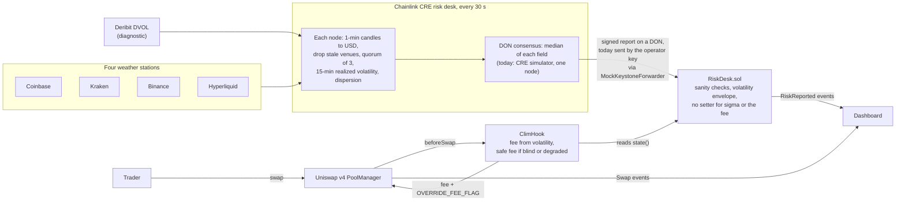
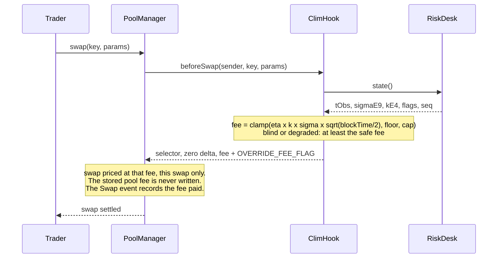

<div align="center">

# ⛈️ clim

**Storm insurance for Uniswap v4 LPs: a Chainlink CRE risk desk measures ETH volatility on four exchanges every 30 seconds, and a Uniswap v4 hook prices every swap from it.**

[-627eea?style=flat-square)](https://sepolia.etherscan.io/address/0x89f04C14f8fAbb5c9202F6B972F940C02AF79080)
[](cre/)
[](contracts/src/ClimHook.sol)
[](contracts/)
[](LICENSE)

**TOKEN2049 Origins · Singapore, October 2026 · Main track and Chainlink "Best workflow with CRE"**

<!-- clim:begin links -->
**[Open the dashboard](https://clim-zeta.vercel.app/app)** · **Video demo** _(added at submission)_ · **Deck** _(added at submission)_ · **[CRE evidence](cre/README.md#evidence)** · **[CRE DevEx report](docs/feedback/cre-devex-report.md)** · **[CRE friction log](docs/feedback/cre-friction-log.md)**
<!-- clim:end links -->

</div>


*The 4 February 2026 storm replayed with real Binance prices at the deployed parameters
(`lab/out/replay-2026-02-04.json`).*

When ETH jumps on Binance, bots buy from a pool at the old price and the liquidity provider (LP)
pays the gap. That loss is small when the market is calm and large in a storm, yet a pool charges
the same fee in both. clim makes the fee follow the weather. Four exchanges act as four weather
stations that must agree: a Chainlink CRE workflow reads them every 30 seconds and writes one
volatility figure on-chain (from the CRE simulator for now: see
[What's live vs. simulated](#whats-live-vs-simulated)). On every swap, a Uniswap v4 hook turns that
figure into the fee: the pair's usual tier when it is calm, a premium that rises with volatility in
a storm. The model behind the fee makes a prediction anyone can check, how often the pool gets
arbitraged, and clim publishes it and measures it. The live desk has already priced a real storm,
not a replay: on 7 October 2026 ETH volatility reached 242% a year and the clim pool's fee 26.50 bp.

> A liquidity provider is an insurer, and the fee is its premium. It is also the LP's only barrier
> against arbitrage: too low and the LP is picked off in a storm, too high and traders route to the
> pool next door.

> **Built solo in 36 hours at [TOKEN2049 Origins](https://www.token2049.com/singapore/2049-origins), Singapore, 6-8 October 2026.**
> Submitted to the main track and to Chainlink's "Best workflow with CRE", the only partner track we
> entered, on purpose: the product is built around it (the risk desk is the CRE workflow, and
> without a fresh CRE report the hook falls back to the safe fee). That track asks for a CRE
> workflow that is the orchestration layer of the product, connects a blockchain to an external
> API, and has run in simulation or on a DON. The main track weighs functionality and execution
> (30%), technical implementation (25%), innovation (20%), usefulness (15%) and the demo (10%).

## Table of contents

- **The idea:** [How it works](#how-it-works) · [How the fee is computed](#how-the-fee-is-computed) · [Results](#results)
- **Chainlink:** [Why Chainlink CRE](#why-chainlink-cre) · [Files that use Chainlink](#files-that-use-chainlink) · [What building it made visible](#what-building-it-made-visible)
- **Status:** [What's live vs. simulated](#whats-live-vs-simulated) · [Can a pool that is already live use clim?](#can-a-pool-that-is-already-live-use-clim) · [Roadmap](#roadmap)
- **On-chain:** [Deployed addresses](#deployed-addresses) · [Chainlink CRE evidence](#chainlink-cre-evidence)
- **Run it:** [Getting started](#getting-started) · [Tech stack](#tech-stack) · [Repository structure](#repository-structure)
- **The rest:** [What we tested and rejected](#what-we-tested-and-rejected) · [Limits](#limits) · [References](#references) · [Team](#team) · [License](#license)

## How it works



1. **Risk desk (Chainlink CRE, every 30 s).** Each node converts the venues' one-minute ETH candles
   to USD, drops any venue whose last closed candle is older than 120 s, requires 3 of the 4, and
   computes the 15-minute realized volatility of the median price and the dispersion between venues.
   On a DON, the nodes agree on the median of each field and sign one report. In this build the
   workflow runs in the CRE simulator, on one node, and the operator key sends each report through
   `MockKeystoneForwarder`, which checks no signature. Deribit's DVOL is a diagnostic only.
2. **`RiskDesk.sol`** receives the report through `onReport` from the Chainlink forwarder. It
   rejects reports that come less than 20 s after the previous one, from more than 30 s in the
   future, or from fewer than 3 venues, and it limits how far volatility can move between two
   reports (at most ×2 up, ×0.8 down, always between 10% and 1000% a year). It has no function that
   sets volatility or the fee: its owner picks the forwarder and workflow to trust. In this build the
   owner key is also the operator key (`simOperator`), the only sender whose simulated reports the
   live desk accepts, so that key can post any volatility inside the envelope, and the fee stays
   within the clamp (5 bp floor, 150 bp cap). `disableSim()` alone does not end this: the owner can
   point the desk at a forwarder it controls, so the owner key can post reports until ownership is
   renounced. On a DON, the owner would point the desk at the `KeystoneForwarder` and pin the
   expected workflow ID (`ReceiverTemplate`'s identity checks), and only then call `disableSim()`
   and renounce ownership ([FAQ](docs/faq.md#can-the-owner-change-the-fee)).
3. **`ClimHook.sol`** (Uniswap v4, built on OpenZeppelin's `BaseOverrideFee`). On every swap the
   PoolManager calls `beforeSwap`; the hook reads `RiskDesk.state()` and returns the fee with
   `OVERRIDE_FEE_FLAG`. If the desk has been silent for longer than the kill delay (blind) or the
   venues disagree (degraded), the hook quotes at least the safe fee.
4. **Dashboard** ([clim-zeta.vercel.app/app](https://clim-zeta.vercel.app/app), reading Sepolia). From
   `RiskReported` and `Swap` events it shows the desk, the clim pool's fee next to a fixed-fee twin
   pool and how often each one gets arbitraged (`/app`), plus the test-token faucet, the fee before
   a swap (`/swap`), liquidity for either pool (`/lp`) and every contract with its Etherscan and
   Sourcify links.

## How the fee is computed

```
fee = clamp( eta × k × sigma × sqrt(blockTime / 2), floor, cap )
```

- **sigma**: the desk's latest volatility, per square-root second (15-minute realized volatility).
- **sqrt(blockTime / 2)**: scales sigma to the typical price move during half a block, the time an
  arbitrageur waits on average. Sepolia blocks are 12 s.
- **eta**: how many standard deviations of that move the fee covers. With `eta = 1/P* - 0.824`, a
  block gets arbitraged with probability P* once the fee is above the floor (Milionis, Moallemi and
  Roughgarden 2023; Nezlobin and Tassy 2025 for fixed block times); at the floor, in calm markets,
  fewer blocks get arbitraged. The fee is a dial on how often the LP lets itself be picked off.
- **k**: a model-risk multiplier between 1 and 2 that can only make the fee more prudent. In this
  build k = 1: the model check runs in the lab, and `RiskDesk` already clamps k to [1, 2], so
  turning it on is a workflow change.
- **floor** is the pair's market fee tier, so in calm markets clim costs traders what the
  neighbouring pool costs.

On-chain it is integer arithmetic, without logarithms or square roots:
`fee_pips = clamp(ceil(sigmaE9 × etaE4 × sqrtHalfDtE6 × kE4 / 1e17), feeMinPips, feeMaxPips)`
(1 bp = 100 pips).

### Nobody "changes" the fee

No keeper sets the fee: there is no admin call and no fee-update transaction. The fee is
recomputed inside every swap:



The pool is created with the dynamic-fee flag (`fee = 0x800000` in its `PoolKey`), which is what
lets the PoolManager take a per-swap fee from the hook. A fee returned with `OVERRIDE_FEE_FLAG`
(`0x400000`) applies to that swap only, and the fee each swap paid is in the `fee` field of the
PoolManager's `Swap` event.

### Parameters

<!-- clim:begin params -->
| Parameter | Value | Meaning |
|---|---|---|
| P* | 30% | Target share of blocks that get arbitraged once the fee is above the floor |
| eta (`etaE4`) | 2.5093 (`25093`) | Fee in standard deviations of the half-block price move: 1/P* - 0.824 |
| sqrt(blockTime/2) (`sqrtHalfDtE6`) | 2.449490 (`2449490`) | Sepolia, 12 s blocks |
| Floor (`feeMinPips`) | 5.00 bp (`500`) | The pair's market fee tier |
| Cap (`feeMaxPips`) | 150.00 bp (`15000`) | Hard ceiling |
| Safe fee (`feeSafePips`) | 30.00 bp (`3000`) | Minimum fee when the desk is blind or degraded |
| Kill delay (`tauKillSec`) | 180 s | A desk silent for longer than this is treated as blind |

Decided by: lab/scripts/decide_pstar.py: year/aggregator LP P&L: P*=0.2: 28.0 bp/yr, P*=0.3: 39.2 bp/yr; P*=0.3 wins 3 of 5 scenarios. These values are immutable constructor arguments of the deployed hook.
<!-- clim:end params -->

### Fee schedule

<!-- clim:begin fee-schedule -->
| ETH volatility (annualized) | Fee charged on every swap (healthy desk, k = 1) |
|---|---|
| 25% | 5.00 bp |
| 50% | 5.48 bp |
| 75% | 8.21 bp |
| 100% | 10.95 bp |
| 150% | 16.42 bp |
| 225% | 24.63 bp |

The fee sits at the 5.00 bp floor up to about 46% annualized volatility, then rises in proportion to volatility. If the desk is blind (silent for more than 180 s) or degraded (venues disagree by more than 25 bp), the fee is at least 30.00 bp.
<!-- clim:end fee-schedule -->

## Results

<!-- clim:begin results -->
Numbers computed by the lab at P* = 30%, floor 5 bp (lab output generated 2026-10-06T15:56:16Z).

| | Feb 2026 storm | Oct 2026 calm | Oct 2025 to Oct 2026 (1-min data bridged) |
|---|---|---|---|
| LP losses to arbitrage vs a fixed-fee pool, **same average fee** | -15.3% | -5.5% | -26.9% |
| LP losses to arbitrage vs a fixed-fee pool, **same cost to traders** | -2.9% | -2.3% | -12.7% |
| Share of blocks arbitraged, predicted / observed | 29.9% / 27.9% | 15.6% / 17.1% | 24.3% / 23.6% |

**Replay of the 4 February 2026 storm** (2026-02-04 12:00 to 16:00 UTC): volatility 34% → 296%, clim's fee 5 → 32.4 bp, LP losses to arbitrage -18.6% against a fixed 15 bp pool with the same average fee; share of the clim pool's blocks arbitraged, predicted / observed: 29.8% / 28.5%. The window was picked during design, at an earlier setting, around the sharpest rise in volatility of the storm, after comparing three candidate windows (lab/scratch/replay_pick*.py). At P* = 30% no rolling 4 h window of the storm does better (best -18.4%): the worst of the 92 is +3.1%, the median -2.1%, and 66 of 92 beat the fixed pool.

**LP gain in the lab's one-year backtest (not a forecast):** -0.10% to +0.70% of capital per year (-$981 to $7,024 a year per $1M of liquidity; full-range ETH LP vs a static 5 bp pool, 1-year replay, 5 retail scenarios). In the main scenario (an aggregator routes retail between clim and a deeper 5 bp pool), ETH gains +0.39% a year, about 53% of it earned in the five stormiest weeks of the year; the same scenario on an asset twice as volatile (the same year with every return doubled) gains +0.40%. It is insurance, not a steady yield.

**Where the model is weak:** it predicts how often arbitrage happens, not how much it costs: in the lab's backtests, losses to arbitrage run 1.29 to 1.33 times the model's estimate. In the two 1 s windows the observed share of arbitraged blocks lands within 10% of the prediction, but the gap is statistically significant (p < 0.0005, thresholds simulated from the model because arbitrage comes in clusters). A volatility measured inside the pool itself would capture 54% to 103% of the same gain (see "Why Chainlink CRE"; above 100% means the in-pool estimate did slightly better in one sample).
<!-- clim:end results -->

The two comparisons answer different questions: does charging at the right time beat a fixed fee
(same average fee), and does it still win when volume grows with volatility (same cost to traders)?
We always show both, and the 4 February replay window always next to the storm's rolling windows.

## Why Chainlink CRE

clim is built around CRE, which is why it is the only partner track we entered: the risk desk is
the CRE workflow, and without a fresh report the hook falls back to the safe fee. The honest answer
first: a volatility measured inside the pool itself would capture most of the gain (see Results).
CRE is not what makes the number possible. It is what makes it **trustworthy**:

- **Four exchanges must agree.** Nobody can push the fee around with fake trades on the pool, and a
  venue that freezes or diverges is dropped or flags the desk as degraded.
- **On a DON: one signed report, and no single key once the owner renounces.** Reports come
  through Chainlink's `KeystoneForwarder`, which checks the DON's signatures: on a DON, once the
  expected workflow ID is pinned, simulation disabled and ownership renounced, no single key can
  write the desk (until then the owner key can re-point the forwarder). Today, in simulation, the
  operator key submits the reports through `MockKeystoneForwarder`, so that one key is trusted to
  post the volatility, inside the envelope (see [How it works](#how-it-works)).
- **One figure for many pools and chains.** CRE can write the same report to other EVM chains and
  to Solana.
- **Room for model control.** The desk could compare its own prediction with what happens on-chain
  and raise k without anyone touching the hook, once the workflow sends k (k = 1 in this build, see
  the fee above).

A price feed with a 0.5% deviation threshold and a one-hour heartbeat is too coarse for this, and a
pull oracle would let the swapper choose its report. Chainlink does list ETH realized-volatility
Data Feeds, but their shortest window is 24 hours with a one-hour heartbeat (and the Sepolia one
last updated on 2024-08-30): a storm that lasts an hour barely moves them ([FAQ](docs/faq.md)).

| Track requirement | In clim | Status |
|---|---|---|
| A CRE workflow that is the orchestration layer, core to the product | The fee is computed from the desk's report on every swap; without a fresh report the hook falls back to the safe fee | ✅ |
| A blockchain integrated with an external API | Six HTTP sources per node (Coinbase, Kraken, Binance, Hyperliquid, Deribit DVOL, Kraken USDT/USD), one report written to `RiskDesk` on Ethereum Sepolia | ✅ |
| A successful simulation with the CRE CLI, or a deployment | `cre workflow simulate --broadcast` every 30 s on Sepolia: to the live desk since 2026-10-06 16:26 UTC; to the replay desk, 459 reports from 17:02 to 20:58 UTC (its loop started at 16:57) | ✅ simulation |
| Beyond the requirement: deployment on a CRE DON | Not done. DON deploy access was requested on 6 October 2026 (22:56 SGT) and not granted during the hackathon (still "Not enabled" on 7 October), so the DON deployment was cut (friction log row 6). The workflow is written with the CRE consensus API for a DON and has not run on one | 🛣️ cut, on the roadmap |

## Files that use Chainlink

| File | What it does |
|---|---|
| [`cre/project.yaml`](cre/project.yaml) | The CRE project: targets `staging-settings` (live simulation) and `replay-settings`, Sepolia RPC. A third target, `production-settings`, is a DON target with a placeholder desk address, never used because DON deploy access was not granted |
| [`cre/risk-desk/workflow.yaml`](cre/risk-desk/workflow.yaml) | Workflow name, entry point and config file per target |
| [`cre/risk-desk/main.ts`](cre/risk-desk/main.ts) | The runner entry point |
| [`cre/risk-desk/workflow.ts`](cre/risk-desk/workflow.ts) | Cron and HTTP triggers, node-mode observation, consensus by median, `runtime.report`, `EVMClient.writeReport` and the read-back of `RiskDesk.state()` |
| [`cre/risk-desk/venues.ts`](cre/risk-desk/venues.ts) | Venue requests, response parsers, concurrent fetch, replay requests |
| [`cre/risk-desk/estimator.ts`](cre/risk-desk/estimator.ts) | Normalization, staleness, quorum, per-minute median, 15-minute realized volatility, dispersion, tick |
| [`cre/risk-desk/report.ts`](cre/risk-desk/report.ts) | The report ABI, encoder and decoder |
| [`contracts/src/RiskDesk.sol`](contracts/src/RiskDesk.sol) | The CRE consumer: `onReport` through the forwarder, on-chain checks, `state()` for the hook |
| [`contracts/src/receiver/ReceiverTemplate.sol`](contracts/src/receiver/ReceiverTemplate.sol) | Chainlink's receiver base, copied from [smartcontractkit/cre-templates](https://github.com/smartcontractkit/cre-templates) |
| [`contracts/src/ClimHook.sol`](contracts/src/ClimHook.sol) | Reads the desk's report on every swap |

[`cre/README.md`](cre/README.md) walks through one execution, the trust model and a sample run.

## What building it made visible

We logged CRE frictions as we built: 25 rows in the
[friction log](docs/feedback/cre-friction-log.md), 23 of them hit while building and 2 from reading
the docs only, summarized for the Chainlink team in the
[DevEx report](docs/feedback/cre-devex-report.md). The three most useful to Chainlink:

- **The sports-resolution starter's receiver template rejects every report once identity checks
  are on.** Its `ReceiverTemplate.sol` (cre-templates `d0223f3`) requires 62 bytes of metadata, but
  `KeystoneForwarder` and `MockKeystoneForwarder` pass 64 (workflow id 32, name 10, owner 20, report
  id 2), so with an expected workflow id, author or name set, every report reverts
  `InvalidMetadataLength(64, 62)`. Reproduced with a forge test on real forwarder metadata; the
  other templates have no length check, and clim uses the `circuit-breaker` copy. A candidate
  upstream fix: align the template with the docs, which already say 64 (friction log row 23).
- **A rejected report looks like a success.** With `--broadcast`, the simulator reports `SUCCESS`
  whenever the forwarder transaction is mined, and `MockKeystoneForwarder` does not revert when the
  consumer does. A forged report on Sepolia
  ([`0x34ee46a6…53d9`](https://sepolia.etherscan.io/tx/0x34ee46a6947d2831fdb3e5a09f831008589efd9cf099f61dca86dc4cdadc53d9))
  was mined with status 1, `ReportProcessed` false and no `RiskReported`. The docs already say the
  status is always `SUCCESS` in simulation, but give the wrong reason: that the mock does not call
  the consumer's `onReport`, when it does (friction log row 2). The workflow re-reads
  `RiskDesk.state()` after each write to tell the two apart (friction log row 9).
- **Simulation is one node, and it needs the network.** The Sepolia mock forwarder checks no
  signature, so `RiskDesk` only accepts simulated reports sent by the operator key (`tx.origin`),
  and the CLI validates its credentials against the CRE API on every run: 5 of 413 runs of our two
  30 s loops (live and replay) on 2026-10-06 stopped there (friction log rows 1 and 24).

## What's live vs. simulated

| Piece | Status | Detail |
|---|---|---|
| Contracts on Sepolia | ✅ live | Both desks, both hooks, the clim pools and their fixed-fee twins, test tokens with a public faucet; clim's own contracts are verified on Sourcify ([addresses](#deployed-addresses)) |
| A CRE report every 30 s | ✅ live, from simulation | `cre workflow simulate --broadcast` in a loop since 2026-10-06 16:26 UTC: 444 reports on the live desk (`state().seq`, read 2026-10-06 20:29 UTC). Observation time (tObs) to block: median 14 s, p90 25 s over 211 reports (last 600 blocks to about 18:40 UTC on 2026-10-06) |
| A real storm on the live desk | ✅ live | On 7 October 2026, real market data, not a replay: from 01:58 to 02:51 UTC, 100 of the live desk's 105 reports put the clim pool's fee above the 5 bp floor; volatility peaked at 242% a year and the fee at 26.50 bp (report observed at 02:11 UTC). Every one of the 105 swaps on the clim pool in that window paid exactly the formula's fee for the desk's state (`RiskReported` and `Swap` events read with `cast`) |
| DON consensus and signature checks | 🛣️ cut | The simulator runs one node and `MockKeystoneForwarder` checks no signature. DON deploy access was requested on 6 October 2026 (22:56 SGT) and not granted during the hackathon (still "Not enabled" on 7 October), so the DON deployment was cut (friction log row 6). The workflow is written with the CRE consensus API for a DON and has not run on one |
| Model-risk multiplier k | 🛣️ off (k = 1) | The model check runs in the lab (`lab/out/validation.json`); `RiskDesk` already clamps k to [1, 2], so turning it on is a workflow change |
| The 4 February 2026 storm | ✅ replayed on Sepolia | Historical Binance prices, served at wall-clock speed by `bots/src/replay-server.ts` to a second CRE loop that writes to the replay desk (its REPLAY flag discloses it). Its loop started at 16:57 UTC on 2026-10-06 and wrote 459 reports, from 17:02 to 20:58 UTC; since then the replay desk is silent and its hook quotes the 30 bp safe fee |
| The market | simulated | Our own arbitrage and retail bots trade the clim pool and its fixed-fee twin. No mainnet pool; volume moving to cheaper pools is only approximated; just-in-time liquidity is not modeled. The arbitrage bot keeps one transaction in flight per pool, so on chain it lands fewer arbitrages than the model's arbitrageur would: on the replay it arbitraged 21.5% of the clim pool's blocks against 29.6% predicted, but counting the 90 blocks it skipped while a trade was pending, it saw the pool outside its no-arbitrage band in 349 of 1,186 blocks (29.4%) |
| Results | simulated | Lab backtests on historical Binance ETHUSDT data (`lab/out/`), not live P&L |
| Dashboard | ✅ live, reads Sepolia | https://clim-zeta.vercel.app: the desk and both pools at `/app`, real Sepolia swaps and liquidity at `/swap` and `/lp` (test tokens from the faucet), the finished replay at `/replay`; numbers checked against `cast` reads |

## Can a pool that is already live use clim?

Not by flipping a switch on an existing pool; yes for a new pool, and yes for a pool that already
has a dynamic fee. Details in [docs/faq.md](docs/faq.md).

- A Uniswap v3 pool cannot: `UniswapV3Pool.fee` is `immutable`.
- A Uniswap v4 pool's fee mode and hook are part of its `PoolKey`, and the `PoolKey` is the pool's
  identity. A static-fee pool cannot become dynamic and cannot gain a hook: you create a new pool
  and LPs move their liquidity.
- A pool created with a dynamic fee gets its fee from its own hook, either per swap (`beforeSwap`
  with `OVERRIDE_FEE_FLAG`, what clim does) or stored (`PoolManager.updateDynamicLPFee`, which only
  that hook can call).
- A DEX that already runs dynamic fees can use the risk desk without migrating anything: its hook or
  keeper reads `RiskDesk.state()`.
- clim's own parameters are immutable. A different P* means a new hook and a new pool.

## Roadmap

1. **Fables on Robinhood Chain, shadow mode first.** Fables' crypto pools charge a flat fee plus a
   temporary override that a keeper posts between a floor and a cap (our pre-hackathon reading of
   public on-chain data, 2026-09-30). First, clim publishes its recommended fee next to the keeper's,
   without acting on it. Then the keeper reads `RiskDesk.state()`, applies the fee rule with Fables'
   own P*, floor and cap, and posts the result: no contract change on their side. This is our
   proposal to Fables, not an agreement: nothing runs on Robinhood Chain yet.
2. **One desk, many chains.** The same CRE workflow can write the same report to a `RiskDesk` on
   every chain CRE supports, and an off-chain keeper can read a desk on any chain without a bridge.
   CRE lists Robinhood Chain as Robinhood Testnet only (docs, 2026-09-18), and writes to Solana.
3. **DON deployment.** Deploy access was not granted during the hackathon. Once it is, the workflow
   runs on a DON and reports arrive through the `KeystoneForwarder`. The owner points `RiskDesk` at
   that forwarder and pins the expected workflow ID (`ReceiverTemplate`'s identity checks), and only
   then calls `disableSim()` and renounces ownership or hands it to a timelocked multisig.

## Deployed addresses

<!-- clim:begin deployments -->
Everything runs on Ethereum Sepolia (chain id 11155111). Each address links to Etherscan. The source of every contract clim deployed (both desks, both hooks, tETH, tUSD and the arbitrage router, Uniswap's unmodified `PoolSwapTest`) is verified on Sourcify.

| | Contract | Address | Source | Role |
|---|---|---|---|---|
| **clim** | `RiskDesk` (live) | [`0xCDbfd6b9…334F`](https://sepolia.etherscan.io/address/0xCDbfd6b9C0b97A8eE31706c6CDE5E54B4954334F) | [Sourcify](https://repo.sourcify.dev/11155111/0xCDbfd6b9C0b97A8eE31706c6CDE5E54B4954334F) | receives the CRE report every 30 s |
|  | `ClimHook` (live) | [`0x89f04C14…9080`](https://sepolia.etherscan.io/address/0x89f04C14f8fAbb5c9202F6B972F940C02AF79080) | [Sourcify](https://repo.sourcify.dev/11155111/0x89f04C14f8fAbb5c9202F6B972F940C02AF79080) | prices every swap of the live clim pool from the live desk |
|  | `RiskDesk` (replay) | [`0x4b843dc3…4746`](https://sepolia.etherscan.io/address/0x4b843dc3A7ec6202d2337cdeF8C67a0F10f24746) | [Sourcify](https://repo.sourcify.dev/11155111/0x4b843dc3A7ec6202d2337cdeF8C67a0F10f24746) | received the CRE reports of the 4 February 2026 storm, replayed (459 reports, the last at 20:58 UTC on 2026-10-06); flagged REPLAY |
|  | `ClimHook` (replay) | [`0xf6E4CEC9…D080`](https://sepolia.etherscan.io/address/0xf6E4CEC98865A0B1D8b2D59f70a0A0036bF4D080) | [Sourcify](https://repo.sourcify.dev/11155111/0xf6E4CEC98865A0B1D8b2D59f70a0A0036bF4D080) | prices every swap of the replay clim pool from the replay desk |
| **Uniswap v4** | `PoolManager` | [`0xE03A1074…3543`](https://sepolia.etherscan.io/address/0xE03A1074c86CFeDd5C142C4F04F1a1536e203543) |  | the v4 singleton; calls the hook on every swap |
|  | `StateView` | [`0xE1Dd9c3f…7E4C`](https://sepolia.etherscan.io/address/0xE1Dd9c3fA50EDB962E442f60DfBc432e24537E4C) |  | pool state reads |
|  | `PoolSwapTest` | [`0x9B6b46e2…6eEe`](https://sepolia.etherscan.io/address/0x9B6b46e2c869aa39918Db7f52f5557FE577B6eEe) |  | test swap router, used by the retail bot |
|  | `PoolModifyLiquidityTest` | [`0x0C478023…1B0A`](https://sepolia.etherscan.io/address/0x0C478023803a644c94c4CE1C1e7b9A087e411B0A) |  | test liquidity router: the pools' seed liquidity and the `/lp` positions; it does not tie a position to its owner (see [Limits](#limits)) |
| **Chainlink** | `MockKeystoneForwarder` | [`0x15fC6ae9…9F88`](https://sepolia.etherscan.io/address/0x15fC6ae953E024d975e77382eEeC56A9101f9F88) |  | delivers `cre workflow simulate --broadcast` reports; checks no signature |
|  | `KeystoneForwarder` | [`0xF8344CFd…4482`](https://sepolia.etherscan.io/address/0xF8344CFd5c43616a4366C34E3EEE75af79a74482) |  | delivers DON-signed reports; not used: the DON deployment was cut |
| **Test tokens and bots** | `tETH` | [`0xcB249894…5A19`](https://sepolia.etherscan.io/address/0xcB2498949AC0c2473a06199e24f2c5062b665A19) | [Sourcify](https://repo.sourcify.dev/11155111/0xcB2498949AC0c2473a06199e24f2c5062b665A19) | test ETH with a public faucet |
|  | `tUSD` | [`0xce3171cB…4C14`](https://sepolia.etherscan.io/address/0xce3171cB1ad23D9E5D3fD9839078b4624DC84C14) | [Sourcify](https://repo.sourcify.dev/11155111/0xce3171cB1ad23D9E5D3fD9839078b4624DC84C14) | test USD with a public faucet |
|  | `PoolSwapTest` (arbitrage) | [`0x70856584…ce51`](https://sepolia.etherscan.io/address/0x70856584d9d8ADDB653aBb1786E37C505665ce51) | [Sourcify](https://repo.sourcify.dev/11155111/0x70856584d9d8ADDB653aBb1786E37C505665ce51) | the arbitrage bot's own router, so its swaps can be told apart |
|  | Operator | [`0x53aB240f…5A82`](https://sepolia.etherscan.io/address/0x53aB240f6cffC204FC22ac6722D9632d753a5A82) |  | deployer, owner of both desks, the live desk's `simOperator` (the only accepted sender of its simulated reports), test-token owner |
|  | Operator (replay) | [`0xbDE42818…B4c8`](https://sepolia.etherscan.io/address/0xbDE42818271EEe35C0bE8a3AB07d150B3797B4c8) |  | the replay desk's `simOperator`: sent all 459 of its simulated reports through `MockKeystoneForwarder` (simulation still on) |

| Pool | LP fee | PoolId |
|---|---|---|
| clim pool (live) | dynamic: set by `ClimHook` on every swap | `0x49cad216…d1e6` |
| fixed-fee twin (live) | 5.11 bp, fixed | `0x0e4aeceb…abf0` |
| clim pool (replay) | dynamic: set by `ClimHook` on every swap | `0xc91db9c4…b60f` |
| fixed-fee twin (replay) | 15.03 bp, fixed | `0x5ccceb29…c1f4` |

The canonical set, with full addresses, pool keys and pool ids, lives in [`shared/deployments/sepolia.json`](shared/deployments/sepolia.json).
<!-- clim:end deployments -->

## Chainlink CRE evidence

The first simulated report
([`0x60465523…1cb6`](https://sepolia.etherscan.io/tx/0x6046552302b7711c4987ee7706d957538dc11ee77ca557b18c92261154e21cb6)),
a forged report the desk ignored and a sample run with its transaction are in
[`cre/README.md`](cre/README.md#evidence). The full list of reports and the raw `simulate`
transcripts are generated at submission:

<!-- clim:begin evidence -->
_Pending: generated from `docs/evidence/cre-reports-sepolia.json` at submission._
<!-- clim:end evidence -->

## Getting started

You need Foundry, Node.js 22, Bun 1.3.9, the [CRE CLI](https://docs.chain.link/cre), uv (Python)
and, for anything that writes on-chain, a Sepolia RPC URL and funded testnet keys.

```bash
git clone --recurse-submodules https://github.com/DVB-ANS/clim && cd clim
bun install                             # root workspace: shared and bots

(cd contracts && forge test)            # contracts: unit and fuzz tests; without SEPOLIA_RPC_URL in contracts/.env
                                        # (see .env.example) the 3 Sepolia fork tests skip: 73 passed, 2 skipped (75 total)
                                        # (forge counts the 2-test fork suite, skipped in setUp, as one)
(cd lab && uv sync && uv run pytest)    # lab: backtests and model checks; a fresh clone has no lab/data/
                                        # (gitignored), so 77 tests run and the 5 that read it skip

# CRE risk desk: one simulated run without a transaction (needs `cre login`)
(cd cre/risk-desk && bun install)
(cd cre && cre workflow simulate risk-desk --non-interactive --trigger-index 0 --target staging-settings)

# Dashboard, a standalone npm project (Next.js): copy shared/, lab/out and the FAQ in, then run
(cd app && npm ci && npm run sync && npm run dev)
```

To run the live loop yourself (a CRE report every 30 s with `--broadcast`, plus the arbitrage and
retail bots), put the operator key in `cre/.env` (`CRE_ETH_PRIVATE_KEY`) and the bot keys in
`bots/.env` (see `bots/.env.example`), then, one terminal each:

```bash
(cd bots && bun run cre-loop --pair live)
(cd bots && bun run arb --pair live)
(cd bots && bun run noise --pair live)
(cd bots && bun run status --pair live --watch)
```

[docs/runbook.md](docs/runbook.md) covers funding, the 4 February replay and the security demos.

## Tech stack

| Layer | Technology |
|---|---|
| Chain | Ethereum Sepolia (chain id 11155111), 12 s blocks |
| Contracts | Solidity 0.8.26 (EVM `cancun`), Foundry 1.4.2, forge-std v1.17.0 |
| Uniswap | Uniswap v4 (v4-core `d153b04`, v4-periphery `7ebd04b`), OpenZeppelin uniswap-hooks v1.2.1 (`BaseOverrideFee`), OpenZeppelin Contracts 5.5.0 |
| Chainlink | CRE CLI v1.37.0, `@chainlink/cre-sdk` 1.23.0 (TypeScript compiled to WASM), `ReceiverTemplate` from cre-templates `d0223f3`, `MockKeystoneForwarder` and `KeystoneForwarder` |
| Bots and shared code | Bun 1.3.9, TypeScript 5.9.3, viem 2.57.3 |
| Lab | Python 3.12 with uv, numpy 2.5.3, pytest |
| Dashboard | Next.js 16, React 19, wagmi 2 and RainbowKit 2, viem, Recharts, Tailwind CSS 4, on Vercel |
| Submission tooling | Node.js 22 (`node:test`), pptxgenjs 4.0.1, matplotlib, ffmpeg |

## Repository structure

```
contracts/                   Foundry: RiskDesk.sol (the CRE consumer), ClimHook.sol (the hook), ClimFeeMath,
                             Chainlink's ReceiverTemplate (src/receiver/), test tokens, deploy scripts, tests
cre/                         the CRE project (project.yaml) and the simulation loop script
  risk-desk/                 the workflow, TypeScript: triggers, venues, estimator, report, write
bots/                        Bun and viem: arbitrage bot, retail bot, CRE loop with receipts, replay server
lab/                         Python: backtests, the P* decision, model validation; out/ holds the JSON results
shared/                      read by every part: deployments/sepolia.json, params.json, abis/
app/                         Next.js dashboard (https://clim-zeta.vercel.app): landing, /app, /swap, /lp,
                             /replay, /lab, /how, /credits; reads the desks' and pools' events on Sepolia
docs/                        faq.md, runbook.md, the CRE feedback (feedback/), the day-by-day sessions,
                             the design spec and plans (superpowers/), the submission tooling (submission/)
  submission/deck/v2/        the deck from Figma: slide images (png/), texts and speaker notes (slides.json)
```

## What we tested and rejected

A first design charged a directional toll against a reference price from the desk. We dropped it
during design, at an earlier setting (exploration scripts in `lab/scratch/bt2.py` and `bt3.py`; not
recomputed at the final P*): the reference is at least 30 s old, so an arbitrageur trades against
the stale reference at the low fee; splitting a swap gets around it; in simulation a symmetric fee
did better at equal tracking error; and a directional fee on a Chainlink oracle already exists
(MSpits/DynamicFeeHook). Implied volatility (Deribit DVOL) stays a diagnostic: realized volatility
drives the fee.

## Limits

- **Latency.** Volatility is computed from closed one-minute candles, so a price move shows up in a
  report only once its candle has closed (up to a minute), then waits for the next report (every
  30 s) and for that report's block (observation time to block: median 14 s, p90 25 s in
  simulation). The first move of a sudden jump is arbitraged at the old fee.
- **Modest average gain, optimistic severity.** The value is concentrated in storms, and the model
  predicts how often arbitrage happens, not how much each one costs (see [Results](#results)).
- **Simulation and our own market.** See [What's live vs. simulated](#whats-live-vs-simulated).
- **Sources.** Binance answers HTTP 451 to US IP addresses. A quorum of 3 out of 4 venues survives
  one missing venue, not two.
- **Cost on mainnet.** Publishing every 30 s on Ethereum would cost an estimated $60k to $110k a
  year in gas at 0.12 to 0.22 gwei and $2,700 per ETH: 175,253 gas per report (the median of 1,359
  live Sepolia reports through the mock forwarder, to 7 October) times about 1.05 million reports a
  year is about 184 ETH a year per gwei of gas price (about $500k a year at 1 gwei), before the DON
  forwarder's signature checks. Production would publish on deviation plus a heartbeat, or on an L2.
- **Fast chains.** With sub-second blocks the formula sits at the floor until an effective Δt (the
  arbitrageurs' reaction time) is calibrated.
- **Test liquidity router.** The pools' seed liquidity and the positions added at `/lp` go through
  Uniswap's `PoolModifyLiquidityTest` router on Sepolia, which does not tie a position to its
  owner: anyone who knows the pool key and the salt can remove it (clim's seed positions use salt 0;
  checked with an `eth_call` from an unrelated address). Harmless on a testnet with test tokens, and
  the reason production would use the v4 `PositionManager`. The live stack watches the pools'
  liquidity, and the operator can restore it.
- **Vercel checkpoint.** Under heavy automated traffic, Vercel may briefly answer non-browser
  clients with a security checkpoint instead of the page (seen during our audit; the site answered
  200 again afterwards).
- **Not audited.** Testnet only.

## References

- Milionis, Moallemi, Roughgarden, Zhang (2022). *Automated Market Making and Loss-Versus-Rebalancing.* [arXiv:2208.06046](https://arxiv.org/abs/2208.06046)
- Milionis, Moallemi, Roughgarden (2023). *Automated Market Making and Arbitrage Profits in the Presence of Fees.* [arXiv:2305.14604](https://arxiv.org/abs/2305.14604)
- Nezlobin, Tassy (2025). *Loss-Versus-Rebalancing under Deterministic and Generalized Block-Times.* [arXiv:2505.05113](https://arxiv.org/abs/2505.05113)
- Campbell, Bergault, Milionis, Nutz (2025). *Optimal Fees for Liquidity Provision in Automated Market Makers.* [arXiv:2508.08152](https://arxiv.org/abs/2508.08152)
- Loesch, Hindman, Richardson, Welch (2021). *Impermanent Loss in Uniswap v3.* [arXiv:2111.09192](https://arxiv.org/abs/2111.09192)
- Kupiec (1995). *Techniques for Verifying the Accuracy of Risk Measurement Models.* The Journal of Derivatives 3(2), 73-84. [doi:10.3905/jod.1995.407942](https://doi.org/10.3905/jod.1995.407942)
- Basel Committee on Banking Supervision (1996). *Supervisory framework for the use of "backtesting" in conjunction with the internal models approach to market risk capital requirements.*
- [Uniswap v4 core](https://github.com/Uniswap/v4-core) (`LPFeeLibrary`, `PoolManager`), [OpenZeppelin uniswap-hooks](https://github.com/OpenZeppelin/uniswap-hooks) (`BaseOverrideFee`), [Chainlink CRE documentation](https://docs.chain.link/cre) and [cre-templates](https://github.com/smartcontractkit/cre-templates) (`ReceiverTemplate`).

## Team

Built solo by a member of **DeVinci Blockchain** (DVB), Paris.

<!-- clim:begin team -->
| | Role | |
|---|---|---|
| **Sofiane Ben Taleb** | Design, contracts, CRE workflow, lab, dashboard | [GitHub](https://github.com/gamween) · [LinkedIn](https://www.linkedin.com/in/sofiane-ben-taleb/) |
<!-- clim:end team -->

## License

[MIT](LICENSE) © 2026 Sofiane Ben Taleb, for clim's own code. Third-party code in this repo keeps its
own license:

- `contracts/src/receiver/` and `contracts/test/fixtures/sports-resolution/`: copied unmodified from
  [smartcontractkit/cre-templates](https://github.com/smartcontractkit/cre-templates) `d0223f3`. MIT,
  © 2025 SmartContract (each folder has its `LICENSE`).
- The `contracts/lib/` submodules keep their own licenses: forge-std is MIT or Apache-2.0,
  OpenZeppelin's code and Uniswap v4-periphery are MIT, and Uniswap v4-core is MIT for the
  interfaces and libraries clim's own contracts import, BUSL-1.1 for `PoolManager` and some internal
  libraries, and UNLICENSED for its `src/test` routers. The local tests deploy `PoolManager` and,
  through v4-core's `Deployers`, compile solmate (AGPL-3.0-only, a submodule of v4-core). clim's
  arbitrage router on Sepolia is v4-core's unmodified `PoolSwapTest`, compiled from the submodule:
  it includes four of those BUSL-1.1 libraries (`Lock`, `CurrencyReserves`, `NonzeroDeltaCount`,
  `Position`), a testnet, non-production use, which BUSL-1.1 permits. clim's own deployed contracts
  (both desks, both hooks, tETH and tUSD) compile only MIT sources.
- `app/` includes third-party components and npm dependencies with their own licenses: the adapted
  components and the non-permissive packages are described in
  [`app/THIRD_PARTY_NOTICES.md`](app/THIRD_PARTY_NOTICES.md) (also at
  [/credits](https://clim-zeta.vercel.app/credits)), and every npm package's license text is in
  [`app/public/third-party-licenses.txt`](app/public/third-party-licenses.txt) (also at
  [/third-party-licenses.txt](https://clim-zeta.vercel.app/third-party-licenses.txt)). Some are not
  permissive: two React Bits components are MIT + Commons Clause, the MetaMask SDK (through wagmi
  and RainbowKit) is under ConsenSys' license, and `ua-parser-js` 2 (through RainbowKit) is AGPL-3.0.
- Other npm dependencies keep their own licenses, including `@chainlink/cre-sdk` (BUSL-1.1).

<div align="center">
<sub>Built for TOKEN2049 Origins · Singapore, October 2026 · Main track and Chainlink "Best workflow with CRE"</sub>
</div>
