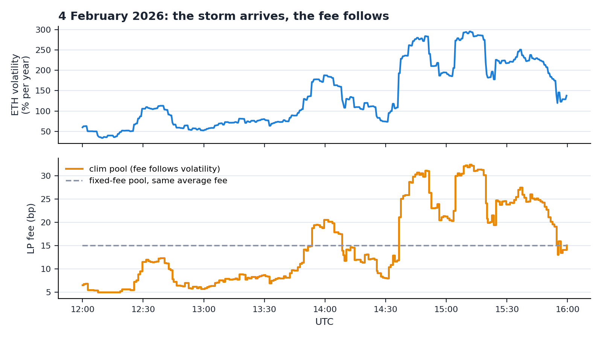
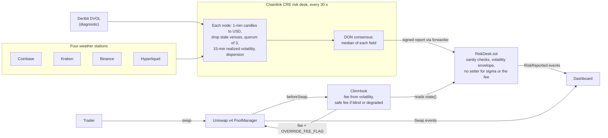
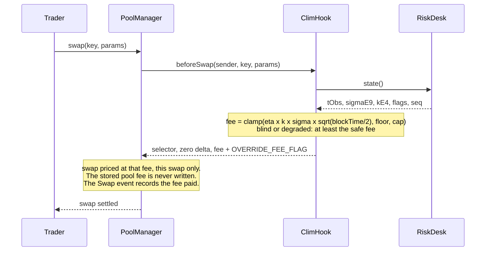

# clim

**Storm insurance for Uniswap v4 liquidity providers.** The fee stays at the market price when the market is calm and rises with the storm. A Chainlink CRE "risk desk" measures the weather every 30 seconds on four exchanges, and a Uniswap v4 hook prices every swap from it.

Built in 36 hours at TOKEN2049 Origins (Singapore, October 2026) for the main track and Chainlink's "Best workflow with CRE" track.

<!-- clim:begin links -->
**Live dashboard:** _open the dashboard: added at submission_ · **Demo video:** _watch the 3-minute demo: added at submission_ · **Deck:** _slides (.pptx): added at submission_ · **CRE evidence:** [docs/evidence](docs/evidence/)
<!-- clim:end links -->



*The 4 February 2026 storm replayed with real Binance prices at the deployed parameters (`lab/out/replay-2026-02-04.json`).*

## In 30 seconds

A liquidity provider (LP) is an insurer. When ETH jumps on Binance, bots buy from the pool at the old price and the LP pays the gap. That loss is small when the market is calm and large in a storm, yet a pool charges the same fee in both.

clim makes the fee follow the weather. Four exchanges act like four weather stations that must agree. A Chainlink CRE workflow reads them every 30 seconds, the oracle network agrees on one volatility figure, signs it and writes it on-chain. On every swap, a Uniswap v4 hook turns that figure into the fee: the pair's usual tier when it is calm, a premium that rises with volatility in a storm.

The model behind the fee makes a prediction anyone can check: how often the pool gets arbitraged. We publish it and measure it.

## How it works



1. **Risk desk (Chainlink CRE, every 30 s).** Each node fetches one-minute ETH candles from Coinbase, Kraken, Binance and Hyperliquid, converts them to USD, drops any venue whose last closed candle is older than 120 s and requires at least 3 venues. It computes the 15-minute realized volatility of the median price and the dispersion between venues. The nodes agree on the median of each field and sign one report.
2. **`RiskDesk.sol`** receives the report through `onReport` from the Chainlink forwarder. It rejects reports that come less than 20 s after the previous one, from more than 30 s in the future, or from fewer than 3 venues, and it limits how far volatility can move between two reports (at most ×2 up, ×0.8 down). It has no function that sets volatility or the fee. Its owner chooses which forwarder and workflow to trust and can switch off simulation mode; a malicious owner could point it at a forwarder it controls, but every accepted report stays inside the envelope and the 5 to 150 bp fee clamp. In production the owner renounces ownership after switching to the `KeystoneForwarder` (spec §6.7).
3. **`ClimHook.sol`** (Uniswap v4, built on OpenZeppelin's `BaseOverrideFee`). On every swap the PoolManager calls `beforeSwap`; the hook reads `RiskDesk.state()` and returns the fee with `OVERRIDE_FEE_FLAG`. If the desk has been silent for longer than the kill delay (blind) or the venues disagree (degraded), the hook quotes at least the safe fee.
4. **Dashboard.** Reads `RiskReported` and `Swap` events and shows the desk, the clim pool's fee next to a fixed-fee twin pool, and how often each one gets arbitraged. With a wallet on Sepolia anyone can take test tokens from the faucet, see the fee before swapping (`/swap`) and provide liquidity to either pool (`/lp`).

## How the fee is computed

```
fee = clamp( eta × k × sigma × sqrt(blockTime / 2), floor, cap )
```

- **sigma**: the desk's latest volatility, per square-root second (15-minute realized volatility).
- **sqrt(blockTime / 2)**: scales sigma to the typical price move during half a block, the time an arbitrageur waits on average. Sepolia blocks are 12 s.
- **eta**: how many standard deviations of that move the fee covers. With `eta = 1/P* - 0.824`, a block gets arbitraged with probability P* once the fee is above the floor (Milionis, Moallemi and Roughgarden 2023; Nezlobin and Tassy 2025 for fixed block times); at the floor, in calm markets, fewer blocks get arbitraged. The fee is a dial on how often the LP lets itself be picked off.
- **k**: a model-risk multiplier sent by the desk, between 1 and 2. It can only make the fee more prudent.
- **floor** is the pair's market fee tier, so in calm markets clim costs traders what the neighbouring pool costs.

On-chain it is integer arithmetic, without logarithms or square roots:
`fee_pips = clamp(ceil(sigmaE9 × etaE4 × sqrtHalfDtE6 × kE4 / 1e17), feeMinPips, feeMaxPips)` (1 bp = 100 pips).

### Nobody "changes" the fee

There is no keeper, no admin call and no fee-update transaction. The fee is recomputed inside every swap:



The pool is created with the dynamic-fee flag (`fee = 0x800000` in its `PoolKey`), which is what lets the PoolManager take a per-swap fee from the hook. A fee returned with `OVERRIDE_FEE_FLAG` (`0x400000`) applies to that swap only; the pool's stored fee is not written. The fee each swap paid is in the `fee` field of the PoolManager's `Swap` event.

### Parameters

<!-- clim:begin params -->
| Parameter | Value | Meaning |
|---|---|---|
| P* | 30% | Target share of blocks that get arbitraged once the fee is above the floor |
| eta (`etaE4`) | 2.5093 (`25093`) | Fee in standard deviations of the half-block price move: 1/P* - 0.824 |
| sqrt(blockTime/2) (`sqrtHalfDtE6`) | 2.449490 (`2449490`) | Sepolia, 12 s blocks |
| Floor (`feeMinPips`) | 5.00 bp (`500`) | The pair's market fee tier |
| Cap (`feeMaxPips`) | 150.00 bp (`15000`) | Hard ceiling |
| Safe fee (`feeSafePips`) | 30.00 bp (`3000`) | Minimum fee when the desk is blind or degraded |
| Kill delay (`tauKillSec`) | 180 s | A desk silent for longer than this is treated as blind |

Decided by: lab/scripts/decide_pstar.py: year/aggregator LP P&L: P*=0.2: 28.0 bp/yr, P*=0.3: 39.2 bp/yr; P*=0.3 wins 3 of 5 scenarios. These values are immutable constructor arguments of the deployed hook.
<!-- clim:end params -->

### Fee schedule

<!-- clim:begin fee-schedule -->
| ETH volatility (annualized) | Fee charged on every swap (healthy desk, k = 1) |
|---|---|
| 25% | 5.00 bp |
| 50% | 5.48 bp |
| 75% | 8.21 bp |
| 100% | 10.95 bp |
| 150% | 16.42 bp |
| 225% | 24.63 bp |

The fee sits at the 5.00 bp floor up to about 46% annualized volatility, then rises in proportion to volatility. If the desk is blind (silent for more than 180 s) or degraded (venues disagree by more than 25 bp), the fee is at least 30.00 bp.
<!-- clim:end fee-schedule -->

## Results

<!-- clim:begin results -->
Numbers computed by the lab at P* = 30%, floor 5 bp (lab output generated 2026-10-06T15:56:16Z).

| | Feb 2026 storm | Oct 2026 calm | Oct 2025 to Oct 2026 (1-min data bridged) |
|---|---|---|---|
| LP losses to arbitrage vs a fixed-fee pool, **same average fee** | -15.3% | -5.5% | -26.9% |
| LP losses to arbitrage vs a fixed-fee pool, **same cost to traders** | -2.9% | -2.3% | -12.7% |
| Share of blocks arbitraged, predicted / observed | 29.9% / 27.9% | 15.6% / 17.1% | 24.3% / 23.6% |

**Replay of the 4 February 2026 storm** (2026-02-04 12:00 to 16:00 UTC): volatility 34% → 296%, clim's fee 5 → 32.4 bp, LP losses to arbitrage -18.6% against a fixed 15 bp pool with the same average fee (range over the 92 rolling 4 h windows of the storm: -18.4% to +3.1%). The window was picked during design, at an earlier setting, around the sharpest rise in volatility of the storm, after comparing three candidate windows (lab/scratch/replay_pick*.py); at P* = 30% it is the most favorable of the 92 rolling 4 h windows of the storm (median window -2.1%, 66 of 92 better than the fixed pool). Share of the clim pool's blocks arbitraged, predicted / observed: 29.8% / 28.5%.

**What an LP can expect:** -0.10% to +0.70% of capital per year (-$981 to $7,024 a year per $1M of liquidity; full-range ETH LP vs a static 5 bp pool, 1-year replay, 5 retail scenarios), up to +0.40% on more volatile assets, with about 53% of it earned in the five stormiest weeks of the year. It is insurance, not a steady yield.

**Where the model is weak:** it predicts how often arbitrage happens, not how much it costs: realized losses to arbitrage run 1.29 to 1.33 times above the model. In the two 1 s windows the observed share of arbitraged blocks lands within 10% of the prediction, but the gap is statistically significant (p < 0.0005, thresholds simulated from the model because arbitrage comes in clusters). A volatility measured inside the pool itself would capture 54% to 103% of the same gain (see "Why Chainlink CRE"; above 100% means the in-pool estimate did slightly better in one sample).
<!-- clim:end results -->

The two comparisons answer different questions. At the same average fee: does charging at the right time beat a fixed fee? At the same cost to traders: does it still win when volume grows with volatility? We always show both.

## Why Chainlink CRE

The honest answer first: a volatility measured inside the pool itself would capture most of the gain (see Results). CRE is not what makes the number possible. It is what makes it **trustworthy**:

- **Four exchanges must agree.** Nobody can push the fee around with fake trades on the pool, and a venue that freezes or diverges is dropped or flags the desk as degraded.
- **One signed report** delivered through the Chainlink forwarder, instead of a keeper key.
- **One figure for many pools and chains.** CRE can write the same report to other EVM chains and to Solana.
- **Model control off-chain.** The desk can check its own prediction against what happens on-chain and raise the model-risk multiplier k, without anyone touching the hook.

The whole desk is one CRE workflow: a cron trigger, six HTTP sources per node, normalization, quorum, estimation, consensus by median, a signed report and an on-chain write. A price feed with a 0.5% deviation threshold and a one-hour heartbeat is too coarse for this, and a pull oracle would let the swapper choose its report. Chainlink does list ETH realized-volatility Data Feeds, but their shortest window is 24 hours with a one-hour heartbeat (and the Sepolia one last updated on 2024-08-30): a storm that lasts an hour barely moves them. Details in [docs/faq.md](docs/faq.md).

## Can a pool that is already live use clim?

Not by flipping a switch on an existing pool; yes for a new pool, and yes for a pool that already has a dynamic fee. Details in [docs/faq.md](docs/faq.md).

- A Uniswap v3 pool cannot: `UniswapV3Pool.fee` is `immutable`.
- A Uniswap v4 pool's fee mode and hook are part of its `PoolKey`, and the `PoolKey` is the pool's identity. A static-fee pool cannot become dynamic and cannot gain a hook: you create a new pool and LPs move their liquidity.
- A pool created with a dynamic fee gets its fee from its own hook, either per swap (`beforeSwap` with `OVERRIDE_FEE_FLAG`, what clim does) or stored (`PoolManager.updateDynamicLPFee`, which only that hook can call).
- A DEX that already runs dynamic fees can use the risk desk without migrating anything: its hook or keeper reads `RiskDesk.state()`.
- clim's own parameters are immutable. A different P* means a new hook and a new pool.

## Deployed on Sepolia

<!-- clim:begin deployments -->
| Contract | Address (Sepolia) |
|---|---|
| `deployer` | [`0x53aB240f6cffC204FC22ac6722D9632d753a5A82`](https://sepolia.etherscan.io/address/0x53aB240f6cffC204FC22ac6722D9632d753a5A82) |
| `uniswap.poolManager` | [`0xE03A1074c86CFeDd5C142C4F04F1a1536e203543`](https://sepolia.etherscan.io/address/0xE03A1074c86CFeDd5C142C4F04F1a1536e203543) |
| `uniswap.stateView` | [`0xE1Dd9c3fA50EDB962E442f60DfBc432e24537E4C`](https://sepolia.etherscan.io/address/0xE1Dd9c3fA50EDB962E442f60DfBc432e24537E4C) |
| `uniswap.poolSwapTest` | [`0x9B6b46e2c869aa39918Db7f52f5557FE577B6eEe`](https://sepolia.etherscan.io/address/0x9B6b46e2c869aa39918Db7f52f5557FE577B6eEe) |
| `uniswap.poolModifyLiquidityTest` | [`0x0C478023803a644c94c4CE1C1e7b9A087e411B0A`](https://sepolia.etherscan.io/address/0x0C478023803a644c94c4CE1C1e7b9A087e411B0A) |
| `cre.mockForwarder` | [`0x15fC6ae953E024d975e77382eEeC56A9101f9F88`](https://sepolia.etherscan.io/address/0x15fC6ae953E024d975e77382eEeC56A9101f9F88) |
| `cre.keystoneForwarder` | [`0xF8344CFd5c43616a4366C34E3EEE75af79a74482`](https://sepolia.etherscan.io/address/0xF8344CFd5c43616a4366C34E3EEE75af79a74482) |
| `tokens.tETH.address` | [`0xcB2498949AC0c2473a06199e24f2c5062b665A19`](https://sepolia.etherscan.io/address/0xcB2498949AC0c2473a06199e24f2c5062b665A19) |
| `tokens.tUSD.address` | [`0xce3171cB1ad23D9E5D3fD9839078b4624DC84C14`](https://sepolia.etherscan.io/address/0xce3171cB1ad23D9E5D3fD9839078b4624DC84C14) |
| `routers.arb` | [`0x70856584d9d8ADDB653aBb1786E37C505665ce51`](https://sepolia.etherscan.io/address/0x70856584d9d8ADDB653aBb1786E37C505665ce51) |
| `riskDesks.live` | [`0xCDbfd6b9C0b97A8eE31706c6CDE5E54B4954334F`](https://sepolia.etherscan.io/address/0xCDbfd6b9C0b97A8eE31706c6CDE5E54B4954334F) |
| `riskDesks.replay` | [`0x4b843dc3A7ec6202d2337cdeF8C67a0F10f24746`](https://sepolia.etherscan.io/address/0x4b843dc3A7ec6202d2337cdeF8C67a0F10f24746) |
| `hooks.live` | [`0x89f04C14f8fAbb5c9202F6B972F940C02AF79080`](https://sepolia.etherscan.io/address/0x89f04C14f8fAbb5c9202F6B972F940C02AF79080) |
| `hooks.replay` | [`0xf6E4CEC98865A0B1D8b2D59f70a0A0036bF4D080`](https://sepolia.etherscan.io/address/0xf6E4CEC98865A0B1D8b2D59f70a0A0036bF4D080) |
| `pools.liveS.key.hooks` | [`0x0000000000000000000000000000000000000000`](https://sepolia.etherscan.io/address/0x0000000000000000000000000000000000000000) |

| Pool | PoolId |
|---|---|
| `pools.liveV` | `0x49cad21621898dabc87e4267bf9446ec97c46b6b0918361356823cb2a81cd1e6` |
| `pools.liveS` | `0x0e4aeceb4d96dda2a3f9d5ae279024e1c3a954a774ca71fdb374cd0650a3abf0` |
| `pools.replayV` | `0xc91db9c403696e8e72e7fac6c11ee502e558a96786ff2047492db5cab116b60f` |
| `pools.replayS` | `0x5ccceb29c89cd803efe580366751034ff1779b4f9c8409995dd193d10401c1f4` |
<!-- clim:end deployments -->

## Chainlink CRE evidence

<!-- clim:begin evidence -->
_Pending: generated from `docs/evidence/cre-reports-sepolia.json` at submission._
<!-- clim:end evidence -->

## Repository layout

| Folder | What it holds |
|---|---|
| `contracts/` | Foundry: `RiskDesk.sol`, `ClimHook.sol`, `ClimFeeMath.sol`, deployment scripts, unit and fuzz tests |
| `cre/` | The CRE project and the `risk-desk` workflow (TypeScript) |
| `bots/` | Arbitrage bot, retail noise bot, CRE simulation loop, replay server (TypeScript, viem) |
| `app/` | The dashboard (Next.js) |
| `lab/` | Python backtests and model checks; `lab/out/` holds the numbers shown here |
| `shared/` | Addresses, parameters and ABIs shared by every part |
| `docs/` | Design spec, plans, FAQ, run-book, session logs, CRE friction log, CRE evidence, submission tooling |

## How to run

You need Foundry, Node.js 22, Bun 1.3.9, the [CRE CLI](https://docs.chain.link/cre), uv (Python) and, for anything that writes on-chain, a Sepolia RPC URL and funded testnet keys.

```bash
git clone --recurse-submodules https://github.com/DVB-ANS/clim && cd clim
bun install                      # root workspace: shared and bots

# Contracts: unit and fuzz tests
(cd contracts && forge test)

# Lab: backtests and model checks
(cd lab && uv sync && uv run pytest)

# CRE risk desk: one simulated run without a transaction (needs `cre login`)
(cd cre/risk-desk && bun install)
(cd cre && cre workflow simulate risk-desk --non-interactive --trigger-index 0 --target staging-settings)

# Dashboard against the deployed Sepolia contracts (a standalone npm project)
(cd app && npm ci && npm run dev)
```

To run the live loop yourself (a CRE report every 30 s with `--broadcast`, plus the arbitrage and retail bots), put the operator key in `cre/.env` (`CRE_ETH_PRIVATE_KEY`) and the bot keys in `bots/.env` (see `bots/.env.example`), then, one terminal each:

```bash
(cd bots && bun run cre-loop --pair live)
(cd bots && bun run arb --pair live)
(cd bots && bun run noise --pair live)
(cd bots && bun run status --pair live --watch)
```

[docs/runbook.md](docs/runbook.md) covers funding, the 4 February replay and the security demos.

## What we tested and rejected

A first design charged a directional toll against a reference price from the desk. We dropped it during design, at an earlier setting (exploration scripts in `lab/scratch/bt2.py` and `bt3.py`; not recomputed at the final P*): the reference is at least 30 s old, so an arbitrageur trades against the stale reference at the low fee; splitting a swap gets around it; in simulation a symmetric fee did better at equal tracking error; and a directional fee on a Chainlink oracle already exists (MSpits/DynamicFeeHook). Deribit's implied volatility (DVOL) is published by the desk as a diagnostic only: realized volatility drives the fee.

## Limits

- **Latency.** The desk reports every 30 s and the report still has to be included in a block. The first move of a sudden jump is arbitraged at the old fee.
- **Modest average gain.** The value is concentrated in storms (see Results). It is insurance, not a steady yield.
- **The model is optimistic about severity.** It predicts how often arbitrage happens, not how much each one costs (see Results).
- **Simulation.** `cre workflow simulate` runs a single node, so the consensus step is not exercised, and the Sepolia mock forwarder does not check signatures. `RiskDesk` therefore only accepts simulated reports sent by our operator key, which the demo shows by rejecting a forged report.
- **Our own bots.** Sepolia proves the plumbing, not the market: no mainnet pool yet, volume moving to cheaper pools is only approximated, and just-in-time liquidity is not modeled.
- **Sources.** Binance answers HTTP 451 to US IP addresses. A quorum of 3 out of 4 venues survives one missing venue, not two.
- **Immutable parameters.** Changing P* or the floor means a new hook and a new pool.
- **Cost on mainnet.** Publishing every 30 s on Ethereum would cost an estimated $60k to $110k a year in gas (design audit estimate); production would publish on deviation plus a heartbeat, or on an L2.
- **Fast chains.** With sub-second blocks the formula sits at the floor until an effective Δt (the arbitrageurs' reaction time) is calibrated.
- **Not audited.** Testnet only.

## References

- Milionis, Moallemi, Roughgarden, Zhang (2022). *Automated Market Making and Loss-Versus-Rebalancing.* [arXiv:2208.06046](https://arxiv.org/abs/2208.06046)
- Milionis, Moallemi, Roughgarden (2023). *Automated Market Making and Arbitrage Profits in the Presence of Fees.* [arXiv:2305.14604](https://arxiv.org/abs/2305.14604)
- Nezlobin, Tassy (2025). *Loss-Versus-Rebalancing under Deterministic and Generalized Block-Times.* [arXiv:2505.05113](https://arxiv.org/abs/2505.05113)
- Campbell, Bergault, Milionis, Nutz (2025). *Optimal Fees for Liquidity Provision in Automated Market Makers.* [arXiv:2508.08152](https://arxiv.org/abs/2508.08152)
- Loesch, Hindman, Richardson, Welch (2021). *Impermanent Loss in Uniswap v3.* [arXiv:2111.09192](https://arxiv.org/abs/2111.09192)
- Kupiec (1995). *Techniques for Verifying the Accuracy of Risk Measurement Models.* The Journal of Derivatives 3(2), 73-84. [doi:10.3905/jod.1995.407942](https://doi.org/10.3905/jod.1995.407942)
- Basel Committee on Banking Supervision (1996). *Supervisory framework for the use of "backtesting" in conjunction with the internal models approach to market risk capital requirements.*
- [Uniswap v4 core](https://github.com/Uniswap/v4-core) (`LPFeeLibrary`, `PoolManager`), [OpenZeppelin uniswap-hooks](https://github.com/OpenZeppelin/uniswap-hooks) (`BaseOverrideFee`), [Chainlink CRE documentation](https://docs.chain.link/cre) and [cre-templates](https://github.com/smartcontractkit/cre-templates) (`ReceiverTemplate`).

## Team

<!-- clim:begin team -->
| Name | GitHub | Role |
|---|---|---|
| Sofiane Ben Taleb | [@gamween](https://github.com/gamween) | Design, contracts, CRE workflow, lab, dashboard |
<!-- clim:end team -->
