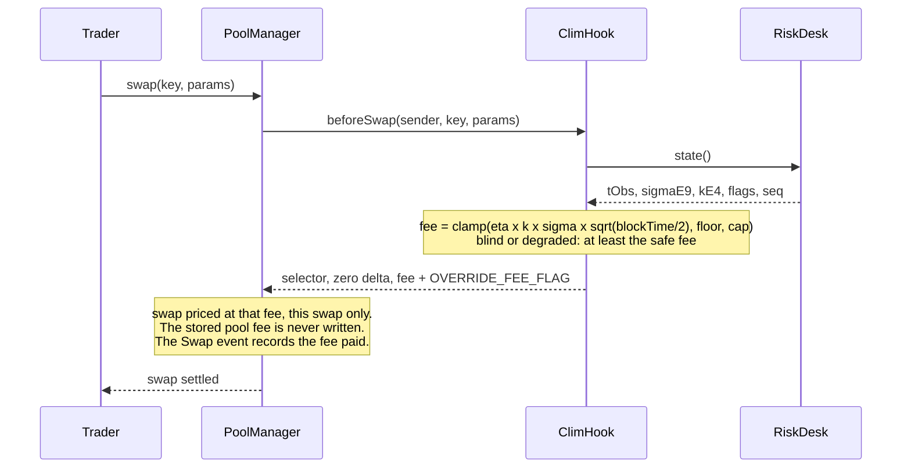

<div align="center">

# ⛈️ clim

**Storm insurance for Uniswap v4 LPs: a Chainlink CRE risk desk measures ETH volatility on four exchanges every 30 seconds, and a Uniswap v4 hook prices every swap from it.**

[-627eea?style=flat-square)](https://sepolia.etherscan.io/address/0x89f04C14f8fAbb5c9202F6B972F940C02AF79080)
[](cre/)
[](contracts/src/ClimHook.sol)
[](contracts/)
[](LICENSE)

**TOKEN2049 Origins · Singapore, October 2026 · Main track and Chainlink "Best workflow with CRE"**

<!-- clim:begin links -->
**Open the dashboard** _(added at submission)_ · **Video demo** _(added at submission)_ · **Deck** _(added at submission)_ · **[CRE evidence](docs/evidence/)** · **[CRE DevEx report](docs/feedback/cre-devex-report.md)** · **[CRE friction log](docs/feedback/cre-friction-log.md)**
<!-- clim:end links -->

</div>


*The 4 February 2026 storm replayed with real Binance prices at the deployed parameters
(`lab/out/replay-2026-02-04.json`).*

When ETH jumps on Binance, bots buy from a pool at the old price and the liquidity provider (LP)
pays the gap. That loss is small when the market is calm and large in a storm, yet a pool charges
the same fee in both. clim makes the fee follow the weather. Four exchanges act as four weather
stations that must agree: a Chainlink CRE workflow reads them every 30 seconds and writes one
volatility figure on-chain (from the CRE simulator for now: see
[What's live vs. simulated](#whats-live-vs-simulated)). On every swap, a Uniswap v4 hook turns that
figure into the fee: the pair's usual tier when it is calm, a premium that rises with volatility in
a storm. The model behind the fee makes a prediction anyone can check, how often the pool gets
arbitraged, and clim publishes it and measures it. No keeper, no admin call, no fee-update
transaction.

> A liquidity provider is an insurer, and the fee is its premium. It is also the LP's only barrier
> against arbitrage: too low and the LP is picked off in a storm, too high and traders route to the
> pool next door. clim charges the market's usual fee in calm weather and a premium in a storm.

> **Built solo in 36 hours at [TOKEN2049 Origins](https://www.token2049.com/singapore/2049-origins), Singapore, 6-8 October 2026.**
> Submitted to the main track and to Chainlink's "Best workflow with CRE" track, which asks for a
> CRE workflow that is the orchestration layer of the product, connects a blockchain to an external
> API, and has run in simulation or on a DON. The main track weighs functionality and execution
> (30%), technical implementation (25%), innovation (20%), usefulness (15%) and the demo (10%).

## Table of contents

- [How it works](#how-it-works)
- [How the fee is computed](#how-the-fee-is-computed)
- [Results](#results)
- [Why Chainlink CRE](#why-chainlink-cre)
- [Files that use Chainlink](#files-that-use-chainlink)
- [What building it made visible](#what-building-it-made-visible)
- [What's live vs. simulated](#whats-live-vs-simulated)
- [Can a pool that is already live use clim?](#can-a-pool-that-is-already-live-use-clim)
- [Roadmap](#roadmap)
- [Deployed addresses](#deployed-addresses)
- [Chainlink CRE evidence](#chainlink-cre-evidence)
- [Getting started](#getting-started)
- [Tech stack](#tech-stack)
- [Repository structure](#repository-structure)
- [What we tested and rejected](#what-we-tested-and-rejected)
- [Limits](#limits)
- [References](#references)
- [Team](#team)
- [License](#license)

## How it works

```
  Coinbase     Kraken      Binance       Hyperliquid    Deribit DVOL (diagnostic)
      │           │           │               │               │
      └───────────┴───────────┴───────┬───────┴───────────────┘
                                      │  1-minute ETH candles, fetched by every node
                                      ▼
 ┌──────────────────────────────────────────────────────────────────────────┐
 │ Chainlink CRE workflow "risk-desk", cron trigger every 30 s              │
 │                                                                          │
 │   each node     converts candles to USD, drops venues older than 120 s,  │
 │                 needs 3 of 4, 15-min realized volatility, dispersion     │
 │   the DON       median of each field, one signed report                  │
 └────────────────────────────────────┬─────────────────────────────────────┘
                                      │  forwarder calls RiskDesk.onReport
                                      ▼
 ┌──────────────────────────────────────────────────────────────────────────┐
 │ RiskDesk.sol    refuses reports < 20 s apart, > 30 s ahead or from < 3   │
 │                 venues; sigma moves at most x2 up, x0.8 down per report; │
 │                 no function sets sigma or the fee                        │
 └────────────────────────────────────┬─────────────────────────────────────┘
                                      │  state(), read inside every swap
                                      ▼
                                ClimHook.sol   fee from sigma and k, between floor and cap
                                  ▲      │     at least the safe fee if blind or degraded
                      beforeSwap  │      │  fee + OVERRIDE_FEE_FLAG, this swap only
                                  │      ▼
 Trader ── swap ────────▶ Uniswap v4 PoolManager ──▶ Swap event: the fee each swap paid

 Dashboard   reads RiskReported (RiskDesk) and Swap (PoolManager) events
```

1. **Risk desk (Chainlink CRE, every 30 s).** Each node fetches one-minute ETH candles from
   Coinbase, Kraken, Binance and Hyperliquid, converts them to USD, drops any venue whose last
   closed candle is older than 120 s and requires at least 3 venues. It computes the 15-minute
   realized volatility of the median price and the dispersion between venues. The nodes agree on
   the median of each field and sign one report. Deribit's implied volatility (DVOL) is published
   as a diagnostic only.
2. **`RiskDesk.sol`** receives the report through `onReport` from the Chainlink forwarder. It
   rejects reports that come less than 20 s after the previous one, from more than 30 s in the
   future, or from fewer than 3 venues, and it limits how far volatility can move between two
   reports (at most ×2 up, ×0.8 down). It has no function that sets volatility or the fee. Its owner
   chooses which forwarder and workflow to trust and can switch off simulation mode; a malicious
   owner could point it at a forwarder it controls, but every accepted report stays inside the
   envelope and the fee clamp. In production the owner renounces ownership after switching to the
   `KeystoneForwarder` ([FAQ](docs/faq.md#can-the-owner-change-the-fee)).
3. **`ClimHook.sol`** (Uniswap v4, built on OpenZeppelin's `BaseOverrideFee`). On every swap the
   PoolManager calls `beforeSwap`; the hook reads `RiskDesk.state()` and returns the fee with
   `OVERRIDE_FEE_FLAG`. If the desk has been silent for longer than the kill delay (blind) or the
   venues disagree (degraded), the hook quotes at least the safe fee.
4. **Dashboard.** Reads `RiskReported` and `Swap` events and shows the desk, the clim pool's fee
   next to a fixed-fee twin pool, and how often each one gets arbitraged. With a wallet on Sepolia
   anyone can take test tokens from the faucet, see the fee before swapping (`/swap`) and provide
   liquidity to either pool (`/lp`).

## How the fee is computed

```
fee = clamp( eta × k × sigma × sqrt(blockTime / 2), floor, cap )
```

- **sigma**: the desk's latest volatility, per square-root second (15-minute realized volatility).
- **sqrt(blockTime / 2)**: scales sigma to the typical price move during half a block, the time an
  arbitrageur waits on average. Sepolia blocks are 12 s.
- **eta**: how many standard deviations of that move the fee covers. With `eta = 1/P* - 0.824`, a
  block gets arbitraged with probability P* once the fee is above the floor (Milionis, Moallemi and
  Roughgarden 2023; Nezlobin and Tassy 2025 for fixed block times); at the floor, in calm markets,
  fewer blocks get arbitraged. The fee is a dial on how often the LP lets itself be picked off.
- **k**: a model-risk multiplier sent by the desk, between 1 and 2. It can only make the fee more
  prudent.
- **floor** is the pair's market fee tier, so in calm markets clim costs traders what the
  neighbouring pool costs.

On-chain it is integer arithmetic, without logarithms or square roots:
`fee_pips = clamp(ceil(sigmaE9 × etaE4 × sqrtHalfDtE6 × kE4 / 1e17), feeMinPips, feeMaxPips)`
(1 bp = 100 pips).

### Nobody "changes" the fee

There is no keeper, no admin call and no fee-update transaction. The fee is recomputed inside every
swap:



The pool is created with the dynamic-fee flag (`fee = 0x800000` in its `PoolKey`), which is what
lets the PoolManager take a per-swap fee from the hook. A fee returned with `OVERRIDE_FEE_FLAG`
(`0x400000`) applies to that swap only; the pool's stored fee is not written. The fee each swap
paid is in the `fee` field of the PoolManager's `Swap` event.

### Parameters

<!-- clim:begin params -->
| Parameter | Value | Meaning |
|---|---|---|
| P* | 30% | Target share of blocks that get arbitraged once the fee is above the floor |
| eta (`etaE4`) | 2.5093 (`25093`) | Fee in standard deviations of the half-block price move: 1/P* - 0.824 |
| sqrt(blockTime/2) (`sqrtHalfDtE6`) | 2.449490 (`2449490`) | Sepolia, 12 s blocks |
| Floor (`feeMinPips`) | 5.00 bp (`500`) | The pair's market fee tier |
| Cap (`feeMaxPips`) | 150.00 bp (`15000`) | Hard ceiling |
| Safe fee (`feeSafePips`) | 30.00 bp (`3000`) | Minimum fee when the desk is blind or degraded |
| Kill delay (`tauKillSec`) | 180 s | A desk silent for longer than this is treated as blind |

Decided by: lab/scripts/decide_pstar.py: year/aggregator LP P&L: P*=0.2: 28.0 bp/yr, P*=0.3: 39.2 bp/yr; P*=0.3 wins 3 of 5 scenarios. These values are immutable constructor arguments of the deployed hook.
<!-- clim:end params -->

### Fee schedule

<!-- clim:begin fee-schedule -->
| ETH volatility (annualized) | Fee charged on every swap (healthy desk, k = 1) |
|---|---|
| 25% | 5.00 bp |
| 50% | 5.48 bp |
| 75% | 8.21 bp |
| 100% | 10.95 bp |
| 150% | 16.42 bp |
| 225% | 24.63 bp |

The fee sits at the 5.00 bp floor up to about 46% annualized volatility, then rises in proportion to volatility. If the desk is blind (silent for more than 180 s) or degraded (venues disagree by more than 25 bp), the fee is at least 30.00 bp.
<!-- clim:end fee-schedule -->

## Results

<!-- clim:begin results -->
Numbers computed by the lab at P* = 30%, floor 5 bp (lab output generated 2026-10-06T15:56:16Z).

| | Feb 2026 storm | Oct 2026 calm | Oct 2025 to Oct 2026 (1-min data bridged) |
|---|---|---|---|
| LP losses to arbitrage vs a fixed-fee pool, **same average fee** | -15.3% | -5.5% | -26.9% |
| LP losses to arbitrage vs a fixed-fee pool, **same cost to traders** | -2.9% | -2.3% | -12.7% |
| Share of blocks arbitraged, predicted / observed | 29.9% / 27.9% | 15.6% / 17.1% | 24.3% / 23.6% |

**Replay of the 4 February 2026 storm** (2026-02-04 12:00 to 16:00 UTC): volatility 34% → 296%, clim's fee 5 → 32.4 bp, LP losses to arbitrage -18.6% against a fixed 15 bp pool with the same average fee (range over the 92 rolling 4 h windows of the storm: -18.4% to +3.1%). The window was picked during design, at an earlier setting, around the sharpest rise in volatility of the storm, after comparing three candidate windows (lab/scratch/replay_pick*.py); at P* = 30% it is the most favorable of the 92 rolling 4 h windows of the storm (median window -2.1%, 66 of 92 better than the fixed pool). Share of the clim pool's blocks arbitraged, predicted / observed: 29.8% / 28.5%.

**What an LP can expect:** -0.10% to +0.70% of capital per year (-$981 to $7,024 a year per $1M of liquidity; full-range ETH LP vs a static 5 bp pool, 1-year replay, 5 retail scenarios), and +0.40% in the main scenario on an asset twice as volatile (the same year with every return doubled), with about 53% of it earned in the five stormiest weeks of the year. It is insurance, not a steady yield.

**Where the model is weak:** it predicts how often arbitrage happens, not how much it costs: realized losses to arbitrage run 1.29 to 1.33 times above the model. In the two 1 s windows the observed share of arbitraged blocks lands within 10% of the prediction, but the gap is statistically significant (p < 0.0005, thresholds simulated from the model because arbitrage comes in clusters). A volatility measured inside the pool itself would capture 54% to 103% of the same gain (see "Why Chainlink CRE"; above 100% means the in-pool estimate did slightly better in one sample).
<!-- clim:end results -->

The two comparisons answer different questions. At the same average fee: does charging at the
right time beat a fixed fee? At the same cost to traders: does it still win when volume grows with
volatility? We always show both, and the 4 February replay window always next to the range and the
median of all the storm's rolling windows.

## Why Chainlink CRE

The honest answer first: a volatility measured inside the pool itself would capture most of the
gain (see Results). CRE is not what makes the number possible. It is what makes it **trustworthy**:

- **Four exchanges must agree.** Nobody can push the fee around with fake trades on the pool, and a
  venue that freezes or diverges is dropped or flags the desk as degraded.
- **One signed report** delivered through the Chainlink forwarder, instead of a keeper key.
- **One figure for many pools and chains.** CRE can write the same report to other EVM chains and
  to Solana.
- **Model control off-chain.** The desk can check its own prediction against what happens on-chain
  and raise the model-risk multiplier k, without anyone touching the hook.

The whole desk is one CRE workflow: a cron trigger, six HTTP sources per node, normalization,
quorum, estimation, consensus by median, a signed report and an on-chain write. A price feed with a
0.5% deviation threshold and a one-hour heartbeat is too coarse for this, and a pull oracle would
let the swapper choose its report. Chainlink does list ETH realized-volatility Data Feeds, but
their shortest window is 24 hours with a one-hour heartbeat (and the Sepolia one last updated on
2024-08-30): a storm that lasts an hour barely moves them. Details in [docs/faq.md](docs/faq.md).

| Track requirement | In clim | Status |
|---|---|---|
| A CRE workflow that is the orchestration layer, core to the product | The fee is computed from the desk's report on every swap; without a fresh report the hook falls back to the safe fee | ✅ |
| A blockchain integrated with an external API | Six HTTP sources per node (Coinbase, Kraken, Binance, Hyperliquid, Deribit DVOL, Kraken USDT/USD), one report written to `RiskDesk` on Ethereum Sepolia | ✅ |
| A successful simulation with the CRE CLI, or a deployment | `cre workflow simulate --broadcast` every 30 s on Sepolia since 2026-10-06 16:26 UTC, for the live desk and the replay desk | ✅ simulation |
| A deployment on a CRE DON | Deploy access requested on 2026-10-06 (`cre account access`), still under review; the workflow already uses the consensus API | 🛣️ |

## Files that use Chainlink

- [`cre/project.yaml`](cre/project.yaml): the CRE project; targets `staging-settings` (live
  simulation), `replay-settings` and `production-settings` (DON deployment), Sepolia RPC.
- [`cre/risk-desk/workflow.yaml`](cre/risk-desk/workflow.yaml): workflow name, entry point and
  config file per target.
- [`cre/risk-desk/main.ts`](cre/risk-desk/main.ts): the runner entry point.
- [`cre/risk-desk/workflow.ts`](cre/risk-desk/workflow.ts): cron and HTTP triggers, node-mode
  observation, consensus by median, `runtime.report`, `EVMClient.writeReport` and the read-back of
  `RiskDesk.state()`.
- [`cre/risk-desk/venues.ts`](cre/risk-desk/venues.ts): venue requests, response parsers, concurrent
  fetch, replay parser.
- [`cre/risk-desk/estimator.ts`](cre/risk-desk/estimator.ts): normalization, staleness, quorum,
  per-minute median, 15-minute realized volatility, dispersion, tick.
- [`cre/risk-desk/report.ts`](cre/risk-desk/report.ts): the report ABI, encoder and decoder.
- [`contracts/src/RiskDesk.sol`](contracts/src/RiskDesk.sol): the CRE consumer; `onReport` through
  the forwarder, on-chain checks, `state()` for the hook.
- [`contracts/src/receiver/ReceiverTemplate.sol`](contracts/src/receiver/ReceiverTemplate.sol):
  Chainlink's receiver base, copied from
  [smartcontractkit/cre-templates](https://github.com/smartcontractkit/cre-templates).
- [`contracts/src/ClimHook.sol`](contracts/src/ClimHook.sol): reads the desk's report on every swap.

[`cre/README.md`](cre/README.md) walks through one execution, the trust model and a sample run.

## What building it made visible

We logged every CRE friction as it happened: 25 entries in
[`docs/feedback/cre-friction-log.md`](docs/feedback/cre-friction-log.md), summarized for the
Chainlink team in [`docs/feedback/cre-devex-report.md`](docs/feedback/cre-devex-report.md). The three
that cost us the most:

- **The receiver template rejects every report once identity checks are on.** The
  `ReceiverTemplate.sol` of cre-templates' `sports-resolution` starter (`d0223f3`) requires 62 bytes
  of metadata, but `KeystoneForwarder` and `MockKeystoneForwarder` pass 64 (workflow id 32, name 10,
  owner 20, report id 2). As soon as an expected workflow id, author or name is set, every report
  reverts `InvalidMetadataLength(64, 62)`. Reproduced with a forge test on real forwarder metadata;
  clim uses the `circuit-breaker` copy, which has no length check. A candidate upstream fix (#23).
- **A rejected report looks like a success.** With `--broadcast`, the simulator reports `SUCCESS`
  whenever the forwarder transaction is mined, and `MockKeystoneForwarder` does not revert when the
  consumer does. A forged report on Sepolia
  ([`0x34ee46a6…53d9`](https://sepolia.etherscan.io/tx/0x34ee46a6947d2831fdb3e5a09f831008589efd9cf099f61dca86dc4cdadc53d9))
  was mined with status 1, `ReportProcessed` false and no `RiskReported`. The workflow re-reads
  `RiskDesk.state()` after each write to tell the two apart (#9).
- **Simulation is one node, and it needs the network.** `cre workflow simulate` runs a single node
  and the Sepolia mock forwarder checks no signature, so `RiskDesk` only accepts simulated reports
  sent by the operator key (`tx.origin`). The CLI also validates its credentials against the CRE API
  on every run: 5 of 413 runs of our 30 s loop on 2026-10-06 stopped there (#1, #24).

## What's live vs. simulated

| Piece | Status | Detail |
|---|---|---|
| Contracts on Sepolia | ✅ live | Both desks, both hooks, the clim pools and their fixed-fee twins, test tokens with a public faucet. `tETH`, `tUSD`, the live `RiskDesk` and the live `ClimHook` are verified on Sourcify |
| A CRE report every 30 s | ✅ live, from simulation | `cre workflow simulate --broadcast` in a loop since 2026-10-06 16:26 UTC. DON time to Sepolia block: median 14 s, p90 25 s over 211 reports on the live desk |
| DON consensus and signature checks | 🛣️ pending | The simulator runs one node and `MockKeystoneForwarder` checks no signature. Deploy access was requested on 2026-10-06 at 22:56 SGT and is still under review (friction #6); the workflow already uses the consensus API, so it runs unchanged on a DON |
| The 4 February 2026 storm | ✅ replayed on Sepolia | Historical Binance prices, served at wall-clock speed by `bots/src/replay-server.ts` to a second CRE loop that writes to the replay desk (first run from 2026-10-06 16:57 UTC); the desk's REPLAY flag discloses it |
| The market | simulated | Our own arbitrage and retail bots trade the clim pool and its fixed-fee twin. No mainnet pool; volume moving to cheaper pools is only approximated; just-in-time liquidity is not modeled |
| Results | simulated | Lab backtests on historical Binance ETHUSDT data (`lab/out/`), not live P&L |
| Dashboard | ✅ live | https://clim-zeta.vercel.app |

## Can a pool that is already live use clim?

Not by flipping a switch on an existing pool; yes for a new pool, and yes for a pool that already
has a dynamic fee. Details in [docs/faq.md](docs/faq.md).

- A Uniswap v3 pool cannot: `UniswapV3Pool.fee` is `immutable`.
- A Uniswap v4 pool's fee mode and hook are part of its `PoolKey`, and the `PoolKey` is the pool's
  identity. A static-fee pool cannot become dynamic and cannot gain a hook: you create a new pool
  and LPs move their liquidity.
- A pool created with a dynamic fee gets its fee from its own hook, either per swap (`beforeSwap`
  with `OVERRIDE_FEE_FLAG`, what clim does) or stored (`PoolManager.updateDynamicLPFee`, which only
  that hook can call).
- A DEX that already runs dynamic fees can use the risk desk without migrating anything: its hook or
  keeper reads `RiskDesk.state()`.
- clim's own parameters are immutable. A different P* means a new hook and a new pool.

## Roadmap

1. **Fables on Robinhood Chain, shadow mode first.** Fables' crypto pools charge a flat fee plus a
   temporary override that a keeper posts between a floor and a cap (our pre-hackathon reading of
   public on-chain data, 2026-09-30). First, clim publishes its recommended fee next to the keeper's,
   without acting on it. Then the keeper reads `RiskDesk.state()`, applies the fee rule with Fables'
   own P*, floor and cap, and posts the result: no contract change on their side.
2. **One desk, many chains.** The same CRE workflow can write the same report to a `RiskDesk` on
   every chain CRE supports, and an off-chain keeper can read a desk on any chain without a bridge.
   CRE lists Robinhood Chain as Robinhood Testnet only (docs, 2026-09-18), and writes to Solana.
3. **DON deployment.** Once deploy access is granted, the workflow runs on a DON, reports arrive
   through the `KeystoneForwarder`, `RiskDesk` checks the expected workflow id, and the owner calls
   `disableSim()`, then renounces ownership or hands it to a timelocked multisig.

## Deployed addresses

<!-- clim:begin deployments -->
Everything runs on Ethereum Sepolia (chain id 11155111). Each address links to Etherscan.

| | Contract | Address | Role |
|---|---|---|---|
| **clim** | `RiskDesk` (live) | [`0xCDbfd6b9…334F`](https://sepolia.etherscan.io/address/0xCDbfd6b9C0b97A8eE31706c6CDE5E54B4954334F) | receives the CRE report every 30 s |
|  | `ClimHook` (live) | [`0x89f04C14…9080`](https://sepolia.etherscan.io/address/0x89f04C14f8fAbb5c9202F6B972F940C02AF79080) | prices every swap of the live clim pool from the live desk |
|  | `RiskDesk` (replay) | [`0x4b843dc3…4746`](https://sepolia.etherscan.io/address/0x4b843dc3A7ec6202d2337cdeF8C67a0F10f24746) | receives CRE reports on the 4 February 2026 storm, replayed; flagged REPLAY |
|  | `ClimHook` (replay) | [`0xf6E4CEC9…D080`](https://sepolia.etherscan.io/address/0xf6E4CEC98865A0B1D8b2D59f70a0A0036bF4D080) | prices every swap of the replay clim pool from the replay desk |
| **Uniswap v4** | `PoolManager` | [`0xE03A1074…3543`](https://sepolia.etherscan.io/address/0xE03A1074c86CFeDd5C142C4F04F1a1536e203543) | the v4 singleton; calls the hook on every swap |
|  | `StateView` | [`0xE1Dd9c3f…7E4C`](https://sepolia.etherscan.io/address/0xE1Dd9c3fA50EDB962E442f60DfBc432e24537E4C) | pool state reads |
|  | `PoolSwapTest` | [`0x9B6b46e2…6eEe`](https://sepolia.etherscan.io/address/0x9B6b46e2c869aa39918Db7f52f5557FE577B6eEe) | test swap router, used by the retail bot |
|  | `PoolModifyLiquidityTest` | [`0x0C478023…1B0A`](https://sepolia.etherscan.io/address/0x0C478023803a644c94c4CE1C1e7b9A087e411B0A) | test liquidity router |
| **Chainlink** | `MockKeystoneForwarder` | [`0x15fC6ae9…9F88`](https://sepolia.etherscan.io/address/0x15fC6ae953E024d975e77382eEeC56A9101f9F88) | delivers `cre workflow simulate --broadcast` reports; checks no signature |
|  | `KeystoneForwarder` | [`0xF8344CFd…4482`](https://sepolia.etherscan.io/address/0xF8344CFd5c43616a4366C34E3EEE75af79a74482) | delivers DON reports; checks the DON's signatures |
| **Test tokens and bots** | `tETH` | [`0xcB249894…5A19`](https://sepolia.etherscan.io/address/0xcB2498949AC0c2473a06199e24f2c5062b665A19) | test ETH with a public faucet |
|  | `tUSD` | [`0xce3171cB…4C14`](https://sepolia.etherscan.io/address/0xce3171cB1ad23D9E5D3fD9839078b4624DC84C14) | test USD with a public faucet |
|  | `PoolSwapTest` (arbitrage) | [`0x70856584…ce51`](https://sepolia.etherscan.io/address/0x70856584d9d8ADDB653aBb1786E37C505665ce51) | the arbitrage bot's own router, so its swaps can be told apart |
|  | Operator | [`0x53aB240f…5A82`](https://sepolia.etherscan.io/address/0x53aB240f6cffC204FC22ac6722D9632d753a5A82) | deployer, test-token owner, sender of the live desk's simulated reports |

| Pool | LP fee | PoolId |
|---|---|---|
| clim pool (live) | dynamic: set by `ClimHook` on every swap | `0x49cad216…d1e6` |
| fixed-fee twin (live) | 5.11 bp, fixed | `0x0e4aeceb…abf0` |
| clim pool (replay) | dynamic: set by `ClimHook` on every swap | `0xc91db9c4…b60f` |
| fixed-fee twin (replay) | 15.03 bp, fixed | `0x5ccceb29…c1f4` |

The canonical set, with full addresses, pool keys and pool ids, lives in [`shared/deployments/sepolia.json`](shared/deployments/sepolia.json).
<!-- clim:end deployments -->

`tETH`, `tUSD`, the live `RiskDesk` and the live `ClimHook` are verified on Sourcify
([`RiskDesk`](https://repo.sourcify.dev/11155111/0xCDbfd6b9C0b97A8eE31706c6CDE5E54B4954334F),
[`ClimHook`](https://repo.sourcify.dev/11155111/0x89f04C14f8fAbb5c9202F6B972F940C02AF79080)).

## Chainlink CRE evidence

The first simulated report
([`0x60465523…1cb6`](https://sepolia.etherscan.io/tx/0x6046552302b7711c4987ee7706d957538dc11ee77ca557b18c92261154e21cb6)),
a forged report the desk ignored and a sample run with its transaction are in
[`cre/README.md`](cre/README.md#evidence). The full list of reports and the raw `simulate`
transcripts are generated at submission:

<!-- clim:begin evidence -->
_Pending: generated from `docs/evidence/cre-reports-sepolia.json` at submission._
<!-- clim:end evidence -->

## Getting started

You need Foundry, Node.js 22, Bun 1.3.9, the [CRE CLI](https://docs.chain.link/cre), uv (Python)
and, for anything that writes on-chain, a Sepolia RPC URL and funded testnet keys.

```bash
git clone --recurse-submodules https://github.com/DVB-ANS/clim && cd clim
bun install                      # root workspace: shared and bots

# Contracts: unit and fuzz tests
(cd contracts && forge test)

# Lab: backtests and model checks
(cd lab && uv sync && uv run pytest)

# CRE risk desk: one simulated run without a transaction (needs `cre login`)
(cd cre/risk-desk && bun install)
(cd cre && cre workflow simulate risk-desk --non-interactive --trigger-index 0 --target staging-settings)

# Dashboard against the deployed Sepolia contracts (a standalone npm project)
(cd app && npm ci && npm run dev)
```

The dashboard is deployed at https://clim-zeta.vercel.app. Its source is developed in its own
repository and is being imported into `app/`; until it lands, the last command has nothing to run.

To run the live loop yourself (a CRE report every 30 s with `--broadcast`, plus the arbitrage and
retail bots), put the operator key in `cre/.env` (`CRE_ETH_PRIVATE_KEY`) and the bot keys in
`bots/.env` (see `bots/.env.example`), then, one terminal each:

```bash
(cd bots && bun run cre-loop --pair live)
(cd bots && bun run arb --pair live)
(cd bots && bun run noise --pair live)
(cd bots && bun run status --pair live --watch)
```

[docs/runbook.md](docs/runbook.md) covers funding, the 4 February replay and the security demos.

## Tech stack

| Layer | Technology |
|---|---|
| Chain | Ethereum Sepolia (chain id 11155111), 12 s blocks |
| Contracts | Solidity 0.8.26 (EVM `cancun`), Foundry 1.4.2, forge-std v1.17.0 |
| Uniswap | Uniswap v4 (v4-core `d153b04`, v4-periphery `7ebd04b`), OpenZeppelin uniswap-hooks v1.2.1 (`BaseOverrideFee`), OpenZeppelin Contracts 5.5.0 |
| Chainlink | CRE CLI v1.37.0, `@chainlink/cre-sdk` 1.23.0 (TypeScript compiled to WASM), `ReceiverTemplate` from cre-templates `d0223f3`, `MockKeystoneForwarder` and `KeystoneForwarder` |
| Bots and shared code | Bun 1.3.9, TypeScript 5.9.3, viem 2.57.3 |
| Lab | Python 3.12 with uv, numpy 2.5.3, pytest |
| Dashboard | Next.js 16, React 19, wagmi 2 and RainbowKit 2, viem, Recharts, Tailwind CSS 4, on Vercel |
| Submission tooling | Node.js 22 (`node:test`), pptxgenjs 4.0.1, matplotlib, ffmpeg |

## Repository structure

```
contracts/                   Foundry
  src/RiskDesk.sol           the CRE consumer: on-chain checks, volatility envelope, state() for the hook
  src/ClimHook.sol           the Uniswap v4 hook: the fee from the desk on every swap
  src/libraries/             ClimFeeMath, the integer fee formula
  src/receiver/              Chainlink's ReceiverTemplate, copied from cre-templates (MIT)
  src/test-tokens/           tETH and tUSD, with a public faucet
  script/                    deployment scripts: tokens, desks, hooks, pools, liquidity, addresses
  test/                      unit, fuzz, integration and Sepolia fork tests
cre/                         the CRE project (project.yaml) and the simulation loop script
  risk-desk/                 the workflow, TypeScript: triggers, venues, estimator, report, write
bots/                        Bun and viem: arbitrage bot, retail bot, CRE loop with receipts, replay server
lab/                         Python: backtests, the P* decision, model validation
  out/                       the JSON behind the lab numbers in this README and the deck
shared/                      read by every part
  deployments/sepolia.json   addresses, pool keys and pool ids
  params.json                the hook parameters decided by the lab
  abis/                      ABIs exported from the contracts
docs/
  faq.md                     the questions we were asked, answered against the source
  feedback/                  the CRE friction log and the DevEx report for the Chainlink team
  sessions/                  decisions and build notes, day by day
  superpowers/               the design spec and the implementation plans
  submission/                README blocks, CRE evidence collector, deck, figures, video
  runbook.md                 funding, the 4 February replay, the security demos
  media/                     the README figure
```

## What we tested and rejected

A first design charged a directional toll against a reference price from the desk. We dropped it
during design, at an earlier setting (exploration scripts in `lab/scratch/bt2.py` and `bt3.py`; not
recomputed at the final P*): the reference is at least 30 s old, so an arbitrageur trades against
the stale reference at the low fee; splitting a swap gets around it; in simulation a symmetric fee
did better at equal tracking error; and a directional fee on a Chainlink oracle already exists
(MSpits/DynamicFeeHook). Deribit's implied volatility (DVOL) is published by the desk as a
diagnostic only: realized volatility drives the fee.

## Limits

- **Latency.** The desk reports every 30 s and the report still has to be included in a block. The
  first move of a sudden jump is arbitraged at the old fee.
- **Modest average gain.** The value is concentrated in storms (see Results). It is insurance, not a
  steady yield.
- **The model is optimistic about severity.** It predicts how often arbitrage happens, not how much
  each one costs (see Results).
- **Simulation and our own market.** See [What's live vs. simulated](#whats-live-vs-simulated).
- **Sources.** Binance answers HTTP 451 to US IP addresses. A quorum of 3 out of 4 venues survives
  one missing venue, not two.
- **Immutable parameters.** Changing P* or the floor means a new hook and a new pool.
- **Cost on mainnet.** Publishing every 30 s on Ethereum would cost an estimated $60k to $110k a
  year in gas (design audit estimate); production would publish on deviation plus a heartbeat, or
  on an L2.
- **Fast chains.** With sub-second blocks the formula sits at the floor until an effective Δt (the
  arbitrageurs' reaction time) is calibrated.
- **Not audited.** Testnet only.

## References

- Milionis, Moallemi, Roughgarden, Zhang (2022). *Automated Market Making and Loss-Versus-Rebalancing.* [arXiv:2208.06046](https://arxiv.org/abs/2208.06046)
- Milionis, Moallemi, Roughgarden (2023). *Automated Market Making and Arbitrage Profits in the Presence of Fees.* [arXiv:2305.14604](https://arxiv.org/abs/2305.14604)
- Nezlobin, Tassy (2025). *Loss-Versus-Rebalancing under Deterministic and Generalized Block-Times.* [arXiv:2505.05113](https://arxiv.org/abs/2505.05113)
- Campbell, Bergault, Milionis, Nutz (2025). *Optimal Fees for Liquidity Provision in Automated Market Makers.* [arXiv:2508.08152](https://arxiv.org/abs/2508.08152)
- Loesch, Hindman, Richardson, Welch (2021). *Impermanent Loss in Uniswap v3.* [arXiv:2111.09192](https://arxiv.org/abs/2111.09192)
- Kupiec (1995). *Techniques for Verifying the Accuracy of Risk Measurement Models.* The Journal of Derivatives 3(2), 73-84. [doi:10.3905/jod.1995.407942](https://doi.org/10.3905/jod.1995.407942)
- Basel Committee on Banking Supervision (1996). *Supervisory framework for the use of "backtesting" in conjunction with the internal models approach to market risk capital requirements.*
- [Uniswap v4 core](https://github.com/Uniswap/v4-core) (`LPFeeLibrary`, `PoolManager`), [OpenZeppelin uniswap-hooks](https://github.com/OpenZeppelin/uniswap-hooks) (`BaseOverrideFee`), [Chainlink CRE documentation](https://docs.chain.link/cre) and [cre-templates](https://github.com/smartcontractkit/cre-templates) (`ReceiverTemplate`).

## Team

Built solo at TOKEN2049 Origins, Singapore, 6-8 October 2026, by a member of
**DeVinci Blockchain** (DVB), Paris.

<!-- clim:begin team -->
| | Role | |
|---|---|---|
| **Sofiane Ben Taleb** | Design, contracts, CRE workflow, lab, dashboard | [GitHub](https://github.com/gamween) · [LinkedIn](https://www.linkedin.com/in/sofiane-ben-taleb/) |
<!-- clim:end team -->

## License

[MIT](LICENSE) © 2026 Sofiane Ben Taleb. Vendored and submodule code keeps its own license:
`contracts/src/receiver/` is copied from
[smartcontractkit/cre-templates](https://github.com/smartcontractkit/cre-templates) (MIT), and
`contracts/lib/forge-std` and `contracts/lib/uniswap-hooks` are git submodules under their own
licenses.

<div align="center">
<sub>Built for TOKEN2049 Origins · Singapore, October 2026 · Main track and Chainlink "Best workflow with CRE"</sub>
</div>
