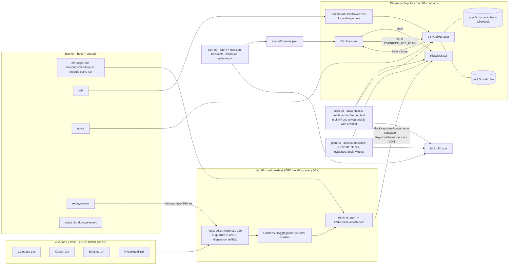
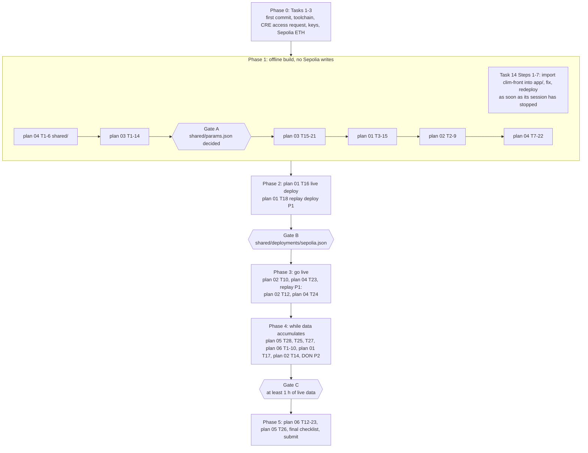

# clim 00 · Master Implementation Plan

> **For agentic workers:** REQUIRED SUB-SKILL: Use superpowers:subagent-driven-development (recommended) or superpowers:executing-plans to implement this plan task-by-task. Steps use checkbox (`- [ ]`) syntax for tracking.

**Goal:** Ship clim for TOKEN2049 Origins (main track and Chainlink "Best workflow with CRE") before 2026-10-07 23:59 SGT, by running plans 01 to 06 in the right order through three gates, with every cross-plan interface fixed in one place.

**Architecture:** clim has four runtime parts and two offline parts. A Chainlink CRE workflow (`cre/risk-desk`, plan 02) measures multi-venue ETH realized volatility every 30 s and writes a signed report to `RiskDesk.sol`. `ClimHook.sol`, a Uniswap v4 dynamic-fee hook (plan 01), reads the desk on every swap and returns the LP fee. Bots (plan 04) trade on twin pools V (clim) and S (static) on Ethereum Sepolia. A Next.js dashboard (plan 05, built in DVB-ANS/clim-front and imported into `app/`) reads the logs and lets anyone use the faucet, swap (`/swap`) and provide liquidity (`/lp`) with a wallet. The lab (plan 03) decides P\* and produces every number. The submission tooling (plan 06) generates the README, the evidence and the deck. `shared/` is the single source of truth between them: addresses, parameters, ABIs and the TypeScript unit helpers. This master plan owns the order, the gates and the cross-plan contracts. The sub-plans own the code.

**Tech Stack:** Foundry 1.4.2 (solc 0.8.26, OpenZeppelin uniswap-hooks v1.2.1); CRE CLI v1.37.0 or later with `@chainlink/cre-sdk` 1.23.0; Bun 1.3.9; TypeScript 5.9.3; viem 2.57.3; Python 3.12 via uv 0.11 (numpy 2.5.3, pytest 9.1.1); Next.js 16.3.8 with Recharts 3.10.1, wagmi 2.19.5 and RainbowKit 2.2.11 on Vercel; Node.js 22.20 (submission tooling, pptxgenjs 4.0.1); ffmpeg; gh.

---

## Read this first (rules for the executor)

- **Launch Claude Code with its working directory at `/Users/fianso/Development/hackathons/clim`.** Plans 02, 04 and 05 write many commands relative to the repository root (`cd shared && ...`, `(cd cre/risk-desk && ...)`, `(cd app && ...)`), and agent shells reset to the launch folder between calls. If the session was launched elsewhere, prefix those commands with `cd /Users/fianso/Development/hackathons/clim && `.
- **Start of every session:** read `CLAUDE.md`, `CLAUDE.local.md`, every `docs/sessions/*.md` (decisions there override the plans until they are folded in), the spec (`docs/superpowers/specs/2026-10-06-clim-design.md`) and this plan. Then run `cd /Users/fianso/Development/hackathons/clim && git log --oneline | head -20`, find the first unchecked task below, and go on from there. The checkboxes in this file and in the sub-plans are the progress record: tick them as you finish them, and add `docs/superpowers/plans/` to the next commit (the sub-plans' own `git add` lines do not include the plan files).
- **How to execute:** use superpowers:subagent-driven-development. Each sub-plan task is one implementer subagent. Give it:
  - the sub-plan path and the task number;
  - the section "Canonical interfaces" of this plan;
  - the rule "copy code blocks exactly; if reality differs, fix the plan file in the same commit and add one session-log line".

  Review its diff against the task before ticking the box. Every sub-plan task ends with its own commit step.
- **Serial by default.** All plans commit to the same working tree. Run two implementer subagents at the same time only in separate worktrees (superpowers:using-git-worktrees), never in the same tree: concurrent `git add` / `git commit` take the same `.git/index.lock`. Long commands are the exception: run them with `run_in_background: true` while you do something that does not touch git. They are `forge install` (plan 01 Task 2), the lab decision script (plan 03 Task 14), `vercel deploy`, the CRE loop and the bots.
- **Absolute paths.** Agent shells reset the working directory between calls. Every command below starts with `cd /Users/fianso/Development/hackathons/clim` or another absolute path.
- **Living documents.** When reality differs from a plan (a version, an output, an address, a schema), change the plan file in the same commit and append one line to today's session log. Format: `- (<area>) <what changed> (<plan and task>).` The areas are `contracts`, `CRE`, `lab`, `ops`, `app`, `submission` and `integration`. When a session-log decision says it overrides a plan, fold it into that plan in the same commit and mark the log line `(folded into plan NN Task M)`.
- **Toolchain on PATH.** Bun and the CRE CLI are linked into `/opt/homebrew/bin` by plan 02 Task 1 (their installers only edit `~/.zshrc`, which the Bash tool does not re-read; `cre workflow build` itself runs `bun`). Never rely on `export PATH=...`: it does not survive to the next command.
- **The dashboard already exists.** A parallel session built plan 05 Tasks 1 to 24 and the Frontend scope upgrade (wallet, `/swap`, `/lp`) in DVB-ANS/clim-front, live at https://clim-zeta.vercel.app. Do not rebuild it: Task 14 imports it into `app/` with `git subtree` once that session has stopped (any time after Task 1), and from then on the app changes only in `clim/app/`.
- **Never:**
  - push without the maintainer's explicit approval (CLAUDE.md);
  - commit a secret (`.env`, `secrets.yaml`), or print a private key in a command's output;
  - deploy `ClimHook` while `shared/params.json` has a `decidedBy` that starts with `PROVISIONAL` or `FIXTURE`;
  - run two CRE loops on the same desk (20 s `MIN_GAP`);
  - send from the operator key in two processes at the same moment (nonces). Any command that sends from it (forge scripts, `bun run fund`, `cast send` with `PRIVATE_KEY`) runs only while the live `cre-loop` is stopped; restart it right after, within 3 minutes if possible (the hook goes blind after 180 s of silence; if it does, note the gap in the session log). The replay desk has its own operator key (`cre/.env.replay`, plan 01 Task 18), so its loop (`ENV_FILE=.env.replay bun run cre-loop --pair replay`) can keep running.
- **Solo for now.** The maintainer works alone until he says otherwise. Every task marked `Delegable: yes` in the sub-plans can be handed to Armand Séchon (@STOOOKEEE) or Noé Wales when he decides to. The "Delegation map" below lists what each one needs (accounts, keys) to start.
- **Plans carry no clock times.** Only the deadline counts: 2026-10-07 23:59 SGT, no late entries. If the remaining time looks short, apply the cut list below in order. Never cut anything on the never-cut list.

## Architecture





## File structure (ownership)

| Path | Created and owned by | Written by others |
|---|---|---|
| `docs/superpowers/plans/2026-10-06-clim-00-master.md` | this plan | |
| `docs/superpowers/specs/2026-10-06-clim-design.md` | spec | plan 03 Task 21 (P\* decision, lab numbers); any plan when reality differs |
| `docs/sessions/<date>.md` | spec | every plan appends (rules below) |
| `docs/feedback/cre-friction-log.md` | spec | plans 01 (Task 6), 02 (Tasks 1, 8 to 13), 04 (Task 17), 06 (Task 22) |
| `docs/faq.md` | spec (planning version) | **replaced** by plan 06 Task 11, run in Task 1 Step 4; plan 05's `npm run sync` copies it into `app/` |
| `README.md` | plan 06 (Tasks 10, 14) | generated blocks only through `npm run readme` |
| `docs/runbook.md` | plan 04 Task 22 | |
| `docs/evidence/`, `docs/media/`, `docs/submission/` | plan 06 | |
| `.gitignore` | repo | plan 04 Task 1 (`out/` → `app/out/` and the `bots/out/*` block), plan 01 Task 2 (anvil outputs), plan 02 Task 2 (CRE build outputs), plan 03 Task 1 (only if `out/` is still bare), plan 06 Task 1 (`docs/submission/out/`) |
| `package.json`, `bunfig.toml` (root Bun workspace: `shared`, `bots`) | plan 04 Task 1 | |
| `shared/src/*`, `shared/test/*`, `shared/scripts/*` | plan 04 Tasks 2 to 6 | |
| `shared/deployments/sepolia.json` | plan 04 Task 6 (bootstrap) | **overwritten** by plan 01 `05_WriteDeployments` (Tasks 16, 18, 19) |
| `shared/params.json` | plan 04 Task 6 (`PROVISIONAL` bootstrap) | **overwritten** by plan 03 Task 14 (the decision) |
| `shared/abis/*.json` | plan 01 Task 14 (`export-abis.sh`) | plan 04's `export-abis` writes identical files |
| `contracts/` | plan 01 | |
| `cre/` | plan 02 | |
| `lab/clim_lab`, `lab/tests`, `lab/scripts`, `lab/out` | plan 03 | `lab/scratch/` and `lab/data/` exist already (data gitignored) |
| `bots/` | plan 04 | `bots/out/cre-runs.jsonl` and `bots/out/security-demos.jsonl` are committed as evidence (plan 06 Task 13) |
| `app/` | plan 05, built in DVB-ANS/clim-front and imported by Task 14 (`git subtree`) | plan 05 Tasks 25 to 28 after the import |

## Canonical interfaces (every plan uses exactly these)

| Contract | Canonical form | Defined in | Checked by |
|---|---|---|---|
| CRE report | `abi.encode(uint40 tObs, uint32 sigmaE9, uint32 rv15E9, uint16 dvolE2, int24 refTick, uint16 dispBp, uint8 nSources, uint16 kE4, uint8 zone)`; `zone` 0 not evaluated, 1 green, 2 yellow, 3 red; hackathon build sends `kE4 = 10000`, `zone = 0`, `sigmaE9 == rv15E9`; `dvolE2 = 0` means DVOL missing | spec §3.4, plan 02 Task 6 | plan 02 golden test against `cast abi-encode`; plan 02 Task 11 against `shared/abis/RiskDesk.json` |
| `RiskDesk` read side | `state() returns (uint40 tObs, uint32 sigmaE9, uint16 kE4, uint8 flags, uint32 seq)`; `RiskReported(uint32 indexed seq, uint40 tObs, uint32 sigmaApplied, uint32 sigmaReported, uint32 rv15E9, uint16 dvolE2, int24 refTick, uint16 dispBp, uint8 nSources, uint16 kE4, uint8 zone)` (topic0 `0x32ed0d7b…efe9`); flags `FLAG_DEGRADED = 1`, `FLAG_REPLAY = 2`; getters `simOperator()`, `simMode()`, `getForwarderAddress()`; sim-guard error `NotSimOperator(address)` (`0x3d7f8f2e`) | plan 01 Tasks 4, 5 | plan 04 ABI drift test, plan 05 Task 4 drift test |
| `RiskDesk` rules | rejects: sim mode and `tx.origin != simOperator`; `tObs < last + 20`; `tObs > block.timestamp + 30`; `nSources < 3`. Envelope: first report `clamp(σ, 17807, 1780730)`, later `clamp(σ, max(17807, prev·8/10), min(1780730, 2·prev))`; `kE4` clamped to [10000, 20000]; DEGRADED iff `dispBp > 25`. A rejected report does **not** revert the forwarder transaction: the evidence is `ReportProcessed(..., false)` and no `RiskReported` | spec §3.5, plan 01 Task 5 | plan 01 Task 6 (real Sepolia mock forwarder) |
| `ClimHook` | constructor `(IPoolManager poolManager, IRiskDesk desk, uint32 etaE4, uint32 sqrtHalfDtE6, uint24 feeMinPips, uint24 feeMaxPips, uint24 feeSafePips, uint32 tauKillSec)`; `quoteFee() returns (uint24 fee, uint8 mode)` with mode 0 normal, 1 degraded, 2 blind; blind when never reported or `block.timestamp > tObs + tauKillSec` (no underflow when `tObs` is ahead); permissions `0x1080` | spec §3.6, plan 01 Task 8 | plan 04 `status.ts` compares it with the mirror every block |
| Fee formula | `ClimFeeMath.feePips(uint32 sigmaE9, uint32 etaE4, uint32 sqrtHalfDtE6, uint16 kE4, uint24 feeMinPips, uint24 feeMaxPips)` = `clamp(ceil(σE9·ηE4·√(Δt/2)E6·kE4 / 1e17), min, max)` | spec §2.4 | the same vectors in plan 01 (Foundry), plan 03 (`lab/tests/test_fee.py`), plan 04 (`shared/test/units.test.ts`), plan 05 (`app/src/lib/feeMath.test.ts`) |
| Units and vectors | `sigmaE9 = round(σ_annual / √31,536,000 · 1e9)`: 10 %→17,807, 48 %→85,475, 100 %→178,072, 225 %→400,663. `etaE4 = round(1e4·(1/P* − 0.824))`: **41,760** (20 %), **25,093** (30 %); old P\* = 10 % vector 91,761. `sqrtHalfDtE6 = 2,449,490`. Vectors (k = 1, floor 500, cap 15,000): 48 % at 91,761 → **1,922** (ceil); 100 % → 1,095 (P\* 30 %) / 1,822 (20 %); 225 % → 2,463 / 4,099; 46 % at 25,093 → 504; k = 2 at 100 %, 25,093 → 2,190 | spec §2.3, §2.4 | as above |
| `shared/params.json` | `pStar, etaE4, sqrtHalfDtE6, feeMinPips (500), feeMaxPips (15000), feeSafePips (3000), tauKillSec (180), staticFeePips, replayStaticFeePips, decidedBy ("lab/scripts/decide_pstar.py: …"), decidedAt`; `staticFeePips != replayStaticFeePips` | spec §2.6, plan 03 Task 14 | plan 03 `test_outputs.py`; plan 04 `parseParams` (±1 on etaE4, ignores extra keys); plan 01 `02_DeployHook` refuses `PROVISIONAL`/`FIXTURE` |
| `shared/deployments/sepolia.json` | `chainId`, `deployBlock`, `deployer`, `uniswap.{poolManager,stateView,poolSwapTest,poolModifyLiquidityTest}`, `cre.{mockForwarder,keystoneForwarder}`, `tokens.{tETH,tUSD}` as `{address,symbol,decimals}`, `routers.arb`, `riskDesks.{live,replay,don}`, `hooks.{live,replay}`, `pools.{liveV,liveS,replayV,replayS}` as `{key:{currency0,currency1,hooks,fee,tickSpacing:60}, poolId, token0IsEth}`, `liquidity.{live,replay}` (decimal strings); `null` until deployed | plan 01 Task 13 (`05_WriteDeployments`), plan 04 contract 1 | plan 04 `parseDeployments` (poolId = keccak of the key, sorted currencies, V dynamic with its hook, S static without hook); plan 05 `parseDeployments` |
| One token pair | live and replay suites share tETH/tUSD; replay V differs by its hook, replay S by its fee | spec §3.7 | plan 01 `03_CreatePools` refuses equal S fees |
| CRE workflow config | `schedule "*/30 * * * * *"`, `deskAddress`, `chainSelectorName "ethereum-testnet-sepolia"`, `gasLimit`, `venues[]`, `dvolUrl`, `usdtUsdUrl`, `mode "live"\|"replay"`, `replayUrl` (base URL, no path), `token0IsEth`, `httpAuthorizedKeys` (extra: needed to deploy); handlers `[0]` cron, `[1]` HTTP | plan 02 Tasks 2, 7 | plan 02 tests |
| Closed candle | a 1-minute candle `[m−60, m)` counts as closed from time m (no grace); close = last price before m; RV15 from the 16 last common closed minutes | spec §2.8, plan 02 Task 3, plan 03 Task 5 | integration check: 479 of 479 replay reports equal the lab's `rv15E9` |
| Replay server | `GET /venue/<venue>/api/v3/klines?symbol=ETHUSDT&interval=1m&limit=20` (Binance format, wall-clock times) for the workflow; `GET /api/v3/ticker/price` for the replay arbitrageur; `/api/v3/klines`, `/snapshot`, `/status` diagnostics; port 8787; input `lab/out/replay-window.json` (`startTs` 1770204600, `warmupSec` 1800, 16,200 closes) | plan 04 Tasks 18, 19; plan 03 Task 20 | plan 04 `replay.test.ts` |
| CRE loop and log lines | one loop: `[ENV_FILE=.env.replay] cre/scripts/sim-loop.sh <staging-settings\|replay-settings> --broadcast` (plan 02 Task 9; `ENV_FILE` is passed to the CLI as `-e`); `bun run cre-loop --pair live\|replay` (plan 04 Task 17) runs it and records each run in `bots/out/cre-runs.jsonl` and `bots/out/cre-sim/<pair>-<start>.log`. Final lines: `REPORT applied … tx=0x…`, `REPORT sent, desk state unreadable after tx=0x…`, `NOT APPLIED: … tx=0x…`, `REJECTED by RiskDesk (onReport reverted) tx=0x…`, `DRY RUN: …`, `clim: no report (<reason>)`; `Write report transaction succeeded: 0x…` precedes the final line | plans 02, 04 | plan 04 `simParse.test.ts` |
| Bot scripts (in `bots/`) | `cre-loop`, `arb`, `noise`, `status [--watch]`, `fund`, `forge-report`, `replay-server`; all take `--pair live\|replay` where relevant | plan 04 Task 7 | used verbatim by plans 02, 06 and the run-book |
| Keys | one operator key = `PRIVATE_KEY` (`contracts/.env`, with 0x) = `CRE_ETH_PRIVATE_KEY` (`cre/.env`, without 0x) = `DEPLOYER_PRIVATE_KEY` (`bots/.env`, with 0x): deployer, TestToken owner, `simOperator` of the live and DON desks. The replay desk's `simOperator` is a second key, `CRE_ETH_PRIVATE_KEY` in `cre/.env.replay` (plan 01 Task 18, `SIM_OPERATOR`), used with `ENV_FILE=.env.replay`. Bot keys `ARB_LIVE`, `NOISE_LIVE`, `ARB_REPLAY`, `NOISE_REPLAY` (`bots/.env`) are different keys | plans 01, 02, 04 | plan 02 Task 10 Step 3 and Task 12 Step 4 compare the addresses with `simOperator()` |
| `TestToken` | `constructor(string name, string symbol, address owner, uint256 faucetAmount)`; owner-only `mint(address,uint256)`; public `faucet()` (10 tETH or 25,000 tUSD per address per hour), `faucetAmount()`, `lastFaucetAt(address)`, `FAUCET_COOLDOWN()`, error `FaucetCooldown(uint256 nextAt)` (`0x12272bab`) | plan 01 Task 7 | plan 01 `TestToken.t.sol`; plan 05 Task 28 ABI fragment; plan 05 Task 27 on Sepolia |
| Pool depth | `LIQ_TETH` default 100,000 tETH per pool (L ≈ 5.2e24 at $2,713): a $2,000 order moves the price about 0.15 bp | plan 01 Task 13 | plan 01 Task 15 Step 3 |
| Lab outputs | `lab/out/pstar_decision.json`, `backtest-summary.json` (`clim.lab.backtest/1`, plan 06; with `replayWindowsMedianPct`, `replayWindowsBetterCount`), `summary.json` (plan 05; `replay.windows*` read by plan 05 Task 28), `validation.json` (plan 06 README and slide 8), `ptrade-band.json` (plan 05), `replay-2026-02-04.json` (`clim.lab.replay/1`: `points[]` for plan 06 and columns for plan 05), `replay-window.json` (plan 04) | plan 03 "Output contracts" | plan 03 `test_outputs.py`; plan 05 parsers; plan 06 `npm run check` |
| Arbitrage attribution | arbitrage swaps go through `routers.arb` only, so `Swap.sender == routers.arb`; the bot pushes the pool to the band edge `[m(1−f), m/(1−f)]` with a binding price limit | plans 01, 04, 05 | integration fork run: the swap's sender topic is the router |
| Gates | A: `shared/params.json` decided by the lab. B: live suite deployed and `shared/deployments/sepolia.json` committed. C: at least 1 h of live data, demos done, app wired | this plan | Tasks 6, 12, 18 below |

## Integration fixes applied by this plan (already in the plan files)

All of them are logged in `docs/sessions/2026-10-06.md`, section "Integration pass (plan 00)". The code changes were re-validated in scratch copies:
- forge: 66 offline tests (69 after the fixer pass's faucet tests), plus an anvil fork dry run of scripts 00 to 05;
- bun: shared 55 pass and 3 skip, bots 60 pass, under Bun 1.3.9 and 1.4.2;
- CRE: 36 pass and 3 skip, and a WASM build;
- an end-to-end replay cross-check.

| Fix | Plans edited |
|---|---|
| etaE4 25,094 → 25,093 in plan 01's tests and fixture; Integration storm step 4,204 → 4,203 | 01 |
| `ClimHook` constructor also refuses `feeMinPips == 0` (spec §3.6: `0 < feeMinPips`), asserted inside the existing bounds test (counts unchanged) | 01 |
| `00_Tokens` deploys the arbitrage router; `05_WriteDeployments` writes `routers.arb` (checked: `manager()` is the PoolManager) | 01, 04, 05, spec |
| CRE estimator `CLOSE_GRACE_SEC` 5 → 0, to match the lab and make replay reports reproduce the lab exactly | 02, 03, spec |
| Replay server adds the wall-clock `/venue/<venue>/api/v3/klines` route that plan 02 calls; `replayUrl` is a base URL | 04, 02 |
| `simParse`: `clim: no report (…)` is a skip; `Write report transaction succeeded` no longer ends a run | 04 |
| Script names `cre-loop` and `forge-report`; transcripts in `bots/out/cre-sim/`; evidence collector default path | 02, 06 |
| `.gitignore`: `bots/out/*` with `cre-runs.jsonl` and `security-demos.jsonl` tracked | 04, 06 |
| Gate names (A, B, C) owned by this plan | 04, 06 |
| Owner powers stated precisely (no direct power over σ or the fee; forwarder trust; `renounceOwnership` in production); FAQ gains the Data Feeds / Data Streams answer; OZ hooks v1.2.1 | 01, 05, 06 |
| Plan 06 FAQ replaces the planning FAQ entirely (no duplicate questions) | 06 |
| `RiskReported`/zone naming "yellow" (was "amber") | 01, 02 |
| Plan 02's DON-desk step and sim-guard error made exact; `CRE_ETH_PRIVATE_KEY` without 0x | 02 |
| Lab schema provenance (plan 03 writes `summary.json` for the app and `backtest-summary.json` for plan 06) | 05, 06 |
| Spec §2.6, §2.8, §3.3, §3.7, §3.8, Appendix B updated; plan 03 Task 21 replaces the audit numbers with the lab's | spec, 03 |
| Evidence collection reads full log history through `https://sepolia.gateway.tenderly.co` (publicnode prunes logs older than about 10,000 blocks) | 06 |

### Fixer pass (after the executability and coverage reviews; logged under "Fixer pass" in the session log)

| Fix | Plans edited |
|---|---|
| Frontend scope upgrade folded in: `TestToken.faucet()` (10 tETH / 25,000 tUSD per hour, +3 tests: 69 offline, 71 with the fork), the dashboard built in DVB-ANS/clim-front and imported by Task 14, plan 05 Task 27 (check `/swap` and `/lp` on Sepolia) and Task 28 (review fixes); cut-list item "test-swap page" removed | 00, 01, 04, 05, spec |
| Pools 10 times deeper: `LIQ_TETH` 100,000 (L ≈ 5.2e24; 0.147 bp for a $2,000 order, measured on a fork) | 01, 04, 05, spec |
| Bun and the CRE CLI linked into `/opt/homebrew/bin`; no `exec zsh -l` | 02, 04, 00 |
| Working directory stated for the coding session; session logs on the start-of-session reading list | 00, 04 |
| Replay desk with its own operator key (`SIM_OPERATOR`, `cre/.env.replay`, `ENV_FILE`), so the two CRE loops never share a nonce | 01, 02, 04, 00, spec |
| `ok` error guard on every chained `forge script` deploy command | 01, 02 |
| Numbers rounded for judges (README, deck, app), the LP gain also in dollars per $1M, the replay window shown with the median and the count of the 92 rolling windows (it is the most favorable one), slide 8 says "within 10 %" and shows the significance of the gap from `lab/out/validation.json`, the year labeled "1-min data bridged", a "More limits" slide (22 slides), plan 06 at 36 tests | 03, 05, 06, spec |
| Directional toll stated qualitatively (README section, spec §2.9, §3.9, §8, §11) instead of an unsupported quantified claim | 06, spec |
| FAQ: Uniswap v3 answer, Fables keeper example, who-can-change-what table, protocol fee; FAQ replaced in Task 1 Step 4 so the live site stops showing the old numbers | 06, 00 |
| Spec §8 acts reordered (live, replay, lab); Kupiec citation verified (Crossref) | spec, 06 |
| Smaller items: `PARAMS_PATH` constraint, plan 01 Task 1 not delegable, TestToken ABI comment, `python -u`, neutral test fixture name, `build-deck` creates its output folder, pptx validator found on disk, no clock time in plan 02, OKX fallback assigned to plan 02 Task 10, vault one-pagers updated in plan 03 Task 17 and plan 06 Task 23, Gate C blind-demo check that can fail | 01, 02, 03, 04, 06, 00 |

## Delegation map (for when the maintainer delegates)

| Phase | Delegable work | What the helper needs |
|---|---|---|
| 1 | plan 04 Tasks 1 to 22; plan 01 Tasks 2, 6, 7, 9, 14, 15; plan 02 Tasks 2 to 7; plan 03 Tasks 15 to 21 | repo access; `contracts/.env` with `SEPOLIA_RPC_URL` only (no key) for plan 01 Tasks 6 and 15; Bun, Foundry, uv |
| 1 | plan 02 Tasks 8, 9 (simulation) | an invitation to the maintainer's CRE organization (plan 02 Task 1 Step 6) and `cre login` |
| 4 | plan 05 Tasks 27 and 28 (Tasks 1 to 24 are done in clim-front); plan 06 Tasks 1 to 10; plan 01 Task 17; plan 02 Tasks 11, 14 | repo access; a wallet with Sepolia ETH for plan 05 Task 27; an Etherscan API key for plan 01 Task 17 |
| 5 | plan 06 Tasks 13 to 19 (evidence, figure, recording, videos, deck, Drive, checks) | a seat at the machine that runs the live system (recording), a Google account (Drive) |
| never | plan 01 Tasks 1, 3, 4, 5, 8, 10 to 13, 16, 18, 19; plan 02 Tasks 1, 10, 12, 13; plan 03 Tasks 1 to 14; plan 04 Tasks 23, 24; plan 05 Tasks 25, 26; this plan's Task 14 Steps 1 to 3 (the import); plan 06 Tasks 12, 20 to 23 | core formula, keys, gates, the maintainer's accounts and final decisions |

## Sepolia ETH and accounts budget

- The live stack at plan 04's defaults burns about 2.2 Sepolia ETH a day at 1 gwei: CRE reports about 0.5, arbitrage about 0.55, retail flow about 1.1 (plan 04 run-book section 0).
- Contract deployment is small: about 6M gas for the live suite including the arbitrage router, 4M for the replay suite.
- `fund` sends 0.2 ETH to each of 4 bot keys; plan 01 Task 18 sends 0.2 ETH to the replay operator key.
- **Target at least 1.5 ETH on the operator key before Gate B.** Collect it from several faucets early (the Chainlink faucet at faucets.chain.link, the Google Cloud Web3 faucet, the Alchemy Sepolia faucet, the PoW faucet sepolia-faucet.pk910.de), and ask mentors at the venue. Write each top-up in the session log as `(ops) operator funded: <amount> ETH from <faucet>`.
- **Set `NOISE_RATE_PER_BLOCK=0.2`** in `bots/.env` unless ETH is plentiful. That is one retail order a minute and cuts the retail cost by more than half; the arbitrage-frequency check does not need more. Never stop the arbitrageur.
- **Accounts:**
  - CRE: the maintainer's, with 2FA (plan 02 Task 1);
  - Vercel: logged in as gamween-7559 (plan 05 Task 24);
  - GitHub: `gh` logged in; the remote is `https://github.com/DVB-ANS/clim.git`, still empty;
  - Etherscan: an optional API key (plan 01 Task 17);
  - Google Drive (plan 06 Task 18) and Builderbase (plan 06 Task 21).

## Logging rules (apply in every task)

- **What the maintainer says is recorded as it happens.** Every decision, feedback (mentors, judges, partners) and surprise goes in the session log if it matters for the code or the submission. Personal, pitch, people and logistics notes go in the maintainer's Obsidian vault (paths in `CLAUDE.local.md`; `clim - Feedbacks.md` is written in French, with no em dashes, no contractions and wiki links only to notes that exist). Never commit vault content or paths.
- **Session log:**
  - file `docs/sessions/2026-10-06.md` on day 1 and `docs/sessions/2026-10-07.md` on day 2 (Task 13 creates it);
  - keep the headings the plans name (`## Decisions`, `## Feedback received`, `## Build notes`, `## Contracts (plan 01)`, `## Surprises`), creating a heading once if it is missing;
  - bullets under `## Build notes` start with the area prefix: `(CRE)`, `(ops)`, `(lab)`, `(app)`, `(submission)`, `(integration)`.
- **Friction log** (`docs/feedback/cre-friction-log.md`): one table row per Chainlink CRE friction, format `| <n> | <Area> | <What we hit> | <Suggestion> | <Status> |`, with the next free number. Update the Status of an existing row instead of duplicating it. Plan 06 Task 22 makes it send-ready for the Chainlink mentor.
- **Mentor questions** (how the fee is computed and changed; whether and how a live pool can change its fee) are answered in:
  - `docs/faq.md` ("How is the fee computed?", "Who changes the fee, and how?", "Can a pool that is already live switch to clim?");
  - the README ("Nobody changes the fee", "Can a pool that is already live use clim?");
  - the deck (slide 4 and the appendix slide for question 2).

  If a mentor or judge asks something new, add the question and its verified answer to `docs/faq.md`, and a line under `## Feedback received`.

---

### Task 1: First commit of the planning documents

**Delegable:** yes
**Depends on:** nothing

**Files:**
- Commit: `.gitignore`, `CLAUDE.md`, `docs/` (spec, plans, FAQ, session log, friction log), `lab/scratch/`

- [x] **Step 1: Check what is about to be committed**

```bash
cd /Users/fianso/Development/hackathons/clim && git status --short && git check-ignore -q CLAUDE.local.md && git check-ignore -q lab/data/eth1m.json && echo IGNORED_OK
```
Expected:
```
?? .gitignore
?? CLAUDE.md
?? docs/
?? lab/
IGNORED_OK
```
If `git status --short` prints nothing and `git log --oneline` already shows a commit with these files, tick this task and go on.

- [x] **Step 2: Stage and verify the file list**

```bash
cd /Users/fianso/Development/hackathons/clim && git add .gitignore CLAUDE.md docs lab && git diff --cached --name-only | wc -l && git diff --cached --name-only | grep -c -E "CLAUDE.local.md|lab/data/" ; git diff --cached --name-only | grep -c "docs/superpowers/plans/"
```
Expected: `26`, then `0`, then `7`: the 26 files are `.gitignore`, `CLAUDE.md`, 3 docs (FAQ, friction log, session log), 7 plans, the spec and 13 scratch scripts. If the first number differs, look at `git diff --cached --name-only` and unstage anything that is not one of those (`git restore --staged <path>`).

- [x] **Step 3: Commit**

```bash
cd /Users/fianso/Development/hackathons/clim && git commit -m "docs: design spec, implementation plans, session and friction logs, lab scratch" && git log --oneline | head -1
```
Expected: one line ending in `docs: design spec, implementation plans, session and friction logs, lab scratch`. Do not push.

- [x] **Step 4: Replace the planning FAQ now (plan 06 Task 11)**

Run plan 06 Task 11 (delegable, no dependency). The planning FAQ quotes the audit's superseded numbers ("85 to 97%", "−14% to +7%"), and the live dashboard (https://clim-zeta.vercel.app, `/how`) shows `docs/faq.md`; Task 14 syncs and redeploys it. Check: `grep -c "85 to 97" /Users/fianso/Development/hackathons/clim/docs/faq.md` prints `0`.

### Task 2: Toolchain, CRE account and the early deploy-access request

**Delegable:** no (the maintainer's CRE account, 2FA and browser)
**Depends on:** Task 1

**Files:**
- Modify: `docs/feedback/cre-friction-log.md`, `docs/sessions/2026-10-06.md` (through plan 02 Task 1)

- [x] **Step 1: Run plan 02 Task 1 (all eight steps)**

It installs Bun 1.3.9 and the CRE CLI, logs in, submits `cre account access` (human review can take hours: do it now), updates friction rows 2, 3, 5 and appends rows 9 to 15, and commits. Plan 02 Task 1 Step 4 needs `! cre login` typed by the maintainer in Claude Code. Step 5 (`cre account access`) must run in a regular terminal, after the login: its prompt needs a TTY, which `!` does not give.

- [x] **Step 2: Check the rest of the toolchain**

```bash
bun --version; which bun cre; cre version; forge --version | head -1; uv --version; node --version; jq --version; gh auth status 2>&1 | grep -m1 "Logged in"; (cd /tmp && vercel whoami); ffmpeg -version | head -1
```
Expected:
- `1.3.9`;
- `/opt/homebrew/bin/bun` and `/opt/homebrew/bin/cre` (plan 02 Task 1 links them there; without the links later tool calls do not find them);
- `CRE CLI version v1.37.0` or later;
- `forge Version: 1.4.2-stable`;
- `uv 0.11.x`;
- `v22.20.0` (any 22.x from 22.18 on);
- a jq version;
- a `Logged in to github.com` line;
- `gamween-7559`;
- an ffmpeg version line.

Optional, only if you want the run-book's single-window layout: `brew install tmux`.

- [x] **Step 3: Log the toolchain**

Append under `## Build notes` in `docs/sessions/2026-10-06.md` (create the heading at the end of the file if it is missing):
```markdown
- (integration) Toolchain checked: Bun 1.3.9, CRE CLI <version>, Foundry 1.4.2, uv <version>, Node <version>, Vercel and gh logged in. CRE deploy access requested (status: <Not enabled|Enabled>).
```
```bash
cd /Users/fianso/Development/hackathons/clim && git add docs/sessions/2026-10-06.md && git commit -m "docs(sessions): toolchain checked"
```

### Task 3: Operator key, Sepolia ETH and the Foundry dependencies

**Delegable:** no (keys and funding)
**Depends on:** Task 2

**Files:**
- Create: `contracts/.env.example`, `contracts/.env` (never committed), Foundry config and submodules (through plan 01 Tasks 1 and 2)

- [x] **Step 1: Run plan 01 Task 1**

It creates the operator key, writes `contracts/.env`, checks every Sepolia infrastructure address with `cast`, checks the balance and commits. For its Step 2, create the key without printing it (only the address is shown; if the maintainer already has a funded testnet key, put that one in `PRIVATE_KEY` instead):
```bash
cd /Users/fianso/Development/hackathons/clim/contracts && test -f .env || cp .env.example .env; K=$(cast wallet new --json | jq -r '.[0].private_key'); sed -i '' "s|^PRIVATE_KEY=.*|PRIVATE_KEY=${K}|" .env; cast wallet address --private-key $K; cd .. && git status --short contracts/.env
```
Expected: one `0x…` address (the operator, deployer and `simOperator`), and no `git status` output.

- [x] **Step 2: Start the Foundry dependency install in the background**

Run plan 01 Task 2 Step 1 (config files), then Step 2 (`forge install …`) with `run_in_background: true`; it takes 12 to 15 minutes.

- [ ] **Step 3: Fund the operator key while the install runs**

Use the faucets of the budget section until the balance reaches the target:
```bash
cd /Users/fianso/Development/hackathons/clim/contracts && set -a && source .env && set +a && cast balance $(cast wallet address --private-key $PRIVATE_KEY) --rpc-url $SEPOLIA_RPC_URL --ether
```
Expected: at least `1.5` before Gate B (at least `0.05` is enough to continue Phase 1). Log each top-up as described in the budget section.

- [x] **Step 4: Finish plan 01 Task 2**

When the install has printed `Installed uniswap-hooks tag=v1.2.1@acbd604c…`, run plan 01 Task 2 Steps 3 to 8 (stage the submodules at the tags, vendor the receiver, gitignore lines, build, log, commit).

### Task 4: Shared foundation

**Delegable:** yes
**Depends on:** Task 1

**Files:** created by plan 04 Tasks 1 to 6 (root Bun workspace, `.gitignore` fix, `shared/` package, bootstrap `shared/deployments/sepolia.json` and `shared/params.json`)

- [x] **Step 1: Run plan 04 Tasks 1 to 6 in order**

- [x] **Step 2: Verify**

```bash
cd /Users/fianso/Development/hackathons/clim && bun run --cwd shared test 2>&1 | grep -E "^ [0-9]+ (pass|skip|fail)$" && git check-ignore -v lab/out/x.json; echo "exit=$?"
```
Expected: ` 55 pass`, ` 3 skip`, ` 0 fail`, then `exit=1` (`lab/out/` is no longer ignored).

### Task 5: The lab, through the P\* decision

**Delegable:** no for plan 03 Tasks 1 to 14 (critical path); yes for Tasks 15 to 21
**Depends on:** Task 4

**Files:** created by plan 03 (`lab/clim_lab/`, `lab/tests/`, `lab/scripts/`, `lab/out/`, `shared/params.json`)

- [x] **Step 1: Run plan 03 Tasks 1 to 14 in order**

Task 14 runs the decision (`decide_pstar.py`, about 2 minutes; run it in the background and wait). If it prints a `chosen P*` other than 0.3, stop: tell the maintainer, paste the printed rows in the session log, and wait for his decision before going on. Hook parameters are immutable.

- [x] **Step 2: Run Gate A (Task 6 of this plan) now**

- [x] **Step 3: Run plan 03 Tasks 15 to 21 in order**

These produce `backtest-summary.json`, `summary.json`, `validation.json`, `ptrade-band.json`, `replay-2026-02-04.json` and `replay-window.json`, write `lab/README.md`, and update the spec with the decision and the lab's numbers (Task 21 Steps 2 and 2b).

- [x] **Step 4: Verify**

```bash
cd /Users/fianso/Development/hackathons/clim/lab && uv run pytest -q 2>&1 | tail -1 && ls out
```
Expected: `82 passed`, then the seven files, one per line: `backtest-summary.json`, `ptrade-band.json`, `pstar_decision.json`, `replay-2026-02-04.json`, `replay-window.json`, `summary.json`, `validation.json`.

### Task 6: GATE A · `shared/params.json` is decided

**Delegable:** no
**Depends on:** plan 03 Task 14

**Files:**
- Modify: `docs/sessions/2026-10-06.md`

- [x] **Step 1: Check the decision file**

```bash
cd /Users/fianso/Development/hackathons/clim && jq -e '(.decidedBy | startswith("lab/scripts/decide_pstar.py")) and (.pStar == 0.2 or .pStar == 0.3) and (.staticFeePips != .replayStaticFeePips) and .feeMinPips == 500 and .feeMaxPips == 15000 and .feeSafePips == 3000 and .tauKillSec == 180' shared/params.json && jq -c '{pStar, etaE4, staticFeePips, replayStaticFeePips}' shared/params.json && git log --oneline -1 -- shared/params.json
```
Expected: `true`, then `{"pStar":0.3,"etaE4":25093,"staticFeePips":511,"replayStaticFeePips":1503}` (the validated run), then the commit `feat(lab): decide P* = 0.3 by LP P&L vs a 5 bp competitor; write shared/params.json`.

- [x] **Step 2: Check that every consumer accepts it**

```bash
cd /Users/fianso/Development/hackathons/clim && (cd lab && uv run pytest -q tests/test_outputs.py -k "params_json or pstar_decision_json" 2>&1 | tail -1) && bun run --cwd shared test 2>&1 | grep -E "^ [0-9]+ fail$"
```
Expected: `2 passed`, then ` 0 fail`.

- [x] **Step 3: Record the gate**

Append under `## Decisions` in `docs/sessions/2026-10-06.md`:
```markdown
- **Gate A passed:** `shared/params.json` decided by the lab (P\* = <pStar>, etaE4 = <etaE4>, S live <staticFeePips> pips, S replay <replayStaticFeePips> pips). The hook can be deployed.
```
```bash
cd /Users/fianso/Development/hackathons/clim && git add docs/sessions/2026-10-06.md && git commit -m "docs(sessions): gate A passed"
```

### Task 7: Contracts, offline

**Delegable:** partly (plan 01 Tasks 6, 7, 9, 14, 15 yes; Tasks 3, 4, 5, 8, 10 to 13 no)
**Depends on:** Task 3

**Files:** created by plan 01 Tasks 3 to 15

- [x] **Step 1: Run plan 01 Tasks 3 to 15 in order**

Task 15 is the anvil fork dry run of every deploy script, including the arbitrage router check (`"arb":true`, `manager()` = the PoolManager).

- [x] **Step 2: Verify**

```bash
cd /Users/fianso/Development/hackathons/clim/contracts && forge test 2>&1 | tail -1 && ls ../shared/abis
```
Expected: `71 tests passed, 0 failed, 0 skipped (71 total tests)` (69 offline plus the 2 fork tests, because `contracts/.env` sets `SEPOLIA_RPC_URL`), then the eight ABI files, one per line: `ClimHook.json`, `IPoolManager.json`, `IRiskDesk.json`, `IStateView.json`, `PoolModifyLiquidityTest.json`, `PoolSwapTest.json`, `RiskDesk.json`, `TestToken.json`.

- [x] **Step 3: Check the ABIs against the shared package**

```bash
cd /Users/fianso/Development/hackathons/clim && bun run --cwd shared test 2>&1 | grep -E "^ [0-9]+ (pass|skip|fail)$"
```
Expected: ` 58 pass`, ` 0 fail` and no `skip` line (the 3 ABI drift checks now run).

### Task 8: CRE workflow, offline and in dry-run simulation

**Delegable:** partly (plan 02 Tasks 2 to 7 yes; Tasks 8 and 9 need `cre login` in the organization)
**Depends on:** Task 2; Step 2 also needs Task 7 (the exported ABIs)

**Files:** created by plan 02 Tasks 2 to 9

- [x] **Step 1: Run plan 02 Tasks 2 to 9 in order**

Task 8 is the first dry run against the live venues; Task 9 creates `cre/scripts/sim-loop.sh` (the only CRE loop) and answers friction rows 11 and 12.

- [x] **Step 2: Run plan 02 Task 11** (ABI check; the ABIs exist since Task 7)

- [x] **Step 3: Verify**

```bash
cd /Users/fianso/Development/hackathons/clim/cre/risk-desk && bun test 2>&1 | grep -E "^ [0-9]+ (pass|skip|fail)$" && bun run typecheck 2>&1 | tail -1 && cd .. && cre workflow build ./risk-desk -o ./risk-desk/binary.wasm 2>&1 | grep -E "compiled successfully"
```
Expected: ` 39 pass`, ` 0 fail`, `$ tsc --noEmit`, `✓ Workflow compiled successfully`.

### Task 9: Bots, offline

**Delegable:** yes
**Depends on:** Task 4

**Files:** created by plan 04 Tasks 7 to 22 (`bots/`, `docs/runbook.md`)

- [x] **Step 1: Run plan 04 Tasks 7 to 22 in order**

- [x] **Step 2: Verify**

```bash
cd /Users/fianso/Development/hackathons/clim && bun run test 2>&1 | grep -E "test:  [0-9]+ (pass|fail|skip)" && bun run typecheck 2>&1 | grep -c "Exited with code 0"
```
Expected: `@clim/shared test:  58 pass`, `@clim/shared test:  0 fail`, `@clim/bots test:  60 pass`, `@clim/bots test:  0 fail`, then `2` (`55 pass` for shared if plan 01 Task 14 has not exported the ABIs yet).

### Task 10: Deploy the live suite, then the replay suite

**Delegable:** no
**Depends on:** Tasks 6, 7, 9; the operator key holds at least 1.5 Sepolia ETH (or at least 0.1, with a session-log note that the live stack waits for more)

**Files:** written by plan 01 Tasks 16 and 18 (`contracts/deployments/11155111/`, `contracts/broadcast/`, `shared/deployments/sepolia.json`, `shared/abis/`)

- [x] **Step 1: Run plan 01 Task 16**

Its Step 1 is the gate check (params decided, balance, 71 tests). Its Step 3 initializes both pools at the current Coinbase ETH price, with 100,000 tETH of full-range liquidity each.

- [ ] **Step 2: Run plan 01 Task 18 now (replay suite, P1)**

It creates and funds the replay operator key (`cre/.env.replay`, 0.2 ETH from the deployer), then deploys the replay desk with that key as `simOperator`, its hook and pools at the replay window's first price. Doing it before any loop runs keeps the deployer key free; the replay itself starts in Task 13. If the replay is already cut (cut list item 4), skip this step.

- [ ] **Step 3: Run Gate B (Task 12 of this plan)**

### Task 11: Bot keys and environment files

**Delegable:** no (keys)
**Depends on:** Task 9 (`bots/.env.example` exists), plan 01 Task 1 (`contracts/.env`)

**Files:**
- Create: `bots/.env` (never committed)

- [x] **Step 1: Write `bots/.env` without printing any key**

```bash
cd /Users/fianso/Development/hackathons/clim/bots && test -f .env || cp .env.example .env; for r in ARB_LIVE NOISE_LIVE ARB_REPLAY NOISE_REPLAY; do k=$(cast wallet new --json | jq -r '.[0].private_key'); sed -i '' "s|^${r}_PRIVATE_KEY=.*|${r}_PRIVATE_KEY=${k}|" .env; done; D=$(grep '^PRIVATE_KEY=' ../contracts/.env | cut -d= -f2); case "$D" in 0x*) ;; *) D="0x$D";; esac; sed -i '' "s|^DEPLOYER_PRIVATE_KEY=.*|DEPLOYER_PRIVATE_KEY=${D}|" .env; sed -i '' "s|^NOISE_RATE_PER_BLOCK=.*|NOISE_RATE_PER_BLOCK=0.2|" .env; grep -c -E '^(DEPLOYER|ARB_LIVE|NOISE_LIVE|ARB_REPLAY|NOISE_REPLAY)_PRIVATE_KEY=0x[0-9a-fA-F]{64}$' .env; cd .. && git status --short bots/.env
```
Expected: `5`, and no output from `git status` (the file is ignored). Skip the `NOISE_RATE_PER_BLOCK` edit if the operator key holds plenty of ETH.

- [x] **Step 2: Note the bot addresses (public) in the session log**

```bash
cd /Users/fianso/Development/hackathons/clim/bots && for r in ARB_LIVE NOISE_LIVE ARB_REPLAY NOISE_REPLAY; do echo "$r $(cast wallet address --private-key $(grep "^${r}_PRIVATE_KEY=" .env | cut -d= -f2))"; done
```
Expected: four lines `<ROLE> 0x<address>`. Append them as one bullet under `## Build notes`: `- (ops) Bot addresses: ARB_LIVE 0x…, NOISE_LIVE 0x…, ARB_REPLAY 0x…, NOISE_REPLAY 0x… (keys in bots/.env, never committed).` Commit the session log:
```bash
cd /Users/fianso/Development/hackathons/clim && git add docs/sessions && git commit -m "docs(sessions): bot addresses"
```

- [x] **Step 3: When plan 02 Task 10 Step 3 asks for `cre/.env`, fill it without printing the key**

```bash
cd /Users/fianso/Development/hackathons/clim && test -f cre/.env || cp cre/.env.example cre/.env; D=$(grep '^PRIVATE_KEY=' contracts/.env | cut -d= -f2); sed -i '' "s|^CRE_ETH_PRIVATE_KEY=.*|CRE_ETH_PRIVATE_KEY=${D#0x}|" cre/.env; grep -c -E '^CRE_ETH_PRIVATE_KEY=[0-9a-fA-F]{64}$' cre/.env
```
Expected: `1`. Then continue plan 02 Task 10 Step 3 from its `cast wallet address` check.

### Task 12: GATE B · the live suite is on Sepolia and recorded

**Delegable:** no
**Depends on:** Task 10

**Files:**
- Modify: today's session log

- [x] **Step 1: Check the deployments file**

```bash
cd /Users/fianso/Development/hackathons/clim && D=shared/deployments/sepolia.json && jq -e --argjson p "$(cat shared/params.json)" '.chainId == 11155111 and (.deployBlock|type=="number") and (.riskDesks.live|type=="string") and (.hooks.live|type=="string") and (.routers.arb|type=="string") and .pools.liveV != null and .pools.liveS != null and (.pools.liveS.key.fee == $p.staticFeePips)' $D && git log --oneline -1 -- $D
```
Expected: `true`, then the commit `deploy(contracts): live clim suite on Sepolia (tokens, RiskDesk, ClimHook, twin pools)`.

- [x] **Step 2: Check the contracts on-chain**

```bash
cd /Users/fianso/Development/hackathons/clim && D=shared/deployments/sepolia.json && R=https://ethereum-sepolia-rpc.publicnode.com && cast call $(jq -r .hooks.live $D) "quoteFee()(uint24,uint8)" --rpc-url $R && cast call $(jq -r .riskDesks.live $D) "simOperator()(address)" --rpc-url $R && jq -r .deployer $D && cast call $(jq -r .routers.arb $D) "manager()(address)" --rpc-url $R
```
Expected:
- `3000` and `2` on two lines (blind: no report yet), unless the CRE loop already runs;
- the same address twice (`simOperator` is the deployer);
- `0xE03A1074c86CFeDd5C142C4F04F1a1536e203543`.

- [x] **Step 3: Check every consumer parses it**

```bash
cd /Users/fianso/Development/hackathons/clim && bun run --cwd shared test 2>&1 | grep -E "^ [0-9]+ (pass|skip|fail)$" && (cd cre/risk-desk && bun test abi-sync.test.ts 2>&1 | grep -E "^ [0-9]+ (pass|skip|fail)$")
```
Expected: ` 58 pass`, ` 0 fail`, then ` 3 pass`, ` 0 fail` (no `skip` lines).

- [x] **Step 4: Record the gate**

Append under `## Decisions` in `docs/sessions/2026-10-06.md` (or the day-2 file):
```markdown
- **Gate B passed:** live suite on Sepolia (desk <riskDesks.live>, hook <hooks.live>, arbitrage router <routers.arb>), recorded in `shared/deployments/sepolia.json`.
```
```bash
cd /Users/fianso/Development/hackathons/clim && git add docs/sessions && git commit -m "docs(sessions): gate B passed"
```

### Task 13: Go live (CRE broadcast and bots), then the replay

**Delegable:** no (operator key, `cre login`)
**Depends on:** Tasks 8, 11, 12

**Files:** through plan 02 Task 10, plan 04 Task 23, plan 02 Task 12, plan 04 Task 24; create `docs/sessions/2026-10-07.md` on day 2

- [ ] **Step 1: On day 2, create the day-2 session log first**

When the date changes (`date +%F` prints `2026-10-07`), create the file once:
```bash
cd /Users/fianso/Development/hackathons/clim && test -f docs/sessions/2026-10-07.md || printf '# Session log · 2026-10-07 (TOKEN2049 Origins, day 2)\n\nDecisions, feedback and open questions that matter for the code. Non-code notes (pitch, people, logistics) live in the team'"'"'s private notes.\n\n## Decisions\n\n## Feedback received\n\n## Build notes\n' > docs/sessions/2026-10-07.md && head -1 docs/sessions/2026-10-07.md
```
Expected: `# Session log · 2026-10-07 (TOKEN2049 Origins, day 2)`. Commit it with the next session-log change.

- [ ] **Step 2: Run plan 02 Task 10** (first broadcast report, forged-report proof, start of the loop, latency)

In its Step 3, fill `cre/.env` with this plan's Task 11 Step 3. In its Step 7, start the bare loop so the desk is not blind while the bots are prepared.

- [ ] **Step 3: Run plan 04 Task 23** (fund, status, one recorded CRE run, ten minutes of the full stack, both security demos)

Before its Step 2 (`fund`), stop the bare loop (`pkill -f sim-loop.sh`): `fund` sends from the operator key, and from then on only `bun run cre-loop` drives the desk (one loop per desk). After its Step 7, start the four live processes again and leave them running (run-book section 3: `cre-loop`, `arb`, `noise`, `status --watch`, all `--pair live`). From now on the live stack accumulates the data that Gate C needs. Check it from time to time with `cd /Users/fianso/Development/hackathons/clim/bots && bun run status --pair live` (exit code 0, no `PROBLEM` line).

- [ ] **Step 4: Start the replay as early as possible (P1, it lasts 4 hours)**

The replay suite is deployed (Task 10 Step 2). Run plan 02 Task 12 (replay desk through CRE, localhost or tunnel), then plan 04 Task 24 (replay smoke test), and leave `replay-server`, `ENV_FILE=.env.replay bun run cre-loop --pair replay`, `arb --pair replay` and `noise --pair replay` running. The replay loop sends from its own operator key, so it runs next to the live loop at any moment. If the replay cannot run, apply the cut list (item 4) and log it.

- [ ] **Step 5: Log**

Append under `## Build notes`:
```markdown
- (integration) Live stack running since <UTC time from the first applied run>; replay started at <UTC> (or cut: <reason>).
```
```bash
cd /Users/fianso/Development/hackathons/clim && git add docs/sessions && git commit -m "docs(sessions): live stack and replay started"
```

### Task 14: Dashboard: import it from clim-front, fix, wire to Sepolia

**Delegable:** no for Steps 1 to 3 and 7 (the import and the maintainer's Vercel account); yes for Steps 4 to 6 and plan 05 Tasks 27 and 28
**Depends on:** Task 1 Step 4 (the new FAQ is in `docs/faq.md`, so the first sync copies it); the clim-front session has stopped. Steps 1 to 7 can run any time after that, even before Gate A ("Read this first"). Step 8 needs Gate B (Task 12) and data flowing (Task 13).

**Files:** `app/` (imported from DVB-ANS/clim-front with its history), `docs/sessions/2026-10-06.md` (clim-front's build log appended)

The dashboard (plan 05 Tasks 1 to 24, plus the Frontend scope upgrade: wallet, `/swap`, `/lp`) was built after kickoff in the private repository DVB-ANS/clim-front, laid out exactly as `app/`, and is live at https://clim-zeta.vercel.app on mock data. A scratch run of Steps 2 to 4 at clim-front commit `c924078` gave the results quoted below.

- [ ] **Step 1: Check that the clim-front session has stopped**

```bash
git -C /Users/fianso/Development/hackathons/clim-front status --short | wc -l && git -C /Users/fianso/Development/hackathons/clim-front log --format='%h %ad %s' --date=iso -1 && git -C /Users/fianso/Development/hackathons/clim-front log --reverse --format='%ad' --date=iso | head -1
```
Expected: `0`, the last commit (`c924078 2026-10-06 ... docs(app): README, how to run and how to go live` at the time of the fixer pass, or a later one), then the first commit's date, after `2026-10-06 12:00:00 +0800` (hackathon rule: `2026-10-06 20:24:03 +0800`). If the first number is not 0, or the maintainer says the clim-front session is still running, stop and ask him: importing now would leave its later work behind.

- [ ] **Step 2: Import with history**

```bash
cd /Users/fianso/Development/hackathons/clim && test -z "$(git status --porcelain)" && git subtree add --prefix=app /Users/fianso/Development/hackathons/clim-front main && git log --oneline -1 && ls app/src/app
```
Expected: `Added dir 'app'`, a commit `Add 'app/' from commit '<sha>'`, then `favicon.ico`, `globals.css`, `how`, `lab`, `layout.tsx`, `lp`, `page.tsx`, `replay`, `swap`. `git subtree add` refuses a dirty working tree (the `test -z` stops first): commit or stash, then rerun. The import keeps clim-front's commits, so their post-kickoff dates are visible in the public repo. From now on the app changes only in `clim/app/`; if the maintainer ever restarts work in clim-front, bring it in with `git subtree pull --prefix=app /Users/fianso/Development/hackathons/clim-front main -m "Merge clim-front main into app/"`.

- [ ] **Step 3: Move clim-front's build log into the session logs**

```bash
cd /Users/fianso/Development/hackathons/clim && for f in app/docs/sessions/*.md; do d=docs/sessions/$(basename "$f"); { echo; echo "## Frontend build log (DVB-ANS/clim-front, imported into app/)"; tail -n +4 "$f" | sed 's/^## /### /'; } >> "$d"; done && git rm -q -r app/docs && grep -c "^## Frontend build log" docs/sessions/2026-10-06.md
```
Expected: `1`. Its decisions (design tokens, wagmi 2 + RainbowKit, `/swap` and `/lp` through the Uniswap test routers, the simulated mode, the live URL) are now under one heading of the session log.

- [ ] **Step 4: Install, sync and check**

```bash
cd /Users/fianso/Development/hackathons/clim/app && npm ci --no-audit --no-fund > /dev/null && npm run sync && npm test 2>&1 | grep -E "Tests " && npm run typecheck && npm run lint && npm run build 2>&1 | grep -E "Compiled successfully|/lp|/swap"
```
Expected: the sync lines (`repo` for every source that exists in `shared/`, `lab/out/` and `docs/faq.md`, `fixture` for the others); `Tests  123 passed | 2 skipped (125)` at clim-front `c924078` (the 2 ABI drift checks skip until plan 01 exports `shared/abis/`; a later clim-front commit may add tests: the requirement is no `failed`); no typecheck or lint error; `Compiled successfully`, `/lp` and `/swap` in the route table.

- [ ] **Step 5: Commit**

```bash
cd /Users/fianso/Development/hackathons/clim && git add app docs/sessions && git commit -m "chore(app): import the dashboard from DVB-ANS/clim-front and sync shared/, lab/out and the FAQ"
```

- [ ] **Step 6: Run plan 05 Task 28** (post-import fixes from the plan review: rounded lab numbers, the replay volatility range from data, the replay-window context, the faucet's cooldown error in the ABI)

- [ ] **Step 7: Link `app/` to the existing Vercel project and redeploy**

```bash
cd /Users/fianso/Development/hackathons/clim/app && vercel whoami && vercel link --yes --project clim && vercel deploy --prod --yes 2>&1 | tail -2 && curl -s -o /dev/null -w "%{http_code}\n" https://clim-zeta.vercel.app/lp
```
Expected: `gamween-7559`, a `Linked to .../clim` line (`app/.vercel/` is ignored by `app/.gitignore`), a production URL, then `200`. Append under `## Build notes`: `- (app) Dashboard imported from DVB-ANS/clim-front at <sha> with git subtree (history kept); https://clim-zeta.vercel.app now deploys from clim/app/.` and commit the session log. To deploy on push later, set the Vercel project's Root Directory to `app/` and give the Vercel GitHub app access to DVB-ANS (optional; CLI deploys work without it).

- [ ] **Step 8: After Gate B and once reports and swaps flow: run plan 05 Task 25** (wire to Sepolia, cross-check against `cast`, redeploy), **then plan 05 Task 27** (`/swap` and `/lp` checked on Sepolia with a wallet and the faucet)

- [ ] **Step 9: Verify**

```bash
cd /Users/fianso/Development/hackathons/clim/app && npm test 2>&1 | grep -E "Tests " && npm run build 2>&1 | grep -E "Compiled successfully|Error" | head -2 && grep -h "Live URL (plan 05)" ../docs/sessions/*.md | head -1
```
Expected: `Tests  128 passed (128)` (clim-front `c924078` plus plan 05 Task 28, with the ABIs exported; more if clim-front moved on, never a `failed`), a `Compiled successfully` line, and the session-log line with https://clim-zeta.vercel.app. Open that URL in a private browser window: the dashboard says it reads live Sepolia data, the desk's report age stays under a minute while the loop runs, and `/swap` and `/lp` show "Connect" with the on-chain mode available.

### Task 15: Submission tooling, README draft and FAQ (while data accumulates)

**Delegable:** yes
**Depends on:** Task 4 (plan 06 Task 3 imports `shared/src/units.ts`)

**Files:** created by plan 06 Tasks 1 to 10 (`docs/submission/`, `README.md`); `docs/faq.md` was replaced in Task 1 Step 4

- [ ] **Step 1: Run plan 06 Tasks 1 to 10 in order** (Task 11, the FAQ, already ran in Task 1 Step 4)

- [ ] **Step 2: Re-sync the dashboard's copy of the FAQ if it changed since Task 14**

If `docs/faq.md` changed after Task 14 Step 4 (a question added from a mentor or judge), run plan 05 Task 25's re-sync and redeploy steps (`npm run sync`, then `vercel deploy --prod --yes`), so `/how` shows it.

- [ ] **Step 3: Verify**

```bash
cd /Users/fianso/Development/hackathons/clim/docs/submission && npm test 2>&1 | grep -E "^# (pass|fail)" && grep -c "^## Can a pool that is already live switch to clim?" ../faq.md
```
Expected: `# pass 36`, `# fail 0`, `1`.

### Task 16: Remaining evidence work (while data accumulates)

**Delegable:** yes for plan 01 Task 17 and plan 02 Task 14; no for the DON deployment
**Depends on:** Task 13

**Files:** through plan 01 Task 17, plan 02 Tasks 13 and 14 (and plan 01 Task 19 if the DON deployment runs)

- [ ] **Step 1: Run plan 01 Task 17** (Etherscan or Sourcify verification of tETH, tUSD, RiskDesk and ClimHook)

- [ ] **Step 2: DON deployment, only if `cre whoami` shows `Deploy Access: Enabled` (P2)**

Run plan 02 Task 13, which runs plan 01 Task 19's commands in its Step 2. Stop the live `cre-loop` while its Steps 2 and 5 send from the operator key, and restart it right after (the replay loop has its own key). If access is still not enabled, skip this step (cut list item 1) and record the access status in the friction log row 6.

- [ ] **Step 3: Run plan 02 Task 14** (`cre/README.md` with a real sample run and the evidence links)

### Task 17: Watch the live data until Gate C

**Delegable:** no
**Depends on:** Task 13

**Files:** none (read-only checks)

- [ ] **Step 1: Count what the live stack has produced**

```bash
cd /Users/fianso/Development/hackathons/clim/bots && grep -c '"status":"applied"' out/cre-runs.jsonl && grep -o '"status":"[a-z-]*"' out/cre-runs.jsonl | sort | uniq -c && grep -c '"held":true' out/security-demos.jsonl && grep -cE '"action":"(buyEth|sellEth)"' out/arb-live.jsonl && grep -c txHash out/noise-live.jsonl && bun run status --pair live > /dev/null; echo "status exit=$?"
```
Expected after one hour:
- at least `100` applied runs (2 per minute), and mostly `applied` in the status counts;
- at least `1` held forged-report demo;
- arbitrage and retail swap counts above `0`;
- `status exit=0`.

If the applied rate is low, read run-book section 7 (troubleshooting) and fix the cause before going on.

### Task 18: GATE C · ready to record

**Delegable:** no
**Depends on:** Tasks 5, 13 to 17

**Files:**
- Modify: today's session log

- [ ] **Step 1: Check every condition**

```bash
cd /Users/fianso/Development/hackathons/clim && test $(grep -c '"status":"applied"' bots/out/cre-runs.jsonl) -ge 100 && echo "CRE OK" && grep -q '"held":true' bots/out/security-demos.jsonl && echo "FORGED OK" && grep -q -h -E "blind .* after the last report" docs/sessions/*.md && echo "BLIND OK" && jq -e --argjson p "$(cat shared/params.json)" '.params.pStar == $p.pStar and .params.staticFeePips == $p.replayStaticFeePips' lab/out/replay-2026-02-04.json && jq -e --argjson p "$(cat shared/params.json)" '.pStar == $p.pStar' lab/out/backtest-summary.json && (cd docs/submission && npm run check 2>&1 | grep -E "^(OK|MISSING|INVALID)")
```
Expected:
- `CRE OK`, `FORGED OK`, `BLIND OK` (the plan 04 Task 23 log line with the blind and normal times exists; without it the chain stops here);
- `true`, `true`;
- `OK` for `shared/deployments/sepolia.json`, `shared/params.json`, the three lab files (backtest summary, replay, validation), `links.json` and `team.json` (empty URLs are only refused by `check:final`);
- `MISSING` only for `docs/evidence/cre-reports-sepolia.json` (plan 06 Task 13 writes it).

- [ ] **Step 2: Replay status**

```bash
curl -s http://127.0.0.1:8787/status | jq -c '{progress, done}'
```
Expected: `progress` above about `0.6`, so that 13:00 to 14:30 replay time, the shot plan 06's s21 needs, has played; or the session log says the replay was cut and Act 2 uses the lab replay page (plan B).

- [ ] **Step 3: Record the gate**

Append under `## Decisions` in today's session log:
```markdown
- **Gate C passed:** <n> applied CRE reports on the live desk, forged report rejected (tx <hash>), blind mode shown, replay <done|running at <progress>|cut>, lab outputs at P\* = <pStar>. Recording can start.
```
```bash
cd /Users/fianso/Development/hackathons/clim && git add docs/sessions && git commit -m "docs(sessions): gate C passed"
```

### Task 19: Record, build the deck, freeze

**Delegable:** see plan 06 (Tasks 13 to 19 yes, Task 12 no)
**Depends on:** Task 18

**Files:** through plan 06 Tasks 12 to 18 and plan 05 Task 26

- [ ] **Step 1: Run plan 06 Tasks 12 to 17 in order** (freeze and inputs, CRE evidence, README picture, recording, videos, final deck)

The live processes keep running during the recording. Plan 06 Task 13 commits `bots/out/cre-runs.jsonl` and `bots/out/security-demos.jsonl` with the evidence.

- [ ] **Step 2: Run plan 05 Task 26** (freeze the on-chain history into the dashboard, redeploy) after the last recorded shot

- [ ] **Step 3: Run plan 06 Task 18** (Google Drive upload, sharing, logged-out test)

### Task 20: Final integration checklist

**Delegable:** no
**Depends on:** Task 19

**Files:**
- Modify: today's session log

- [ ] **Step 1: Every test suite is green**

```bash
cd /Users/fianso/Development/hackathons/clim && (cd contracts && forge test 2>&1 | tail -1) && (cd cre/risk-desk && bun test 2>&1 | grep -E "^ [0-9]+ (pass|skip|fail)$") && bun run test 2>&1 | grep -E "test:  [0-9]+ (pass|fail)" && (cd lab && uv run pytest -q 2>&1 | tail -1) && (cd app && npm test 2>&1 | grep -E "Tests ") && (cd docs/submission && npm test 2>&1 | grep -E "^# (pass|fail)")
```
Expected:
- `71 tests passed, 0 failed, 0 skipped (71 total tests)`;
- ` 39 pass`, ` 0 fail`;
- `@clim/shared test:  58 pass`, `@clim/shared test:  0 fail`, `@clim/bots test:  60 pass`, `@clim/bots test:  0 fail`;
- `82 passed`;
- `Tests  128 passed (128)` (more if clim-front moved on before the import; never a `failed`);
- `# pass 36`, `# fail 0`.

- [ ] **Step 2: Cross-plan consistency**

```bash
cd /Users/fianso/Development/hackathons/clim && grep -rn -E "bun run (sim-loop|spoof-report)|bots/out/cre-logs|rETH|no power over the fee" README.md docs/runbook.md docs/faq.md docs/evidence/README.md cre/README.md lab/README.md app/src 2>/dev/null | wc -l && jq -r '.decidedBy' shared/params.json | cut -c1-28 && (cd bots && bun run status --pair live > /dev/null; echo "status exit=$?")
```
Expected: `0`, `lab/scripts/decide_pstar.py`, `status exit=0` (the deployed hook matches the shared fee mirror computed from `shared/params.json`).

- [ ] **Step 3: Submission artifacts**

```bash
cd /Users/fianso/Development/hackathons/clim/docs/submission && O=$(mktemp) && npm run check:final > $O 2>&1; echo "check exit=$?"; grep -E "^(OK|MISSING|INVALID)" $O; npm run scan 2>&1 | tail -1; cd ../.. && git status --short | grep -E "\.env$|secrets\.yaml$" | wc -l
```
Expected: `check exit=0`, an `OK` line for every input (`links.json` now holds the https repo, live, deck and video URLs), `no .env secret in <n> tracked files (...)`, then `0`.

Then by hand, in a private browser window:
- the live URL loads;
- the Drive link opens the deck without logging in;
- the embedded stage video plays in the downloaded deck;
- the README renders on GitHub after the push.

- [ ] **Step 4: Log and commit**

Append under `## Decisions` in today's session log: `- **Final integration checklist passed** at commit <short hash>.`
```bash
cd /Users/fianso/Development/hackathons/clim && git add docs/sessions && git commit -m "docs(sessions): final integration checklist passed"
```

### Task 21: Publish and submit

**Delegable:** no
**Depends on:** Task 20

**Files:** through plan 06 Tasks 19 to 23

- [ ] **Step 1: Run plan 06 Task 19** (final repository checks, clean-clone smoke test)

- [ ] **Step 2: Ask the maintainer for push approval, then run plan 06 Task 20** (push, GitHub page)

- [ ] **Step 3: Run plan 06 Task 21** (Builderbase: main track, then the CRE track with the evidence field), before 2026-10-07 23:59 SGT

- [ ] **Step 4: Run plan 06 Tasks 22 and 23** (friction log send-ready, message to the Chainlink mentor, session log and private vault notes)

---

## Never cut

1. CRE → `onReport` → `RiskDesk` → hook fee f(σ̂), with its bounds and circuit breaker (plan 01 Tasks 3 to 16, plan 02 Tasks 1 to 10).
2. The twin pools V and S at the same average fee (plan 01 Tasks 12, 13, 16; plan 03 Task 14 S fees).
3. The CRE transaction hashes as evidence (plan 02 Task 10, plan 04 Task 17, plan 06 Task 13).
4. The predicted-against-observed P_trade chart (plan 03 Tasks 14, 18, 19; plan 05 Tasks 9, 18).
5. The honest limits slide (plan 06 deck) and the honest numbers (lab outputs, not the audit's).
6. The submission itself: public repo, live URL, `.pptx` (or Keynote) deck on Google Drive with the embedded recording, Builderbase main track and CRE track with the evidence field, before the deadline.

## Cut list (in this order, only when time is short; log every cut in the session log)

1. The real CRE DON deployment (plan 02 Task 13, plan 01 Task 19). Keep the `cre account access` request and the friction-log status.
2. The full 3-minute video in the deck appendix (plan 06); keep the stage cut.
3. Etherscan source verification (plan 01 Task 17): try the Sourcify fallback before cutting.
4. The on-chain replay (plan 01 Task 18, plan 02 Task 12, plan 04 Task 24 and the replay processes): Act 2 then shows plan 05's `/replay` page drawn from `lab/out/replay-2026-02-04.json` (plan B, already built).
5. Act 3 shots of the video (plan 06): show the lab slide instead.
6. The clean-clone smoke test (plan 06 Task 19 Step 3): keep the secret scan.
7. Hyperliquid as a venue (`venues` in `cre/risk-desk/config.*.json`), only if it keeps failing: keep at least 3 venues.
8. Live wiring of the dashboard (plan 05 Task 25): last resort, deploy the lab pages with a clear "mock data" badge.

The `/swap` and `/lp` pages are not on this list: the maintainer made them core (Frontend scope upgrade, session log 2026-10-06), and they are already built.

## Definition of done (hackathon)

- [ ] `github.com/DVB-ANS/clim` is public and contains:
  - the README with generated numbers, deployments and CRE evidence;
  - `docs/faq.md` answering both mentor questions;
  - the run-book, the spec, the plans, the session logs and the friction log;
  - no secret.
- [ ] RiskDesk, ClimHook, tETH and tUSD are on Sepolia with verified sources; the live V and S pools hold liquidity; `shared/deployments/sepolia.json` is committed.
- [ ] Evidence that the CRE workflow ran (`docs/evidence/`):
  - at least 100 `RiskReported` events written by `cre workflow simulate --broadcast`;
  - transcripts;
  - the forged-report rejection transaction;
  - the blind-mode demo.
- [ ] The live URL serves the dashboard with live or frozen Sepolia data, and `/swap` and `/lp` work with a wallet on Sepolia (faucet, swap, liquidity; plan 05 Task 27).
- [ ] The deck (`.pptx`, or Keynote if organizers refuse `.pptx`) with the embedded stage-cut recording is on Google Drive, shared by link and tested logged out.
- [ ] Builderbase submissions are made for the main track and the CRE track, before 2026-10-07 23:59 SGT.
- [ ] The friction log is send-ready; the session logs are complete; the vault notes are updated (plan 06 Task 23).

## Risks and fallbacks

| Risk | Sign | Fallback |
|---|---|---|
| CRE deploy access not granted | `cre whoami` shows `Not enabled` | simulation evidence only (allowed by the CRE track rules); friction row 6 |
| Simulator cannot reach the replay server on 127.0.0.1 | `source dropped: replay <venue>` for every venue | cloudflared or localtunnel (plan 02 Task 12 Step 3, run-book section 4) |
| Binance HTTP 451 or another venue down | `source dropped: binance: HTTP 451` | the quorum of 3 holds; friction row 8 |
| Sepolia ETH runs short | `fund` cannot top up; `status` shows low balances | `NOISE_RATE_PER_BLOCK=0.2` or lower; more faucets; never stop `arb` or `cre-loop` |
| Public RPC log pruning | `pruned history unavailable` | `https://sepolia.gateway.tenderly.co` (plans 05 and 06) |
| The replay loop is started without its own key | every replay run `not-applied` (`NotSimOperator`), or `nonce too low` next to the live loop | restart it as `ENV_FILE=.env.replay bun run cre-loop --pair replay` (plan 01 Task 18 gave the replay desk its own operator) |
| The clim-front session is still running when Task 14 imports it | `git -C .../clim-front status --short` is not empty, or new clim-front commits after the import | ask the maintainer; wait, then import; later commits come in with `git subtree pull` (Task 14 Step 2) |
| P\* comes out other than 0.3 | plan 03 Task 14 prints another `chosen P*` | stop, the maintainer decides; every plan reads `shared/params.json`, so nothing else changes |
| `.pptx` refused by organizers | plan 06 Task 12 answer | Keynote export (plan 06 Task 17 Step 6) |
| A plan's expected output differs | different count, message or shape | fix the plan in the same commit, log one line; never edit a test's expected value without recomputing it |

---

## Self-review (performed)

**1. Spec coverage.**

| Requirement | Where |
|---|---|
| Goal, architecture diagram, tooling bootstrap (Bun, CRE CLI, login, Sepolia RPC, funded key in `.env`, early `cre account access`) | header, Architecture, Tasks 2, 3, 11 |
| Ordered execution across plans, with Gate A (lab writes `shared/params.json` before any deploy script), Gate B (contracts deployed and `shared/deployments` written before CRE `--broadcast`, bots and app wiring), Gate C (live data before recording) | Tasks 4 to 21, Tasks 6, 12, 18, execution diagram |
| What runs in parallel and what is delegable | "Read this first" (serial by default, background commands, worktrees), Delegation map, each task's Delegable line |
| Never-cut list and ordered cut list (from the design note, mapped to plan tasks) | "Never cut", "Cut list" |
| Logging rules: session log, friction log, vault notes through `CLAUDE.local.md`, and recording what the maintainer says as it happens | "Logging rules" |
| Definition of done, final integration checklist | "Definition of done", Task 20 |
| Mentor questions answered in the FAQ, README and deck | "Logging rules" (pointers), plan 06 Tasks 10 and 11 |
| Chain choice (Sepolia, not Solana) and frontend decision | spec §9 and the session log; "Integration pass" and "Fixer pass" bullets |
| Frontend scope upgrade (wallet, `/swap`, `/lp`, `TestToken.faucet()`), built in DVB-ANS/clim-front | Task 14 (import), plan 01 Task 7, plan 05 Tasks 27 and 28, spec §3.10 |
| Review findings (executability and coverage reviews, 2026-10-06) | "Fixer pass" table, session log "Fixer pass" |
| No clock times | only the submission deadline appears |

**2. Placeholder scan.**
- Searched all seven plans for "TBD", "TODO", "implement later", "similar to Task", "add error handling" and "fill in": none in any step.
- Angle-bracket values are runtime observations, written in session-log lines only. They are addresses, hashes, counts, versions and times.
- Every command in this plan has its expected output.

**3. Type and name consistency (checked across all plans by grep and by running code).**
- The report ABI, `state()`, `RiskReported`, `quoteFee()`, the `ClimHook` constructor and the `ClimFeeMath.feePips` signature are identical in the spec and plans 01, 02, 04, 05 and 06.
- Fee vectors: one set in all four implementations. It was 25,094 in plan 01 before this pass.
- `shared/params.json`:
  - plan 03 writes 11 keys;
  - plan 01 reads the 6 hook fields and the 2 S fees;
  - plans 04, 05 and 06 read the 8 core keys and ignore the rest.
- `shared/deployments/sepolia.json`:
  - plan 01 writes plan 04's schema plus `routers.arb`, which it did not write before this pass;
  - plan 04's `parseDeployments` parsed the fork output, `routers.arb` included;
  - plan 05 parses the same keys;
  - plan 06 walks it generically.
- Lab output names (`pstar_decision.json`, `backtest-summary.json`, `summary.json`, `validation.json`, `ptrade-band.json`, `replay-2026-02-04.json`, `replay-window.json`) match plan 03's writers, plan 05's parsers, plan 06's specs and plan 04's replay server.
- The script names, transcript paths, log lines, the `.gitignore` rules and the replay endpoint are the same in plans 02, 04 and 06 after this pass.
- Test counts quoted in this plan come from the sub-plans' own expected outputs:
  - forge 71 (69 offline);
  - CRE 39;
  - shared 58 after the ABIs are exported;
  - bots 60;
  - lab 82;
  - app 128 after the ABIs are exported (clim-front `c924078` plus plan 05 Task 28; 126 passed and 2 skipped before);
  - submission 36.

  The changed counts were re-run in scratch: bots 60, simParse 9, replay 13 in the integration pass; forge 69 and 71, lab 82, submission 36, app 126 + 2 skipped and the plan 01 fork dry run in the fixer pass.
