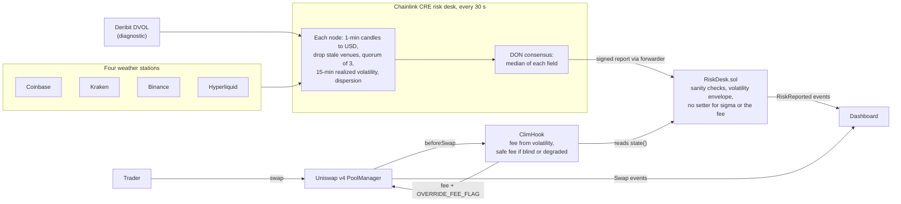
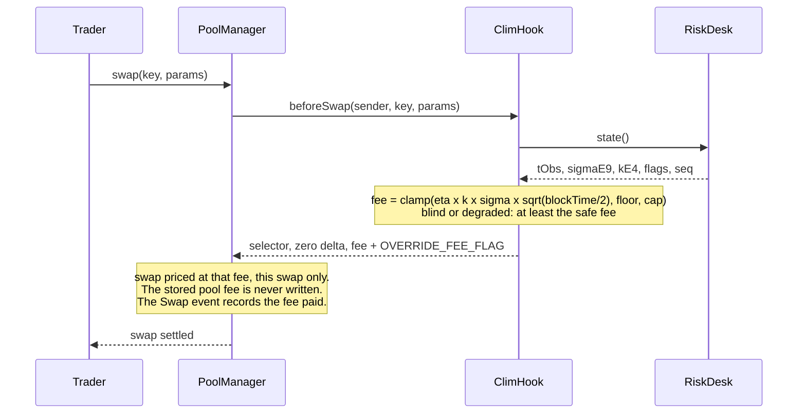

# clim Demo and Submission Implementation Plan

> **For agentic workers:** REQUIRED SUB-SKILL: Use superpowers:subagent-driven-development (recommended) or superpowers:executing-plans to implement this plan task-by-task. Steps use checkbox (`- [ ]`) syntax for tracking.

**Goal:** Turn the working clim system into a complete TOKEN2049 Origins submission: a judge-ready README with generated numbers and CRE evidence, a precise FAQ (including the Chainlink mentor's two questions), a 3-act screen recording, a .pptx deck with the recording embedded, a Google Drive link, and the main-track plus CRE-track submission, then close the loop with the Chainlink friction log and the private notes.

**Architecture:** A small Node.js package in `docs/submission/` (plain ES modules, `node:test`, no build step; the fee formula is imported from plan 04's `shared/src/units.ts`, which Node 22 loads directly) reads the single sources of truth (`shared/deployments/sepolia.json`, `shared/params.json`, `lab/out/backtest-summary.json`, `lab/out/replay-2026-02-04.json`, on-chain `RiskReported` events) and generates (1) the numeric blocks of `README.md` between `<!-- clim:begin X -->` markers, (2) `docs/evidence/` (CRE evidence), and (3) the deck `docs/submission/out/clim.pptx` with pptxgenjs (native charts, embedded videos, speaker notes). Two Python scripts (run with `uv run --no-project`) draw the README figure and the video title cards and captions; one bash script turns raw macOS screen recordings into the two demo videos with ffmpeg. No number shown to judges is typed by hand.

**Tech Stack:** Node.js 22 (ES modules, `node:test`), pptxgenjs 4.0.1, viem 2.57.3, Python 3 via uv (matplotlib, Pillow, pytest), ffmpeg/ffprobe (Homebrew build: no `drawtext`, so captions are PNG overlays), macOS screen recording (Cmd+Shift+5), Microsoft PowerPoint for Mac (installed) for the final playback check, the `anthropic-skills:pptx` skill for deck QA, Google Drive (browser), Builderbase (submission platform), `gh`.

All commands below use absolute paths because subagent shells reset their working directory. `CLIM` means `/Users/fianso/Development/hackathons/clim`.

---

## Verified hackathon rules (quoted, retrieved 2026-10-06)

Sources: Builderbase event JSON `curl https://edge.builderbase.com/super-events/public/token2049-origins-hackathon` (field `data.super_event.page_data.html`, page updated `2026-10-04T08:00:30Z`), `curl https://edge.builderbase.com/events/public/chainlink-best-workflow-with-cre` (page updated `2026-10-06T00:36:27Z`), https://www.token2049.com/singapore/2049-origins, and the Terms and Conditions PDF linked from the event JSON (`tc_file_url`). Re-run the two `curl` commands in Task 21 Step 1 in case the pages changed.

**What every team submits (main track page):**
> "GitHub repository : public, or with judge access granted."
> "Project link : a live URL or hosted demo."
> "Presentation slides : a Google Drive link to a .ppt or .keynote file."
> "Submission deadline: 12:00am on 8 October (submit by 11:59pm on 7 October). No late entries allowed. Partner tracks may ask for extra material such as a demo video or a short write-up; check the track page."

The JSON field `submission_deadline` is `2026-10-07T15:59:00+00:00`, which is 23:59 SGT on 7 October.

**Stage rules:**
> "Slide format: .ppt or .keynote only. Google Slides, Gamma or Vercel page links are not accepted; they won't play reliably on stage."
> "Demo footage: Live demos are prohibited to avoid technical errors on stage. Use a screen recording and embed the video directly in your slides. Do not link to YouTube or external video."
> "Locked at submission: No changes after the deadline, so make sure your deck is stage-ready before you submit."
> FAQ: "No late entries are allowed, and slides are locked once you submit."

**Eligibility:**
> "Built during Origins. All submitted projects must be built entirely within the 36-hour Origins Hackathon. Projects, prototypes or substantial code developed before the official start are not eligible. Publicly available libraries, frameworks, APIs and developer tooling may of course be used."
> "Meaningful integration. Projects competing for a partner track or prize must meaningfully integrate the relevant partner technology into the core functionality of the project. Superficial integrations added solely to qualify will not be considered eligible."
> token2049.com FAQ: "Teams can have a maximum of 4 members." and "all project work must begin after the official hacking period starts. You can brainstorm ideas, but no code, designs, or prototypes before kickoff."

**Main-track judging:** 30% Functionality & Execution, 25% Technical Implementation & Integration, 20% Innovation & Originality, 15% Usefulness & Potential Impact, 10% Demo & Presentation. The event JSON also has `"auto_ai_evaluation": true`: an automated first pass probably reads the repository and the submission text, so the README must state the problem, the mechanism, the results and the CRE evidence plainly.

**Chainlink "Best workflow with CRE" track page:**
> "To qualify: Build, simulate or deploy a CRE Workflow that's used as an orchestration layer within your project. Integrate at least one blockchain with an external API, system, data source, LLM or AI agent. Demonstrate a successful simulation (via the CRE CLI) or a live deployment on the CRE network."
> Judging: "40% Blockchain: How valuable this project is for decentralization and adoption of Blockchain and Web3. 40% Effective use of CRE: How they use CRE. 20% WOW Factor: The judges' personal evaluation of the project."
> Submission: "Submit to the main track for the Top 5, then add this track." and "Evidence of a successful CRE simulation or deployment : demo video, terminal output, execution logs or deployment details."
> FAQ: "Anything that proves the workflow ran: a demo video, terminal output of the simulation, execution logs or deployment details. Add it to the 'Evidence of a successful CRE simulation or deployment' field when you submit."
> FAQ: "CRE has EVM and Solana clients" (used in the "why not Solana" answer).

**Terms and Conditions 6.4:** "Participants must not include confidential information, personal data or third-party materials unless they are authorised to do so." The deck therefore cites only public papers, our own lab numbers, and one pre-hackathon measurement of public on-chain data, dated as such (speaker notes of slide 2).

**Open format question:** the rules say ".ppt or .keynote"; this plan produces a `.pptx` (PowerPoint's current format; the legacy `.ppt` format cannot reliably embed MP4). Task 12 asks an organizer to confirm `.pptx`, and Task 17 Step 6 is the Keynote fallback.

## Inputs this plan consumes (contracts with plans 01 to 05)

Task 12 runs `npm run check`, which prints OK, MISSING or INVALID for each input. If another plan wrote a different shape, change that plan's output or the matching spec in `docs/submission/src/inputs.mjs` (one place), and log the change.

| File | Written by | Shape this plan reads |
|---|---|---|
| `shared/deployments/sepolia.json` | plan 01 deploy scripts, shape fixed by plan 04 ("Contracts with other plans" 1) | Read generically: every `0x` + 40-hex string is listed in the README with its JSON path as label (`riskDesks.live`, `hooks.live`, `tokens.tETH.address`, ...), `null` entries are skipped, risk desks are the addresses whose path contains `desk`, pool ids the values under a `poolId` key. |
| `shared/params.json` | plan 03 (lab decision) | `{ pStar, etaE4, sqrtHalfDtE6, feeMinPips, feeMaxPips, feeSafePips, tauKillSec, decidedBy }` are read; the lab also writes `staticFeePips`, `replayStaticFeePips` and `decidedAt` (ignored here). Plan 04 checks `|etaE4 - round((1/pStar - 0.824) * 1e4)| <= 1`. |
| `shared/src/units.ts` | plan 04 Task 2 | `feePips`, `pipsToBp`, `annualSigmaToSigmaE9`, `sigmaE9ToAnnual`, `SECONDS_PER_YEAR` (the TypeScript mirror of `ClimFeeMath`). |
| `lab/out/backtest-summary.json` | plan 03 | Schema `clim.lab.backtest/1` exactly as plan 03 writes it (its "Output contracts"; the app reads the separate `lab/out/summary.json`), **including three fields this plan needs**: `lpGainPctPerYear.volatileAssetHigh` (percent of capital per year, best case on a volatile asset), `lpGainPctPerYear.top5WeeksSharePct` (percent of the yearly gain earned in the five stormiest weeks), `inPoolVolGainSharePct {low, high}` (percent of the gain a pool-internal volatility captures), plus `replayWindowsMedianPct` and `replayWindowsBetterCount` (the median of the rolling 4 h windows and how many beat the static pool, so the replay window is never shown without its context). Plan 03 writes them (validated against `BACKTEST_SPEC`). Every value is rounded at display time (shares to whole percent, %/yr of capital and ratios to 2 decimals): the lab writes 8 significant digits. |
| `lab/out/validation.json` | plan 03 Task 19 | Schema `clim.lab.validation/1`: `pStar`, `windowBlocks`, `nSimsTotal`, `samples[]` of `{name, blocks, pTradeObserved, pTradePredicted, simPValueTwoSided, zones.simulated {green, yellow, red}}` (validated against `VALIDATION_SPEC`). The README's "Where the model is weak" and deck slide 8 read it: the largest observed/predicted gap, the simulated alert zones and the significance of the gap. |
| `lab/out/replay-2026-02-04.json` | plan 03 | Schema `clim.lab.replay/1` as plan 03 writes it (one file carries this plan's `points[]` and plan 05's columnar arrays): `window`, `params` (with `staticFeePips`), `units.arb`, `points[]` of `{t, price, sigmaAnnualPct, feeVBp, feeSBp, cumArbV, cumArbS}`, `summary` (`arbChangePct`, `pTradeObsV`, `pTradePredV`, ...). Computed at the deployed parameters. Not the same file as `lab/out/replay-window.json` (plan 03's price series for plan 04's replay server). |
| `bots/out/cre-sim/<pair>-<run start>.log` | plan 04 Task 17 (`bun run cre-loop`) | One transcript per `cre workflow simulate --broadcast` run (the loop's `[USER LOG]` lines: `node:` venues, `consensus:` sigma and dispersion, `Write report transaction succeeded: 0x<64 hex>`, `REPORT applied ... tx=0x...`; plan 04 contract 6). Ignored by git; the full CLI logs are in `cre/logs/`. |
| `bots/out/cre-runs.jsonl`, `bots/out/security-demos.jsonl` | plan 04 | Tracked by git (plan 04's `.gitignore` exceptions); linked from `docs/evidence/README.md`. |
| `bots` scripts | plan 04 | `cre-loop --pair live`, `arb --pair live`, `noise --pair live`, `status --pair live --watch`, `forge-report --pair live`, `replay-server`, `ENV_FILE=.env.replay cre-loop --pair replay` (the replay desk has its own operator key, plan 01 Task 18); run-book `docs/runbook.md` (plan 04 Task 22). |
| Dashboard | plan 05 | Live view (desk, hook mode, fee of V and S, swaps), the 4 February replay view, the lab view (P_trade against its band, both comparisons), and the live URL on Vercel, copied by hand into `docs/submission/links.json` in Task 12. |
| `cre/project.yaml` | plan 02 | Targets `staging-settings` (live) and `replay-settings`; workflow folder `cre/risk-desk`, run from `cre/`. |

## Deviations from the canonical layout (explicit)

- `docs/submission/`: submission tooling (README generator, evidence collector, deck builder, figures, video script). Generated files go to `docs/submission/out/` (gitignored).
- `docs/evidence/`: committed CRE evidence for judges (on-chain report list and simulate transcripts).
- `docs/media/`: committed README figure.
- `.gitignore`: plan 04 Task 1 narrows `out/` to `app/out/` (so `lab/out/` is tracked) and ignores `bots/out/*` except its two evidence files. Task 1 here only adds `docs/submission/out/` (deck and videos, too large for git), applying plan 04's edit first if it has not run yet.
- This plan owns `README.md` and `docs/faq.md`. If an earlier plan created a stub, Task 10 and Task 11 replace it and keep any extra FAQ entry the stub had.

## File structure

| File | Responsibility |
|---|---|
| `.gitignore` | Modify: ignore `docs/submission/out/` (Task 1). |
| `docs/submission/package.json` | Node package for the submission tooling (scripts: `test`, `check`, `check:final`, `evidence`, `readme`, `deck`). |
| `docs/submission/links.json` | Repo, live, deck and video URLs (filled as they exist). |
| `docs/submission/team.json` | Team members shown in the README and the deck. |
| `docs/submission/src/paths.mjs` | Every input and output path, resolved from the repo root. |
| `docs/submission/src/inputs.mjs` | JSON loader, structural specs (lab schemas of plan 05), address walker. |
| `docs/submission/src/lab.mjs` | Facts derived from the lab outputs (replay statistics, severity range). |
| `docs/submission/src/fee.mjs` | Re-exports the fee formula of `shared/src/units.ts`; floor crossover. |
| `docs/submission/src/readme-blocks.mjs` | Renders each generated README block. |
| `docs/submission/src/update-readme.mjs` | CLI: rewrites the README blocks. |
| `docs/submission/src/check-inputs.mjs` | CLI: OK / MISSING / INVALID per input. |
| `docs/submission/src/evidence.mjs` | Event decoding, block ranges, secret scanning, URL redaction. |
| `docs/submission/src/collect-evidence.mjs` | CLI: reads `RiskReported` from Sepolia, copies transcripts into `docs/evidence/`. |
| `docs/submission/src/scan-secrets.mjs` | CLI: fails if a tracked file contains a secret from a `.env` file. |
| `docs/submission/figures/fee_figure.py` | Draws `docs/media/fee-follows-weather.png`. |
| `docs/submission/figures/video_cards.py` | Draws the video title cards and caption overlays. |
| `docs/submission/figures/test_figures.py` | pytest for both scripts. |
| `docs/submission/scripts/build-video.sh` | Builds `demo-full.mp4` and `demo-stage.mp4` from raw recordings. |
| `docs/submission/deck/style.mjs` | Palette, layouts, drawing helpers. |
| `docs/submission/deck/data.mjs` | Loads deck inputs, chart series, fee schedule. |
| `docs/submission/deck/slides.mjs` | Slide-by-slide content and speaker notes. |
| `docs/submission/deck/build-deck.mjs` | CLI and `buildDeck()`. |
| `docs/submission/test/*.test.mjs`, `test/fixtures/*.json` | Unit tests and fixtures. |
| `docs/evidence/README.md`, `cre-reports-sepolia.json`, `cre-simulate-*.log` | CRE evidence. |
| `docs/media/fee-follows-weather.png` | The README picture. |
| `README.md` | Judge-facing README. |
| `docs/faq.md` | Precise answers, including the mentor's two questions. |
| `docs/feedback/cre-friction-log.md` | Modify: send-ready final pass. |
| `docs/sessions/<date>.md` | Append decisions and feedback. |

The test fixtures contain the numbers known on 2026-10-06 (P* = 10% runs; the per-period split of the equal-trader-cost comparison and the `arbOverLvr` values are made up to fit the known ranges). They exist only for tests; the CLIs never read `test/fixtures/`.

## Order and gates

- **Tasks 1 to 11 can start right away**, in parallel with plans 01 to 05: they only use fixtures. They are delegable. Exception: Task 3 (and Tasks 4 and 9, which import it) needs plan 04 Task 2 (`shared/src/units.ts`).
- **Gate C (from the master plan):** contracts deployed and recorded in `shared/deployments/sepolia.json` (master Gate B); `shared/params.json` decided by the lab (master Gate A); the CRE loop has been writing reports with `--broadcast` for at least an hour; the bots trade on pools V and S; `lab/out/backtest-summary.json` and `lab/out/replay-2026-02-04.json` computed at the deployed parameters (with the three extra fields of Task 2 Step 5); the dashboard deployed with a live URL. Tasks 12 to 23 need Gate C.
- **Never-cut list for this plan:** CRE evidence (Task 13), README (Tasks 10, 14), deck with an embedded recording (Tasks 15 to 17), Drive link and submission (Tasks 18 to 21). If time runs short, cut in this order: the full 3-minute video in the appendix (keep the stage cut), Act 3 shots (show the lab slide instead), the clean-clone smoke test (keep the secret scan).

---

### Task 1: Ignore the deck output and scaffold the submission package

**Delegable:** yes
**Depends on:** plan 00 initial commit (the repository has a first commit)

**Files:**
- Modify: `.gitignore`
- Create: `docs/submission/package.json`, `docs/submission/links.json`, `docs/submission/team.json`
- Create (generated): `docs/submission/package-lock.json`

- [x] **Step 1: See what `.gitignore` does today**

Run:
```bash
cd /Users/fianso/Development/hackathons/clim && grep -n -E "^out/$|^app/out/$|^bots/out/\*$|^docs/submission/out/$" .gitignore
```
- If the output contains `out/` alone: plan 04 Task 1 has not run. Apply plan 04 Task 1 Step 4 exactly now (replace `out/` with `app/out/` in the `# Node / Next / Bun` block, and insert before `# OS` the block `# Bots: run logs stay local, except the CRE run log and the security demo records (submission evidence)` / `bots/out/*` / `!bots/out/cre-runs.jsonl` / `!bots/out/security-demos.jsonl`), and log it as plan 04 asks.
- If it already shows `app/out/` and `bots/out/*`: go on.

- [x] **Step 2: Ignore the deck and video output**

In the `# Node / Next / Bun` block, add the line `docs/submission/out/` right after `app/out/`.

- [x] **Step 3: Check the result**

Run:
```bash
cd /Users/fianso/Development/hackathons/clim && git check-ignore -v lab/out/backtest-summary.json; echo "exit=$?"; git check-ignore -v docs/submission/out/clim.pptx bots/out/cre-sim/x.log; git check-ignore bots/out/cre-runs.jsonl; echo "exit=$?"
```
Expected:
```
exit=1
.gitignore:<n>:docs/submission/out/	docs/submission/out/clim.pptx
.gitignore:<n>:bots/out/*	bots/out/cre-sim/x.log
exit=1
```
(`exit=1` means not ignored: `lab/out/` and `bots/out/cre-runs.jsonl` are tracked; `<n>` are line numbers.)

- [x] **Step 4: Create the package and the two small data files**

`docs/submission/package.json`:
```json
{
  "name": "clim-submission",
  "private": true,
  "type": "module",
  "engines": {
    "node": ">=22"
  },
  "scripts": {
    "test": "node --test test/*.test.mjs",
    "check": "node src/check-inputs.mjs",
    "check:final": "node src/check-inputs.mjs --final",
    "evidence": "node src/collect-evidence.mjs",
    "readme": "node src/update-readme.mjs",
    "deck": "node deck/build-deck.mjs",
    "scan": "node src/scan-secrets.mjs"
  },
  "dependencies": {
    "pptxgenjs": "4.0.1",
    "viem": "2.57.3"
  }
}
```

`docs/submission/links.json` (the empty URLs are filled in Tasks 12 and 18; `npm run check:final` refuses empty ones):
```json
{
  "repoUrl": "https://github.com/DVB-ANS/clim",
  "liveUrl": "",
  "deckUrl": "",
  "videoUrl": ""
}
```

`docs/submission/team.json` (Task 12 asks the maintainer who is on the registered Builderbase team; one object per registered member, `github` may be `""`):
```json
[
  { "name": "Sofiane Ben Taleb", "github": "gamween", "role": "Design, contracts, CRE workflow, lab, dashboard" }
]
```

Then install (this is a standalone npm package, outside the root Bun workspace, like `app/`):
```bash
cd /Users/fianso/Development/hackathons/clim/docs/submission && npm install
```
Expected: `added <n> packages` and no error. `node_modules/` is already ignored by the root `.gitignore`.

- [x] **Step 5: Commit**

```bash
cd /Users/fianso/Development/hackathons/clim && git add .gitignore docs/submission/package.json docs/submission/package-lock.json docs/submission/links.json docs/submission/team.json && git commit -m "chore(submission): scaffold submission tooling, ignore its build output"
```

---

### Task 2: Input loaders, structural checks and lab facts

**Delegable:** yes
**Depends on:** Task 1

The two lab schemas are the ones plan 03 writes (its "Output contracts": `backtest-summary.json` and the `points[]` part of `replay-2026-02-04.json`), so the README, the deck and the app show the same numbers. The fixtures follow plan 04's deployments shape and plan 03's lab shapes.

**Files:**
- Create: `docs/submission/src/paths.mjs`, `docs/submission/src/inputs.mjs`, `docs/submission/src/lab.mjs`
- Create: `docs/submission/test/fixtures/sepolia.json`, `params.json`, `backtest-summary.json`, `replay.json`, `validation.json`, `links.json`, `team.json`, `evidence.json`
- Test: `docs/submission/test/inputs.test.mjs`, `docs/submission/test/lab.test.mjs`

- [x] **Step 1: Write the fixtures and the failing test**

`docs/submission/test/fixtures/sepolia.json`:
```json
{
  "chainId": 11155111,
  "deployBlock": 11850000,
  "uniswap": {
    "poolManager": "0xE03A1074c86CFeDd5C142C4F04F1a1536e203543",
    "stateView": "0xE1Dd9c3fA50EDB962E442f60DfBc432e24537E4C"
  },
  "cre": { "mockForwarder": "0x15fC6ae953E024d975e77382eEeC56A9101f9F88", "keystoneForwarder": "0xF8344CFd5c43616a4366C34E3EEE75af79a74482" },
  "tokens": {
    "tETH": { "address": "0x1111111111111111111111111111111111111111", "symbol": "tETH", "decimals": 18 },
    "tUSD": { "address": "0x2222222222222222222222222222222222222222", "symbol": "tUSD", "decimals": 18 }
  },
  "riskDesks": { "live": "0x3333333333333333333333333333333333333333", "replay": null },
  "hooks": { "live": "0x4444444444444444444444444444444444444080", "replay": null },
  "pools": {
    "liveV": {
      "key": {
        "currency0": "0x1111111111111111111111111111111111111111",
        "currency1": "0x2222222222222222222222222222222222222222",
        "fee": 8388608,
        "tickSpacing": 60,
        "hooks": "0x4444444444444444444444444444444444444080"
      },
      "poolId": "0xaaaaaaaaaaaaaaaaaaaaaaaaaaaaaaaaaaaaaaaaaaaaaaaaaaaaaaaaaaaaaaaa",
      "token0IsEth": true
    },
    "liveS": null,
    "replayV": null,
    "replayS": null
  }
}
```

`docs/submission/test/fixtures/params.json`:
```json
{
  "pStar": 0.3,
  "etaE4": 25093,
  "sqrtHalfDtE6": 2449490,
  "feeMinPips": 500,
  "feeMaxPips": 15000,
  "feeSafePips": 3000,
  "tauKillSec": 180,
  "decidedBy": "fixture"
}
```

`docs/submission/test/fixtures/backtest-summary.json`:
```json
{
  "schema": "clim.lab.backtest/1",
  "generatedAt": "fixture",
  "pStar": 0.1,
  "feeMinBp": 5,
  "periods": [
    {
      "id": "feb-2026",
      "label": "Feb 2026",
      "source": "Binance ETHUSDT 1 s",
      "blocks": 21600,
      "equalTimeAvgFee": { "staticFeeBp": 19.2, "dynMeanFeeBp": 19.2, "arbChangePct": -20.0 },
      "equalTraderCost": { "staticFeeBp": 21.0, "dynVolWeightedFeeBp": 21.0, "arbChangePct": -14.0 },
      "pTrade": { "observed": 0.08, "predicted": 0.1 },
      "arbOverLvr": { "observed": 0.387, "model": 0.3 }
    },
    {
      "id": "oct-2026",
      "label": "Oct 2026",
      "source": "Binance ETHUSDT 1 s",
      "blocks": 21600,
      "equalTimeAvgFee": { "staticFeeBp": 12.0, "dynMeanFeeBp": 12.0, "arbChangePct": -24.5 },
      "equalTraderCost": { "staticFeeBp": 13.0, "dynVolWeightedFeeBp": 13.0, "arbChangePct": 7.0 },
      "pTrade": { "observed": 0.097, "predicted": 0.094 },
      "arbOverLvr": { "observed": 0.399, "model": 0.3 }
    }
  ],
  "replayWindows": [
    { "id": "feb04", "label": "4 Feb 2026 12:00-16:00 UTC", "arbChangePct": -25.0 },
    { "id": "feb04-late", "label": "4 Feb 2026 16:00-20:00 UTC", "arbChangePct": -8.0 }
  ],
  "replayWindowsMedianPct": -16.5,
  "replayWindowsBetterCount": 2,
  "lpGainPctPerYear": { "low": 0.1, "high": 0.5, "note": "full-range ETH LP", "volatileAssetHigh": 1.0, "top5WeeksSharePct": 52.87945 },
  "inPoolVolGainSharePct": { "low": 53.686573, "high": 103.34705 }
}
```

`docs/submission/test/fixtures/replay.json`:
```json
{
  "schema": "clim.lab.replay/1",
  "generatedAt": "fixture",
  "window": { "id": "feb04", "label": "4 Feb 2026", "startUtc": "2026-02-04T12:00:00Z", "endUtc": "2026-02-04T16:00:00Z", "source": "Binance ETHUSDT 1 s" },
  "params": { "pStar": 0.3, "etaE4": 25093, "sqrtHalfDtE6": 2449490, "feeMinPips": 500, "feeMaxPips": 15000, "staticFeePips": 5570 },
  "units": { "arb": "USD per $1M of liquidity" },
  "points": [
    { "t": 1770206400, "price": 2650, "sigmaAnnualPct": 74, "feeVBp": 12, "feeSBp": 55.7, "cumArbV": 0, "cumArbS": 0 },
    { "t": 1770210000, "price": 2610, "sigmaAnnualPct": 110, "feeVBp": 30, "feeSBp": 55.7, "cumArbV": 120, "cumArbS": 200 },
    { "t": 1770213600, "price": 2480, "sigmaAnnualPct": 225, "feeVBp": 128, "feeSBp": 55.7, "cumArbV": 900, "cumArbS": 1300 },
    { "t": 1770217200, "price": 2530, "sigmaAnnualPct": 160, "feeVBp": 80, "feeSBp": 55.7, "cumArbV": 1300, "cumArbS": 1800 },
    { "t": 1770220800, "price": 2560, "sigmaAnnualPct": 120, "feeVBp": 45, "feeSBp": 55.7, "cumArbV": 1500, "cumArbS": 2000 }
  ],
  "summary": { "meanFeeVBp": 55.7, "meanFeeSBp": 55.7, "arbV": 1500, "arbS": 2000, "arbChangePct": -25.0, "pTradeObsV": 0.069, "pTradePredV": 0.092, "pTradeObsS": 0.11 }
}
```

`docs/submission/test/fixtures/validation.json` (the fields of plan 03's validation output that the README and the deck read, with the values of the validation run):
```json
{
  "schema": "clim.lab.validation/1",
  "generatedAt": "fixture",
  "pStar": 0.3,
  "windowBlocks": 300,
  "nSimsTotal": 2000,
  "samples": [
    {
      "name": "feb",
      "blocks": 28716,
      "pTradeObserved": 0.2795,
      "pTradePredicted": 0.2989,
      "simPValueTwoSided": 0.0,
      "zones": { "simulated": { "green": 94, "yellow": 1, "red": 0 } }
    },
    {
      "name": "oct",
      "blocks": 21557,
      "pTradeObserved": 0.1711,
      "pTradePredicted": 0.1558,
      "simPValueTwoSided": 0.0,
      "zones": { "simulated": { "green": 62, "yellow": 7, "red": 2 } }
    }
  ]
}
```

`docs/submission/test/fixtures/links.json`:
```json
{
  "repoUrl": "https://github.com/DVB-ANS/clim",
  "liveUrl": "",
  "deckUrl": "",
  "videoUrl": ""
}
```

`docs/submission/test/fixtures/team.json`:
```json
[
  { "name": "Test Member", "github": "test-member", "role": "Design, contracts, CRE workflow, lab, dashboard" }
]
```

`docs/submission/test/fixtures/evidence.json`:
```json
{
  "chainId": 11155111,
  "collectedAt": "2026-10-07T10:00:00.000Z",
  "fromBlock": 11850000,
  "toBlock": 11860000,
  "desks": [
    {
      "label": "riskDesks.live",
      "address": "0x3333333333333333333333333333333333333333",
      "reports": [
        { "seq": 1, "txHash": "0x1000000000000000000000000000000000000000000000000000000000000001", "blockNumber": 11850010, "tObs": 1791300000, "sigmaApplied": 53419, "sigmaReported": 53419, "rv15E9": 53419, "dvolE2": 4800, "refTick": -200000, "nSources": 4, "dispBp": 3, "kE4": 10000, "zone": 0 },
        { "seq": 2, "txHash": "0x1000000000000000000000000000000000000000000000000000000000000002", "blockNumber": 11850013, "tObs": 1791300030, "sigmaApplied": 55000, "sigmaReported": 55000, "rv15E9": 55000, "dvolE2": 4810, "refTick": -199990, "nSources": 3, "dispBp": 4, "kE4": 10000, "zone": 0 }
      ]
    }
  ]
}
```

`docs/submission/test/inputs.test.mjs`:
```js
import { test } from "node:test";
import assert from "node:assert/strict";
import { readJson, check, schemaErrors, provisionalErrors, PARAMS_SPEC, BACKTEST_SPEC, BACKTEST_SCHEMA, REPLAY_SPEC, REPLAY_SCHEMA, VALIDATION_SPEC, VALIDATION_SCHEMA, LINKS_SPEC, TEAM_SPEC, EVIDENCE_SPEC, linkErrors, collectAddresses, deskAddresses } from "../src/inputs.mjs";

const fx = (name) => readJson(new URL(`./fixtures/${name}`, import.meta.url));

test("fixtures satisfy every spec", () => {
  assert.deepEqual(check(PARAMS_SPEC, fx("params.json")), []);
  assert.deepEqual(check(BACKTEST_SPEC, fx("backtest-summary.json")), []);
  assert.deepEqual(schemaErrors(fx("backtest-summary.json"), BACKTEST_SCHEMA), []);
  assert.deepEqual(check(REPLAY_SPEC, fx("replay.json")), []);
  assert.deepEqual(schemaErrors(fx("replay.json"), REPLAY_SCHEMA), []);
  assert.deepEqual(check(VALIDATION_SPEC, fx("validation.json")), []);
  assert.deepEqual(schemaErrors(fx("validation.json"), VALIDATION_SCHEMA), []);
  assert.deepEqual(check(LINKS_SPEC, fx("links.json")), []);
  assert.deepEqual(check(EVIDENCE_SPEC, fx("evidence.json")), []);
  assert.deepEqual(check(TEAM_SPEC, fx("team.json")), []);
});

test("check reports the exact path of a wrong field", () => {
  const bad = { ...fx("params.json"), etaE4: 2.5 };
  assert.deepEqual(check(PARAMS_SPEC, bad), ["$.etaE4: expected integer, got 2.5"]);
});

test("the two fields plan 06 adds to the backtest summary are required", () => {
  const bad = fx("backtest-summary.json");
  delete bad.inPoolVolGainSharePct;
  assert.deepEqual(check(BACKTEST_SPEC, bad), ["$.inPoolVolGainSharePct: expected object"]);
});

test("provisional parameters are refused", () => {
  assert.deepEqual(provisionalErrors(fx("params.json")), []);
  assert.deepEqual(provisionalErrors({ ...fx("params.json"), decidedBy: "PROVISIONAL: bootstrap" }), ["params.decidedBy is PROVISIONAL: the lab has not decided P* yet"]);
});

test("schemaErrors names the expected schema", () => {
  assert.deepEqual(schemaErrors({ schema: "x" }, REPLAY_SCHEMA), ['schema must be "clim.lab.replay/1", got "x"']);
});

test("final link check requires https URLs", () => {
  assert.deepEqual(linkErrors(fx("links.json"), { final: false }), []);
  assert.equal(linkErrors(fx("links.json"), { final: true }).length, 3);
});

test("collectAddresses walks any shape, dedupes addresses, finds pool ids", () => {
  const { addresses, poolIds } = collectAddresses(fx("sepolia.json"));
  assert.deepEqual(addresses.map((a) => a.label), [
    "uniswap.poolManager",
    "uniswap.stateView",
    "cre.mockForwarder",
    "cre.keystoneForwarder",
    "tokens.tETH.address",
    "tokens.tUSD.address",
    "riskDesks.live",
    "hooks.live",
  ]);
  assert.deepEqual(poolIds, [{ label: "pools.liveV", poolId: "0x" + "a".repeat(64) }]);
});

test("deskAddresses keeps labels that contain desk", () => {
  assert.deepEqual(deskAddresses(fx("sepolia.json")), [
    { label: "riskDesks.live", address: "0x3333333333333333333333333333333333333333" },
  ]);
});
```

`docs/submission/test/lab.test.mjs`:
```js
import { test } from "node:test";
import assert from "node:assert/strict";
import { readJson } from "../src/inputs.mjs";
import { replayStats, severityRange, validationFacts, usdPerMillion, replayChoiceNote } from "../src/lab.mjs";

const fx = (name) => readJson(new URL(`./fixtures/${name}`, import.meta.url));

test("replayStats summarizes the replay window and its place among the rolling windows", () => {
  assert.deepEqual(replayStats(fx("replay.json"), fx("backtest-summary.json")), {
    window: "2026-02-04 12:00 to 16:00 UTC",
    sigmaMinPct: 74,
    sigmaMaxPct: 225,
    feeVMinBp: 12,
    feeVMaxBp: 128,
    feeSBp: 55.7,
    arbChangePct: -25,
    arbChangeRangePct: [-25, -8],
    windowsCount: 2,
    windowsMedianPct: -16.5,
    windowsBetterCount: 2,
    windowsBeatingChosen: 0,
    pTradePredicted: 0.092,
    pTradeObserved: 0.069,
    arbUnit: "USD per $1M of liquidity",
  });
});

test("severityRange divides observed by model per period, to 2 decimals", () => {
  assert.deepEqual(severityRange(fx("backtest-summary.json")), [1.29, 1.33]);
});

test("validationFacts: largest P_trade gap rounded up, simulated zones, significance", () => {
  assert.deepEqual(validationFacts(fx("validation.json")), {
    maxGapPct: 10,
    zones: [
      { name: "feb", green: 94, yellow: 1, red: 0, windows: 95 },
      { name: "oct", green: 62, yellow: 7, red: 2, windows: 71 },
    ],
    significant: true,
    pText: "p < 0.0005",
  });
});

test("usdPerMillion turns % of capital per year into dollars per $1M", () => {
  assert.equal(usdPerMillion(0.39), "$3,900");
  assert.equal(usdPerMillion(-0.0981486), "-$981");
  assert.equal(usdPerMillion(0.70240233), "$7,024");
});

test("replayChoiceNote says when the replay window is the most favorable one", () => {
  const stats = replayStats(fx("replay.json"), fx("backtest-summary.json"));
  assert.equal(
    replayChoiceNote(stats, 0.3),
    "The window was picked during design, at an earlier setting, around the sharpest rise in volatility of the storm, after comparing three candidate windows (lab/scratch/replay_pick*.py); at P* = 30% it is the most favorable of the 2 rolling 4 h windows of the storm (median window -16.5%, 2 of 2 better than the fixed pool).",
  );
  assert.match(replayChoiceNote({ ...stats, windowsBeatingChosen: 1 }, 0.3), /at P\* = 30% 1 of the 2 rolling 4 h windows of the storm did better/);
});
```

- [x] **Step 2: Run them, expect FAIL**

Run: `cd /Users/fianso/Development/hackathons/clim/docs/submission && node --test test/inputs.test.mjs test/lab.test.mjs`
Expected: FAIL with `Cannot find module '.../docs/submission/src/inputs.mjs'` (`ERR_MODULE_NOT_FOUND`).

- [x] **Step 3: Implement**

`docs/submission/src/paths.mjs`:
```js
// Every file the submission tooling reads or writes, resolved from the repo root.
import path from "node:path";
import { fileURLToPath } from "node:url";

export const SUBMISSION_DIR = path.resolve(path.dirname(fileURLToPath(import.meta.url)), "..");
export const REPO_ROOT = path.resolve(SUBMISSION_DIR, "..", "..");

export const P = {
  deployments: path.join(REPO_ROOT, "shared/deployments/sepolia.json"),
  params: path.join(REPO_ROOT, "shared/params.json"),
  backtest: path.join(REPO_ROOT, "lab/out/backtest-summary.json"),
  replay: path.join(REPO_ROOT, "lab/out/replay-2026-02-04.json"),
  validation: path.join(REPO_ROOT, "lab/out/validation.json"),
  links: path.join(SUBMISSION_DIR, "links.json"),
  team: path.join(SUBMISSION_DIR, "team.json"),
  evidence: path.join(REPO_ROOT, "docs/evidence/cre-reports-sepolia.json"),
  evidenceDir: path.join(REPO_ROOT, "docs/evidence"),
  readme: path.join(REPO_ROOT, "README.md"),
  outDir: path.join(SUBMISSION_DIR, "out"),
  videoDir: path.join(SUBMISSION_DIR, "out/video"),
};
```

`docs/submission/src/inputs.mjs`:
```js
// Loaders and structural checks for every input the README and the deck consume.
import { readFileSync } from "node:fs";

export function readJson(file) {
  return JSON.parse(readFileSync(file, "utf8"));
}

// Spec language: "number" | "int" | "string" | "pair" ([number, number]) | [spec] (non-empty array) | {key: spec}
export function check(spec, value, where = "$") {
  const errors = [];
  walk(spec, value, where, errors);
  return errors;
}

function walk(spec, v, where, errors) {
  if (spec === "number") {
    if (typeof v !== "number" || !Number.isFinite(v)) errors.push(`${where}: expected number, got ${JSON.stringify(v)}`);
    return;
  }
  if (spec === "int") {
    if (!Number.isInteger(v)) errors.push(`${where}: expected integer, got ${JSON.stringify(v)}`);
    return;
  }
  if (spec === "string") {
    if (typeof v !== "string") errors.push(`${where}: expected string, got ${JSON.stringify(v)}`);
    return;
  }
  if (spec === "pair") {
    if (!Array.isArray(v) || v.length !== 2 || !v.every((x) => typeof x === "number")) {
      errors.push(`${where}: expected [number, number], got ${JSON.stringify(v)}`);
    }
    return;
  }
  if (Array.isArray(spec)) {
    if (!Array.isArray(v) || v.length === 0) {
      errors.push(`${where}: expected non-empty array`);
      return;
    }
    v.forEach((item, i) => walk(spec[0], item, `${where}[${i}]`, errors));
    return;
  }
  if (v === null || typeof v !== "object" || Array.isArray(v)) {
    errors.push(`${where}: expected object`);
    return;
  }
  for (const [k, sub] of Object.entries(spec)) walk(sub, v[k], `${where}.${k}`, errors);
}

export const PARAMS_SPEC = {
  pStar: "number",
  etaE4: "int",
  sqrtHalfDtE6: "int",
  feeMinPips: "int",
  feeMaxPips: "int",
  feeSafePips: "int",
  tauKillSec: "int",
  decidedBy: "string",
};

// Plan 04 commits a bootstrap params.json whose decidedBy starts with PROVISIONAL until the lab decides P*.
export function provisionalErrors(params) {
  return String(params?.decidedBy ?? "").startsWith("PROVISIONAL") ? ["params.decidedBy is PROVISIONAL: the lab has not decided P* yet"] : [];
}

// Lab outputs: the schemas plan 03 writes (its "Output contracts"), including the fields marked "plan 06" in backtest.
export const BACKTEST_SCHEMA = "clim.lab.backtest/1";
export const REPLAY_SCHEMA = "clim.lab.replay/1";
export const VALIDATION_SCHEMA = "clim.lab.validation/1";

export const BACKTEST_SPEC = {
  schema: "string",
  generatedAt: "string",
  pStar: "number",
  feeMinBp: "number",
  periods: [
    {
      id: "string",
      label: "string",
      source: "string",
      blocks: "int",
      equalTimeAvgFee: { staticFeeBp: "number", dynMeanFeeBp: "number", arbChangePct: "number" },
      equalTraderCost: { staticFeeBp: "number", dynVolWeightedFeeBp: "number", arbChangePct: "number" },
      pTrade: { observed: "number", predicted: "number" },
      arbOverLvr: { observed: "number", model: "number" },
    },
  ],
  replayWindows: [{ id: "string", label: "string", arbChangePct: "number" }],
  replayWindowsMedianPct: "number", // median of the rolling 4 h windows (plan 03 Task 17)
  replayWindowsBetterCount: "int", // windows whose ARB is below the static pool's
  lpGainPctPerYear: { low: "number", high: "number", note: "string", volatileAssetHigh: "number", top5WeeksSharePct: "number" }, // last two: plan 06
  inPoolVolGainSharePct: { low: "number", high: "number" }, // plan 06
};

export const REPLAY_SPEC = {
  schema: "string",
  generatedAt: "string",
  window: { id: "string", label: "string", startUtc: "string", endUtc: "string", source: "string" },
  params: { pStar: "number", etaE4: "int", sqrtHalfDtE6: "int", feeMinPips: "int", feeMaxPips: "int", staticFeePips: "int" },
  units: { arb: "string" },
  points: [{ t: "int", price: "number", sigmaAnnualPct: "number", feeVBp: "number", feeSBp: "number", cumArbV: "number", cumArbS: "number" }],
  summary: { meanFeeVBp: "number", meanFeeSBp: "number", arbV: "number", arbS: "number", arbChangePct: "number", pTradeObsV: "number", pTradePredV: "number", pTradeObsS: "number" },
};

// lab/out/validation.json (plan 03 Task 19): the model check on the two 1 s windows, with simulated alert zones.
export const VALIDATION_SPEC = {
  schema: "string",
  pStar: "number",
  windowBlocks: "int",
  nSimsTotal: "int",
  samples: [
    {
      name: "string",
      blocks: "int",
      pTradeObserved: "number",
      pTradePredicted: "number",
      simPValueTwoSided: "number",
      zones: { simulated: { green: "int", yellow: "int", red: "int" } },
    },
  ],
};

export function schemaErrors(obj, expected) {
  return obj?.schema === expected ? [] : [`schema must be "${expected}", got ${JSON.stringify(obj?.schema)}`];
}

export const TEAM_SPEC = [{ name: "string", github: "string", role: "string" }];

export const LINKS_SPEC = { repoUrl: "string", liveUrl: "string", deckUrl: "string", videoUrl: "string" };

export function linkErrors(links, { final }) {
  if (!final) return [];
  return Object.keys(LINKS_SPEC)
    .filter((k) => typeof links?.[k] !== "string" || !links[k].startsWith("https://"))
    .map((k) => `links.${k}: must be an https:// URL before submission, got ${JSON.stringify(links?.[k])}`);
}

export const REPORT_SPEC = {
  seq: "int",
  txHash: "string",
  blockNumber: "int",
  tObs: "int",
  sigmaApplied: "int",
  sigmaReported: "int",
  nSources: "int",
  dispBp: "int",
};

export const EVIDENCE_SPEC = {
  chainId: "int",
  collectedAt: "string",
  fromBlock: "int",
  toBlock: "int",
  desks: [{ label: "string", address: "string", reports: [REPORT_SPEC] }],
};

const ADDRESS = /^0x[0-9a-fA-F]{40}$/;
const BYTES32 = /^0x[0-9a-fA-F]{64}$/;
const ZERO_ADDRESS = /^0x0{40}$/; // e.g. a static pool's `hooks`: not a deployed contract

// Walks any JSON shape. Returns every 20-byte hex value (first label wins per address)
// and every 32-byte hex value stored under a key that contains "poolId".
export function collectAddresses(deployments) {
  const addresses = [];
  const poolIds = [];
  const seen = new Set();
  const visit = (node, segs) => {
    if (typeof node === "string") {
      const label = segs.join(".");
      if (ADDRESS.test(node) && !ZERO_ADDRESS.test(node) && !seen.has(node.toLowerCase())) {
        seen.add(node.toLowerCase());
        addresses.push({ label, address: node });
      } else if (BYTES32.test(node) && /poolid/i.test(String(segs[segs.length - 1]))) {
        poolIds.push({ label: segs.slice(0, -1).join(".") || label, poolId: node });
      }
      return;
    }
    if (Array.isArray(node)) node.forEach((x, i) => visit(x, [...segs, `[${i}]`]));
    else if (node && typeof node === "object") for (const [k, v] of Object.entries(node)) visit(v, [...segs, k]);
  };
  visit(deployments, []);
  return { addresses, poolIds };
}

export function deskAddresses(deployments) {
  return collectAddresses(deployments).addresses.filter((a) => /desk/i.test(a.label));
}
```

`docs/submission/src/lab.mjs`:
```js
// Facts derived from the lab outputs (lab/out/backtest-summary.json, lab/out/replay-2026-02-04.json and
// lab/out/validation.json), rounded for judges: the lab writes 8 significant digits.
const round1 = (x) => Math.round(x * 10) / 10;
const round2 = (x) => Math.round(x * 100) / 100;

export function replayStats(replay, backtest) {
  const sigma = replay.points.map((x) => x.sigmaAnnualPct);
  const fee = replay.points.map((x) => x.feeVBp);
  const windows = backtest.replayWindows.map((w) => w.arbChangePct);
  return {
    window: `${replay.window.startUtc.slice(0, 16).replace("T", " ")} to ${replay.window.endUtc.slice(11, 16)} UTC`,
    sigmaMinPct: Math.round(Math.min(...sigma)),
    sigmaMaxPct: Math.round(Math.max(...sigma)),
    feeVMinBp: round1(Math.min(...fee)),
    feeVMaxBp: round1(Math.max(...fee)),
    feeSBp: round1(replay.params.staticFeePips / 100),
    arbChangePct: replay.summary.arbChangePct,
    arbChangeRangePct: [Math.min(...windows), Math.max(...windows)],
    windowsCount: windows.length,
    windowsMedianPct: backtest.replayWindowsMedianPct,
    windowsBetterCount: backtest.replayWindowsBetterCount,
    windowsBeatingChosen: windows.filter((w) => w < replay.summary.arbChangePct).length,
    pTradePredicted: replay.summary.pTradePredV,
    pTradeObserved: replay.summary.pTradeObsV,
    arbUnit: replay.units.arb,
  };
}

// How many times realized arbitrage losses exceed the model, lowest and highest period, to 2 decimals.
export function severityRange(backtest) {
  const ratios = backtest.periods.map((p) => p.arbOverLvr.observed / p.arbOverLvr.model);
  return [round2(Math.min(...ratios)), round2(Math.max(...ratios))];
}

// The model check on the 1 s windows: the largest relative gap between observed and predicted P_trade (whole
// percent, rounded up), the simulated alert zones per window, and whether the gap is statistically significant.
export function validationFacts(validation) {
  const gaps = validation.samples.map((s) => Math.abs(s.pTradeObserved / s.pTradePredicted - 1));
  const maxP = Math.max(...validation.samples.map((s) => s.simPValueTwoSided));
  return {
    maxGapPct: Math.ceil(Math.max(...gaps) * 100),
    zones: validation.samples.map((s) => {
      const z = s.zones.simulated;
      return { name: s.name, green: z.green, yellow: z.yellow, red: z.red, windows: z.green + z.yellow + z.red };
    }),
    significant: maxP < 0.01,
    pText: maxP === 0 ? `p < ${1 / validation.nSimsTotal}` : `p = ${maxP}`,
  };
}

// A gain in % of capital per year, in dollars per year per $1M of liquidity (1% of $1M = $10,000).
export function usdPerMillion(pctPerYear) {
  const usd = Math.round(Math.abs(pctPerYear) * 10_000);
  return `${pctPerYear < 0 ? "-" : ""}$${usd.toLocaleString("en-US")}`;
}

// The replay window against the rolling windows, said the same way in the README and the deck.
export function replayChoiceNote(stats, pStar) {
  const where = stats.windowsBeatingChosen === 0
    ? `it is the most favorable of the ${stats.windowsCount} rolling 4 h windows of the storm`
    : `${stats.windowsBeatingChosen} of the ${stats.windowsCount} rolling 4 h windows of the storm did better`;
  return `The window was picked during design, at an earlier setting, around the sharpest rise in volatility of the storm, after comparing three candidate windows (lab/scratch/replay_pick*.py); at P* = ${Math.round(pStar * 100)}% ${where} (median window ${stats.windowsMedianPct > 0 ? "+" : ""}${stats.windowsMedianPct.toFixed(1)}%, ${stats.windowsBetterCount} of ${stats.windowsCount} better than the fixed pool).`;
}
```

- [x] **Step 4: Run, expect PASS**

Run: `cd /Users/fianso/Development/hackathons/clim/docs/submission && node --test test/inputs.test.mjs test/lab.test.mjs`
Expected: `# pass 13`, `# fail 0`.

- [x] **Step 5: Ask plan 03 for the three extra fields, then commit**

Append to today's session log:
```markdown
- **Interface (plan 06 -> plan 03):** `lab/out/backtest-summary.json` also carries `lpGainPctPerYear.volatileAssetHigh`, `lpGainPctPerYear.top5WeeksSharePct`, `inPoolVolGainSharePct {low, high}`, `replayWindowsMedianPct` and `replayWindowsBetterCount` (README, deck); the README and the deck also read `lab/out/validation.json`. Schemas otherwise as plan 03's "Output contracts".
```
```bash
cd /Users/fianso/Development/hackathons/clim && git add docs/submission/src/paths.mjs docs/submission/src/inputs.mjs docs/submission/src/lab.mjs docs/submission/test docs/sessions && git commit -m "feat(submission): input loaders, lab schemas, address walker"
```

---

### Task 3: Fee helpers on top of the shared fee mirror

**Delegable:** yes
**Depends on:** Task 1; plan 04 Task 2 (`shared/src/units.ts`)

The README fee schedule must show exactly what the hook charges. The formula lives once, in `shared/src/units.ts` (plan 04's mirror of `ClimFeeMath`, which plan 04's `status.ts` compares with the deployed hook on every block). Node 22 imports that TypeScript file directly (type stripping, checked with Node 22.20.0), so `fee.mjs` only re-exports it and adds the floor crossover. The tests below double as a second check of the shared mirror: with `ceil`, 48%/yr at `etaE4 = 91,761` gives **1,922** pips (1,921.2 before rounding up), not 1,921.

**Files:**
- Create: `docs/submission/src/fee.mjs`
- Test: `docs/submission/test/fee.test.mjs`

- [x] **Step 1: Write the failing test**

`docs/submission/test/fee.test.mjs`:
```js
import { test } from "node:test";
import assert from "node:assert/strict";
import { sigmaE9FromAnnual, annualFromSigmaE9, feePips, pipsToBp, floorCrossoverAnnual } from "../src/fee.mjs";

test("sigma conversions match the spec examples", () => {
  assert.equal(sigmaE9FromAnnual(0.48), 85475);
  assert.equal(sigmaE9FromAnnual(0.25), 44518);
  assert.equal(sigmaE9FromAnnual(0.10), 17807);
  assert.ok(Math.abs(annualFromSigmaE9(85475) - 0.48) < 1e-5);
});

test("feePips rounds up like ClimFeeMath", () => {
  // 85475 * 91761 * 2449490 * 10000 / 1e17 = 1921.2015 -> ceil 1922
  assert.equal(feePips(85475, 91761, 2449490, 10000, 0, 1_000_000), 1922);
  assert.equal(feePips(44518, 91761, 2449490, 10000, 0, 1_000_000), 1001);
});

test("feePips clamps to floor and cap", () => {
  assert.equal(feePips(17807, 25093, 2449490, 10000, 500, 15000), 500);
  assert.equal(feePips(1780730, 91761, 2449490, 20000, 500, 15000), 15000);
});

test("post-audit calibration: P* = 30% and P* = 20%", () => {
  assert.equal(feePips(sigmaE9FromAnnual(1.0), 25093, 2449490, 10000, 500, 15000), 1095);
  assert.equal(feePips(sigmaE9FromAnnual(2.25), 25093, 2449490, 10000, 500, 15000), 2463);
  assert.equal(feePips(sigmaE9FromAnnual(1.0), 41760, 2449490, 10000, 500, 15000), 1822);
  assert.equal(feePips(sigmaE9FromAnnual(2.25), 41760, 2449490, 10000, 500, 15000), 4099);
});

test("pipsToBp and floor crossover", () => {
  assert.equal(pipsToBp(1095), 10.95);
  assert.ok(Math.abs(floorCrossoverAnnual({ etaE4: 25093, sqrtHalfDtE6: 2449490, feeMinPips: 500 }) - 0.4568) < 0.001);
  assert.ok(Math.abs(floorCrossoverAnnual({ etaE4: 41760, sqrtHalfDtE6: 2449490, feeMinPips: 500 }) - 0.2745) < 0.001);
});
```

- [x] **Step 2: Run it, expect FAIL**

Run: `cd /Users/fianso/Development/hackathons/clim/docs/submission && node --test test/fee.test.mjs`
Expected: FAIL with `Cannot find module '.../docs/submission/src/fee.mjs'`.

- [x] **Step 3: Implement**

`docs/submission/src/fee.mjs`:
```js
// Fee helpers for the README and the deck. The formula itself lives in shared/src/units.ts (plan 04), the TypeScript
// mirror of ClimFeeMath that the bots and the app also use; Node 22 imports it directly (type stripping).
export {
  SECONDS_PER_YEAR,
  feePips,
  pipsToBp,
  annualSigmaToSigmaE9 as sigmaE9FromAnnual,
  sigmaE9ToAnnual as annualFromSigmaE9,
} from "../../../shared/src/units.ts";
import { SECONDS_PER_YEAR } from "../../../shared/src/units.ts";

// Annual volatility (fraction) above which the formula rises above the floor.
export function floorCrossoverAnnual({ etaE4, sqrtHalfDtE6, feeMinPips }) {
  return (feeMinPips / 1e6 / ((etaE4 / 1e4) * (sqrtHalfDtE6 / 1e6))) * Math.sqrt(SECONDS_PER_YEAR);
}
```

- [x] **Step 4: Run, expect PASS**

Run: `cd /Users/fianso/Development/hackathons/clim/docs/submission && node --test test/fee.test.mjs`
Expected: `# pass 5`, `# fail 0`. A failure here with `shared/src/units.ts` present means the shared mirror changed: the shared mirror and the contract are the reference, fix the expectation only after checking plan 04's test vectors, and log it.

- [x] **Step 5: Commit**

```bash
cd /Users/fianso/Development/hackathons/clim && git add docs/submission/src/fee.mjs docs/submission/test/fee.test.mjs && git commit -m "feat(submission): fee helpers on the shared fee mirror"
```

---

### Task 4: README block renderer and updater

**Delegable:** yes
**Depends on:** Tasks 2, 3

**Files:**
- Create: `docs/submission/src/readme-blocks.mjs`, `docs/submission/src/update-readme.mjs`
- Test: `docs/submission/test/readme-blocks.test.mjs`

- [x] **Step 1: Write the failing test**

`docs/submission/test/readme-blocks.test.mjs`:
```js
import { test } from "node:test";
import assert from "node:assert/strict";
import { readJson } from "../src/inputs.mjs";
import { renderLinks, renderDeployments, renderParams, renderFeeSchedule, renderResults, renderEvidence, renderTeam, renderAll, replaceBlock } from "../src/readme-blocks.mjs";

const fx = (name) => readJson(new URL(`./fixtures/${name}`, import.meta.url));

test("links: empty URLs are marked, present URLs are linked", () => {
  const out = renderLinks({ ...fx("links.json"), liveUrl: "https://clim.example" });
  assert.match(out, /\*\*Live dashboard:\*\* \[open the dashboard\]\(https:\/\/clim\.example\)/);
  assert.match(out, /_watch the 3-minute demo: added at submission_/);
});

test("deployments: one Etherscan row per address and a pool id table", () => {
  const out = renderDeployments(fx("sepolia.json"));
  assert.match(out, /\| `uniswap\.poolManager` \| \[`0xE03A1074c86CFeDd5C142C4F04F1a1536e203543`\]\(https:\/\/sepolia\.etherscan\.io\/address\/0xE03A1074c86CFeDd5C142C4F04F1a1536e203543\) \|/);
  assert.match(out, /\| `pools\.liveV` \| `0xa{64}` \|/);
  assert.equal(out.split("\n").filter((l) => l.includes("etherscan")).length, 8);
});

test("params and fee schedule at P* = 30%", () => {
  const p = fx("params.json");
  assert.match(renderParams(p), /\| P\* \| 30% \|/);
  const s = renderFeeSchedule(p);
  assert.match(s, /\| 25% \| 5\.00 bp \|/);
  assert.match(s, /\| 100% \| 10\.95 bp \|/);
  assert.match(s, /\| 225% \| 24\.63 bp \|/);
  assert.match(s, /floor up to about 46% annualized volatility/);
  assert.match(s, /at least 30\.00 bp/);
});

test("results show both comparisons, the replay and the weak spots, rounded", () => {
  const out = renderResults(fx("backtest-summary.json"), fx("replay.json"), fx("validation.json"));
  assert.match(out, /lab at P\* = 10%, floor 5 bp/);
  assert.match(out, /\| \| Feb 2026 \| Oct 2026 \|/);
  assert.match(out, /same average fee\*\* \| -20\.0% \| -24\.5% \|/);
  assert.match(out, /same cost to traders\*\* \| -14\.0% \| \+7\.0% \|/);
  assert.match(out, /predicted \/ observed \| 10\.0% \/ 8\.0% \| 9\.4% \/ 9\.7% \|/);
  assert.match(out, /\(2026-02-04 12:00 to 16:00 UTC\): volatility 74% → 225%, clim's fee 12 → 128 bp/);
  assert.match(out, /against a fixed 55\.7 bp pool/);
  assert.match(out, /range over the 2 rolling 4 h windows of the storm: -25\.0% to -8\.0%\)/);
  assert.match(out, /it is the most favorable of the 2 rolling 4 h windows of the storm \(median window -16\.5%, 2 of 2 better than the fixed pool\)/);
  assert.match(out, /\+0\.10% to \+0\.50% of capital per year \(\$1,000 to \$5,000 a year per \$1M of liquidity; full-range ETH LP\), and \+1\.00% in the main scenario on an asset twice as volatile \(the same year with every return doubled\)/);
  assert.match(out, /with about 53% of it earned/);
  assert.match(out, /1\.29 to 1\.33 times above the model/);
  assert.match(out, /lands within 10% of the prediction, but the gap is statistically significant \(p < 0\.0005/);
  assert.match(out, /capture 54% to 103% of the same gain \(see "Why Chainlink CRE"; above 100% means the in-pool estimate did slightly better in one sample\)/);
  assert.doesNotMatch(out, /\d\.\d{3,}%/);
});

test("team table links GitHub handles", () => {
  const out = renderTeam(fx("team.json"));
  assert.match(out, /\| Test Member \| \[@test-member\]\(https:\/\/github\.com\/test-member\) \|/);
});

test("evidence lists the latest reports newest first", () => {
  const out = renderEvidence(fx("evidence.json"));
  assert.match(out, /2 reports written by the CRE workflow\. Latest 2:/);
  const rows = out.split("\n").filter((l) => l.startsWith("| 2 ") || l.startsWith("| 1 "));
  assert.equal(rows[0].slice(0, 4), "| 2 ");
  assert.match(rows[0], /\| 30\.9% \| 3 \| 4 bp \|/);
});

test("renderAll marks missing inputs as pending", () => {
  const blocks = renderAll({ deployments: null, params: fx("params.json"), backtest: null, replay: null, links: fx("links.json"), evidence: null, team: null });
  assert.match(blocks.deployments, /_Pending: generated from `shared\/deployments\/sepolia\.json` at submission\._/);
  assert.match(blocks.params, /\| P\* \| 30% \|/);
});

test("replaceBlock swaps only the content between markers", () => {
  const text = "a\n<!-- clim:begin x -->\nold\n<!-- clim:end x -->\nb";
  assert.equal(replaceBlock(text, "x", "new"), "a\n<!-- clim:begin x -->\nnew\n<!-- clim:end x -->\nb");
  assert.throws(() => replaceBlock(text, "y", "new"), /missing the markers for block "y"/);
});
```

- [x] **Step 2: Run it, expect FAIL**

Run: `cd /Users/fianso/Development/hackathons/clim/docs/submission && node --test test/readme-blocks.test.mjs`
Expected: FAIL with `Cannot find module '.../docs/submission/src/readme-blocks.mjs'`.

- [x] **Step 3: Implement the renderer and the CLI**

`docs/submission/src/readme-blocks.mjs`:
```js
// Renders the generated blocks of README.md. Every number shown to judges comes from a JSON input, never typed by hand.
import { collectAddresses } from "./inputs.mjs";
import { feePips, sigmaE9FromAnnual, pipsToBp, floorCrossoverAnnual, annualFromSigmaE9 } from "./fee.mjs";
import { replayStats, severityRange, validationFacts, usdPerMillion, replayChoiceNote } from "./lab.mjs";

export const ETHERSCAN = "https://sepolia.etherscan.io";
const SCHEDULE_SIGMAS = [0.25, 0.5, 0.75, 1.0, 1.5, 2.25];

const pct = (x, d = 1) => `${(x * 100).toFixed(d)}%`;
const signedPct = (x) => `${x > 0 ? "+" : ""}${x.toFixed(1)}%`;
const signedPct2 = (x) => `${x > 0 ? "+" : ""}${x.toFixed(2)}%`;
const bp = (pips) => `${pipsToBp(pips).toFixed(2)} bp`;
const short = (hex) => `${hex.slice(0, 6)}…${hex.slice(-4)}`;
const utc = (unix) => new Date(unix * 1000).toISOString().slice(0, 19).replace("T", " ");

export function pending(source) {
  return `_Pending: generated from \`${source}\` at submission._`;
}

export function link(url, text) {
  return url ? `[${text}](${url})` : `_${text}: added at submission_`;
}

export function renderLinks(links) {
  return [
    `**Live dashboard:** ${link(links.liveUrl, "open the dashboard")}`,
    `**Demo video:** ${link(links.videoUrl, "watch the 3-minute demo")}`,
    `**Deck:** ${link(links.deckUrl, "slides (.pptx)")}`,
    `**CRE evidence:** [docs/evidence](docs/evidence/)`,
  ].join(" · ");
}

export function renderDeployments(deployments) {
  const { addresses, poolIds } = collectAddresses(deployments);
  const rows = addresses.map((a) => `| \`${a.label}\` | [\`${a.address}\`](${ETHERSCAN}/address/${a.address}) |`);
  const out = ["| Contract | Address (Sepolia) |", "|---|---|", ...rows];
  if (poolIds.length) {
    out.push("", "| Pool | PoolId |", "|---|---|", ...poolIds.map((p) => `| \`${p.label}\` | \`${p.poolId}\` |`));
  }
  return out.join("\n");
}

export function renderParams(params) {
  return [
    "| Parameter | Value | Meaning |",
    "|---|---|---|",
    `| P* | ${pct(params.pStar, 0)} | Target share of blocks that get arbitraged once the fee is above the floor |`,
    `| eta (\`etaE4\`) | ${(params.etaE4 / 1e4).toFixed(4)} (\`${params.etaE4}\`) | Fee in standard deviations of the half-block price move: 1/P* - 0.824 |`,
    `| sqrt(blockTime/2) (\`sqrtHalfDtE6\`) | ${(params.sqrtHalfDtE6 / 1e6).toFixed(6)} (\`${params.sqrtHalfDtE6}\`) | Sepolia, 12 s blocks |`,
    `| Floor (\`feeMinPips\`) | ${bp(params.feeMinPips)} (\`${params.feeMinPips}\`) | The pair's market fee tier |`,
    `| Cap (\`feeMaxPips\`) | ${bp(params.feeMaxPips)} (\`${params.feeMaxPips}\`) | Hard ceiling |`,
    `| Safe fee (\`feeSafePips\`) | ${bp(params.feeSafePips)} (\`${params.feeSafePips}\`) | Minimum fee when the desk is blind or degraded |`,
    `| Kill delay (\`tauKillSec\`) | ${params.tauKillSec} s | A desk silent for longer than this is treated as blind |`,
    "",
    `Decided by: ${params.decidedBy}. These values are immutable constructor arguments of the deployed hook.`,
  ].join("\n");
}

export function renderFeeSchedule(params) {
  const rows = SCHEDULE_SIGMAS.map((s) => {
    const fee = feePips(sigmaE9FromAnnual(s), params.etaE4, params.sqrtHalfDtE6, 10_000, params.feeMinPips, params.feeMaxPips);
    return `| ${pct(s, 0)} | ${bp(fee)} |`;
  });
  return [
    "| ETH volatility (annualized) | Fee charged on every swap (healthy desk, k = 1) |",
    "|---|---|",
    ...rows,
    "",
    `The fee sits at the ${bp(params.feeMinPips)} floor up to about ${pct(floorCrossoverAnnual(params), 0)} annualized volatility, then rises in proportion to volatility. If the desk is blind (silent for more than ${params.tauKillSec} s) or degraded (venues disagree by more than 25 bp), the fee is at least ${bp(params.feeSafePips)}.`,
  ].join("\n");
}

export function renderResults(backtest, replay, validation) {
  const periods = backtest.periods;
  const r = replayStats(replay, backtest);
  const g = backtest.lpGainPctPerYear;
  const sev = severityRange(backtest);
  const share = backtest.inPoolVolGainSharePct;
  const row = (label, fmt) => `| ${label} | ${periods.map(fmt).join(" | ")} |`;
  const model = validation
    ? (() => {
        const v = validationFacts(validation);
        return ` In the two 1 s windows the observed share of arbitraged blocks lands within ${v.maxGapPct}% of the prediction, but the gap is statistically significant (${v.pText}, thresholds simulated from the model because arbitrage comes in clusters).`;
      })()
    : "";
  return [
    `Numbers computed by the lab at P* = ${pct(backtest.pStar, 0)}, floor ${backtest.feeMinBp} bp (lab output generated ${backtest.generatedAt}).`,
    "",
    `| | ${periods.map((x) => x.label).join(" | ")} |`,
    `|---|${periods.map(() => "---").join("|")}|`,
    row("LP losses to arbitrage vs a fixed-fee pool, **same average fee**", (x) => signedPct(x.equalTimeAvgFee.arbChangePct)),
    row("LP losses to arbitrage vs a fixed-fee pool, **same cost to traders**", (x) => signedPct(x.equalTraderCost.arbChangePct)),
    row("Share of blocks arbitraged, predicted / observed", (x) => `${pct(x.pTrade.predicted)} / ${pct(x.pTrade.observed)}`),
    "",
    `**Replay of the 4 February 2026 storm** (${r.window}): volatility ${r.sigmaMinPct}% → ${r.sigmaMaxPct}%, clim's fee ${r.feeVMinBp} → ${r.feeVMaxBp} bp, LP losses to arbitrage ${signedPct(r.arbChangePct)} against a fixed ${r.feeSBp} bp pool with the same average fee (range over the ${r.windowsCount} rolling 4 h windows of the storm: ${signedPct(r.arbChangeRangePct[0])} to ${signedPct(r.arbChangeRangePct[1])}). ${replayChoiceNote(r, backtest.pStar)} Share of the clim pool's blocks arbitraged, predicted / observed: ${pct(r.pTradePredicted)} / ${pct(r.pTradeObserved)}.`,
    "",
    `**What an LP can expect:** ${signedPct2(g.low)} to ${signedPct2(g.high)} of capital per year (${usdPerMillion(g.low)} to ${usdPerMillion(g.high)} a year per $1M of liquidity; ${g.note}), and ${signedPct2(g.volatileAssetHigh)} in the main scenario on an asset twice as volatile (the same year with every return doubled), with about ${Math.round(g.top5WeeksSharePct)}% of it earned in the five stormiest weeks of the year. It is insurance, not a steady yield.`,
    "",
    `**Where the model is weak:** it predicts how often arbitrage happens, not how much it costs: realized losses to arbitrage run ${sev[0].toFixed(2)} to ${sev[1].toFixed(2)} times above the model.${model} A volatility measured inside the pool itself would capture ${Math.round(share.low)}% to ${Math.round(share.high)}% of the same gain (see "Why Chainlink CRE"${share.high > 100 ? "; above 100% means the in-pool estimate did slightly better in one sample" : ""}).`,
  ].join("\n");
}

export function renderEvidence(evidence) {
  const out = [`Collected ${evidence.collectedAt} from Sepolia blocks ${evidence.fromBlock} to ${evidence.toBlock} (\`RiskReported\` events).`];
  for (const desk of evidence.desks) {
    const latest = [...desk.reports].sort((a, b) => b.seq - a.seq).slice(0, 5);
    out.push(
      "",
      `**\`${desk.label}\`** [\`${desk.address}\`](${ETHERSCAN}/address/${desk.address}): ${desk.reports.length} reports written by the CRE workflow. Latest ${latest.length}:`,
      "",
      "| seq | Observed (UTC) | Volatility applied (annualized) | Venues | Dispersion | Transaction |",
      "|---|---|---|---|---|---|",
      ...latest.map((x) => `| ${x.seq} | ${utc(x.tObs)} | ${pct(annualFromSigmaE9(x.sigmaApplied))} | ${x.nSources} | ${x.dispBp} bp | [\`${short(x.txHash)}\`](${ETHERSCAN}/tx/${x.txHash}) |`),
    );
  }
  out.push("", "Raw `cre workflow simulate` transcripts are in [docs/evidence](docs/evidence/).");
  return out.join("\n");
}

export function renderTeam(team) {
  return [
    "| Name | GitHub | Role |",
    "|---|---|---|",
    ...team.map((m) => `| ${m.name} | ${m.github ? `[@${m.github}](https://github.com/${m.github})` : "-"} | ${m.role} |`),
  ].join("\n");
}

const SOURCES = {
  links: "docs/submission/links.json",
  results: "lab/out/backtest-summary.json, lab/out/replay-2026-02-04.json and lab/out/validation.json",
  params: "shared/params.json",
  "fee-schedule": "shared/params.json",
  deployments: "shared/deployments/sepolia.json",
  evidence: "docs/evidence/cre-reports-sepolia.json",
  team: "docs/submission/team.json",
};

export function renderAll({ deployments, params, backtest, replay, validation, links, evidence, team }) {
  return {
    links: links ? renderLinks(links) : pending(SOURCES.links),
    results: backtest && replay ? renderResults(backtest, replay, validation) : pending(SOURCES.results),
    params: params ? renderParams(params) : pending(SOURCES.params),
    "fee-schedule": params ? renderFeeSchedule(params) : pending(SOURCES["fee-schedule"]),
    deployments: deployments ? renderDeployments(deployments) : pending(SOURCES.deployments),
    evidence: evidence ? renderEvidence(evidence) : pending(SOURCES.evidence),
    team: team ? renderTeam(team) : pending(SOURCES.team),
  };
}

export function replaceBlock(text, name, body) {
  const begin = `<!-- clim:begin ${name} -->`;
  const end = `<!-- clim:end ${name} -->`;
  const i = text.indexOf(begin);
  const j = text.indexOf(end);
  if (i < 0 || j < i) throw new Error(`README is missing the markers for block "${name}"`);
  return `${text.slice(0, i + begin.length)}\n${body}\n${text.slice(j)}`;
}
```

`docs/submission/src/update-readme.mjs`:
```js
// Rewrites the generated blocks of README.md from the JSON inputs. Usage: node src/update-readme.mjs [--allow-missing]
import { existsSync, readFileSync, writeFileSync } from "node:fs";
import { P } from "./paths.mjs";
import { readJson, check, schemaErrors, provisionalErrors, PARAMS_SPEC, BACKTEST_SPEC, BACKTEST_SCHEMA, REPLAY_SPEC, REPLAY_SCHEMA, VALIDATION_SPEC, VALIDATION_SCHEMA, LINKS_SPEC, TEAM_SPEC, EVIDENCE_SPEC } from "./inputs.mjs";
import { renderAll, replaceBlock } from "./readme-blocks.mjs";

const allowMissing = process.argv.includes("--allow-missing");
const load = (file) => (existsSync(file) ? readJson(file) : null);
const inputs = {
  deployments: load(P.deployments),
  params: load(P.params),
  backtest: load(P.backtest),
  replay: load(P.replay),
  validation: load(P.validation),
  links: load(P.links),
  evidence: load(P.evidence),
  team: load(P.team),
};

if (inputs.params && provisionalErrors(inputs.params).length) {
  if (!allowMissing) {
    console.error(provisionalErrors(inputs.params)[0]);
    process.exit(1);
  }
  inputs.params = null; // a draft shows the parameters as pending rather than provisional values
}
const missing = Object.entries(inputs).filter(([, v]) => v === null).map(([k]) => k);
if (missing.length && !allowMissing) {
  console.error(`Missing inputs: ${missing.join(", ")}. Run "npm run check" for the file list, or pass --allow-missing for a draft.`);
  process.exit(1);
}
const specs = { params: PARAMS_SPEC, backtest: BACKTEST_SPEC, replay: REPLAY_SPEC, validation: VALIDATION_SPEC, links: LINKS_SPEC, evidence: EVIDENCE_SPEC, team: TEAM_SPEC };
const invalid = [
  ...Object.entries(specs).flatMap(([k, spec]) => (inputs[k] ? check(spec, inputs[k], k) : [])),
  ...(inputs.backtest ? schemaErrors(inputs.backtest, BACKTEST_SCHEMA) : []),
  ...(inputs.replay ? schemaErrors(inputs.replay, REPLAY_SCHEMA) : []),
  ...(inputs.validation ? schemaErrors(inputs.validation, VALIDATION_SCHEMA) : []),
];
if (invalid.length) {
  console.error(`Invalid inputs:\n  - ${invalid.join("\n  - ")}`);
  process.exit(1);
}

let readme = readFileSync(P.readme, "utf8");
const blocks = renderAll(inputs);
for (const [name, body] of Object.entries(blocks)) readme = replaceBlock(readme, name, body);
writeFileSync(P.readme, readme);
console.log(`README.md updated: ${Object.keys(blocks).join(", ")}${missing.length ? ` (pending: ${missing.join(", ")})` : ""}`);
```

- [x] **Step 4: Run, expect PASS**

Run: `cd /Users/fianso/Development/hackathons/clim/docs/submission && node --test test/readme-blocks.test.mjs`
Expected: `# pass 8`, `# fail 0`.

- [x] **Step 5: Commit**

```bash
cd /Users/fianso/Development/hackathons/clim && git add docs/submission/src/readme-blocks.mjs docs/submission/src/update-readme.mjs docs/submission/test/readme-blocks.test.mjs && git commit -m "feat(submission): generated README blocks (links, results, params, fees, deployments, evidence, team)"
```

---

### Task 5: Input checker CLI

**Delegable:** yes
**Depends on:** Task 2

Glue only (the checks themselves are tested in Task 2), so no new unit test.

**Files:**
- Create: `docs/submission/src/check-inputs.mjs`

- [x] **Step 1: Write the CLI**

`docs/submission/src/check-inputs.mjs`:
```js
// Prints OK / MISSING / INVALID for every input of the README and the deck. Usage: node src/check-inputs.mjs [--final]
import { existsSync } from "node:fs";
import path from "node:path";
import { P, REPO_ROOT } from "./paths.mjs";
import { readJson, check, schemaErrors, provisionalErrors, PARAMS_SPEC, BACKTEST_SPEC, BACKTEST_SCHEMA, REPLAY_SPEC, REPLAY_SCHEMA, VALIDATION_SPEC, VALIDATION_SCHEMA, LINKS_SPEC, TEAM_SPEC, EVIDENCE_SPEC, linkErrors, collectAddresses, deskAddresses } from "./inputs.mjs";

const final = process.argv.includes("--final");
const items = [
  [P.deployments, (d) => [
    ...(collectAddresses(d).addresses.length ? [] : ["no 0x address found"]),
    ...(deskAddresses(d).length ? [] : ["no address under a key containing 'desk'"]),
  ]],
  [P.params, (d) => [...check(PARAMS_SPEC, d), ...provisionalErrors(d)]],
  [P.backtest, (d) => [...schemaErrors(d, BACKTEST_SCHEMA), ...check(BACKTEST_SPEC, d)]],
  [P.replay, (d) => [...schemaErrors(d, REPLAY_SCHEMA), ...check(REPLAY_SPEC, d)]],
  [P.validation, (d) => [...schemaErrors(d, VALIDATION_SCHEMA), ...check(VALIDATION_SPEC, d)]],
  [P.links, (d) => [...check(LINKS_SPEC, d), ...linkErrors(d, { final })]],
  [P.team, (d) => check(TEAM_SPEC, d)],
  [P.evidence, (d) => check(EVIDENCE_SPEC, d)],
];

let bad = 0;
for (const [file, validate] of items) {
  const name = path.relative(REPO_ROOT, file);
  if (!existsSync(file)) {
    bad++;
    console.log(`MISSING ${name}`);
    continue;
  }
  let errors;
  try {
    errors = validate(readJson(file));
  } catch (e) {
    errors = [`cannot parse: ${e.message}`];
  }
  if (errors.length) {
    bad++;
    console.log(`INVALID ${name}`);
    for (const e of errors) console.log(`  - ${e}`);
  } else {
    console.log(`OK      ${name}`);
  }
}
process.exit(bad ? 1 : 0);
```

- [x] **Step 2: Run it on the real repo**

Run: `cd /Users/fianso/Development/hackathons/clim/docs/submission && npm run check; echo "exit=$?"`
Expected before Gate C: one line per input (OK, MISSING, or INVALID followed by the reasons) and `exit=1`. For example after plan 04 Task 6 (infrastructure addresses and the provisional `params.json` committed) and before plan 01 deploys:
```
INVALID shared/deployments/sepolia.json
  - no address under a key containing 'desk'
INVALID shared/params.json
  - params.decidedBy is PROVISIONAL: the lab has not decided P* yet
MISSING lab/out/backtest-summary.json
MISSING lab/out/replay-2026-02-04.json
MISSING lab/out/validation.json
OK      docs/submission/links.json
OK      docs/submission/team.json
MISSING docs/evidence/cre-reports-sepolia.json
exit=1
```

- [x] **Step 3: Check the final mode**

Run: `cd /Users/fianso/Development/hackathons/clim/docs/submission && npm run check:final | grep -A3 links.json`
Expected:
```
INVALID docs/submission/links.json
  - links.liveUrl: must be an https:// URL before submission, got ""
  - links.deckUrl: must be an https:// URL before submission, got ""
  - links.videoUrl: must be an https:// URL before submission, got ""
```

- [x] **Step 4: Commit**

```bash
cd /Users/fianso/Development/hackathons/clim && git add docs/submission/src/check-inputs.mjs && git commit -m "feat(submission): input checker CLI"
```

---

### Task 6: CRE evidence collector

**Delegable:** yes
**Depends on:** Task 2

Reads every `RiskReported` event of every desk since kickoff (2026-10-06 04:00 UTC) in 5,000-block chunks (the public RPC answered `pruned history unavailable` for a 50,000-block range on 2026-10-06, and 10,000 worked), writes `docs/evidence/cre-reports-sepolia.json`, and copies the newest transcripts that contain a transaction hash, after redacting RPC keys and the home directory and refusing any file that contains a secret from a `.env` file. The same helpers power `npm run scan`, which fails if any tracked file contains such a secret.

**Files:**
- Create: `docs/submission/src/evidence.mjs`, `docs/submission/src/collect-evidence.mjs`, `docs/submission/src/scan-secrets.mjs`
- Test: `docs/submission/test/evidence.test.mjs`

- [x] **Step 1: Write the failing test**

`docs/submission/test/evidence.test.mjs`:
```js
import { test } from "node:test";
import assert from "node:assert/strict";
import { encodeEventTopics, encodeAbiParameters } from "viem";
import { RISK_REPORTED, kickoffFromBlock, blockRanges, toReport, secretsFromEnv, findSecrets, redactUrls, redactHome } from "../src/evidence.mjs";

test("toReport decodes a RiskReported log", () => {
  const topics = encodeEventTopics({ abi: [RISK_REPORTED], eventName: "RiskReported", args: { seq: 7 } });
  const nonIndexed = RISK_REPORTED.inputs.filter((i) => !i.indexed);
  const data = encodeAbiParameters(nonIndexed, [1791300000, 53419, 53500, 53500, 4800, -199990, 3, 4, 10000, 0]);
  const r = toReport({ topics, data, transactionHash: "0x" + "ab".repeat(32), blockNumber: 11850010n });
  assert.deepEqual(r, {
    seq: 7, txHash: "0x" + "ab".repeat(32), blockNumber: 11850010, tObs: 1791300000, sigmaApplied: 53419, sigmaReported: 53500,
    rv15E9: 53500, dvolE2: 4800, refTick: -199990, dispBp: 3, nSources: 4, kE4: 10000, zone: 0,
  });
});

test("kickoffFromBlock starts at or before the kickoff block", () => {
  // 1 day after kickoff at 12 s per block = 7200 blocks, plus a 100-block margin
  assert.equal(kickoffFromBlock(11_860_000, 1791259200 + 86_400), 11_860_000 - 7200 - 100);
  assert.equal(kickoffFromBlock(50, 1791259200 + 86_400), 0);
});

test("blockRanges covers the interval in inclusive chunks", () => {
  assert.deepEqual(blockRanges(10, 25, 10), [[10, 19], [20, 25]]);
  assert.deepEqual(blockRanges(10, 10, 10), [[10, 10]]);
});

test("secrets are read from env files and found in text", () => {
  const env = [
    "CRE_ETH_PRIVATE_KEY=0x" + "1f".repeat(32),
    "SHORT=abc",
    "# comment",
    'export RPC="https://x.io/v2/ABCDEFGHIJKLMNOPQRST"',
    "SEPOLIA_RPC_URL=https://ethereum-sepolia-rpc.publicnode.com",
    "ETHERSCAN_API_KEY=ABCDEFGHIJKLMNOP1234",
  ].join("\n");
  const secrets = secretsFromEnv(env);
  assert.deepEqual(secrets, ["0x" + "1f".repeat(32), "1f".repeat(32), "https://x.io/v2/ABCDEFGHIJKLMNOPQRST", "ABCDEFGHIJKLMNOP1234"]);
  assert.deepEqual(findSecrets("key " + "1f".repeat(32), secrets), ["1f".repeat(32)]);
  assert.deepEqual(findSecrets("tx 0x" + "ab".repeat(32), secrets), []);
});

test("redactHome replaces the home directory", () => {
  assert.equal(redactHome("at /Users/alice/dev/clim/cre", "/Users/alice"), "at ~/dev/clim/cre");
});

test("redactUrls hides keys in RPC URLs", () => {
  assert.equal(redactUrls("rpc https://eth-sepolia.g.alchemy.com/v2/AbCdEfGhIjKlMnOpQrSt done"), "rpc https://eth-sepolia.g.alchemy.com/v2/<redacted> done");
  assert.equal(redactUrls("https://api.x.io/q?apikey=SECRETSECRET&b=1"), "https://api.x.io/q?apikey=<redacted>&b=1");
});
```

- [x] **Step 2: Run it, expect FAIL**

Run: `cd /Users/fianso/Development/hackathons/clim/docs/submission && node --test test/evidence.test.mjs`
Expected: FAIL with `Cannot find module '.../docs/submission/src/evidence.mjs'`.

- [x] **Step 3: Implement the helpers and the CLI**

`docs/submission/src/evidence.mjs`:
```js
// Helpers for the CRE evidence collector and the secret scan: event decoding, block ranges, secrets, redaction.
import { existsSync, readFileSync } from "node:fs";
import os from "node:os";
import path from "node:path";
import { parseAbiItem, decodeEventLog } from "viem";

export const KICKOFF_TS = 1791259200; // 2026-10-06T04:00:00Z = 12:00 SGT, hackathon kickoff
export const CHUNK_BLOCKS = 5000;

export const RISK_REPORTED = parseAbiItem(
  "event RiskReported(uint32 indexed seq, uint40 tObs, uint32 sigmaApplied, uint32 sigmaReported, uint32 rv15E9, uint16 dvolE2, int24 refTick, uint16 dispBp, uint8 nSources, uint16 kE4, uint8 zone)",
);

// First block that can hold a post-kickoff transaction. Overestimates the block count (missed slots), so it starts early.
export function kickoffFromBlock(latestBlock, latestTimestamp, kickoffTs = KICKOFF_TS, blockTimeSec = 12) {
  const blocks = Math.ceil((latestTimestamp - kickoffTs) / blockTimeSec);
  return Math.max(0, latestBlock - blocks - 100);
}

export function blockRanges(from, to, size = CHUNK_BLOCKS) {
  const out = [];
  for (let a = from; a <= to; a += size) out.push([a, Math.min(a + size - 1, to)]);
  return out;
}

export function toReport(log) {
  const { args } = decodeEventLog({ abi: [RISK_REPORTED], topics: log.topics, data: log.data });
  return {
    seq: Number(args.seq),
    txHash: log.transactionHash,
    blockNumber: Number(log.blockNumber),
    tObs: Number(args.tObs),
    sigmaApplied: Number(args.sigmaApplied),
    sigmaReported: Number(args.sigmaReported),
    rv15E9: Number(args.rv15E9),
    dvolE2: Number(args.dvolE2),
    refTick: Number(args.refTick),
    dispBp: Number(args.dispBp),
    nSources: Number(args.nSources),
    kE4: Number(args.kE4),
    zone: Number(args.zone),
  };
}

export const ENV_FILES = [".env", "cre/.env", "cre/.env.replay", "bots/.env", "contracts/.env", "app/.env.local", "lab/.env"];

const SECRET_NAME = /KEY|SECRET|TOKEN|PASS|PRIVATE|MNEMONIC|SEED|AUTH/i;
const KEYED_URL = /\/v[23]\/[A-Za-z0-9_-]{16,}|[?&](?:api[_-]?key|key|token)=/i;

// Secret values of KEY=VALUE lines: any value of a key named like a secret, and URLs that embed an API key.
// Returned with and without a 0x prefix.
export function secretsFromEnv(text) {
  const out = [];
  for (const line of text.split("\n")) {
    const m = line.match(/^\s*(?:export\s+)?([A-Za-z_][A-Za-z0-9_]*)\s*=\s*["']?([^"'\s#]+)["']?/);
    if (!m || m[2].length < 16) continue;
    const [, name, value] = m;
    if (!SECRET_NAME.test(name) && !KEYED_URL.test(value)) continue;
    out.push(value);
    if (value.startsWith("0x")) out.push(value.slice(2));
  }
  return out;
}

export function loadSecrets(root) {
  return ENV_FILES.map((f) => path.join(root, f))
    .filter((f) => existsSync(f))
    .flatMap((f) => secretsFromEnv(readFileSync(f, "utf8")));
}

export function findSecrets(text, secrets) {
  return secrets.filter((s) => text.includes(s));
}

// Replaces the home directory (it carries the local user name) with ~.
export function redactHome(text, home = os.homedir()) {
  return text.split(home).join("~");
}

// Hides API keys embedded in RPC URLs (Alchemy /v2/<key>, Infura /v3/<key>, ?apikey=<key>).
export function redactUrls(text) {
  return text
    .replace(/(\/v[23]\/)[A-Za-z0-9_-]{16,}/g, "$1<redacted>")
    .replace(/([?&](?:api[_-]?key|key|token)=)[A-Za-z0-9_-]{8,}/gi, "$1<redacted>");
}
```

`docs/submission/src/collect-evidence.mjs`:
```js
// Collects CRE evidence for judges: RiskReported events from Sepolia plus curated `cre workflow simulate` transcripts.
// Usage: node src/collect-evidence.mjs [--logs <dir with *.log transcripts>] [--max-logs 3]
import { existsSync, mkdirSync, readdirSync, readFileSync, statSync, writeFileSync } from "node:fs";
import path from "node:path";
import { createPublicClient, http } from "viem";
import { sepolia } from "viem/chains";
import { P, REPO_ROOT } from "./paths.mjs";
import { readJson, deskAddresses } from "./inputs.mjs";
import { RISK_REPORTED, kickoffFromBlock, blockRanges, toReport, loadSecrets, findSecrets, redactUrls, redactHome } from "./evidence.mjs";

const arg = (name, fallback) => {
  const i = process.argv.indexOf(name);
  return i >= 0 ? process.argv[i + 1] : fallback;
};
const logsDir = path.resolve(REPO_ROOT, arg("--logs", "bots/out/cre-sim"));
const maxLogs = Number(arg("--max-logs", "3"));
const rpc = process.env.SEPOLIA_RPC_URL ?? "https://ethereum-sepolia-rpc.publicnode.com";

const client = createPublicClient({ chain: sepolia, transport: http(rpc, { retryCount: 3 }) });
const desks = deskAddresses(readJson(P.deployments));
if (desks.length === 0) throw new Error("No address under a key containing 'desk' in shared/deployments/sepolia.json");

const latest = await client.getBlock({ blockTag: "latest" });
const toBlock = Number(latest.number);
const fromBlock = kickoffFromBlock(toBlock, Number(latest.timestamp));

const out = { chainId: 11155111, collectedAt: new Date().toISOString(), fromBlock, toBlock, desks: [] };
for (const desk of desks) {
  const reports = [];
  for (const [a, b] of blockRanges(fromBlock, toBlock)) {
    const logs = await client.getLogs({ address: desk.address, event: RISK_REPORTED, fromBlock: BigInt(a), toBlock: BigInt(b) });
    reports.push(...logs.map(toReport));
  }
  reports.sort((x, y) => x.seq - y.seq);
  console.log(`${desk.label} ${desk.address}: ${reports.length} RiskReported events`);
  if (reports.length) out.desks.push({ label: desk.label, address: desk.address, reports });
}
if (out.desks.length === 0) throw new Error("No RiskReported event found since kickoff: run the CRE loop with --broadcast first");

mkdirSync(P.evidenceDir, { recursive: true });
writeFileSync(P.evidence, `${JSON.stringify(out, null, 2)}\n`);
console.log(`wrote ${path.relative(REPO_ROOT, P.evidence)}`);

const secrets = loadSecrets(REPO_ROOT);

if (!existsSync(logsDir)) {
  console.log(`no transcript directory at ${path.relative(REPO_ROOT, logsDir)}: skipped transcripts`);
} else {
  const txLogs = readdirSync(logsDir)
    .filter((f) => f.endsWith(".log"))
    .map((f) => path.join(logsDir, f))
    .filter((f) => /0x[0-9a-fA-F]{64}/.test(readFileSync(f, "utf8")))
    .sort((a, b) => statSync(b).mtimeMs - statSync(a).mtimeMs)
    .slice(0, maxLogs);
  for (const f of txLogs) {
    const text = redactHome(redactUrls(readFileSync(f, "utf8")));
    const leaked = findSecrets(text, secrets);
    if (leaked.length) throw new Error(`${f} contains ${leaked.length} value(s) from a .env file: not copied. Remove them and rerun.`);
    const dest = path.join(P.evidenceDir, `cre-simulate-${path.basename(f)}`);
    writeFileSync(dest, text);
    console.log(`copied ${path.relative(REPO_ROOT, dest)}`);
  }
}
```

`docs/submission/src/scan-secrets.mjs`:
```js
// Fails if any tracked file contains a secret value from a local .env file. Usage: node src/scan-secrets.mjs
import { execFileSync } from "node:child_process";
import { readFileSync, statSync } from "node:fs";
import path from "node:path";
import { REPO_ROOT } from "./paths.mjs";
import { loadSecrets, findSecrets } from "./evidence.mjs";

const secrets = loadSecrets(REPO_ROOT);
const files = execFileSync("git", ["ls-files", "-z"], { cwd: REPO_ROOT }).toString().split("\0").filter(Boolean);
let leaks = 0;
for (const f of files) {
  const full = path.join(REPO_ROOT, f);
  if (!statSync(full, { throwIfNoEntry: false })?.isFile()) continue; // submodule (contracts/lib/*) or deleted in the working tree
  const buf = readFileSync(full);
  if (buf.includes(0)) continue; // binary
  const found = findSecrets(buf.toString("utf8"), secrets);
  if (found.length) {
    leaks++;
    console.log(`LEAK ${f}: ${found.length} value(s) from a .env file`);
  }
}
console.log(leaks ? `${leaks} tracked file(s) contain .env secrets` : `no .env secret in ${files.length} tracked files (${secrets.length} secret values checked)`);
process.exit(leaks ? 1 : 0);
```

- [x] **Step 4: Run, expect PASS, then the scan**

Run: `cd /Users/fianso/Development/hackathons/clim/docs/submission && node --test test/evidence.test.mjs`
Expected: `# pass 6`, `# fail 0`.
Run: `cd /Users/fianso/Development/hackathons/clim/docs/submission && npm run scan`
Expected: `no .env secret in <n> tracked files (<m> secret values checked)` and exit code 0.

- [x] **Step 5: End-to-end check on a local chain (no repo files touched)**

This proves the CLI decodes real logs. It runs in a temporary copy of the tooling.
```bash
T=$(mktemp -d) && mkdir -p $T/repo/shared/deployments $T/repo/bots/out/cre-sim $T/emitter/src && cp -R /Users/fianso/Development/hackathons/clim/docs/submission $T/repo/docs-submission-copy && mkdir -p $T/repo/docs && mv $T/repo/docs-submission-copy $T/repo/docs/submission
cat > $T/emitter/src/E.sol <<'SOL'
// SPDX-License-Identifier: MIT
pragma solidity ^0.8.24;
contract E {
    event RiskReported(uint32 indexed seq, uint40 tObs, uint32 sigmaApplied, uint32 sigmaReported, uint32 rv15E9, uint16 dvolE2, int24 refTick, uint16 dispBp, uint8 nSources, uint16 kE4, uint8 zone);
    function emitOne(uint32 seq) external { emit RiskReported(seq, uint40(block.timestamp), 53419, 53500, 53500, 4800, -199990, 3, 4, 10000, 0); }
}
SOL
(anvil --chain-id 11155111 --port 8547 > $T/anvil.log 2>&1 &) && sleep 2
PK=0xac0974bec39a17e36ba4a6b4d238ff944bacb478cbed5efcae784d7bf4f2ff80
ADDR=$(cd $T/emitter && forge create src/E.sol:E --rpc-url http://127.0.0.1:8547 --private-key $PK --broadcast | grep "Deployed to" | awk '{print $3}')
for i in 1 2 3; do cast send $ADDR "emitOne(uint32)" $i --rpc-url http://127.0.0.1:8547 --private-key $PK > /dev/null; done
printf '{ "riskDesk": { "live": "%s" } }\n' $ADDR > $T/repo/shared/deployments/sepolia.json
printf 'run\nTransaction hash: 0x%s\nhttps://eth-sepolia.g.alchemy.com/v2/AbCdEfGhIjKlMnOpQrSt\n' $(printf 'cd%.0s' $(seq 1 32)) > $T/repo/bots/out/cre-sim/run-001.log
cd $T/repo/docs/submission && SEPOLIA_RPC_URL=http://127.0.0.1:8547 node src/collect-evidence.mjs && cat $T/repo/docs/evidence/cre-simulate-run-001.log
pkill -f "anvil --chain-id 11155111 --port 8547"
```
Expected:
```
riskDesk.live 0x5FbDB2315678afecb367f032d93F642f64180aa3: 3 RiskReported events
wrote docs/evidence/cre-reports-sepolia.json
copied docs/evidence/cre-simulate-run-001.log
run
Transaction hash: 0xcdcdcdcdcdcdcdcdcdcdcdcdcdcdcdcdcdcdcdcdcdcdcdcdcdcdcdcdcdcdcdcd
https://eth-sepolia.g.alchemy.com/v2/<redacted>
```

- [x] **Step 6: Commit**

```bash
cd /Users/fianso/Development/hackathons/clim && git add docs/submission/src/evidence.mjs docs/submission/src/collect-evidence.mjs docs/submission/src/scan-secrets.mjs docs/submission/test/evidence.test.mjs && git commit -m "feat(submission): CRE evidence collector and secret scan"
```

---

### Task 7: README figure and video cards (Python)

**Delegable:** yes
**Depends on:** Task 2 (fixtures)

uv fetches matplotlib, Pillow and pytest into a throwaway environment (`--no-project`), so this does not touch the lab's own environment. The fonts are macOS system fonts.

**Files:**
- Create: `docs/submission/figures/fee_figure.py`, `docs/submission/figures/video_cards.py`
- Test: `docs/submission/figures/test_figures.py`

- [x] **Step 1: Write the failing test**

`docs/submission/figures/test_figures.py`:
```python
import json
import os

from PIL import Image

from fee_figure import make_fee_figure
from video_cards import CAPTIONS, H, W, cards, main as make_cards

HERE = os.path.dirname(__file__)


def test_fee_figure_is_1600x900(tmp_path):
    with open(os.path.join(HERE, "..", "test", "fixtures", "replay.json")) as f:
        replay = json.load(f)
    out = tmp_path / "fee.png"
    make_fee_figure(replay, str(out))
    assert Image.open(out).size == (1600, 900)


def test_cards_and_captions(tmp_path):
    with open(os.path.join(HERE, "..", "test", "fixtures", "replay.json")) as f:
        replay = json.load(f)
    make_cards(str(tmp_path), replay)
    assert "74% to 225%" in cards(replay)["card-act2"][1]
    for name in cards(replay):
        img = Image.open(tmp_path / f"{name}.png")
        assert img.size == (W, H) and img.mode == "RGB"
    for name in CAPTIONS:
        img = Image.open(tmp_path / f"{name}.png")
        assert img.size == (W, H) and img.mode == "RGBA"
        assert img.getpixel((10, 10))[3] == 0
```

- [x] **Step 2: Run it, expect FAIL**

Run:
```bash
cd /Users/fianso/Development/hackathons/clim && uv run --no-project --with "matplotlib>=3.9,<3.11" --with "pillow>=10" --with "pytest>=8" pytest docs/submission/figures -q -p no:warnings --rootdir docs/submission/figures
```
Expected: FAIL, `ModuleNotFoundError: No module named 'fee_figure'`.

- [x] **Step 3: Implement both scripts**

`docs/submission/figures/fee_figure.py`:
```python
"""Draws docs/media/fee-follows-weather.png from lab/out/replay-2026-02-04.json.

Usage: python figures/fee_figure.py <replay.json> <out.png>
"""
import json
import sys
from datetime import datetime, timezone

import matplotlib

matplotlib.use("Agg")
import matplotlib.dates as mdates  # noqa: E402
import matplotlib.pyplot as plt  # noqa: E402

SKY = "#1C7ED6"
AMBER = "#E8890C"
GREY = "#8A94A6"
INK = "#1B2433"


def make_fee_figure(replay: dict, out_path: str) -> None:
    points = replay["points"]
    times = [datetime.fromtimestamp(p["t"], tz=timezone.utc) for p in points]
    fig, (top, bottom) = plt.subplots(
        2, 1, sharex=True, figsize=(8, 4.5), dpi=200, gridspec_kw={"height_ratios": [1, 1.2]}
    )
    fig.patch.set_facecolor("white")

    top.plot(times, [p["sigmaAnnualPct"] for p in points], color=SKY, linewidth=1.6)
    top.set_ylabel("ETH volatility\n(% per year)", color=INK, fontsize=9)
    top.set_title(
        "4 February 2026: the storm arrives, the fee follows",
        loc="left", color=INK, fontsize=11, fontweight="bold",
    )

    bottom.step(times, [p["feeVBp"] for p in points], where="post", color=AMBER, linewidth=1.8, label="clim pool (fee follows volatility)")
    bottom.step(times, [p["feeSBp"] for p in points], where="post", color=GREY, linewidth=1.4, linestyle="--", label="fixed-fee pool, same average fee")
    bottom.set_ylabel("LP fee (bp)", color=INK, fontsize=9)
    bottom.legend(loc="upper left", fontsize=8, frameon=False)
    bottom.xaxis.set_major_formatter(mdates.DateFormatter("%H:%M", tz=timezone.utc))
    bottom.set_xlabel("UTC", color=INK, fontsize=9)

    for ax in (top, bottom):
        ax.grid(axis="y", color="#E3E7EE", linewidth=0.8)
        for side in ("top", "right"):
            ax.spines[side].set_visible(False)
        ax.tick_params(colors=INK, labelsize=8)

    fig.tight_layout()
    fig.savefig(out_path, facecolor="white")
    plt.close(fig)


if __name__ == "__main__":
    with open(sys.argv[1]) as f:
        make_fee_figure(json.load(f), sys.argv[2])
    print(f"wrote {sys.argv[2]}")
```

`docs/submission/figures/video_cards.py`:
```python
"""Title cards and caption overlays for the demo video (1920x1080 PNG).

Usage: python figures/video_cards.py <out_dir> <lab/out/replay-2026-02-04.json>
Writes card-*.png (opaque) and cap-*.png (transparent overlays) for every entry of cards() and CAPTIONS.
"""
import json
import os
import sys

from PIL import Image, ImageDraw, ImageFont

W, H = 1920, 1080
NIGHT = (14, 23, 38, 255)
INK = (232, 238, 247, 255)
MUTED = (159, 176, 200, 255)
AMBER = (245, 165, 36, 255)
FONT_BOLD = "/System/Library/Fonts/Supplemental/Arial Bold.ttf"
FONT = "/System/Library/Fonts/Supplemental/Arial.ttf"


def cards(replay: dict) -> dict:
    sigma = [p["sigmaAnnualPct"] for p in replay["points"]]
    return {
        "card-act1": ("Act 1 · Live on Sepolia", "Chainlink CRE writes the weather on-chain. The hook prices every swap from it."),
        "card-act2": (
            "Act 2 · Replay of 4 February 2026",
            f"Volatility goes from {min(sigma):.0f}% to {max(sigma):.0f}% a year. Watch the fee follow.",
        ),
        "card-act3": ("Act 3 · Does the model hold?", "Predicted against observed, on real market data."),
        "card-end": ("clim", "Storm insurance for Uniswap LPs · github.com/DVB-ANS/clim"),
    }


CAPTIONS = {
    "cap-s11": "CRE risk desk: 4 venues, quorum, 15-min volatility, one signed report every 30 s",
    "cap-s12": "The report lands on-chain: RiskDesk.onReport via the Chainlink forwarder",
    "cap-s13": "Every swap reads the desk: clim pool fee next to a fixed-fee twin",
    "cap-s14": "A forged report from another key is rejected by RiskDesk",
    "cap-s15": "Desk silent for 3 minutes: the hook goes blind and quotes the safe fee",
    "cap-s16": "Desk back: the fee returns to the market-driven level",
    "cap-s21": "Replay of 4 Feb 2026: volatility climbs, clim's fee steps up, the fixed pool stays flat",
    "cap-s22": "LP losses to arbitrage: clim pool against the fixed-fee pool at the same average fee",
    "cap-s31": "Share of arbitraged blocks: predicted by the model against observed",
    "cap-s32": "Both comparisons: same average fee, and same cost to traders",
}


def make_card(title: str, subtitle: str, path: str) -> None:
    img = Image.new("RGBA", (W, H), NIGHT)
    d = ImageDraw.Draw(img)
    d.text((140, 430), title, font=ImageFont.truetype(FONT_BOLD, 96), fill=INK)
    d.text((140, 580), subtitle, font=ImageFont.truetype(FONT, 44), fill=MUTED)
    d.ellipse((140, 360, 176, 396), fill=AMBER)
    img.convert("RGB").save(path)


def make_caption(text: str, path: str) -> None:
    img = Image.new("RGBA", (W, H), (0, 0, 0, 0))
    d = ImageDraw.Draw(img)
    font = ImageFont.truetype(FONT_BOLD, 40)
    box = d.textbbox((0, 0), text, font=font)
    tw, th = box[2] - box[0], box[3] - box[1]
    x, y = (W - tw) // 2, H - 150
    d.rounded_rectangle((x - 36, y - 24, x + tw + 36, y + th + 30), radius=18, fill=(14, 23, 38, 225))
    d.text((x, y), text, font=font, fill=INK)
    img.save(path)


def main(out_dir: str, replay: dict) -> None:
    os.makedirs(out_dir, exist_ok=True)
    all_cards = cards(replay)
    for name, (title, subtitle) in all_cards.items():
        make_card(title, subtitle, os.path.join(out_dir, f"{name}.png"))
    for name, text in CAPTIONS.items():
        make_caption(text, os.path.join(out_dir, f"{name}.png"))
    print(f"wrote {len(all_cards)} cards and {len(CAPTIONS)} captions to {out_dir}")


if __name__ == "__main__":
    with open(sys.argv[2]) as f:
        main(sys.argv[1], json.load(f))
```

- [x] **Step 4: Run, expect PASS, and look at the fixture figure**

Run the same pytest command as Step 2. Expected: `2 passed`.

Then draw the figure from the fixture and open it with the Read tool:
```bash
cd /Users/fianso/Development/hackathons/clim && mkdir -p docs/submission/out && uv run --no-project --with "matplotlib>=3.9,<3.11" python docs/submission/figures/fee_figure.py docs/submission/test/fixtures/replay.json docs/submission/out/fee-fixture.png
```
Expected: `wrote docs/submission/out/fee-fixture.png`; the image shows a blue volatility line on top and an amber step line with a grey dashed flat line below, titled "4 February 2026: the storm arrives, the fee follows".

- [x] **Step 5: Commit**

```bash
cd /Users/fianso/Development/hackathons/clim && git add docs/submission/figures && git commit -m "feat(submission): README fee figure and video title cards"
```

---

### Task 8: Video build script

**Delegable:** yes
**Depends on:** Task 7

The Homebrew ffmpeg on this Mac has no `drawtext` or `subtitles` filter (checked 2026-10-06), so captions are PNG overlays from Task 7. Every shot is recorded as its own file; the script normalizes each one to 1920x1080 at 30 fps (padding with the deck's night colour), overlays its caption, cuts it to a cap (`trim`) or time-lapses it to the cap (`fit`, used for the 3-minute blind-mode wait and the replay), adds title cards and concatenates two cuts: the full demo (about 2.5 minutes) and the stage cut (about 78 s) embedded on slide 6. `-nostdin` matters: without it ffmpeg eats the shot list and the loop breaks.

**Files:**
- Create: `docs/submission/scripts/build-video.sh`

- [x] **Step 1: Write the script**

`docs/submission/scripts/build-video.sh`:
```bash
#!/usr/bin/env bash
# Builds the demo videos from raw macOS screen recordings.
# Inputs:  out/video/raw/<shot>.mov (or .mp4), out/video/cards/*.png (figures/video_cards.py)
# Outputs: out/video/demo-full.mp4, out/video/demo-stage.mp4, out/video/cover-stage.png, out/video/cover-full.png
# Usage:   bash scripts/build-video.sh   (run from docs/submission)
set -euo pipefail

V=out/video
RAW=$V/raw
CARDS=$V/cards
SEG=$V/segments
mkdir -p "$SEG"

ENC=(-c:v libx264 -preset medium -crf 26 -pix_fmt yuv420p -r 30 -an)
BG=0x0E1726

# shot  full_cap_s  stage_cap_s(0 = not in stage cut)  mode(trim = cut at cap, fit = time-lapse to cap)
SHOTS="s11 12 8 trim
s12 8 0 trim
s13 15 0 trim
s14 12 10 trim
s15 12 8 fit
s16 8 0 trim
s21 40 30 fit
s22 12 8 trim
s31 12 8 trim
s32 12 0 trim"

raw_of() {
  for ext in mov mp4 MOV MP4; do
    if [ -f "$RAW/$1.$ext" ]; then echo "$RAW/$1.$ext"; return 0; fi
  done
  echo "missing raw recording for shot $1 in $RAW" >&2
  return 1
}

duration_of() {
  ffprobe -v error -show_entries format=duration -of default=nw=1:nk=1 "$1"
}

# segment <shot> <cap_seconds> <mode> <out.mp4>
segment() {
  local src cap mode out dur factor speed
  src=$(raw_of "$1"); cap=$2; mode=$3; out=$4
  dur=$(duration_of "$src")
  speed="setpts=PTS"
  if [ "$mode" = fit ]; then
    factor=$(awk -v c="$cap" -v d="$dur" 'BEGIN { f = c / d; if (f > 1) f = 1; printf "%.6f", f }')
    speed="setpts=PTS*$factor"
  fi
  ffmpeg -nostdin -y -v error -i "$src" -i "$CARDS/cap-$1.png" -filter_complex \
    "[0:v]$speed,scale=1920:1080:force_original_aspect_ratio=decrease,pad=1920:1080:(ow-iw)/2:(oh-ih)/2:color=$BG,fps=30[base];[base][1:v]overlay=0:0,format=yuv420p[v]" \
    -map "[v]" -t "$cap" "${ENC[@]}" "$out"
}

# card <name> <seconds> <out.mp4>
card() {
  ffmpeg -nostdin -y -v error -loop 1 -t "$2" -i "$CARDS/$1.png" -vf "fps=30,format=yuv420p" "${ENC[@]}" "$3"
}

concat() {
  local list=$1 out=$2
  ffmpeg -nostdin -y -v error -f concat -safe 0 -i "$list" "${ENC[@]}" -movflags +faststart "$out"
}

FULL_LIST=$SEG/full.txt
STAGE_LIST=$SEG/stage.txt
: > "$FULL_LIST"; : > "$STAGE_LIST"

card card-act1 3 "$SEG/card-act1-full.mp4"; echo "file 'card-act1-full.mp4'" >> "$FULL_LIST"
card card-act1 2 "$SEG/card-act1-stage.mp4"; echo "file 'card-act1-stage.mp4'" >> "$STAGE_LIST"

while read -r shot full stage mode; do
  case $shot in
    s21) card card-act2 3 "$SEG/card-act2-full.mp4"; echo "file 'card-act2-full.mp4'" >> "$FULL_LIST"
         card card-act2 2 "$SEG/card-act2-stage.mp4"; echo "file 'card-act2-stage.mp4'" >> "$STAGE_LIST" ;;
    s31) card card-act3 3 "$SEG/card-act3-full.mp4"; echo "file 'card-act3-full.mp4'" >> "$FULL_LIST" ;;
  esac
  segment "$shot" "$full" "$mode" "$SEG/$shot-full.mp4"; echo "file '$shot-full.mp4'" >> "$FULL_LIST"
  if [ "$stage" != 0 ]; then
    segment "$shot" "$stage" "$mode" "$SEG/$shot-stage.mp4"; echo "file '$shot-stage.mp4'" >> "$STAGE_LIST"
  fi
done <<< "$SHOTS"

card card-end 3 "$SEG/card-end-full.mp4"; echo "file 'card-end-full.mp4'" >> "$FULL_LIST"
card card-end 2 "$SEG/card-end-stage.mp4"; echo "file 'card-end-stage.mp4'" >> "$STAGE_LIST"

concat "$FULL_LIST" "$V/demo-full.mp4"
concat "$STAGE_LIST" "$V/demo-stage.mp4"

# Poster frames: the middle of the replay shot.
ffmpeg -nostdin -y -v error -ss "$(awk -v d="$(duration_of "$SEG/s21-stage.mp4")" 'BEGIN { printf "%.2f", d / 2 }')" -i "$SEG/s21-stage.mp4" -frames:v 1 "$V/cover-stage.png"
ffmpeg -nostdin -y -v error -i "$SEG/card-act1-full.mp4" -frames:v 1 "$V/cover-full.png"

for f in "$V/demo-full.mp4" "$V/demo-stage.mp4"; do
  printf '%s  %.1f s  %s MB\n' "$f" "$(duration_of "$f")" "$(du -m "$f" | cut -f1)"
done
```

Then: `chmod +x /Users/fianso/Development/hackathons/clim/docs/submission/scripts/build-video.sh`

- [x] **Step 2: Test it on synthetic recordings**

```bash
cd /Users/fianso/Development/hackathons/clim/docs/submission && mkdir -p out/video/raw && for s in s11 s12 s13 s14 s16 s22 s31 s32; do ffmpeg -nostdin -y -v error -f lavfi -i "testsrc2=size=2880x1800:rate=60:duration=15" -c:v libx264 -preset ultrafast -pix_fmt yuv420p out/video/raw/$s.mov; done && for s in s15 s21; do ffmpeg -nostdin -y -v error -f lavfi -i "testsrc2=size=2880x1800:rate=60:duration=90" -c:v libx264 -preset ultrafast -pix_fmt yuv420p out/video/raw/$s.mov; done
cd /Users/fianso/Development/hackathons/clim/docs/submission && uv run --no-project --with "pillow>=10" python figures/video_cards.py out/video/cards test/fixtures/replay.json && bash scripts/build-video.sh
```
Expected (sizes vary):
```
wrote 4 cards and 10 captions to out/video/cards
out/video/demo-full.mp4  155.0 s  30 MB
out/video/demo-stage.mp4  78.0 s  17 MB
```
Then check the format: `ffprobe -v error -show_entries stream=width,height,r_frame_rate,pix_fmt,codec_name -of compact /Users/fianso/Development/hackathons/clim/docs/submission/out/video/demo-stage.mp4`
Expected: `stream|codec_name=h264|width=1920|height=1080|pix_fmt=yuv420p|r_frame_rate=30/1`. Open `out/video/cover-stage.png` with the Read tool: test pattern, night-coloured side bars, caption pill at the bottom.

- [x] **Step 3: Delete the synthetic files**

```bash
rm -rf /Users/fianso/Development/hackathons/clim/docs/submission/out/video
```

- [x] **Step 4: Commit**

```bash
cd /Users/fianso/Development/hackathons/clim && git add docs/submission/scripts/build-video.sh && git commit -m "feat(submission): ffmpeg pipeline for the full and stage demo cuts"
```

---

### Task 9: Deck builder

**Delegable:** yes
**Depends on:** Tasks 2, 3

Load the `anthropic-skills:pptx` skill before this task; its gotchas are applied in the code (layout set first, hex colours without `#`, a fresh options object per chart, `isTextBox` on every free text box, notes through `addNotes`, sections, layouts with placeholders, native charts). The deck is dark throughout ("storm night"), Calibri only (safe font), 13.33 x 7.5 in. Colours are written as hex rather than scheme colours, so the skill's `apply_theme.js` step is not needed. The slide-by-slide content is in the section "Deck content, slide by slide" below.

**Files:**
- Create: `docs/submission/deck/style.mjs`, `docs/submission/deck/data.mjs`, `docs/submission/deck/slides.mjs`, `docs/submission/deck/build-deck.mjs`
- Test: `docs/submission/test/deck.test.mjs`

- [x] **Step 1: Write the failing test**

`docs/submission/test/deck.test.mjs`:
```js
import { test } from "node:test";
import assert from "node:assert/strict";
import { execFileSync } from "node:child_process";
import { mkdtempSync } from "node:fs";
import os from "node:os";
import path from "node:path";
import { fileURLToPath } from "node:url";
import { buildDeck } from "../deck/build-deck.mjs";
import { downsample, feeSchedule } from "../deck/data.mjs";

const FX = path.join(path.dirname(fileURLToPath(import.meta.url)), "fixtures");
const fx = (n) => path.join(FX, n);

function tinyVideo(dir, name) {
  const out = path.join(dir, name);
  execFileSync("ffmpeg", ["-nostdin", "-y", "-v", "error", "-f", "lavfi", "-i", "testsrc2=size=320x180:rate=30:duration=1", "-c:v", "libx264", "-pix_fmt", "yuv420p", out]);
  return out;
}

function zipList(file) {
  return execFileSync("unzip", ["-Z1", file], { encoding: "utf8" }).trim().split("\n");
}

test("downsample keeps both ends and the requested size", () => {
  assert.deepEqual(downsample([1, 2, 3, 4, 5, 6, 7, 8, 9], 3), [1, 5, 9]);
  assert.deepEqual(downsample([1, 2], 5), [1, 2]);
});

test("fee schedule at P* = 30%", () => {
  const sched = feeSchedule({ etaE4: 25093, sqrtHalfDtE6: 2449490, feeMinPips: 500, feeMaxPips: 15000 });
  assert.deepEqual(sched.map((x) => x.feeBp), [5, 5.48, 8.21, 10.95, 16.42, 24.63]);
});

test("deck builds with 22 slides, notes, native charts and two embedded videos", async () => {
  const dir = mkdtempSync(path.join(os.tmpdir(), "clim-deck-"));
  const files = {
    params: fx("params.json"),
    backtest: fx("backtest-summary.json"),
    replay: fx("replay.json"),
    validation: fx("validation.json"),
    links: fx("links.json"),
    team: fx("team.json"),
    videoStage: tinyVideo(dir, "demo-stage.mp4"),
    videoFull: tinyVideo(dir, "demo-full.mp4"),
  };
  const out = await buildDeck(files, path.join(dir, "clim.pptx"));
  const entries = zipList(out);
  assert.equal(entries.filter((e) => /^ppt\/slides\/slide\d+\.xml$/.test(e)).length, 22);
  assert.equal(entries.filter((e) => /^ppt\/notesSlides\/notesSlide\d+\.xml$/.test(e)).length, 22);
  assert.ok(entries.filter((e) => /^ppt\/charts\/chart\d+\.xml$/.test(e)).length >= 4);
  assert.equal(entries.filter((e) => /^ppt\/media\/.*\.mp4$/.test(e)).length, 2);
});

test("deck refuses to build without videos unless allowed", async () => {
  const dir = mkdtempSync(path.join(os.tmpdir(), "clim-deck-"));
  const files = { params: fx("params.json"), backtest: fx("backtest-summary.json"), replay: fx("replay.json"), validation: fx("validation.json"), links: fx("links.json"), team: fx("team.json") };
  await assert.rejects(buildDeck(files, path.join(dir, "a.pptx")), /demo-stage\.mp4 or demo-full\.mp4 missing/);
  await buildDeck(files, path.join(dir, "out", "b.pptx"), { allowMissingVideo: true }); // a missing output folder is created
});
```

- [x] **Step 2: Run it, expect FAIL**

Run: `cd /Users/fianso/Development/hackathons/clim/docs/submission && node --test test/deck.test.mjs`
Expected: FAIL with `Cannot find module '.../docs/submission/deck/build-deck.mjs'`.

- [x] **Step 3: Implement the style module**

`docs/submission/deck/style.mjs`:
```js
// Palette, fonts, slide layouts and drawing helpers for the clim deck ("storm night": dark throughout).
export const C = {
  night: "0E1726",
  surface: "16233A",
  surface2: "1E2E4A",
  ink: "E8EEF7",
  muted: "9FB0C8",
  sky: "5BC0EB",
  amber: "F5A524",
  grey: "8A94A6",
  good: "3DDC97",
  bad: "FF6B6B",
  grid: "2A3A57",
};
export const FONT = "Calibri";
export const W = 13.333;
export const H = 7.5;
export const M = 0.6;

export function defineLayouts(pres) {
  pres.defineSlideMaster({
    title: "TITLE",
    background: { color: C.night },
    objects: [
      { placeholder: { options: { name: "title", type: "title", x: M, y: 2.0, w: W - 2 * M, h: 1.7, fontFace: FONT, fontSize: 96, bold: true, color: C.ink, align: "left", valign: "bottom", margin: 0 }, text: "" } },
      { placeholder: { options: { name: "body", type: "body", x: M, y: 3.85, w: W - 2 * M, h: 0.8, fontFace: FONT, fontSize: 32, color: C.amber, align: "left", valign: "top", margin: 0 }, text: "" } },
    ],
  });
  pres.defineSlideMaster({
    title: "CONTENT",
    background: { color: C.night },
    slideNumber: { x: W - 1.1, y: H - 0.5, w: 0.6, h: 0.3, fontFace: FONT, fontSize: 10, color: C.muted, align: "right" },
    objects: [
      { placeholder: { options: { name: "title", type: "title", x: M, y: 0.35, w: W - 2 * M, h: 0.9, fontFace: FONT, fontSize: 36, bold: true, color: C.ink, align: "left", valign: "middle", margin: 0 }, text: "" } },
      { text: { text: "clim · TOKEN2049 Origins 2026", options: { x: M, y: H - 0.5, w: 5, h: 0.3, fontFace: FONT, fontSize: 10, color: C.muted, margin: 0 } } },
    ],
  });
  pres.defineSlideMaster({
    title: "SECTION",
    background: { color: C.surface },
    objects: [
      { placeholder: { options: { name: "title", type: "title", x: M, y: 2.9, w: W - 2 * M, h: 1.4, fontFace: FONT, fontSize: 60, bold: true, color: C.ink, align: "left", valign: "middle", margin: 0 }, text: "" } },
    ],
  });
}

export function card(pres, slide, { x, y, w, h, heading, body, color = C.amber, fill = C.surface, headSize = 20, bodySize = 15, name }) {
  slide.addShape(pres.shapes.ROUNDED_RECTANGLE, { x, y, w, h, rectRadius: 0.12, fill: { color: fill }, line: { color: fill }, objectName: `${name}-bg` });
  slide.addText(
    [
      { text: heading, options: { bold: true, color, fontSize: headSize, breakLine: true } },
      { text: body, options: { color: C.ink, fontSize: bodySize } },
    ],
    { x: x + 0.25, y: y + 0.2, w: w - 0.5, h: h - 0.4, valign: "top", fontFace: FONT, margin: 0, paraSpaceAfter: 8, isTextBox: true, objectName: name },
  );
}

export function stat(slide, { x, y, w, value, label, color = C.amber, valueSize = 44, name }) {
  slide.addText(
    [
      { text: value, options: { bold: true, color, fontSize: valueSize, breakLine: true } },
      { text: label, options: { color: C.muted, fontSize: 14 } },
    ],
    { x, y, w, h: valueSize / 72 + 0.8, fontFace: FONT, margin: 0, valign: "top", isTextBox: true, objectName: name },
  );
}

export function badge(pres, slide, { x, y, text, color = C.amber, name }) {
  slide.addShape(pres.shapes.OVAL, { x, y, w: 0.5, h: 0.5, fill: { color }, line: { color }, objectName: `${name}-dot` });
  slide.addText(text, { x, y, w: 0.5, h: 0.5, align: "center", valign: "middle", fontFace: FONT, fontSize: 16, bold: true, color: C.night, margin: 0, isTextBox: true, objectName: name });
}

export function arrow(pres, slide, { x, y, w, name }) {
  slide.addShape(pres.shapes.LINE, { x, y, w, h: 0, line: { color: C.muted, width: 2, endArrowType: "triangle" }, objectName: name });
}

export function note(slide, { x, y, w, h = 0.5, text, name, size = 12 }) {
  slide.addText(text, { x, y, w, h, fontFace: FONT, fontSize: size, color: C.muted, margin: 0, valign: "top", isTextBox: true, objectName: name });
}

// A fresh options object per chart: pptxgenjs mutates the options it receives.
export function chartBase(extra) {
  return {
    chartArea: { fill: { color: C.night }, roundedCorners: false },
    plotArea: { fill: { color: C.night } },
    catAxisLabelColor: C.muted,
    valAxisLabelColor: C.muted,
    catAxisLabelFontFace: FONT,
    valAxisLabelFontFace: FONT,
    catAxisLabelFontSize: 11,
    valAxisLabelFontSize: 11,
    valGridLine: { color: C.grid, size: 0.5 },
    catGridLine: { style: "none" },
    catAxisLineShow: false,
    valAxisLineShow: false,
    showLegend: false,
    legendColor: C.ink,
    legendFontFace: FONT,
    legendFontSize: 12,
    dataLabelFontFace: FONT, // pptxgenjs defaults data labels to Arial
    showTitle: true,
    titleColor: C.ink,
    titleFontFace: FONT,
    titleFontSize: 14,
    ...extra,
  };
}
```

- [x] **Step 4: Implement the data module**

`docs/submission/deck/data.mjs`:
```js
// Loads and checks every deck input, and derives the chart series and the fee schedule.
import { existsSync, readFileSync } from "node:fs";
import { readJson, check, schemaErrors, provisionalErrors, PARAMS_SPEC, BACKTEST_SPEC, BACKTEST_SCHEMA, REPLAY_SPEC, REPLAY_SCHEMA, VALIDATION_SPEC, VALIDATION_SCHEMA, LINKS_SPEC, TEAM_SPEC } from "../src/inputs.mjs";
import { feePips, sigmaE9FromAnnual, pipsToBp } from "../src/fee.mjs";
import { replayStats, severityRange, validationFacts } from "../src/lab.mjs";

export const CHART_POINTS = 120;

export function downsample(values, n) {
  if (values.length <= n) return [...values];
  return Array.from({ length: n }, (_, i) => values[Math.round((i * (values.length - 1)) / (n - 1))]);
}

export function hhmm(unix) {
  return new Date(unix * 1000).toISOString().slice(11, 16);
}

export function feeSchedule(params) {
  return [0.25, 0.5, 0.75, 1.0, 1.5, 2.25].map((s) => ({
    sigmaPct: Math.round(s * 100),
    feeBp: pipsToBp(feePips(sigmaE9FromAnnual(s), params.etaE4, params.sqrtHalfDtE6, 10_000, params.feeMinPips, params.feeMaxPips)),
  }));
}

// files: { params, backtest, replay, validation, links, team, videoStage, videoFull, coverStage, coverFull } (paths)
export function loadDeckData(files) {
  const d = {
    params: readJson(files.params),
    backtest: readJson(files.backtest),
    replay: readJson(files.replay),
    validation: readJson(files.validation),
    links: readJson(files.links),
    team: readJson(files.team),
  };
  const errors = [
    ...check(PARAMS_SPEC, d.params, "params"),
    ...provisionalErrors(d.params),
    ...schemaErrors(d.backtest, BACKTEST_SCHEMA),
    ...check(BACKTEST_SPEC, d.backtest, "backtest"),
    ...schemaErrors(d.replay, REPLAY_SCHEMA),
    ...check(REPLAY_SPEC, d.replay, "replay"),
    ...schemaErrors(d.validation, VALIDATION_SCHEMA),
    ...check(VALIDATION_SPEC, d.validation, "validation"),
    ...check(LINKS_SPEC, d.links, "links"),
    ...check(TEAM_SPEC, d.team, "team"),
  ];
  if (errors.length) throw new Error(`deck inputs invalid:\n  - ${errors.join("\n  - ")}`);

  const pts = downsample(d.replay.points, CHART_POINTS);
  d.series = {
    labels: pts.map((x) => hhmm(x.t)),
    sigma: pts.map((x) => x.sigmaAnnualPct),
    feeV: pts.map((x) => x.feeVBp),
    feeS: pts.map((x) => x.feeSBp),
    arbV: pts.map((x) => x.cumArbV),
    arbS: pts.map((x) => x.cumArbS),
  };
  d.stats = replayStats(d.replay, d.backtest);
  d.severity = severityRange(d.backtest);
  d.model = validationFacts(d.validation);
  d.schedule = feeSchedule(d.params);
  const file = (p) => (p && existsSync(p) ? p : null);
  const png = (p) => (file(p) ? `image/png;base64,${readFileSync(p).toString("base64")}` : null);
  d.video = { stage: file(files.videoStage), full: file(files.videoFull), coverStage: png(files.coverStage), coverFull: png(files.coverFull) };
  return d;
}
```

- [x] **Step 5: Implement the slides**

`docs/submission/deck/slides.mjs`:
```js
// Slide-by-slide content of the clim deck. Every number comes from the data object (lab, params, links), never typed here.
import { C, FONT, W, M, card, stat, badge, arrow, note, chartBase } from "./style.mjs";
import { usdPerMillion } from "../src/lab.mjs";

const pct = (x, d = 1) => `${(x * 100).toFixed(d)}%`;
const signed = (x) => `${x > 0 ? "+" : ""}${x.toFixed(1)}%`;
const signed2 = (x) => `${x > 0 ? "+" : ""}${x.toFixed(2)}%`;
const bp = (pips) => `${(pips / 100).toFixed(0)} bp`;

function content(pres, section, heading) {
  const slide = pres.addSlide({ masterName: "CONTENT", sectionTitle: section });
  slide.addText(heading, { placeholder: "title" });
  return slide;
}

function videoOrMissing(pres, slide, { path, cover, x, y, w, h, name }) {
  if (path) {
    slide.addMedia({ type: "video", path, cover: cover ?? undefined, x, y, w, h, objectName: name });
    return;
  }
  slide.addShape(pres.shapes.ROUNDED_RECTANGLE, { x, y, w, h, rectRadius: 0.12, fill: { color: C.surface }, line: { color: C.bad, width: 2 }, objectName: `${name}-missing` });
  slide.addText("VIDEO MISSING: run scripts/build-video.sh, then rebuild the deck", { x, y, w, h, align: "center", valign: "middle", fontFace: FONT, fontSize: 20, color: C.bad, isTextBox: true, objectName: `${name}-missing-text` });
}

export const PITCH_30S =
  "Liquidity providers are insurers. When ETH jumps on Binance, bots buy from the pool at the old price and the LP pays the gap. " +
  "That loss is small when the market is calm and large in a storm, yet pools charge the same fee in both. " +
  "clim is storm insurance. Four exchanges, like four weather stations that must agree, are read every 30 seconds by a Chainlink workflow. " +
  "A Uniswap hook turns that weather into the fee: the market price when it is calm, a rising premium in the storm.";

export function addSlides(pres, d) {
  const { backtest: bt, params: p, links, team, series, schedule, video, stats: r, severity, model } = d;

  // 1. Hook
  pres.addSection({ title: "Pitch" });
  const s1 = pres.addSlide({ masterName: "TITLE", sectionTitle: "Pitch" });
  s1.addText("clim", { placeholder: "title" });
  s1.addText("Storm insurance for Uniswap liquidity providers", { placeholder: "body" });
  note(s1, { x: M, y: 4.85, w: 11, h: 0.9, size: 18, name: "s1-tagline", text: "A fee at market price when it is calm, a premium that rises with the storm, measured by a Chainlink CRE risk desk." });
  note(s1, { x: M, y: 6.6, w: 8, h: 0.4, size: 12, name: "s1-footer", text: "TOKEN2049 Origins · Singapore · October 2026 · github.com/DVB-ANS/clim" });
  s1.addNotes(`30-second pitch: ${PITCH_30S}`);

  // 2. Problem
  const s2 = content(pres, "Pitch", "Every time the market moves, the LP pays");
  const steps = [
    ["1 · ETH jumps on exchanges", "Binance and Coinbase reprice in milliseconds."],
    ["2 · The pool lags", "An AMM price only moves when someone trades, at most once per block."],
    ["3 · A bot takes the gap", "It buys from the pool at the stale price and sells on the exchange. The LP pays the difference."],
  ];
  steps.forEach(([h, b], i) => {
    card(pres, s2, { x: M + i * 4.15, y: 1.55, w: 3.7, h: 1.85, heading: h, body: b, color: i === 2 ? C.bad : C.sky, name: `s2-step${i + 1}` });
    if (i < 2) arrow(pres, s2, { x: M + i * 4.15 + 3.75, y: 2.47, w: 0.35, name: `s2-arrow${i + 1}` });
  });
  stat(s2, { x: M, y: 3.95, w: 5.6, value: "$260M vs $199M", label: "impermanent loss vs fees earned, 17 largest Uniswap v3 pools, first months after launch (Loesch et al., 2021)", color: C.bad, valueSize: 40, name: "s2-stat" });
  card(pres, s2, { x: 6.9, y: 3.9, w: 5.83, h: 1.9, heading: "One fee for all weather", body: "Too high when it is calm: traders go to the pool next door. Too low in a storm: LPs get picked off.", color: C.amber, name: "s2-onefee" });
  s2.addNotes(
    "This loss has a name: loss-versus-rebalancing (Milionis et al. 2022). It grows with the square of volatility, so it is mostly a storm problem. " +
      "Before the hackathon we measured one live L2 pool (Fables ETH/USDG on Robinhood Chain, September 2026): arbitrage losses were 75 to 105% of the fees earned.",
  );

  // 3. Idea
  const s3 = content(pres, "Pitch", "clim is storm insurance");
  card(pres, s3, { x: M, y: 1.55, w: 6.0, h: 2.35, heading: "Calm", body: `Fee = the pair's market tier (${bp(p.feeMinPips)} for ETH/USDC). Same price as the pool next door, so traders stay.`, color: C.good, name: "s3-calm" });
  card(pres, s3, { x: M, y: 4.15, w: 6.0, h: 2.35, heading: "Storm", body: "Fee = a premium that rises with volatility. The LP is paid for the risk it carries.", color: C.amber, name: "s3-storm" });
  const rows = [
    ["Liquidity provider", "insurer"],
    ["Fee", "premium"],
    ["Volatility", "weather"],
    ["Chainlink CRE", "4 weather stations that must agree"],
  ];
  s3.addTable(
    rows.map(([a, b]) => [
      { text: a, options: { color: C.muted, fontSize: 18 } },
      { text: b, options: { color: C.ink, fontSize: 18, bold: true } },
    ]),
    { x: 7.0, y: 1.75, w: 5.73, colW: [2.4, 3.33], rowH: 0.9, fontFace: FONT, fill: { color: C.night }, border: { type: "solid", pt: 0.75, color: C.grid }, valign: "middle", objectName: "s3-metaphor" },
  );
  s3.addNotes("The shape of the fee, flat at the market tier and then rising with volatility, follows the threshold fee schedules studied by Campbell, Bergault, Milionis and Nutz (2025) for pools that compete with other venues.");

  // 4. How the fee is computed
  const s4 = content(pres, "Pitch", "The fee follows the weather, swap by swap");
  s4.addChart(pres.charts.LINE, [{ name: "ETH volatility (% per year)", labels: series.labels, values: series.sigma }], chartBase({ x: M, y: 1.4, w: 7.6, h: 2.4, chartColors: [C.sky], lineSize: 2, lineDataSymbol: "none", title: `ETH volatility, % per year (${r.window})`, catAxisLabelFrequency: "20", objectName: "s4-sigma" }));
  s4.addChart(
    pres.charts.LINE,
    [
      { name: "clim pool fee (bp)", labels: series.labels, values: series.feeV },
      { name: "fixed-fee pool, same average (bp)", labels: series.labels, values: series.feeS },
    ],
    chartBase({ x: M, y: 3.95, w: 7.6, h: 2.75, chartColors: [C.amber, C.grey], lineSize: 2, lineDataSymbol: "none", title: "LP fee, bp", showLegend: true, legendPos: "b", catAxisLabelFrequency: "20", objectName: "s4-fee" }),
  );
  card(pres, s4, {
    x: 8.55, y: 1.45, w: 4.18, h: 2.55,
    heading: "fee = max(floor, η · σ · √(Δt/2))",
    body: `σ: 15-min volatility from the desk, every 30 s.\n√(Δt/2): price noise in half a 12 s block.\nη: ${pct(p.pStar, 0)} of blocks arbitraged above the floor (fewer when calm).`,
    headSize: 18, bodySize: 14, name: "s4-formula",
  });
  card(pres, s4, {
    x: 8.55, y: 4.2, w: 4.18, h: 2.5,
    heading: "Nobody changes the fee",
    body: "Uniswap calls the hook inside every swap. The hook reads the desk and returns the fee for that swap only. No keeper, no admin, no fee transaction.",
    color: C.good, headSize: 18, bodySize: 14, name: "s4-nochange",
  });
  s4.addNotes(
    "Mentor question 1, how is the fee computed and changed: it is never changed by a transaction. On every swap the PoolManager calls ClimHook.beforeSwap; the hook reads RiskDesk.state() and returns the fee with OVERRIDE_FEE_FLAG. " +
      "The fee is in standard deviations of the price move over half a block, so a block gets arbitraged with a known probability P* (Milionis, Moallemi, Roughgarden 2023; Nezlobin and Tassy 2025).",
  );

  // 5. The CRE risk desk
  const s5 = content(pres, "Pitch", "The risk desk runs on Chainlink CRE");
  ["Coinbase", "Kraken", "Binance", "Hyperliquid"].forEach((v, i) => {
    s5.addShape(pres.shapes.ROUNDED_RECTANGLE, { x: M, y: 1.55 + i * 0.78, w: 1.9, h: 0.6, rectRadius: 0.1, fill: { color: C.surface2 }, line: { color: C.surface2 }, objectName: `s5-venue${i}-bg` });
    s5.addText(v, { x: M, y: 1.55 + i * 0.78, w: 1.9, h: 0.6, align: "center", valign: "middle", fontFace: FONT, fontSize: 15, color: C.ink, margin: 0, isTextBox: true, objectName: `s5-venue${i}` });
  });
  arrow(pres, s5, { x: 2.6, y: 2.95, w: 0.4, name: "s5-a1" });
  card(pres, s5, { x: 3.1, y: 1.55, w: 2.95, h: 2.9, heading: "Every node, every 30 s", body: "USD prices, drop stale venues, need 3 of 4, 15-min volatility, venue dispersion.", color: C.sky, headSize: 17, bodySize: 14, name: "s5-node" });
  arrow(pres, s5, { x: 6.1, y: 2.95, w: 0.4, name: "s5-a2" });
  card(pres, s5, { x: 6.6, y: 1.55, w: 2.75, h: 2.9, heading: "DON consensus", body: "Median of each field across nodes, one signed report.", color: C.sky, headSize: 17, bodySize: 14, name: "s5-don" });
  arrow(pres, s5, { x: 9.4, y: 2.95, w: 0.4, name: "s5-a3" });
  card(pres, s5, { x: 9.9, y: 1.55, w: 2.83, h: 2.9, heading: "RiskDesk.sol", body: "Rejects early, future or thin reports. Caps jumps: ×2 up, ×0.8 down. No setter for σ or the fee.", color: C.amber, headSize: 17, bodySize: 14, name: "s5-desk" });
  card(pres, s5, { x: M, y: 4.85, w: 5.9, h: 1.65, heading: "Blind mode", body: `Desk silent for more than ${p.tauKillSec} s: the hook quotes at least ${bp(p.feeSafePips)}.`, color: C.bad, headSize: 17, bodySize: 15, name: "s5-blind" });
  card(pres, s5, { x: 6.83, y: 4.85, w: 5.9, h: 1.65, heading: "Degraded mode", body: `Venues disagree by more than 25 bp: the hook quotes at least ${bp(p.feeSafePips)}.`, color: C.bad, headSize: 17, bodySize: 15, name: "s5-degraded" });
  s5.addNotes("CRE does the whole orchestration: six HTTP sources per node, normalization, quorum, estimation, consensus, a signed report and the on-chain write. The Data Feed (0.5% deviation, 1 h heartbeat) is too coarse, and a pull oracle would let the swapper pick its report.");

  // 6. Demo
  const s6 = content(pres, "Pitch", "Demo");
  videoOrMissing(pres, s6, { path: video.stage, cover: video.coverStage, x: 1.87, y: 1.35, w: 9.6, h: 5.4, name: "s6-video" });
  s6.addNotes("Stage cut of the screen recording: live Sepolia plumbing with the safety demos, the 4 February 2026 replay, the lab results. Talk over it, it has no sound.");

  // 7. Proof: replay
  pres.addSection({ title: "Proof" });
  const s7 = content(pres, "Proof", "4 February 2026: the storm test");
  stat(s7, { x: M, y: 1.5, w: 4.6, value: `${r.sigmaMinPct}% → ${r.sigmaMaxPct}%`, label: "ETH volatility, per year", color: C.sky, name: "s7-sigma" });
  stat(s7, { x: M, y: 3.15, w: 4.6, value: `${r.feeVMinBp} → ${r.feeVMaxBp} bp`, label: "clim's fee", color: C.amber, name: "s7-fee" });
  stat(s7, { x: M, y: 4.8, w: 4.6, value: signed(r.arbChangePct), label: `LP losses to arbitrage vs a fixed ${r.feeSBp} bp pool, same average fee`, color: C.good, name: "s7-arb" });
  s7.addChart(
    pres.charts.LINE,
    [
      { name: "clim pool", labels: series.labels, values: series.arbV },
      { name: "fixed-fee pool", labels: series.labels, values: series.arbS },
    ],
    chartBase({ x: 5.5, y: 1.45, w: 7.23, h: 4.6, chartColors: [C.amber, C.grey], lineSize: 2.5, lineDataSymbol: "none", title: `LP losses to arbitrage, cumulative (${r.arbUnit})`, showLegend: true, legendPos: "b", catAxisLabelFrequency: "20", valAxisLabelFormatCode: "#,##0", objectName: "s7-arb-chart" }),
  );
  const chosen = r.windowsBeatingChosen === 0 ? "this window is the most favorable one" : `${r.windowsBeatingChosen} windows did better than this one`;
  note(s7, { x: 5.5, y: 6.15, w: 7.23, h: 0.75, size: 11, name: "s7-range", text: `Over the ${r.windowsCount} rolling 4 h windows of the storm: ${signed(r.arbChangeRangePct[0])} to ${signed(r.arbChangeRangePct[1])}, median ${signed(r.windowsMedianPct)}; ${chosen} (picked during design, at an earlier setting). Predicted / observed arbitraged blocks: ${pct(r.pTradePredicted)} / ${pct(r.pTradeObserved)}.` });
  s7.addNotes("The replay feeds real Binance prices of the 4 February 2026 storm through the same desk and hook. Both pools have the same average fee, so the gain comes from charging at the right time, not from charging more. We picked this window during design, at the old setting, around the sharpest rise in volatility, after comparing three candidates; at the final setting it turns out to be the most favorable 4 h window of the storm, so the slide shows the range and the median of all the hourly windows next to it.");

  // 8. Proof: prediction
  const s8 = content(pres, "Proof", `How often the pool is arbitraged: predicted within ${model.maxGapPct}%`); // one line at 36 pt
  const periods = bt.periods.map((x) => x.label);
  s8.addChart(
    pres.charts.BAR,
    [
      { name: "predicted", labels: periods, values: bt.periods.map((x) => +(x.pTrade.predicted * 100).toFixed(1)) },
      { name: "observed", labels: periods, values: bt.periods.map((x) => +(x.pTrade.observed * 100).toFixed(1)) },
    ],
    chartBase({ x: M, y: 1.45, w: 6.2, h: 5.0, barDir: "col", barGrouping: "clustered", chartColors: [C.sky, C.amber], title: "Share of blocks arbitraged (%)", showLegend: true, legendPos: "b", showValue: true, dataLabelPosition: "outEnd", dataLabelColor: C.ink, dataLabelFontSize: 12, dataLabelFormatCode: "0.0", valAxisMinVal: 0, objectName: "s8-ptrade" }),
  );
  const head = (t) => ({ text: t, options: { bold: true, color: C.ink, fill: { color: C.surface2 } } });
  const cell = (t) => ({ text: t, options: { color: C.ink } });
  s8.addTable(
    [
      [head("Change in LP losses to arbitrage"), ...periods.map(head)],
      [cell("Same average fee"), ...bt.periods.map((x) => cell(signed(x.equalTimeAvgFee.arbChangePct)))],
      [cell("Same cost to traders"), ...bt.periods.map((x) => cell(signed(x.equalTraderCost.arbChangePct)))],
    ],
    { x: 7.1, y: 1.6, w: 5.63, colW: [2.63, ...periods.map(() => 3.0 / periods.length)], rowH: 0.6, fontFace: FONT, fontSize: 15, fill: { color: C.surface }, border: { type: "solid", pt: 0.75, color: C.grid }, valign: "middle", objectName: "s8-comparisons" },
  );
  note(s8, { x: 7.1, y: 4.0, w: 5.63, h: 1.6, size: 14, name: "s8-why", text: "Against a fixed-fee pool. We always show both: at the same average fee clim wins; when volume grows with volatility, the same cost to traders is the fairer test and the gain shrinks." });
  const periodLabel = (name) => bt.periods.find((x) => x.id.startsWith(name))?.label ?? name;
  const zoneText = model.zones.map((z) => `${periodLabel(z.name)}: ${z.red} red, ${z.yellow} yellow of ${z.windows}`).join("; ");
  note(s8, {
    x: 7.1, y: 5.65, w: 5.63, h: 0.95, size: 12, name: "s8-validation",
    text: `Simulated alert zones, 1 h windows: ${zoneText}. The gap is ${model.significant ? "statistically significant" : "not significant"} (${model.pText}); losses per arbitrage run ${severity[0].toFixed(2)} to ${severity[1].toFixed(2)} times the model.`,
  });
  s8.addNotes("The prediction is the share of arbitraged blocks. Above the floor the fee targets P*; at the floor fewer blocks are arbitraged, and the model predicts that too. It is falsifiable and we check it: within a few percent, but with years of blocks even a small gap is statistically significant. The one-year bar uses 1-minute data bridged to 12 s blocks, a weaker test than the two 1 s windows. Arbitrage comes in clusters, so our alert thresholds are simulated rather than taken from a textbook.");

  // 9. Not just another hook
  const s9 = content(pres, "Proof", "Not just another volatility hook");
  note(s9, { x: M, y: 1.4, w: 12, h: 0.5, size: 18, name: "s9-intro", text: "At least 15 hooks already raise fees with volatility. clim adds three things:" });
  [
    ["A falsifiable prediction", `Above the ${bp(p.feeMinPips)} floor the fee is set so that ${pct(p.pStar, 0)} of blocks get arbitraged (fewer when calm). We publish the prediction and measure it, live and on history.`],
    ["Model control", "Alert thresholds come from simulating the model, because arbitrage comes in clusters. A model-risk multiplier k (1 to 2) can only make the fee more prudent."],
    ["A desk with no fee setter", "Immutable parameters, bounded volatility jumps, a kill switch to a safe fee. The owner only picks the trusted forwarder, then renounces."],
  ].forEach(([h, b], i) => {
    badge(pres, s9, { x: M + i * 4.15, y: 2.15, text: String(i + 1), name: `s9-badge${i + 1}` });
    card(pres, s9, { x: M + i * 4.15, y: 2.85, w: 3.85, h: 2.7, heading: h, body: b, color: C.amber, name: `s9-card${i + 1}` });
  });
  s9.addNotes("We never pitch volatility fees as new. What is new is the closed-form, checked prediction and the multi-venue desk on Chainlink.");

  // 10. Competition
  const s10 = content(pres, "Proof", "Where clim sits");
  [
    ["Volatility fees", "Trader Joe Liquidity Book, Meteora DLMM, Bunni v2, 15+ v4 hooks (incl. LiquidMind on CRE).", "Same family. clim adds the multi-venue desk and the checked prediction.", C.sky],
    ["Auctions and ordering", "Angstrom, CoW AMM.", "Win arbitrage back by changing who trades first. Needs a new venue or sequencing. Complementary.", C.sky],
    ["Managed liquidity", "Arrakis.", "A professional manager runs the position. You trust the manager.", C.sky],
    ["clim", "A public risk desk any pool can read.", "A hook that prices every swap from it, and a prediction anyone can check.", C.amber],
  ].forEach(([h, who, what, color], i) => {
    card(pres, s10, { x: M + i * 3.1, y: 1.55, w: 2.9, h: 4.9, heading: h, body: `${who}\n\n${what}`, color, fill: i === 3 ? C.surface2 : C.surface, bodySize: 15, name: `s10-col${i + 1}` });
  });
  s10.addNotes("LiquidMind (github.com/Hebx/liquidmind-ai) uses CRE and Data Feeds for rebalancing and dynamic fees on Uniswap v4. Bunni v2 adds surge fees in volatile periods. Angstrom (Sorella) and CoW AMM change ordering or batch trades.");

  // 11. Why Chainlink
  const s11 = content(pres, "Proof", "Why Chainlink CRE");
  stat(s11, { x: M, y: 1.6, w: 4.6, value: `${Math.round(bt.inPoolVolGainSharePct.low)}–${Math.round(bt.inPoolVolGainSharePct.high)}%`, label: "of the desk's gain is also captured by a volatility measured inside the pool (our lab). So CRE is about trust, not about the number.", color: C.sky, valueSize: 54, name: "s11-honest" });
  [
    ["Four exchanges must agree", "Nobody moves the fee with fake trades on the pool."],
    ["One signed report", "Delivered through the Chainlink forwarder, not a keeper key."],
    ["One figure, many pools and chains", "CRE writes to EVM chains and to Solana."],
    ["Model control off-chain", "The desk checks its own prediction and can raise k."],
  ].forEach(([h, b], i) => {
    card(pres, s11, { x: 5.7, y: 1.5 + i * 1.28, w: 7.03, h: 1.13, heading: h, body: b, color: C.amber, headSize: 17, bodySize: 14, name: `s11-row${i + 1}` });
  });
  s11.addNotes("Honest answer first, then robustness. This is the answer to 'why not compute volatility on-chain?'. Above 100% means the in-pool estimate did slightly better in one sample (the February storm).");

  // 12. Limits
  const s12 = content(pres, "Proof", "Limits we know about");
  const g = bt.lpGainPctPerYear;
  [
    ["Latency", "At least 30 s plus inclusion. The first move of a jump is still arbitraged at the old fee."],
    ["Modest average gain", `${signed2(g.low)} to ${signed2(g.high)} of capital per year (${usdPerMillion(g.low)} to ${usdPerMillion(g.high)} per $1M), about ${Math.round(g.top5WeeksSharePct)}% of it in the 5 stormiest weeks.`],
    ["Severity", `Arbitrage costs ${severity[0].toFixed(2)} to ${severity[1].toFixed(2)} times more than the model says. Only the frequency is predicted well (within ${model.maxGapPct}%).`],
    ["Simulation", "One CRE node and a mock forwarder without signatures. RiskDesk accepts simulated reports only from our operator key."],
    ["Our own bots", "Sepolia proves the plumbing, not the market. No mainnet pool yet."],
    ["Immutable parameters", "A different P* means a new hook and a new pool."],
  ].forEach(([h, b], i) => {
    const col = i % 2;
    const row = Math.floor(i / 2);
    card(pres, s12, { x: M + col * 6.13, y: 1.5 + row * 1.7, w: 5.93, h: 1.55, heading: h, body: b, color: C.bad, headSize: 17, bodySize: 14, name: `s12-limit${i + 1}` });
  });
  s12.addNotes("We show the limits on purpose: the value of clim is a model you can check, so we check ourselves first.");

  // 13. After the hackathon
  pres.addSection({ title: "Next" });
  const s13 = content(pres, "Next", "After the hackathon: a risk desk as a service");
  note(s13, { x: M, y: 1.4, w: 12, h: 0.5, size: 18, name: "s13-intro", text: "Not a startup as a hook fee: DEXs build fees in-house. The desk is the product." });
  [
    ["Shadow mode", "Publish volatility and a recommended fee next to a live DEX's keeper. First conversation: Fables."],
    ["Signal", "They plug the number in, pay for a pilot or co-sign a study."],
    ["Otherwise", "Publish the work: paper, Uniswap Foundation or Chainlink grant."],
  ].forEach(([h, b], i) => {
    badge(pres, s13, { x: M + i * 4.15, y: 2.15, text: String(i + 1), color: C.sky, name: `s13-badge${i + 1}` });
    card(pres, s13, { x: M + i * 4.15, y: 2.85, w: 3.85, h: 2.1, heading: h, body: b, color: C.sky, name: `s13-step${i + 1}` });
  });
  note(s13, { x: M, y: 5.35, w: 12, h: 0.8, size: 15, name: "s13-next", text: "Next markets: memecoins, where arbitrage exceeds fees; tokenized stocks around the open and close. One desk, many chains." });
  s13.addNotes("The audit was clear: as a hook fee this is at most a few hundred thousand dollars a year. As a risk desk that measures LVR, recommends fees and checks the model, it is a service DEXs could buy.");

  // 14. Team and links
  const s14 = content(pres, "Next", "Team and links");
  team.forEach((m, i) => {
    card(pres, s14, { x: M, y: 1.5 + i * 1.35, w: 5.6, h: 1.2, heading: m.name, body: `${m.github ? `@${m.github} · ` : ""}${m.role}`, color: C.amber, headSize: 18, bodySize: 14, name: `s14-member${i + 1}` });
  });
  const linkRows = [
    ["Code", links.repoUrl],
    ["Live dashboard", links.liveUrl || "added at submission"],
    ["CRE evidence", `${links.repoUrl}/tree/main/docs/evidence`],
  ];
  s14.addTable(
    linkRows.map(([a, b]) => [
      { text: a, options: { color: C.muted, fontSize: 15 } },
      { text: b.replace("https://", ""), options: { color: C.ink, fontSize: 14, hyperlink: b.startsWith("https://") ? { url: b } : undefined } },
    ]),
    { x: 6.5, y: 1.5, w: 6.23, colW: [1.7, 4.53], rowH: 0.7, fontFace: FONT, fill: { color: C.night }, border: { type: "solid", pt: 0.75, color: C.grid }, valign: "middle", objectName: "s14-links" },
  );
  note(s14, { x: 6.5, y: 4.0, w: 6.23, h: 0.8, size: 15, name: "s14-built", text: "Built in 36 hours at TOKEN2049 Origins, for the main track and Chainlink's Best workflow with CRE." });
  s14.addNotes("Thank you. Questions: the answer bank is in the plan and docs/faq.md.");

  // Appendix
  pres.addSection({ title: "Appendix" });
  const a0 = pres.addSlide({ masterName: "SECTION", sectionTitle: "Appendix" });
  a0.addText("Appendix", { placeholder: "title" });

  const aLive = content(pres, "Appendix", "Can a pool that is already live switch to clim?");
  [
    ["Static-fee v4 pool: no", "Fee mode and hook are part of the PoolKey, the pool's identity. Open a new pool with the dynamic-fee flag and clim's hook; LPs move their liquidity.", C.bad],
    ["Dynamic-fee v4 pool: through its hook", "Its hook sets the fee per swap (beforeSwap + OVERRIDE_FEE_FLAG) or stores it (updateDynamicLPFee, hook only). If that hook or its keeper can read RiskDesk.state(), no migration.", C.amber],
    ["Any DEX with a keeper-set fee", "The keeper reads RiskDesk.state(), or CRE writes the same report to its chain. Start in shadow mode: publish the recommended fee next to the live one.", C.sky],
    ["clim's own pools: immutable", "P*, floor, cap, safe fee and kill delay are constructor arguments. A new profile means a new hook and a new pool, so no owner can change the rule.", C.good],
  ].forEach(([h, b, color], i) => {
    const col = i % 2;
    const row = Math.floor(i / 2);
    card(pres, aLive, { x: M + col * 6.13, y: 1.5 + row * 2.55, w: 5.93, h: 2.35, heading: h, body: b, color, headSize: 18, bodySize: 15, name: `alive-${i + 1}` });
  });
  aLive.addNotes("Mentor question 2. Sources: v4-core PoolKey, LPFeeLibrary (DYNAMIC_FEE_FLAG 0x800000, OVERRIDE_FEE_FLAG 0x400000), PoolManager.updateDynamicLPFee (reverts unless msg.sender is the pool's hook). Full answer in docs/faq.md.");

  const aLimits = content(pres, "Appendix", "More limits");
  [
    ["DVOL", "A single source with little short-term information: published as a diagnostic, never used in the fee."],
    ["Sources", "Binance answers HTTP 451 to US IPs, and where DON nodes run is unknown. A quorum of 3 of 4 survives one missing venue, not two."],
    ["Fast chains", "With sub-second blocks the formula sits at the floor until an effective Δt, the arbitrageurs' reaction time, is calibrated."],
    ["Cost on Ethereum mainnet", "A report every 30 s would cost an estimated $60k to $110k a year in gas. Production would publish on deviation plus a heartbeat, or on an L2."],
    ["Governance, not audited", "Immutable parameters: a new profile needs a new pool. The desk owner is a trust assumption until it renounces. Testnet code, not audited."],
  ].forEach(([h, b], i) => {
    const col = i % 2;
    const row = Math.floor(i / 2);
    card(pres, aLimits, { x: M + col * 6.13, y: 1.5 + row * 1.7, w: 5.93, h: 1.55, heading: h, body: b, color: C.bad, headSize: 17, bodySize: 14, name: `alimits-${i + 1}` });
  });
  aLimits.addNotes("Spec section 10, items 6 to 10. The mainnet gas figure is the design audit's estimate, not a lab output.");

  const a1 = content(pres, "Appendix", "The maths");
  const maths = [
    "Price noise over half a block: â = σ·√(Δt/2), with σ per √second = σ_year / √31,536,000.",
    "Arbitrage probability per block (Milionis, Moallemi, Roughgarden 2023): P = 1/(1 + η), with η = fee / â.",
    "Fixed block times (Nezlobin, Tassy 2025): P ≈ 1/(η + 0.824), where 0.824 ≈ |ζ(1/2)|/√π.",
    "Policy: η* = 1/P* − 0.824, fee = clamp(⌈η*·k·σ·√(Δt/2)⌉, floor, cap).",
    "On-chain integers: fee_pips = ⌈sigmaE9 · etaE4 · sqrtHalfDtE6 · kE4 / 10^17⌉, 1 bp = 100 pips.",
    "Desk estimator: p_t = median of venue closes (USD, 1 min); σ̂ = √(Σ r_i² / 900 s) over 15 returns.",
    "Envelope: σ_applied = clamp(σ_report, max(σ_min, 0.8·σ_prev), min(σ_max, 2·σ_prev)).",
    "Gain vs a fixed fee at the same average fee: ARB(f ∝ σ) / ARB(fixed) = E[σ]·E[σ²] / E[σ³] ≤ 1.",
  ];
  a1.addText(
    maths.map((t, i) => ({ text: t, options: { bullet: true, breakLine: i < maths.length - 1 } })),
    { x: M, y: 1.45, w: 12.1, h: 5.2, fontFace: FONT, fontSize: 16, color: C.ink, paraSpaceAfter: 10, valign: "top", margin: 0, isTextBox: true, objectName: "a1-maths" },
  );

  const a2 = content(pres, "Appendix", "Parameters and fee schedule");
  const prow = (a, b) => [{ text: a, options: { color: C.muted } }, { text: b, options: { color: C.ink, bold: true } }];
  a2.addTable(
    [
      prow("P* (target share of arbitraged blocks)", pct(p.pStar, 0)),
      prow("etaE4", String(p.etaE4)),
      prow("sqrtHalfDtE6 (12 s blocks)", String(p.sqrtHalfDtE6)),
      prow("Floor / cap / safe fee", `${bp(p.feeMinPips)} / ${bp(p.feeMaxPips)} / ${bp(p.feeSafePips)}`),
      prow("Kill delay", `${p.tauKillSec} s`),
      prow("Decided by", p.decidedBy),
    ],
    { x: M, y: 1.5, w: 6.3, colW: [3.6, 2.7], rowH: 0.62, fontFace: FONT, fontSize: 14, fill: { color: C.surface }, border: { type: "solid", pt: 0.75, color: C.grid }, valign: "middle", objectName: "a2-params" },
  );
  a2.addTable(
    [
      [{ text: "Volatility (per year)", options: { bold: true, color: C.ink, fill: { color: C.surface2 } } }, { text: "Fee (healthy desk)", options: { bold: true, color: C.ink, fill: { color: C.surface2 } } }],
      ...schedule.map((x) => [{ text: `${x.sigmaPct}%`, options: { color: C.ink } }, { text: `${x.feeBp.toFixed(2)} bp`, options: { color: C.amber, bold: true } }]),
    ],
    { x: 7.4, y: 1.5, w: 5.33, colW: [2.8, 2.53], rowH: 0.55, fontFace: FONT, fontSize: 14, fill: { color: C.surface }, border: { type: "solid", pt: 0.75, color: C.grid }, valign: "middle", objectName: "a2-schedule" },
  );

  const a3 = content(pres, "Appendix", "Model control");
  const ctrl = [
    "Count X arbitraged blocks out of N; under the model X follows a binomial law with probability P*.",
    "Kupiec (1995) test: LR = −2·ln[(1−P*)^(N−X)·P*^X] + 2·ln[(1−p̂)^(N−X)·p̂^X], compared with χ²(1).",
    "Arbitrage arrives in clusters: after an arbitraged block, the next one is arbitraged far more often. Textbook Basel traffic-light zones (BCBS, January 1996) assume independent exceptions, so they flag a correct model too often.",
    "Our alert thresholds are computed by simulating the model, and a severity check compares realized losses per arbitrage with the model.",
    "In red, the desk raises the model-risk multiplier k = clamp(σ_arb / σ̂, 1, 2): it can only make the fee more prudent.",
  ];
  a3.addText(
    ctrl.map((t, i) => ({ text: t, options: { bullet: true, breakLine: i < ctrl.length - 1 } })),
    { x: M, y: 1.45, w: 12.1, h: 5.2, fontFace: FONT, fontSize: 17, color: C.ink, paraSpaceAfter: 12, valign: "top", margin: 0, isTextBox: true, objectName: "a3-control" },
  );

  const a4 = content(pres, "Appendix", "Full demo (3 minutes)");
  videoOrMissing(pres, a4, { path: video.full, cover: video.coverFull, x: 1.87, y: 1.35, w: 9.6, h: 5.4, name: "a4-video" });

  const a5 = content(pres, "Appendix", "References");
  const refs = [
    "Milionis, Moallemi, Roughgarden, Zhang (2022). Automated Market Making and Loss-Versus-Rebalancing. arXiv:2208.06046.",
    "Milionis, Moallemi, Roughgarden (2023). Automated Market Making and Arbitrage Profits in the Presence of Fees. arXiv:2305.14604.",
    "Nezlobin, Tassy (2025). Loss-Versus-Rebalancing under Deterministic and Generalized Block-Times. arXiv:2505.05113.",
    "Campbell, Bergault, Milionis, Nutz (2025). Optimal Fees for Liquidity Provision in Automated Market Makers. arXiv:2508.08152.",
    "Loesch, Hindman, Richardson, Welch (2021). Impermanent Loss in Uniswap v3. arXiv:2111.09192.",
    "Kupiec (1995). Techniques for Verifying the Accuracy of Risk Measurement Models. Journal of Derivatives 3(2), 73-84.",
    "Basel Committee (1996). Supervisory framework for the use of backtesting in conjunction with the internal models approach.",
    "Uniswap v4 core (LPFeeLibrary, PoolManager); OpenZeppelin uniswap-hooks (BaseOverrideFee); Chainlink CRE docs and cre-templates.",
  ];
  a5.addText(
    refs.map((t, i) => ({ text: t, options: { bullet: true, breakLine: i < refs.length - 1 } })),
    { x: M, y: 1.45, w: 12.1, h: 5.2, fontFace: FONT, fontSize: 14, color: C.ink, paraSpaceAfter: 8, valign: "top", margin: 0, isTextBox: true, objectName: "a5-refs" },
  );
}
```

- [x] **Step 6: Implement the builder**

`docs/submission/deck/build-deck.mjs`:
```js
// Builds docs/submission/out/clim.pptx. Usage: node deck/build-deck.mjs [--out <file.pptx>] [--allow-missing-video]
import fs from "node:fs";
import path from "node:path";
import pptxgen from "pptxgenjs";
import { P, REPO_ROOT } from "../src/paths.mjs";
import { loadDeckData } from "./data.mjs";
import { defineLayouts } from "./style.mjs";
import { addSlides } from "./slides.mjs";

export async function buildDeck(files, outFile, { allowMissingVideo = false } = {}) {
  const data = loadDeckData(files);
  if (!allowMissingVideo && (!data.video.stage || !data.video.full)) {
    throw new Error("demo-stage.mp4 or demo-full.mp4 missing in out/video: run scripts/build-video.sh, or pass --allow-missing-video for a draft");
  }
  const pres = new pptxgen();
  pres.layout = "LAYOUT_WIDE";
  pres.title = "clim · storm insurance for Uniswap LPs";
  pres.author = data.team.map((m) => m.name).join(", ");
  pres.company = "clim";
  pres.theme = { headFontFace: "Calibri", bodyFontFace: "Calibri" };
  defineLayouts(pres);
  addSlides(pres, data);
  fs.mkdirSync(path.dirname(path.resolve(outFile)), { recursive: true }); // out/ is gitignored: absent on a clean clone
  await pres.writeFile({ fileName: outFile });
  return outFile;
}

if (import.meta.url === `file://${process.argv[1]}`) {
  const i = process.argv.indexOf("--out");
  const out = i >= 0 ? path.resolve(process.argv[i + 1]) : path.join(P.outDir, "clim.pptx");
  const files = {
    params: P.params,
    backtest: P.backtest,
    replay: P.replay,
    validation: P.validation,
    links: P.links,
    team: P.team,
    videoStage: path.join(P.videoDir, "demo-stage.mp4"),
    videoFull: path.join(P.videoDir, "demo-full.mp4"),
    coverStage: path.join(P.videoDir, "cover-stage.png"),
    coverFull: path.join(P.videoDir, "cover-full.png"),
  };
  await buildDeck(files, out, { allowMissingVideo: process.argv.includes("--allow-missing-video") });
  console.log(`wrote ${path.relative(REPO_ROOT, out)}`);
}
```

- [x] **Step 7: Run, expect PASS, then the whole suite**

Run: `cd /Users/fianso/Development/hackathons/clim/docs/submission && node --test test/deck.test.mjs`
Expected: `# pass 4`, `# fail 0`.
Run: `cd /Users/fianso/Development/hackathons/clim/docs/submission && npm test`
Expected: `# pass 36`, `# fail 0`.

- [x] **Step 8: QA a fixture deck with the pptx skill**

Build a draft from the fixtures (no video yet) and validate it with the pptx skill's validator, found on disk (on this Mac it is under `~/.claude/skills/synced/.../pptx/scripts/office/validate.py`).
```bash
cd /Users/fianso/Development/hackathons/clim/docs/submission && node --input-type=module -e "import('./deck/build-deck.mjs').then(({buildDeck}) => buildDeck({params:'test/fixtures/params.json',backtest:'test/fixtures/backtest-summary.json',replay:'test/fixtures/replay.json',validation:'test/fixtures/validation.json',links:'test/fixtures/links.json',team:'test/fixtures/team.json'}, 'out/clim-fixture.pptx', {allowMissingVideo:true})).then(f => console.log('wrote', f))"
V=$(find ~/.claude -path '*pptx*/scripts/office/validate.py' -print -quit) && test -n "$V" && echo "validator: $V" && uv run --no-project --with defusedxml --with lxml python "$V" /Users/fianso/Development/hackathons/clim/docs/submission/out/clim-fixture.pptx
uvx --from 'markitdown[pptx]' markitdown /Users/fianso/Development/hackathons/clim/docs/submission/out/clim-fixture.pptx > /Users/fianso/Development/hackathons/clim/docs/submission/out/clim-fixture.md && grep -c "Slide number" /Users/fianso/Development/hackathons/clim/docs/submission/out/clim-fixture.md
```
Expected: `wrote out/clim-fixture.pptx`, `validator: <path>`, `All validations PASSED!`, `22`. If no validator is found (the `find` prints nothing and the chain stops), skip validation and rely on markitdown and the visual pass of Step 9; log it.

- [x] **Step 9: Visual QA**

LibreOffice is not installed on this Mac. Run it without installing it (checked on 2026-10-06 with 26.8.1; the download is about 300 MB): 
```bash
D=$(mktemp -d) && curl -sSL -o $D/lo.dmg https://download.documentfoundation.org/libreoffice/stable/26.8.1/mac/aarch64/LibreOffice_26.8.1_MacOS_aarch64.dmg && mkdir -p $D/mnt && hdiutil attach -nobrowse -mountpoint $D/mnt $D/lo.dmg
$D/mnt/LibreOffice.app/Contents/MacOS/soffice --headless --convert-to pdf --outdir /Users/fianso/Development/hackathons/clim/docs/submission/out /Users/fianso/Development/hackathons/clim/docs/submission/out/clim-fixture.pptx
cd /Users/fianso/Development/hackathons/clim/docs/submission/out && find . -maxdepth 1 -name 'slide-*.jpg' -delete && pdftoppm -jpeg -r 80 clim-fixture.pdf slide && ls -1 "$PWD"/slide-*.jpg
```
If version 26.8.1 is gone, take the current one from https://download.documentfoundation.org/libreoffice/stable/. If the redirect lands on a slow mirror (on 2026-10-06 it picked one at about 35 KB/s), take a faster one from the same URL plus `.mirrorlist` (`https://mirror.fcix.net/tdf/libreoffice/stable/26.8.1/mac/aarch64/LibreOffice_26.8.1_MacOS_aarch64.dmg` ran at about 1 MB/s) and compare `shasum -a 256` with the URL plus `.sha256`. Shells reset between agent calls, so print `$D` and reuse the literal path. Keep `$D/mnt` mounted for Task 17 (`hdiutil detach $D/mnt` when done). `find ... -delete` replaces `rm -f slide-*.jpg`, which aborts in zsh when nothing matches.
Open every image with the Read tool (or dispatch a subagent to look at them fresh) and fix in `slides.mjs`, never by hand: text overflow, overlaps, titles at different heights, low contrast, a number split from its unit. LibreOffice substitutes Calibri with Carlito (same metrics), so text fit is reliable. The "VIDEO MISSING" boxes on slides 6 and 21 are expected for this draft.

The references on slide 22 and in the README were checked: Kupiec (1995) is *The Journal of Derivatives* 3(2), 73-84 (Crossref record of DOI 10.3905/jod.1995.407942, read 2026-10-06; spec Appendix A).

- [x] **Step 10: Commit**

```bash
cd /Users/fianso/Development/hackathons/clim && git add docs/submission/deck docs/submission/test/deck.test.mjs && git commit -m "feat(submission): pptx deck builder with native charts, embedded videos and notes"
```

---

### Task 10: README draft

**Delegable:** yes
**Depends on:** Task 4

**Files:**
- Create or replace: `README.md`

- [x] **Step 1: Write the README**

Replace the whole of `README.md` with the text below. The `<!-- clim:begin X -->` / `<!-- clim:end X -->` pairs are filled by `npm run readme`; never edit between them by hand.

````markdown
# clim

**Storm insurance for Uniswap v4 liquidity providers.** The fee stays at the market price when the market is calm and rises with the storm. A Chainlink CRE "risk desk" measures the weather every 30 seconds on four exchanges, and a Uniswap v4 hook prices every swap from it.

Built in 36 hours at TOKEN2049 Origins (Singapore, October 2026) for the main track and Chainlink's "Best workflow with CRE" track.

<!-- clim:begin links -->
<!-- clim:end links -->


*The 4 February 2026 storm replayed with real Binance prices at the deployed parameters (`lab/out/replay-2026-02-04.json`).*

## In 30 seconds

A liquidity provider (LP) is an insurer. When ETH jumps on Binance, bots buy from the pool at the old price and the LP pays the gap. That loss is small when the market is calm and large in a storm, yet a pool charges the same fee in both.

clim makes the fee follow the weather. Four exchanges act like four weather stations that must agree. A Chainlink CRE workflow reads them every 30 seconds, the oracle network agrees on one volatility figure, signs it and writes it on-chain. On every swap, a Uniswap v4 hook turns that figure into the fee: the pair's usual tier when it is calm, a premium that rises with volatility in a storm.

The model behind the fee makes a prediction anyone can check: how often the pool gets arbitraged. We publish it and measure it.

## How it works



1. **Risk desk (Chainlink CRE, every 30 s).** Each node fetches one-minute ETH candles from Coinbase, Kraken, Binance and Hyperliquid, converts them to USD, drops any venue whose last closed candle is older than 120 s and requires at least 3 venues. It computes the 15-minute realized volatility of the median price and the dispersion between venues. The nodes agree on the median of each field and sign one report.
2. **`RiskDesk.sol`** receives the report through `onReport` from the Chainlink forwarder. It rejects reports that come less than 20 s after the previous one, from more than 30 s in the future, or from fewer than 3 venues, and it limits how far volatility can move between two reports (at most ×2 up, ×0.8 down). It has no function that sets volatility or the fee. Its owner chooses which forwarder and workflow to trust and can switch off simulation mode; a malicious owner could point it at a forwarder it controls, but every accepted report stays inside the envelope and the 5 to 150 bp fee clamp. In production the owner renounces ownership after switching to the `KeystoneForwarder` (spec §6.7).
3. **`ClimHook.sol`** (Uniswap v4, built on OpenZeppelin's `BaseOverrideFee`). On every swap the PoolManager calls `beforeSwap`; the hook reads `RiskDesk.state()` and returns the fee with `OVERRIDE_FEE_FLAG`. If the desk has been silent for longer than the kill delay (blind) or the venues disagree (degraded), the hook quotes at least the safe fee.
4. **Dashboard.** Reads `RiskReported` and `Swap` events and shows the desk, the clim pool's fee next to a fixed-fee twin pool, and how often each one gets arbitraged. With a wallet on Sepolia anyone can take test tokens from the faucet, see the fee before swapping (`/swap`) and provide liquidity to either pool (`/lp`).

## How the fee is computed

```
fee = clamp( eta × k × sigma × sqrt(blockTime / 2), floor, cap )
```

- **sigma**: the desk's latest volatility, per square-root second (15-minute realized volatility).
- **sqrt(blockTime / 2)**: scales sigma to the typical price move during half a block, the time an arbitrageur waits on average. Sepolia blocks are 12 s.
- **eta**: how many standard deviations of that move the fee covers. With `eta = 1/P* - 0.824`, a block gets arbitraged with probability P* once the fee is above the floor (Milionis, Moallemi and Roughgarden 2023; Nezlobin and Tassy 2025 for fixed block times); at the floor, in calm markets, fewer blocks get arbitraged. The fee is a dial on how often the LP lets itself be picked off.
- **k**: a model-risk multiplier sent by the desk, between 1 and 2. It can only make the fee more prudent.
- **floor** is the pair's market fee tier, so in calm markets clim costs traders what the neighbouring pool costs.

On-chain it is integer arithmetic, without logarithms or square roots:
`fee_pips = clamp(ceil(sigmaE9 × etaE4 × sqrtHalfDtE6 × kE4 / 1e17), feeMinPips, feeMaxPips)` (1 bp = 100 pips).

### Nobody "changes" the fee

There is no keeper, no admin call and no fee-update transaction. The fee is recomputed inside every swap:



The pool is created with the dynamic-fee flag (`fee = 0x800000` in its `PoolKey`), which is what lets the PoolManager take a per-swap fee from the hook. A fee returned with `OVERRIDE_FEE_FLAG` (`0x400000`) applies to that swap only; the pool's stored fee is not written. The fee each swap paid is in the `fee` field of the PoolManager's `Swap` event.

### Parameters

<!-- clim:begin params -->
<!-- clim:end params -->

### Fee schedule

<!-- clim:begin fee-schedule -->
<!-- clim:end fee-schedule -->

## Results

<!-- clim:begin results -->
<!-- clim:end results -->

The two comparisons answer different questions. At the same average fee: does charging at the right time beat a fixed fee? At the same cost to traders: does it still win when volume grows with volatility? We always show both.

## Why Chainlink CRE

The honest answer first: a volatility measured inside the pool itself would capture most of the gain (see Results). CRE is not what makes the number possible. It is what makes it **trustworthy**:

- **Four exchanges must agree.** Nobody can push the fee around with fake trades on the pool, and a venue that freezes or diverges is dropped or flags the desk as degraded.
- **One signed report** delivered through the Chainlink forwarder, instead of a keeper key.
- **One figure for many pools and chains.** CRE can write the same report to other EVM chains and to Solana.
- **Model control off-chain.** The desk can check its own prediction against what happens on-chain and raise the model-risk multiplier k, without anyone touching the hook.

The whole desk is one CRE workflow: a cron trigger, six HTTP sources per node, normalization, quorum, estimation, consensus by median, a signed report and an on-chain write. A price feed with a 0.5% deviation threshold and a one-hour heartbeat is too coarse for this, and a pull oracle would let the swapper choose its report. Chainlink does list ETH realized-volatility Data Feeds, but their shortest window is 24 hours with a one-hour heartbeat (and the Sepolia one last updated on 2024-08-30): a storm that lasts an hour barely moves them. Details in [docs/faq.md](docs/faq.md).

## Can a pool that is already live use clim?

Not by flipping a switch on an existing pool; yes for a new pool, and yes for a pool that already has a dynamic fee. Details in [docs/faq.md](docs/faq.md).

- A Uniswap v3 pool cannot: `UniswapV3Pool.fee` is `immutable`.
- A Uniswap v4 pool's fee mode and hook are part of its `PoolKey`, and the `PoolKey` is the pool's identity. A static-fee pool cannot become dynamic and cannot gain a hook: you create a new pool and LPs move their liquidity.
- A pool created with a dynamic fee gets its fee from its own hook, either per swap (`beforeSwap` with `OVERRIDE_FEE_FLAG`, what clim does) or stored (`PoolManager.updateDynamicLPFee`, which only that hook can call).
- A DEX that already runs dynamic fees can use the risk desk without migrating anything: its hook or keeper reads `RiskDesk.state()`.
- clim's own parameters are immutable. A different P* means a new hook and a new pool.

## Deployed on Sepolia

<!-- clim:begin deployments -->
<!-- clim:end deployments -->

## Chainlink CRE evidence

<!-- clim:begin evidence -->
<!-- clim:end evidence -->

## Repository layout

| Folder | What it holds |
|---|---|
| `contracts/` | Foundry: `RiskDesk.sol`, `ClimHook.sol`, `ClimFeeMath.sol`, deployment scripts, unit and fuzz tests |
| `cre/` | The CRE project and the `risk-desk` workflow (TypeScript) |
| `bots/` | Arbitrage bot, retail noise bot, CRE simulation loop, replay server (TypeScript, viem) |
| `app/` | The dashboard (Next.js) |
| `lab/` | Python backtests and model checks; `lab/out/` holds the numbers shown here |
| `shared/` | Addresses, parameters and ABIs shared by every part |
| `docs/` | Design spec, plans, FAQ, run-book, session logs, CRE friction log, CRE evidence, submission tooling |

## How to run

You need Foundry, Node.js 22, Bun 1.3.9, the [CRE CLI](https://docs.chain.link/cre), uv (Python) and, for anything that writes on-chain, a Sepolia RPC URL and funded testnet keys.

```bash
git clone --recurse-submodules https://github.com/DVB-ANS/clim && cd clim
bun install                      # root workspace: shared and bots

# Contracts: unit and fuzz tests
(cd contracts && forge test)

# Lab: backtests and model checks
(cd lab && uv sync && uv run pytest)

# CRE risk desk: one simulated run without a transaction (needs `cre login`)
(cd cre/risk-desk && bun install)
(cd cre && cre workflow simulate risk-desk --non-interactive --trigger-index 0 --target staging-settings)

# Dashboard against the deployed Sepolia contracts (a standalone npm project)
(cd app && npm ci && npm run dev)
```

To run the live loop yourself (a CRE report every 30 s with `--broadcast`, plus the arbitrage and retail bots), put the operator key in `cre/.env` (`CRE_ETH_PRIVATE_KEY`) and the bot keys in `bots/.env` (see `bots/.env.example`), then, one terminal each:

```bash
(cd bots && bun run cre-loop --pair live)
(cd bots && bun run arb --pair live)
(cd bots && bun run noise --pair live)
(cd bots && bun run status --pair live --watch)
```

[docs/runbook.md](docs/runbook.md) covers funding, the 4 February replay and the security demos.

## What we tested and rejected

A first design charged a directional toll against a reference price from the desk. We dropped it during design, at an earlier setting (exploration scripts in `lab/scratch/bt2.py` and `bt3.py`; not recomputed at the final P*): the reference is at least 30 s old, so an arbitrageur trades against the stale reference at the low fee; splitting a swap gets around it; in simulation a symmetric fee did better at equal tracking error; and a directional fee on a Chainlink oracle already exists (MSpits/DynamicFeeHook). Deribit's implied volatility (DVOL) is published by the desk as a diagnostic only: realized volatility drives the fee.

## Limits

- **Latency.** The desk reports every 30 s and the report still has to be included in a block. The first move of a sudden jump is arbitraged at the old fee.
- **Modest average gain.** The value is concentrated in storms (see Results). It is insurance, not a steady yield.
- **The model is optimistic about severity.** It predicts how often arbitrage happens, not how much each one costs (see Results).
- **Simulation.** `cre workflow simulate` runs a single node, so the consensus step is not exercised, and the Sepolia mock forwarder does not check signatures. `RiskDesk` therefore only accepts simulated reports sent by our operator key, which the demo shows by rejecting a forged report.
- **Our own bots.** Sepolia proves the plumbing, not the market: no mainnet pool yet, volume moving to cheaper pools is only approximated, and just-in-time liquidity is not modeled.
- **Sources.** Binance answers HTTP 451 to US IP addresses. A quorum of 3 out of 4 venues survives one missing venue, not two.
- **Immutable parameters.** Changing P* or the floor means a new hook and a new pool.
- **Cost on mainnet.** Publishing every 30 s on Ethereum would cost an estimated $60k to $110k a year in gas (design audit estimate); production would publish on deviation plus a heartbeat, or on an L2.
- **Fast chains.** With sub-second blocks the formula sits at the floor until an effective Δt (the arbitrageurs' reaction time) is calibrated.
- **Not audited.** Testnet only.

## References

- Milionis, Moallemi, Roughgarden, Zhang (2022). *Automated Market Making and Loss-Versus-Rebalancing.* [arXiv:2208.06046](https://arxiv.org/abs/2208.06046)
- Milionis, Moallemi, Roughgarden (2023). *Automated Market Making and Arbitrage Profits in the Presence of Fees.* [arXiv:2305.14604](https://arxiv.org/abs/2305.14604)
- Nezlobin, Tassy (2025). *Loss-Versus-Rebalancing under Deterministic and Generalized Block-Times.* [arXiv:2505.05113](https://arxiv.org/abs/2505.05113)
- Campbell, Bergault, Milionis, Nutz (2025). *Optimal Fees for Liquidity Provision in Automated Market Makers.* [arXiv:2508.08152](https://arxiv.org/abs/2508.08152)
- Loesch, Hindman, Richardson, Welch (2021). *Impermanent Loss in Uniswap v3.* [arXiv:2111.09192](https://arxiv.org/abs/2111.09192)
- Kupiec (1995). *Techniques for Verifying the Accuracy of Risk Measurement Models.* The Journal of Derivatives 3(2), 73-84. [doi:10.3905/jod.1995.407942](https://doi.org/10.3905/jod.1995.407942)
- Basel Committee on Banking Supervision (1996). *Supervisory framework for the use of "backtesting" in conjunction with the internal models approach to market risk capital requirements.*
- [Uniswap v4 core](https://github.com/Uniswap/v4-core) (`LPFeeLibrary`, `PoolManager`), [OpenZeppelin uniswap-hooks](https://github.com/OpenZeppelin/uniswap-hooks) (`BaseOverrideFee`), [Chainlink CRE documentation](https://docs.chain.link/cre) and [cre-templates](https://github.com/smartcontractkit/cre-templates) (`ReceiverTemplate`).

## Team

<!-- clim:begin team -->
<!-- clim:end team -->
````

- [x] **Step 2: Render the draft with pending blocks**

Run: `cd /Users/fianso/Development/hackathons/clim/docs/submission && node src/update-readme.mjs --allow-missing`
Expected: `README.md updated: links, results, params, fee-schedule, deployments, evidence, team (pending: deployments, params, backtest, replay, validation, evidence)` (the list shrinks as inputs appear; provisional parameters count as pending; without `lab/out/validation.json` the results block is still written, without the sentence on the significance of the gap). Then: `grep -c "_Pending:" /Users/fianso/Development/hackathons/clim/README.md` prints the number of blocks still pending (at most 5: results, params, fee-schedule, deployments, evidence).

- [x] **Step 3: Check both mermaid diagrams render**

GitHub renders mermaid natively; check locally before pushing. Install mermaid-cli in a throwaway folder and point it at the installed Chrome (no Chromium download):
```bash
M=$(mktemp -d) && cd $M && npm init -y > /dev/null && PUPPETEER_SKIP_DOWNLOAD=1 npm install --silent @mermaid-js/mermaid-cli@11 && echo '{"executablePath":"/Applications/Google Chrome.app/Contents/MacOS/Google Chrome","args":["--no-sandbox"]}' > pp.json
awk '/^```mermaid/{f=1;n++;next} /^```/{if(f){f=0}} f{print > ("d" n ".mmd")}' /Users/fianso/Development/hackathons/clim/README.md && for f in d1 d2; do ./node_modules/.bin/mmdc -p pp.json -i $f.mmd -o $f.png -w 1600 -b white; done && ls -1 $M/d*.png
```
Expected: `Generating single mermaid chart` twice and two PNG paths. Open both with the Read tool: a left-to-right architecture (4 stations, CRE desk, RiskDesk, hook, PoolManager, dashboard) and a 4-participant sequence diagram.

- [x] **Step 4: Commit**

```bash
cd /Users/fianso/Development/hackathons/clim && git add README.md && git commit -m "docs: judge-facing README with generated blocks"
```

---

### Task 11: FAQ

**Delegable:** yes
**Depends on:** none

Answers the Chainlink mentor's two questions precisely (how the fee is computed and changed; whether and how a live pool can change its fee). Facts checked in v4-core `main` on 2026-10-06: `PoolKey` holds `fee` and `hooks`; `LPFeeLibrary.DYNAMIC_FEE_FLAG = 0x800000`, `OVERRIDE_FEE_FLAG = 0x400000`, `MAX_LP_FEE = 1000000`, `getInitialLPFee` returns 0 for a dynamic pool; `Hooks.beforeSwap` parses the fee only `if (key.fee.isDynamicFee())`; `Pool.swap` uses the override for that swap only; `PoolManager.updateDynamicLPFee` reverts with `UnauthorizedDynamicLPFeeUpdate` unless the pool is dynamic and `msg.sender == address(key.hooks)`; `Pool.initialize` reverts `PoolAlreadyInitialized`; the `Swap` event's `fee` is the swap fee in pips (LP fee plus protocol fee). OpenZeppelin uniswap-hooks v1.2.1 (the tag plan 01 pins) `src/fee/BaseOverrideFee.sol`: `_beforeSwap` returns `fee | LPFeeLibrary.OVERRIDE_FEE_FLAG`, `_afterInitialize` reverts `NotDynamicFee()`.

**Files:**
- Create or replace: `docs/faq.md`

- [x] **Step 1: Write the FAQ**

Replace `docs/faq.md` entirely with the text below. The FAQ written with the spec during planning is superseded: every question it answers is covered here (its Data Feeds / Data Streams answer and its owner-power answer are merged below), and its numbers were at the old P\* = 10 % setting. Questions added later by hand (for example from judges) are kept: append them at the end.

````markdown
# clim FAQ

Questions we were asked during TOKEN2049 Origins, with precise answers. Code references point to this repository and to [Uniswap v4 core](https://github.com/Uniswap/v4-core).

## How is the fee computed?

On every swap:

```
fee_pips = clamp( ceil(sigmaE9 × etaE4 × sqrtHalfDtE6 × kE4 / 1e17), feeMinPips, feeMaxPips )
```

- `sigmaE9`: the risk desk's latest ETH volatility, per square-root second, times 10^9 (an annual volatility divided by √31,536,000). The desk measures it as the 15-minute realized volatility of the median one-minute price of four exchanges.
- `etaE4`: η × 10^4, with η = 1/P* − 0.824. Under the arbitrage model of Milionis, Moallemi and Roughgarden (2023), corrected for fixed block times by Nezlobin and Tassy (2025), a block is arbitraged with probability 1/(η + 0.824). Choosing η therefore chooses P*, the share of blocks the LP lets arbitrageurs take.
- `sqrtHalfDtE6`: √(blockTime/2) × 10^6. Sepolia has 12 s blocks, so 2,449,490.
- `kE4`: a model-risk multiplier from the desk, between 1 and 2 (10,000 to 20,000). It can only make the fee more prudent.
- `feeMinPips` is the pair's market fee tier (500 pips = 5 bp for ETH/USDC), `feeMaxPips` a hard cap. 1 bp = 100 pips; Uniswap caps LP fees at 1,000,000 pips.

Two safety rules sit on top:
- **Blind:** if the desk never reported, or its last report is older than `tauKillSec`, the fee is at least `feeSafePips`.
- **Degraded:** if the venues disagree by more than 25 bp, the fee is at least `feeSafePips`.

The README shows the deployed values and the fee at several volatility levels.

## Who changes the fee, and how?

Nobody, and no transaction does. The fee is recomputed inside each swap:

1. A trader calls `PoolManager.swap` on the clim pool.
2. Because the pool's `PoolKey` names `ClimHook` as its hook and the hook has the `beforeSwap` permission, the PoolManager calls `ClimHook.beforeSwap`.
3. The hook reads `RiskDesk.state()` (one external view call), computes the fee as above and returns it with `OVERRIDE_FEE_FLAG` (`0x400000`). This is OpenZeppelin's `BaseOverrideFee` pattern.
4. The PoolManager uses that fee for this swap only. In v4-core `Pool.swap`: `lpFee = params.lpFeeOverride.isOverride() ? params.lpFeeOverride.removeOverrideFlagAndValidate() : slot0Start.lpFee()`. The fee stored in the pool's `slot0` is not written.
5. The `Swap` event's `fee` field records the fee that swap paid (LP fee plus protocol fee; the protocol fee is zero on our Sepolia pools).

What moves the fee over time is the desk: every 30 s the Chainlink CRE workflow writes a new signed report to `RiskDesk`, and the next swap reads it.

## Can a pool that is already live switch to clim?

It depends on how the pool was created.

0. **A Uniswap v3 pool: no.** `UniswapV3Pool.fee` is `immutable`; the factory owner can only enable new fee tiers or set the protocol's share of fees, never change what an existing pool charges.
1. **A static-fee Uniswap v4 pool: no.** A pool is identified by `PoolId = keccak256(abi.encode(PoolKey))`, and the `PoolKey` contains the fee and the hook address. A pool whose key has a fixed fee (for example 500) can never take a per-swap fee: the PoolManager only honours a hook's fee override when `key.fee == DYNAMIC_FEE_FLAG` (`0x800000`). It cannot gain a hook either, and a pool cannot be initialized twice (`PoolAlreadyInitialized`). The path is a new pool with `fee = 0x800000` and `hooks = ClimHook`, and LPs move their liquidity to it (remove from the old pool, add to the new one). Uniswap v2 and v3 pools have no hooks at all.
2. **A dynamic-fee v4 pool with its own hook: it depends on that hook.** Uniswap v4 gives a dynamic-fee pool's hook two ways to set the fee: per swap (`beforeSwap` returning the fee with `OVERRIDE_FEE_FLAG`, what clim does) or stored (`PoolManager.updateDynamicLPFee(key, fee)`, which reverts unless `msg.sender` is the pool's hook). If the existing hook can read an external source or exposes a keeper path to `updateDynamicLPFee`, it can follow clim's risk desk without migrating. If its logic is fixed, a new hook means a new pool.
3. **A DEX with its own AMM and a keeper-set fee** (for example on an L2): its keeper reads `RiskDesk.state()`, or the same CRE workflow writes the report to its chain, and the DEX applies its own fee rule. The lightest first step is "shadow mode": publish the recommended fee next to the live one before switching. Example: Fables (Robinhood Chain) already has a keeper post temporary fee overrides between a floor and a cap on top of a flat fee (our pre-hackathon reading of public on-chain data, 2026-09-30); that keeper could read `RiskDesk.state()` with no contract change.
4. **clim's own pools: the parameters are immutable.** P*, the floor, the cap, the safe fee and the kill delay are constructor arguments of `ClimHook`. Changing them means deploying a new hook (a new address mined for its permission bits) and a new pool. That is deliberate: an LP knows the risk profile it joined, and no owner can change the rule.

What can change on a live clim pool without any migration: the volatility (every report), the multiplier k (sent by the desk, bounded to [1, 2]), the forwarder address and expected workflow id on `RiskDesk` (owner, to move from the simulation forwarder to the production `KeystoneForwarder`), and `disableSim()`, which permanently stops accepting simulated reports.

| Who | On a clim pool | On a static-fee v4 pool |
|---|---|---|
| A swapper | Nothing: the fee depends on neither direction, size nor pool state | Nothing |
| The CRE DON | The volatility and the flags, through signed reports, bounded by the envelope | Not applicable |
| The `RiskDesk` owner | Which forwarder and workflow are trusted; never the volatility, the fee or the parameters directly | Not applicable |
| The `ClimHook` deployer | Nothing after deployment: every parameter is immutable | Not applicable |
| The PoolManager owner (protocol fee controller) | The protocol fee only (at most 1,000 pips per direction; the controller is `0x0` on Sepolia) | The same |

The protocol fee is a separate dial: it is taken on top of the LP fee and goes to the protocol, not to LPs.

## Why not measure volatility inside the pool, on-chain?

It would capture most of the gain: in our lab, a volatility computed from the pool's own prices gets most of the improvement (the exact share is in the README's Results section). We still use a desk because the number must be hard to manipulate and easy to share:
- a pool-internal estimate can be pushed by trading against the pool itself; four exchanges that must agree cannot;
- the pool only sees itself, and an untraded pool shows no volatility at all;
- one signed figure can serve many pools and chains;
- the model check (predicted against observed arbitrage) runs off-chain, next to the data.

## Why Chainlink CRE, and not Data Feeds or Data Streams?

- **Data Feeds.** The ETH/USD price feed on Ethereum mainnet updates on a 0.5 % deviation or a one-hour heartbeat: a price, not a volatility, and too coarse to build a 15-minute estimate from. Chainlink also lists ETH realized-volatility feeds, but their shortest window is 24 hours with a one-hour heartbeat, they are not listed on Ethereum mainnet, and the Sepolia ETH-USD 24hr feed (`0x31D04174D0e1643963b38d87f26b0675Bb7dC96e`) last updated on 2024-08-30. A storm that starts and ends within the hour barely moves a 24-hour number.
- **Data Streams.** Pull-based: the user fetches a signed report off-chain and submits it for verification. For a fee, that would let the swapper choose which fresh report to bring. Its report schemas cover prices and other market data, not a 15-minute multi-venue realized volatility.
- **CRE** runs our own computation where the data lives (USD normalization, freshness, quorum, RV15, dispersion), lets every node fetch independently, and delivers one signed report on-chain every 30 s that any pool, keeper or chain can read.

## Is the CRE consensus real in your demo?

Not in simulation, and we say so. `cre workflow simulate` runs a single node, and on Sepolia the `--broadcast` path goes through `MockKeystoneForwarder`, which does not verify signatures. We compensate in two ways: `RiskDesk` accepts simulated reports only when `tx.origin` is our operator key (the demo shows a forged report being rejected), and the workflow already uses the CRE consensus API (median of each field), so it runs unchanged on a DON. On a DON, reports arrive through the production `KeystoneForwarder`, `RiskDesk` checks the expected workflow id, and the owner calls `disableSim()`.

## Is it profitable?

For LPs, modestly and unevenly: it is insurance. The README's Results section gives the lab numbers at the deployed parameters (both comparisons, and the expected gain per year of capital). As a business, not as a cut of hook fees: the credible path is a risk desk offered as a service to DEXs.

## Why Ethereum Sepolia? Why not Solana?

We need Uniswap v4 hooks and Chainlink CRE on the same chain. Sepolia has both, and its 12 s blocks make the fee formula produce readable fees. Solana has no Uniswap v4 hooks (we would have to write our own AMM program), and Meteora already ships volatility-based fees there. CRE can write to Solana, so the same desk can publish its report there later: one desk, many chains.

## What if an exchange goes down or reports a wrong price?

A venue whose last closed one-minute candle is older than 120 s is dropped. With fewer than 3 venues there is no report, and if the desk stays silent past the kill delay the hook quotes the safe fee. If the venues disagree by more than 25 bp, the desk flags itself as degraded and the hook quotes at least the safe fee. Volatility can move at most ×2 up and ×0.8 down between two reports, so one bad report cannot swing the fee arbitrarily.

## Can the owner change the fee?

Not directly. `ClimHook` has no owner and no setter, and `RiskDesk` has no function that sets volatility or the fee. `RiskDesk`'s owner (OpenZeppelin `Ownable`, through Chainlink's `ReceiverTemplate`) can choose which forwarder and which workflow to trust (`setForwarderAddress`, `setExpectedWorkflowId`, `setExpectedAuthor`, `setExpectedWorkflowName`), call `disableSim()`, and transfer or renounce ownership. That is a trust assumption: a malicious owner could point the desk at a forwarder it controls, or at address 0, which removes the sender check, and then feed its own volatility. Every such report would still be bounded: volatility moves at most ×2 up and ×0.8 down per report, and the fee stays between the 5 bp floor and the 150 bp cap. In production, after switching to the `KeystoneForwarder`, setting the workflow id and calling `disableSim()`, the owner renounces ownership (or hands it to a timelocked multisig). The hackathon deployment keeps an owner because it must switch forwarders.
````

- [x] **Step 2: Check the anchors the README and the mentor message use**

Run: `grep -n "^## Can a pool that is already live switch to clim?" /Users/fianso/Development/hackathons/clim/docs/faq.md`
Expected: one line. GitHub turns it into the anchor `#can-a-pool-that-is-already-live-switch-to-clim`.

- [x] **Step 3: Log and commit**

Append to today's session log (`docs/sessions/$(date +%F).md`; create it with the header `# Session log · <date> (TOKEN2049 Origins)` if missing):
```markdown
- **Mentor Q1 and Q2 answered:** `docs/faq.md` ("Who changes the fee, and how?", "Can a pool that is already live switch to clim?"), checked against v4-core and OpenZeppelin uniswap-hooks v1.2.1 source.
```
```bash
cd /Users/fianso/Development/hackathons/clim && git add docs/faq.md docs/sessions && git commit -m "docs: FAQ answering how the fee is set and whether a live pool can switch"
```

---

## Gate C: everything below needs the live system

### Task 12: Freeze, confirm the team and the format, check every input

**Delegable:** no (decisions for the maintainer)
**Depends on:** Gate C

**Files:**
- Modify: `docs/submission/links.json`, `docs/submission/team.json` (if needed), `docs/sessions/<date>.md`

- [ ] **Step 1: Ask the maintainer two questions and record the answers**

1. "Who is on the registered Builderbase team?" Edit `docs/submission/team.json` to list exactly those people (`name`, `github` handle or `""`, one-line `role`). Known candidates: Sofiane Ben Taleb (@gamween), Armand Séchon (@STOOOKEEE), Noé Wales.
2. "Can you ask an organizer (help desk or Discord) whether a `.pptx` file is accepted for the '.ppt or .keynote' rule, and how long the top-5 stage pitch is?" Record the answers in today's session log:
```markdown
- **Organizer answers:** .pptx accepted: <yes/no, who answered>. Stage pitch length: <minutes>.
```
If `.pptx` is refused, Task 17 Step 6 (Keynote) becomes mandatory.

- [ ] **Step 2: Set the live URL**

Put the deployed dashboard URL from plan 05 into `docs/submission/links.json` as `liveUrl` (an `https://` URL). Open it in a private browser window and check that it loads and shows live desk data.

- [ ] **Step 3: Check every input**

Run: `cd /Users/fianso/Development/hackathons/clim/docs/submission && npm run check; echo "exit=$?"`
Expected:
```
OK      shared/deployments/sepolia.json
OK      shared/params.json
OK      lab/out/backtest-summary.json
OK      lab/out/replay-2026-02-04.json
OK      lab/out/validation.json
OK      docs/submission/links.json
OK      docs/submission/team.json
MISSING docs/evidence/cre-reports-sepolia.json
exit=1
```
Any INVALID line: fix the producing plan's output (or the spec in `src/inputs.mjs`), then log the interface change.

- [ ] **Step 4: Check that `shared/params.json` matches the deployed hook**

Plan 04's `status` script compares the deployed hook's `quoteFee()` with the shared fee mirror computed from `shared/params.json` and the desk state:
```bash
cd /Users/fianso/Development/hackathons/clim/bots && bun run status --pair live; echo "exit=$?"
```
Expected: the pool, desk and hook lines and `exit=0`. A hook/mirror mismatch (exit code 1) means `shared/params.json` does not describe the deployed hook: stop and fix it before anything is generated.

- [ ] **Step 5: Log the freeze and commit**

```bash
cd /Users/fianso/Development/hackathons/clim && P=$(node -p "require('./shared/params.json').pStar") && echo "- **Freeze:** deployments and parameters frozen for the submission at commit $(git rev-parse --short HEAD) (P* = $P). No redeploy after this line." >> docs/sessions/$(date +%F).md && git add docs/submission/links.json docs/submission/team.json docs/sessions && git commit -m "chore(submission): freeze deployments, set live URL and team"
```

---

### Task 13: Collect the CRE evidence

**Delegable:** yes
**Depends on:** Task 12, Task 6

**Files:**
- Create: `docs/evidence/cre-reports-sepolia.json`, `docs/evidence/cre-simulate-*.log` (generated), `docs/evidence/README.md`

- [ ] **Step 1: Check the transcripts exist**

Run: `ls -t /Users/fianso/Development/hackathons/clim/bots/out/cre-sim/*.log | head -5`
Expected: recent `live-<run start>.log` files written by plan 04's `bun run cre-loop` (one transcript per `cre workflow simulate` run). The collector reads this folder by default; pass `--logs <path relative to the repo root>` in Step 2 if they are elsewhere.

- [ ] **Step 2: Collect**

Run: `cd /Users/fianso/Development/hackathons/clim/docs/submission && SEPOLIA_RPC_URL=https://sepolia.gateway.tenderly.co npm run evidence`
(The Tenderly gateway serves the full log history; publicnode answers `pruned history unavailable` for logs older than about 10,000 blocks, about 33 h, measured by plan 05.)
Expected (counts differ):
```
riskDesk.live 0x...: <n> RiskReported events
wrote docs/evidence/cre-reports-sepolia.json
copied docs/evidence/cre-simulate-<name>.log
copied docs/evidence/cre-simulate-<name>.log
copied docs/evidence/cre-simulate-<name>.log
```
If that RPC fails, rerun with another archive-capable Sepolia RPC in `SEPOLIA_RPC_URL`. A replay desk with zero events is skipped by design.

- [ ] **Step 3: Read the copied transcripts**

Open each `docs/evidence/cre-simulate-*.log` with the Read tool. Each must show the venues fetched, the quorum, the volatility, and the line `Write report transaction succeeded: 0x...`. Nothing private: no key, no e-mail address, no home path (the collector already replaced the home directory with `~` and RPC keys with `<redacted>`). Delete any file that does not meet this and rerun with `--max-logs 5`.

- [ ] **Step 4: Write `docs/evidence/README.md`**

```markdown
# CRE evidence

What shows that the clim risk desk ran as a Chainlink CRE workflow:

- `cre-reports-sepolia.json`: every `RiskReported` event emitted by the clim risk desks on Ethereum Sepolia since the hackathon kickoff (2026-10-06 04:00 UTC), with the transaction hash of each report written by `cre workflow simulate --broadcast`. Generated by `docs/submission/src/collect-evidence.mjs`.
- `cre-simulate-*.log`: terminal transcripts of `cre workflow simulate` runs, one file per run. RPC keys and the local home directory are redacted.
- [`bots/out/cre-runs.jsonl`](../../bots/out/cre-runs.jsonl): one line per run of the simulation loop (status, transaction hash, block, gas, forwarder result, decoded report).
- [`bots/out/security-demos.jsonl`](../../bots/out/security-demos.jsonl): the forged-report demo (`bun run forge-report`: forwarder result `false`, no `RiskReported` in the forged transaction).
- The main README, section "Chainlink CRE evidence", lists the latest reports with Etherscan links.

To reproduce, see "How to run" in the main README.
```

- [ ] **Step 5: Regenerate the README and commit**

Run: `cd /Users/fianso/Development/hackathons/clim/docs/submission && npm run readme`
Expected: `README.md updated: links, results, params, fee-schedule, deployments, evidence, team`.
```bash
cd /Users/fianso/Development/hackathons/clim && git add docs/evidence README.md bots/out/cre-runs.jsonl && { [ ! -f bots/out/security-demos.jsonl ] || git add bots/out/security-demos.jsonl; } && git commit -m "docs(evidence): CRE reports on Sepolia, simulate transcripts and run records"
```

---

### Task 14: The README picture from real data

**Delegable:** yes
**Depends on:** Task 12, Task 7

**Files:**
- Create: `docs/media/fee-follows-weather.png`
- Modify: `README.md` (generated blocks)

- [x] **Step 1: Draw it**

```bash
cd /Users/fianso/Development/hackathons/clim && mkdir -p docs/media && uv run --no-project --with "matplotlib>=3.9,<3.11" python docs/submission/figures/fee_figure.py lab/out/replay-2026-02-04.json docs/media/fee-follows-weather.png
```
Expected: `wrote docs/media/fee-follows-weather.png`. Open it with the Read tool: the amber step line must rise and fall with the blue volatility line, and the grey dashed line must be flat. If the fee line sits on the floor the whole time, the replay was computed at other parameters than `shared/params.json`: ask plan 03 to recompute.

- [ ] **Step 2: Regenerate and read the README as a judge would**

Run: `cd /Users/fianso/Development/hackathons/clim/docs/submission && npm run readme && grep -c "_Pending:" /Users/fianso/Development/hackathons/clim/README.md`
Expected: `README.md updated: ...` then `0`.
Read the whole README once. The hand-written text must not contradict the generated numbers (for example "the pair's usual tier when it is calm" requires `feeMinPips` to be the market tier). Fix the prose, not the generated blocks.

- [ ] **Step 3: Commit**

```bash
cd /Users/fianso/Development/hackathons/clim && git add docs/media/fee-follows-weather.png README.md && git commit -m "docs: README figure and numbers at the deployed parameters"
```

---

### Task 15: Record the demo

**Delegable:** yes (to anyone sitting at the machine that runs the live system)
**Depends on:** Task 12; plan 04's run-book (`docs/runbook.md`) sections 1 to 5: `cre-loop`, `arb`, `noise` and `status --watch` running on the live pair for at least an hour, the replay done or running; plan 05's live, replay and lab views

Follow the section "Demo script (3 acts)" below. Each shot is its own recording. Re-record a shot by recording it again under the same name.

- [ ] **Step 1: Prepare the machine**

1. Focus: turn on Do Not Disturb (Control Centre, Focus). Quit Slack, Telegram, Mail and anything that pops up.
2. Browser: open a Chrome **Guest** window (profile menu, Guest), so no bookmark, extension or e-mail address shows. Zoom 110% (Cmd+plus). Open four tabs: the dashboard live page, the Sepolia Etherscan page of the live RiskDesk (`https://sepolia.etherscan.io/address/<desk>`), the dashboard replay page, the dashboard lab page.
3. Terminal: a new window, dark profile, font size 18 pt, split in two panes: the `cre-loop --pair live` pane and the `status --pair live --watch` pane of plan 04's tmux session (run-book section 3), plus a free pane for commands. In the free pane run `cd /Users/fianso/Development/hackathons/clim/bots && export PS1='$ ' && clear`. Never run `cat .env`, `env`, or anything that prints a key.
4. Size the browser and the terminal to the same 16:9 area (for example 1600 x 900 points). Keep the bottom 15% of that area free of anything important: the caption is drawn there.
5. Create the raw folder: `mkdir -p /Users/fianso/Development/hackathons/clim/docs/submission/out/video/raw`
6. Press Cmd+Shift+5, choose "Record Selected Portion", drag the 16:9 area, open Options: Save to "Other Location..." and pick `docs/submission/out/video/raw`; Timer None; Microphone None; Show Mouse Clicks on. These options are remembered for every shot.

- [ ] **Step 2: Record the shots**

For each shot of the demo script, in order: set the screen up as described, press Cmd+Shift+5 then Record, perform the action, stop with the stop button in the menu bar (or Cmd+Ctrl+Esc), then rename the newest file to the shot name:
```bash
R=/Users/fianso/Development/hackathons/clim/docs/submission/out/video/raw; f=$(ls -t "$R"/Screen\ Recording*.mov | head -1); mv "$f" "$R/s11.mov"
```
(replace `s11` by the shot name).

- [ ] **Step 3: Check all ten shots exist**

Run: `ls /Users/fianso/Development/hackathons/clim/docs/submission/out/video/raw`
Expected: `s11.mov s12.mov s13.mov s14.mov s15.mov s16.mov s21.mov s22.mov s31.mov s32.mov`.

- [ ] **Step 4: Log**

Append to today's session log:
```markdown
- **Demo recorded:** 10 shots (live Sepolia, safety demos, 4 February replay <on-chain | lab plan B>, lab results).
```

---

### Task 16: Build and review the two videos

**Delegable:** yes
**Depends on:** Task 15, Task 8

**Files:**
- Create (gitignored): `docs/submission/out/video/demo-full.mp4`, `demo-stage.mp4`, `cover-full.png`, `cover-stage.png`

- [ ] **Step 1: Cards and captions from the real numbers**

Run: `cd /Users/fianso/Development/hackathons/clim/docs/submission && uv run --no-project --with "pillow>=10" python figures/video_cards.py out/video/cards ../../lab/out/replay-2026-02-04.json`
Expected: `wrote 4 cards and 10 captions to out/video/cards`.

- [ ] **Step 2: Build**

Run: `cd /Users/fianso/Development/hackathons/clim/docs/submission && bash scripts/build-video.sh`
Expected: two lines, `out/video/demo-full.mp4  <about 155> s  <n> MB` and `out/video/demo-stage.mp4  <about 78> s  <n> MB`.

- [ ] **Step 3: Watch both**

`open /Users/fianso/Development/hackathons/clim/docs/submission/out/video/demo-stage.mp4` (QuickTime), then the full one. Check: every caption matches what is on screen, nothing private is visible, nothing important is hidden under a caption, the replay shot shows the fee rising with volatility. Re-record any bad shot (Task 15 Step 2) and rerun Step 2.

- [ ] **Step 4: Size check**

The deck embeds both videos and must stay under 100 MB for Google Drive's preview. Run: `du -m /Users/fianso/Development/hackathons/clim/docs/submission/out/video/demo-*.mp4`
If the two together exceed 90 MB, change `-crf 26` to `-crf 30` in `scripts/build-video.sh`, rebuild, and commit that change.

---

### Task 17: Build the final deck and check it in PowerPoint

**Delegable:** yes (Steps 1 to 4); Step 5 and 6 need someone at the Mac
**Depends on:** Tasks 9, 12, 16

**Files:**
- Create (gitignored): `docs/submission/out/clim.pptx`

- [ ] **Step 1: Build**

Run: `cd /Users/fianso/Development/hackathons/clim/docs/submission && npm run deck && du -m out/clim.pptx`
Expected: `wrote docs/submission/out/clim.pptx` and a size under 100 (MB).

- [ ] **Step 2: Validate and read the text**

```bash
V=$(find ~/.claude -path '*pptx*/scripts/office/validate.py' -print -quit) && test -n "$V" && echo "validator: $V" && uv run --no-project --with defusedxml --with lxml python "$V" /Users/fianso/Development/hackathons/clim/docs/submission/out/clim.pptx
uvx --from 'markitdown[pptx]' markitdown /Users/fianso/Development/hackathons/clim/docs/submission/out/clim.pptx > /Users/fianso/Development/hackathons/clim/docs/submission/out/clim.md
grep -c -E "VIDEO MISSING|added at submission|fixture|NaN|undefined" /Users/fianso/Development/hackathons/clim/docs/submission/out/clim.md
```
Expected: `validator: <path>`, `All validations PASSED!` then `0`. Read `out/clim.md` from top to bottom against the section "Deck content, slide by slide": every number must match `lab/out/backtest-summary.json`, `lab/out/replay-2026-02-04.json`, `lab/out/validation.json` and `shared/params.json`, and no number shows more than 2 decimals.

- [ ] **Step 3: Visual QA**

Same procedure as Task 9 Step 9, on `out/clim.pptx`. Fix in `deck/slides.mjs`, rebuild, re-render only the changed slides.

- [ ] **Step 4: Commit any deck code change**

```bash
cd /Users/fianso/Development/hackathons/clim && git add docs/submission/deck && git commit -m "fix(deck): visual QA fixes" || echo "nothing to commit"
```

- [ ] **Step 5: Play it in PowerPoint and set the stage video to start by itself**

1. `open -a "Microsoft PowerPoint" /Users/fianso/Development/hackathons/clim/docs/submission/out/clim.pptx`
2. Slide Show from slide 6: the stage video must play when clicked, with no sound. Check slide 21 (full video) too.
3. On slide 6, select the video, Playback tab, Start: "Automatically". Save (Cmd+S).
4. If a video does not play: delete it on that slide, Insert, Video, "Movie from File...", pick `out/video/demo-stage.mp4` (or `demo-full.mp4`), drag it to fill the frame, set Start as above, save, and log:
```markdown
- **Deck video:** pptxgenjs embed did not play in PowerPoint for Mac; re-inserted by hand.
```
After this step, do not rebuild the deck with `npm run deck`, or redo this step.

- [ ] **Step 6 (only if `.pptx` is refused): Keynote copy**

Install Keynote from the Mac App Store (free), open `out/clim.pptx` in Keynote, play both videos, then File, Save, `out/clim.key`. Upload it next to the `.pptx` in Task 18 and submit the `.key` link.

---

### Task 18: Google Drive upload and sharing

**Delegable:** yes (anyone with a Google account; the maintainer must be able to edit the files later only before submission)
**Depends on:** Task 17

**Files:**
- Modify: `docs/submission/links.json`, `README.md` (generated)

- [ ] **Step 1: Upload**

In https://drive.google.com: New, New folder, `clim · TOKEN2049 Origins 2026`. Open it and drag in `docs/submission/out/clim.pptx` and `docs/submission/out/video/demo-full.mp4` (plus `clim.key` if Task 17 Step 6 ran).

- [ ] **Step 2: Share**

For each file and for the folder: right click, Share, Share, General access "Anyone with the link", role "Viewer", Copy link, Done.

- [ ] **Step 3: Test the links logged out**

Open each link in a Chrome Incognito window. The `.pptx` shows a preview or a download button; the `.mp4` plays or downloads. A "request access" page means Step 2 failed.

- [ ] **Step 4: Record the links and regenerate the README**

Put the `.pptx` link in `deckUrl` and the `.mp4` link in `videoUrl` of `docs/submission/links.json`. Then:
```bash
cd /Users/fianso/Development/hackathons/clim/docs/submission && npm run readme && npm run check:final; echo "exit=$?"
```
Expected: `README.md updated: ...`, then every line `OK`, then `exit=0`.

- [ ] **Step 5: Commit**

```bash
cd /Users/fianso/Development/hackathons/clim && git add docs/submission/links.json README.md && git commit -m "docs: deck and demo video links"
```

To change the deck before submitting, keep the same link: right click the file, File information, Manage versions, Upload new version. Never change it after submitting (the rules lock slides at submission).

---

### Task 19: Final repository checks

**Delegable:** yes
**Depends on:** Task 18

- [ ] **Step 1: Tests and generated content**

```bash
cd /Users/fianso/Development/hackathons/clim/docs/submission && npm test 2>&1 | grep -E "^# (pass|fail)" && grep -c -E "_Pending:|added at submission" /Users/fianso/Development/hackathons/clim/README.md
```
Expected: `# pass 36`, `# fail 0`, `0`.

- [ ] **Step 2: Secret scan**

Run: `cd /Users/fianso/Development/hackathons/clim/docs/submission && npm run scan`
Expected: `no .env secret in <n> tracked files (<m> secret values checked)`. Also run `cd /Users/fianso/Development/hackathons/clim && git status --short | grep -E "\.env$|secrets\.yaml$"` and expect no output. Any leak: remove the value, rotate that testnet key, and rewrite the commit before pushing.

- [ ] **Step 3: Clean-clone smoke test of "How to run"**

```bash
T=$(mktemp -d) && git clone --recurse-submodules /Users/fianso/Development/hackathons/clim $T/clim && cd $T/clim
bun install 2>&1 | tail -2
(cd contracts && forge test) 2>&1 | tail -3
(cd lab && uv sync && uv run pytest -q) 2>&1 | tail -3
(cd cre/risk-desk && bun install) 2>&1 | tail -2
(cd cre && cre workflow simulate risk-desk --non-interactive --trigger-index 0 --target staging-settings) 2>&1 | tail -5
(cd app && npm install && npm run build) 2>&1 | tail -3
```
Expected: forge reports all tests passed, pytest passes, the simulation prints a computed report (no broadcast), and the Next.js build succeeds. Any failing command: fix the README command (or the missing file, for example a `.env.example`), then log:
```markdown
- **README how-to-run:** fixed `<command>` (clean-clone test).
```

- [ ] **Step 4: Commit**

```bash
cd /Users/fianso/Development/hackathons/clim && git add -A README.md docs && git commit -m "docs: README commands checked on a clean clone" || echo "nothing to commit"
```

---

### Task 20: Push and polish the GitHub page

**Delegable:** no (the maintainer approves pushes)
**Depends on:** Task 19

- [ ] **Step 1: Ask before pushing**

Ask the maintainer: "Everything is committed and checked. May I push `main` to `origin` (github.com/DVB-ANS/clim, public)?" Push only after an explicit yes:
```bash
cd /Users/fianso/Development/hackathons/clim && git push origin main
```

- [ ] **Step 2: Repository description, homepage and topics (ask first too)**

```bash
gh repo edit DVB-ANS/clim --description "Storm insurance for Uniswap v4 LPs: a Chainlink CRE risk desk measures volatility on 4 exchanges, a v4 hook sets the fee on every swap" --homepage "$(node -p "require('/Users/fianso/Development/hackathons/clim/docs/submission/links.json').liveUrl")" --add-topic chainlink --add-topic chainlink-cre --add-topic uniswap-v4 --add-topic uniswap-hooks --add-topic defi --add-topic hackathon
gh repo view DVB-ANS/clim --json visibility,description,homepageUrl
```
Expected: `"visibility":"PUBLIC"`, the description and the live URL.

- [ ] **Step 3: Look at the README on GitHub**

Open https://github.com/DVB-ANS/clim: both mermaid diagrams render, the figure shows, every Etherscan link opens the right address or transaction, the docs/faq.md anchor works.

---

### Task 21: Submit on Builderbase (main track, then the CRE track)

**Delegable:** no (the maintainer's account)
**Depends on:** Task 20; before 2026-10-07 23:59 SGT. Slides lock at submission, so submit once, with the final deck.

- [ ] **Step 1: Re-read the rules**

```bash
curl -s https://edge.builderbase.com/super-events/public/token2049-origins-hackathon | python3 -c "import json,sys; d=json.load(sys.stdin)['data']['super_event']; print(d['updated_at'], d['submission_deadline'])"
curl -s https://edge.builderbase.com/events/public/chainlink-best-workflow-with-cre | python3 -c "import json,sys; d=json.load(sys.stdin)['data']['event']; print(d['updated_at'], d['submission_deadline_effective'])"
```
Expected: `2026-10-04T08:00:30...` / `2026-10-06T00:36:27...` and `2026-10-07T15:59:00+00:00` twice. A newer `updated_at` means the page changed: re-read it and adjust this checklist.

- [ ] **Step 2: Get the CRE evidence figures**

```bash
node -e 'const e=require("/Users/fianso/Development/hackathons/clim/docs/evidence/cre-reports-sepolia.json"); for (const d of e.desks) { console.log(d.label, d.address, d.reports.length, "reports"); for (const r of d.reports.slice(-3)) console.log("https://sepolia.etherscan.io/tx/" + r.txHash); }'
```

- [ ] **Step 3: Fill the main-track submission**

On Builderbase (TOKEN2049 Origins dashboard), create the project submission with the texts of the section "Submission texts" below:
- GitHub repository: `https://github.com/DVB-ANS/clim`
- Project link: `liveUrl` from `docs/submission/links.json`
- Presentation slides: `deckUrl` (or the `.key` link if `.pptx` was refused)
Check the checklist before pressing submit:
- [ ] repo public and pushed (Task 20)
- [ ] live URL opens logged out and shows live data
- [ ] Drive link opens logged out; the deck embeds the stage video on slide 6 (no YouTube link)
- [ ] team members on Builderbase match `docs/submission/team.json`
- [ ] README has no "Pending" block

- [ ] **Step 4: Add the Chainlink "Best workflow with CRE" track**

Add the track to the same submission. In "Evidence of a successful CRE simulation or deployment", paste the CRE evidence text from "Submission texts", with the count and the three links from Step 2. If plan 02 deployed the workflow to a DON, add the workflow ID and the deployment transaction.

- [ ] **Step 5: Submit, then log**

Submit. Do not change the Drive files afterwards. Append to today's session log:
```markdown
- **Submitted:** main track and Chainlink CRE track on Builderbase. Repo, live URL and deck links as in `docs/submission/links.json`.
```
```bash
cd /Users/fianso/Development/hackathons/clim && git add docs/sessions && git commit -m "docs(session): submission logged"
```
Push this commit only if the maintainer asks.

---

### Task 22: Final pass on the CRE friction log (send-ready)

**Delegable:** no (it is the maintainer's feedback to Chainlink)
**Depends on:** the build (plans 02 and 04 logged their frictions)

**Files:**
- Modify: `docs/feedback/cre-friction-log.md`

- [ ] **Step 1: Collect the environment**

```bash
cre version; bun --version; sw_vers -productVersion; node -p "require('/Users/fianso/Development/hackathons/clim/cre/risk-desk/package.json').dependencies['@chainlink/cre-sdk']"
```

- [ ] **Step 2: Rewrite the header**

Replace everything above the table with (fill the four values from Step 1 and the three asks from Step 3):
```markdown
# Chainlink CRE friction log

Developer-experience feedback for the Chainlink team, written while building clim at TOKEN2049 Origins (October 2026). Each entry says what we tried, what happened and what would help. Status: `confirmed` (we hit it while building), `corrected` (our first reading of the docs was wrong; the entry says what is true), `not hit` (we did not get to that part).

**Environment:** CRE CLI <version>, `@chainlink/cre-sdk` <version>, Bun <version>, macOS <version>, target `ethereum-testnet-sepolia`.

## Top three asks
1. <ask>
2. <ask>
3. <ask>
```

- [ ] **Step 3: Resolve every row**

For each row, set Status to `confirmed`, `corrected: <one sentence>` or `not hit`, using what plans 02 and 04 logged. The three asks are the three `confirmed` rows that cost the most time; one sentence each, starting with a verb ("Add a `--loop` mode to `cre workflow simulate`...").
Then run: `grep -c -E "design phase|to confirm" /Users/fianso/Development/hackathons/clim/docs/feedback/cre-friction-log.md`
Expected: `0`.

- [ ] **Step 4: Commit and prepare the message**

```bash
cd /Users/fianso/Development/hackathons/clim && git add docs/feedback/cre-friction-log.md && git commit -m "docs(feedback): send-ready CRE friction log"
```
Give the maintainer this message to send himself to the Chainlink mentor (it stays out of the repo):
```text
Hi, thanks again for your questions at our idea pitch on day one. Two follow-ups from clim:
1. How the fee changes, and whether a live pool can switch: https://github.com/DVB-ANS/clim/blob/main/docs/faq.md#can-a-pool-that-is-already-live-switch-to-clim
2. The CRE developer-experience log we kept while building, with our top three asks first: https://github.com/DVB-ANS/clim/blob/main/docs/feedback/cre-friction-log.md
Happy to walk your team through any of it. Sofiane (clim, TOKEN2049 Origins)
```

---

### Task 23: Session log and private notes

**Delegable:** no
**Depends on:** Task 21

- [ ] **Step 1: Session log**

Append to today's session log every mentor, judge or organizer feedback received while demoing or submitting that is not logged yet (one line each, `- **<who>:** <what>, <what we did>`). Commit:
```bash
cd /Users/fianso/Development/hackathons/clim && git add docs/sessions && git commit -m "docs(session): feedback from submission day" || echo "nothing to commit"
```

- [ ] **Step 2: Private vault notes (never committed)**

Read `CLAUDE.local.md` (gitignored) for the vault paths and writing rules, then update, in French:
- the hackathon Overview note: `result` in the front matter (submitted, tracks), the links (repo, live URL, Drive folder, demo video), and its "Dans ce dossier" section;
- the Feedbacks note: what was submitted, the organizers' answers from Task 12, every feedback received, and what is left to do after the hackathon (send the mentor message, Fables shadow mode);
- the one-pagers `clim - FR.md` (French) and `clim - EN.md` (English), kept identical: the final numbers of the README's Results block (P\* = 0.3, both comparisons, the replay with its median window, the LP gain in % and in dollars per $1M) and the links. Plan 03 Task 17 Step 6b did a first pass; check nothing older is left (for example "−14 % to +7 %", "+0.1 to +0.5 %", "up to +1 %", "85-97 %").
Follow the vault rules in `CLAUDE.local.md` (no em dashes, no contractions in English, wiki links only to notes that exist). Do not copy any vault path or content into the repository.

- [ ] **Step 3 (only if selected for the top 5): stage preparation**

Rehearse with the deck and the stage video until the talk fits the length the organizers gave (Task 12): slides 1 to 8, 11 and 14, the others on demand. Learn the Q&A answer bank below. Keep the `.pptx` on a USB stick as well as on Drive.

---

## Demo script (3 acts)

No sound: the speaker talks over the stage cut, and the captions (Task 7, `CAPTIONS` in `video_cards.py`) carry the message for judges who watch it alone. Caps are maximum lengths after editing (`build-video.sh`); "fit" shots are time-lapsed to their cap, so they can be recorded for as long as needed.

| Shot | Act | Cap full / stage | What is on screen | Action while recording |
|---|---|---|---|---|
| card-act1 | 1 | 3 s / 2 s | "Act 1 · Live on Sepolia" | generated |
| s11 | 1 | 12 s / 8 s, trim | Terminal: the `cre-loop --pair live` pane prints a new `[sim-loop live] run <time>: applied tx 0x... block N seq S sigmaApplied X forwarderResult true` line; then, in the free pane, `cat "$(ls -t out/cre-sim/*.log | head -1)"` shows that run's transcript: the `node:` line (venues, quorum, volatility, dispersion), the `consensus:` line, `Write report transaction succeeded: 0x...` and `REPORT applied ...` | Start recording just before a run (every 30 s); stop after the raw log is on screen |
| s12 | 1 | 8 s / not in stage cut, trim | Etherscan: that transaction (to the MockKeystoneForwarder, internal call to RiskDesk), then its Logs tab with `RiskReported` | Paste the hash in the Etherscan search, open the Logs tab |
| s13 | 1 | 15 s / not in stage cut, trim | Dashboard live page: desk panel (volatility, venues, dispersion, report age ticking), the fee of pool V next to pool S, the latest swaps with the fee each paid | Scroll slowly from the desk panel to the swaps |
| s14 | 1 | 12 s / 10 s, trim | Free pane: `bun run forge-report --pair live` (plan 04 Task 21) pushes volatility 0 through the permissionless mock forwarder from a key that is not the operator. It prints `forwarder result=false`, `RiskReported in tx: 0`, the desk's `seq` (`N -> N`, or `N -> N+1 (another report landed in between, not this tx)` while the live loop runs) and `SIM guard held: forged report rejected` (the mock forwarder does not revert, it records `result=false`). Then Etherscan: that transaction's `ReportProcessed` event with `result = false` | Run the command, open the printed hash on Etherscan |
| s15 | 1 | 12 s / 8 s, fit | Ctrl+C in the `cre-loop` pane. The `status --watch` pane and the dashboard: report age climbing past the kill delay, then `V fee 3000 pips (30.00 bp, blind)` (or higher) and the dashboard's blind mode | Record continuously for about 3.5 minutes; the script time-lapses it |
| s16 | 1 | 8 s / not in stage cut, trim | `bun run cre-loop --pair live` again in its pane. After its first successful run the `status` line and the dashboard return to `normal` | Record until the mode is normal |
| card-act2 | 2 | 3 s / 2 s | "Act 2 · Replay of 4 February 2026", with the volatility range of `lab/out/replay-2026-02-04.json` | generated |
| s21 | 2 | 40 s / 30 s, fit | Dashboard replay view: the 4 February 2026 volatility climbing, the clim pool's fee stepping up under it, the fixed-fee pool flat, the cumulative LP losses of both pools drawing apart | The on-chain replay (run-book section 4) takes 4 hours: record 10 to 15 minutes of the dashboard around the most volatile part (replay clock 13:00 to 14:30 UTC, read it with `curl -s localhost:8787/status`), or, if the view can show the finished replay or the lab series of the same window (plan B), record that. Any length |
| s22 | 2 | 12 s / 8 s, trim | End of the replay: final cumulative losses of both pools, the % difference, predicted against observed arbitraged blocks | Hold still on the final state |
| card-act3 | 3 | 3 s / not in stage cut | "Act 3 · Does the model hold?" | generated |
| s31 | 3 | 12 s / 8 s, trim | Dashboard lab page: share of arbitraged blocks, predicted against observed (February, October, live Sepolia) with its band | Hover the bars |
| s32 | 3 | 12 s / not in stage cut, trim | Dashboard lab page: both comparisons (same average fee, same cost to traders) | Scroll to the table |
| card-end | | 3 s / 2 s | "clim · Storm insurance for Uniswap LPs · github.com/DVB-ANS/clim" | generated |

Full cut: about 155 s. Stage cut: about 78 s (card-act1, s11, s14, s15, card-act2, s21, s22, s31, card-end).

**Narration for the stage cut (spoken over the video, about 75 s):**
"This is clim running on Sepolia. Every 30 seconds, the Chainlink workflow reads four exchanges, checks they agree, and writes one signed volatility figure on-chain. Here someone tries to push a fake report: rejected. Here we switch the desk off: after three minutes the hook stops trusting old weather and quotes the safe fee. Now the real test, the 4th of February 2026: volatility triples, and the fee follows it up and back down, while the fixed pool stays flat. Same average fee, and the LP loses less to arbitrage. And the share of arbitraged blocks lands within 10% of the model's prediction."

---

## Deck content, slide by slide

Built by `deck/slides.mjs`; every number comes from `lab/out/backtest-summary.json`, `lab/out/replay-2026-02-04.json`, `lab/out/validation.json`, `shared/params.json`, `docs/submission/links.json` and `docs/submission/team.json` (rounded at display: shares to whole percent, %/yr and ratios to 2 decimals), except the design audit's mainnet gas estimate on slide 17. Speaker notes are in the code. Stage run: slides 1 to 8, 11 and 14; the rest is for judges reading the file and for questions.

| # | Title | Visual | Message |
|---|---|---|---|
| 1 | clim | Title on night background, amber subtitle | Storm insurance for Uniswap LPs. Notes hold the 30-second pitch. |
| 2 | Every time the market moves, the LP pays | 3 cards with arrows (exchange jumps, pool lags, bot takes the gap), stat "$260M vs $199M" (Loesch et al. 2021), card "One fee for all weather" | The problem, without jargon. |
| 3 | clim is storm insurance | Calm card (fee = market tier) and Storm card (premium), metaphor table (LP = insurer, fee = premium, volatility = weather, Chainlink CRE = 4 weather stations that must agree) | The idea in one metaphor. |
| 4 | The fee follows the weather, swap by swap | Two native line charts of the 4 February 2026 replay (volatility on top, clim fee vs fixed fee below), formula card, "Nobody changes the fee" card | The mentor's question 1, as one picture. |
| 5 | The risk desk runs on Chainlink CRE | Flow: 4 venues, node computation, DON consensus, RiskDesk.sol; blind and degraded cards | What CRE does, end to end. |
| 6 | Demo | Embedded stage cut (about 78 s, starts automatically) | The working product. |
| 7 | 4 February 2026: the storm test | 3 stat callouts (volatility range, fee range, change in LP losses), cumulative losses chart, range and median over the 92 rolling windows, and that this window is the most favorable one | The highlight result, without cherry-picking. |
| 8 | How often the pool is arbitraged: predicted within N% (N computed from `lab/out/validation.json`: 10 in the validation run) | Bar chart predicted vs observed arbitraged blocks per period (the year bar is labeled "1-min data bridged"); table of both comparisons; simulated alert zones and the significance of the gap | Proof and honesty. |
| 9 | Not just another volatility hook | 3 numbered cards: falsifiable prediction, model control, desk with no fee setter | Novelty. |
| 10 | Where clim sits | 4 columns: volatility fees, auctions and ordering, managed liquidity, clim | Competition. |
| 11 | Why Chainlink CRE | Honest stat (in-pool volatility captures most of the gain) and 4 reasons | Why Chainlink. |
| 12 | Limits we know about | 6 cards (the LP gain in % and in dollars per $1M) | Honest limits. |
| 13 | After the hackathon: a risk desk as a service | 3 steps (shadow mode with Fables, signal, otherwise publish), next markets | Usefulness beyond the hack. |
| 14 | Team and links | Team cards, links table (repo, live dashboard, CRE evidence) | Close. |
| 15 | Appendix | Section divider | |
| 16 | Can a pool that is already live switch to clim? | 4 cards: static-fee pool (no, new pool), dynamic-fee pool (through its hook), any DEX with a keeper (read the desk, shadow mode), clim's own pools (immutable) | The mentor's question 2. |
| 17 | More limits | 5 cards: DVOL, sources, fast chains, cost on Ethereum mainnet, governance and no audit (spec §10 items 6 to 10) | The rest of the honest limits. |
| 18 | The maths | 8 formula lines | MMR 2023, NT 2025, integer form, estimator, envelope, gain ratio. |
| 19 | Parameters and fee schedule | Two tables | Deployed values and the fee at 25% to 225% volatility. |
| 20 | Model control | 5 lines | Binomial and Kupiec, clustering, simulated thresholds, k. |
| 21 | Full demo (3 minutes) | Embedded full video | For judges reading the deck. |
| 22 | References | 8 references | Sources. |

---

## The 30-second pitch

Spoken, about 30 seconds (also in slide 1's notes and in the README):

"Liquidity providers are insurers. When ETH jumps on Binance, bots buy from the pool at the old price and the LP pays the gap. That loss is small when the market is calm and large in a storm, yet pools charge the same fee in both. clim is storm insurance. Four exchanges, like four weather stations that must agree, are read every 30 seconds by a Chainlink workflow. A Uniswap hook turns that weather into the fee: the market price when it is calm, a rising premium in the storm."

---

## Q&A answer bank (spoken versions; the written versions are in `docs/faq.md`)

Read the numbers in brackets from `lab/out/backtest-summary.json` and `shared/params.json` (or the README's Results and Fee schedule blocks) the day of the pitch.

**"You charge 15 bp while the pool next door charges 5 bp. Traders will leave."**
"That was our first calibration, and our own audit caught it. Before deploying, we set the floor to the pair's market tier, 5 bp, and raised P* to [pStar]. So clim charges exactly 5 bp up to about [floor crossover, README fee schedule] annual volatility, which is most of the year. The premium only appears in storms, when the LP really needs it."

**"Why not compute volatility on-chain, from the pool itself?"**
"Honestly, it would capture most of the gain: [inPoolVolGainSharePct.low to high, rounded to whole percent] in our lab. But a pool-internal number can be pushed by trading against the pool, it sees one venue only, and it goes blind when the pool is not traded. CRE gives four exchanges that must agree, a signed report, one figure for many pools and chains, and a model check off-chain."

**"Is the consensus real in your simulation?"**
"No, and we say it on the limits slide. `cre workflow simulate` runs one node, and the Sepolia mock forwarder does not check signatures. So RiskDesk only accepts simulated reports from our operator key, and the demo shows a forged report being rejected. The workflow already uses CRE's consensus API, median per field, so it runs unchanged on a DON."

**"Is it profitable?"**
"For LPs, modestly: [lpGainPctPerYear.low to high, 2 decimals] of capital per year on a full-range ETH position, that is [the same × $10,000] a year per million dollars, up to [lpGainPctPerYear.volatileAssetHigh] on volatile assets, and about [top5WeeksSharePct]% of it in the five stormiest weeks. It is insurance, not yield. As a business, not as a cut of the hook fee: the credible product is a risk desk as a service for DEXs, starting in shadow mode with Fables."

**"Can a pool that is already live switch to this?"**
"A static-fee v4 pool cannot: the fee mode and the hook are part of the pool's key, its identity. You open a new pool and LPs move. A pool that already has a dynamic fee can follow our desk if its hook or keeper reads it. And for any DEX, the lightest start is to read `RiskDesk.state()` next to their current fee."

**"Why Sepolia? Why not Solana?"**
"We need Uniswap v4 hooks and CRE on the same chain, and Sepolia has both; its 12-second blocks also make the formula give readable fees. Solana has no v4 hooks, we would have to write our own AMM, and Meteora already has volatility fees there. But CRE can write to Solana, so the same desk can publish there: one desk, many chains."

**"What does it cost to run?"**
"On an L2, close to nothing. Publishing every 30 s on Ethereum mainnet would cost tens of thousands of dollars a year in gas (our audit estimated 60 to 110 thousand), so mainnet would publish less often or only when volatility moves."

**"Does it work on fast chains?"**
"With very short blocks the formula falls to the floor, because the half-block noise is tiny. On those chains the right time scale is the arbitrageurs' real reaction time, which has to be measured first. That is on the list after the hackathon."

**"What stops the owner from changing the fee?"**
"The hook has no owner and no setter; its parameters are immutable. The desk has no setter for volatility or the fee either. Its owner chooses which forwarder to trust, so in theory it could feed its own reports, but each one is capped at ×2 up and ×0.8 down and the fee stays between 5 and 150 bp. In production the owner renounces ownership once the production forwarder is set."

---

## Submission texts

**Project name:** clim

**Tagline:** Storm insurance for Uniswap v4 LPs: a fee that follows the market's weather, measured by a Chainlink CRE risk desk.

**Short description:** A liquidity provider is an insurer: arbitrage bots make it pay every time the market moves. clim gives it a premium that follows the market's weather: four exchanges, read every 30 seconds by a Chainlink CRE workflow and required to agree, publish one signed volatility figure, and a Uniswap v4 hook turns it into the fee of every swap, at the market price when it is calm and rising in a storm.

**Long description:**
clim is a volatility-indexed LP fee with a prediction you can check. A Chainlink CRE workflow (the "risk desk") fetches one-minute ETH prices from Coinbase, Kraken, Binance and Hyperliquid on every node, drops stale venues, requires a quorum of three, computes 15-minute realized volatility and venue dispersion, and has the DON agree on the median before writing a signed report to `RiskDesk.sol` every 30 seconds. A Uniswap v4 hook built on OpenZeppelin's `BaseOverrideFee` reads the desk inside every swap and returns the fee: the pair's market tier when it is calm, η standard deviations of the half-block price move in a storm, and a safe fee if the desk goes silent or the venues disagree. η is chosen so that a known share of blocks gets arbitraged (Milionis, Moallemi and Roughgarden 2023; Nezlobin and Tassy 2025), which we check against what happens on-chain and on historical data. Live on Sepolia with twin pools (clim and a fixed fee at the same average), our own arbitrage and retail bots, an on-chain replay of the 4 February 2026 storm, and a dashboard. Numbers, limits and evidence are in the README.

**Built with:** Chainlink CRE (TypeScript SDK, cron trigger, HTTP capability, consensus by median, EVM write), Uniswap v4 hooks, OpenZeppelin uniswap-hooks, Solidity and Foundry, TypeScript, viem and Bun bots, Next.js, Python. Network: Ethereum Sepolia.

**Evidence of a successful CRE simulation or deployment (CRE track field):**
"CRE is the orchestration layer of clim: one workflow (`cre/risk-desk`) runs six HTTP sources per node, normalization, a quorum, the volatility estimate, consensus by median and a signed on-chain write every 30 s. Evidence: (1) `cre workflow simulate` transcripts: https://github.com/DVB-ANS/clim/tree/main/docs/evidence ; (2) <n> reports written on Sepolia by `cre workflow simulate --broadcast` to RiskDesk <address>, latest: <tx link 1>, <tx link 2>, <tx link 3>, every run logged in https://github.com/DVB-ANS/clim/blob/main/bots/out/cre-runs.jsonl ; (3) the demo video (Act 1) on slide 6 of the deck and at <videoUrl>."
Fill `<n>`, `<address>` and the links from Task 21 Step 2, and `<videoUrl>` from `docs/submission/links.json`.

---

## Self-review (performed while writing this plan)

**Spec coverage.**
- README for judges: picture (Task 7, 14), 30-second pitch, how the fee is computed and that no transaction changes it (README text, sequence diagram), why Chainlink CRE, live-pool FAQ, architecture diagram, generated addresses and CRE transaction table (Tasks 4, 6, 13), how to run (checked in Task 19), limits, references, team (Task 10, `team.json`).
- Deck as .pptx with the requested slides: hook (1), problem (2), storm insurance (3), how the fee is computed in one picture (4), CRE desk (5), embedded demo (6), proof with P_trade, the 4 February replay and both comparisons (7, 8), not just another hook (9), competition (10), why Chainlink (11), limits (12, and 17 for spec §10 items 6 to 10), after the hackathon (13), team (14), maths in the appendix (18 to 20): Task 9, Task 17.
- 3-act recording script, macOS recording instructions, embedding (Tasks 15 to 17 and "Demo script").
- Google Drive upload and sharing (Task 18). Submission checklist for the main track and the CRE track, with CRE evidence (Tasks 13, 21). Friction log final pass and send-ready message (Task 22). Vault notes, paths kept out of the repo (Task 23). 30-second pitch and the Q&A bank with the six required questions plus three more. Mentor questions 1 and 2 in `docs/faq.md`, the README, slide 4 (question 1) and slide 16 (question 2).
- Rules verified from the Builderbase JSON, token2049.com and the T&C, and quoted at the top.

**Placeholder scan.** Searched for "TBD", "TODO", "implement later", "similar to Task". None. The pptx validator path is found on disk (Task 9 Step 8). The angle-bracket values left (`<n>`, `<sigmaE9>`, transaction links, organizer answers, versions) are values only known at execution time, each with the exact command that produces it.

**Type and name consistency.** One spec per input in `src/inputs.mjs` (`PARAMS_SPEC`, `BACKTEST_SPEC`, `REPLAY_SPEC`, `VALIDATION_SPEC`, `LINKS_SPEC`, `TEAM_SPEC`, `EVIDENCE_SPEC`, `REPORT_SPEC`), used by the checker, the README updater and the deck; the lab specs match plan 03's "Output contracts" field for field, including the five fields requested from plan 03 and `lab/out/validation.json`; the deployments walker reads plan 04's shape without depending on it; script names, log paths and the `.gitignore` rules are plan 04's. `RiskReported` is decoded with the canonical signature `(uint32 indexed seq, uint40 tObs, uint32 sigmaApplied, uint32 sigmaReported, uint32 rv15E9, uint16 dvolE2, int24 refTick, uint16 dispBp, uint8 nSources, uint16 kE4, uint8 zone)`; `state()` as `(uint40,uint32,uint16,uint8,uint32)`; `quoteFee()` as `(uint24,uint8)`. `feePips` takes the same argument order as `ClimFeeMath.feePips`. Shot names `s11` to `s32` match `CAPTIONS` keys (`cap-<shot>`) and `SHOTS` in `build-video.sh`. Test counts: inputs 8, lab 5, fee 5, readme-blocks 8, evidence 6, deck 4: 36 in total.

**Validated before writing.** Every code block of Tasks 2 to 9 was run on 2026-10-06 in a scratch copy: `npm test` 33/33 passing, then 36/36 after the fixer pass (rounding, validation input, replay-window context, dollars per $1M, the "More limits" slide; the fixer pass also rebuilt the deck from the real lab outputs and it passed `validate.py`) (with plan 04's `shared/src/units.ts` copied from its plan); the evidence collector end to end against anvil and against the public Sepolia RPC; the secret scan catching a planted key; both mermaid diagrams rendered with mermaid-cli; the video pipeline on synthetic 2880x1800 recordings (1920x1080, 30 fps, H.264 outputs); a 21-slide deck (22 after the fixer pass) with two embedded MP4s passing the pptx skill's `validate.py`, read back with markitdown, and rendered with LibreOffice 26.8.1 for a visual pass (fixes applied: video frames clear of the footer, tighter cards, line breaks in the formula card, shorter link labels).
