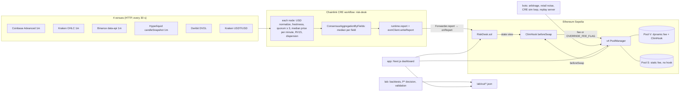
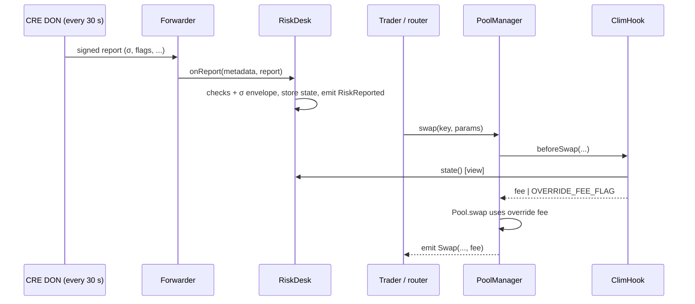

# clim · Design spec

> **Status:** v3.2, 2026-10-06 (integration pass of plan 00: one token pair for both suites, `routers.arb`, the closed-candle rule, the full `shared/params.json` schema; fixer pass: `TestToken.faucet()`, the dashboard's wallet, `/swap` and `/lp` pages, 100,000 tETH per pool, a replay operator key, the directional toll stated qualitatively, demo acts reordered). This is a living document: when the build or new research contradicts it, update it and log the change in `docs/sessions/<date>.md`.
> **Supersedes:** the team's private French design notes (v2, 2026-10-06 15:45 SGT) and the audit of the same day. This spec applies the post-audit calibration.
> **Event:** TOKEN2049 Origins, Singapore, 2026-10-06 to 08. Tracks: Main track and Chainlink "Best workflow with CRE".
> **Team:** Sofiane Ben Taleb (@gamween), building solo for now. Armand Séchon (@STOOOKEEE) and Noé Wales may join later.
> **Plans:** `docs/superpowers/plans/2026-10-06-clim-00-master.md` (order and gates), then `01` to `06`.

---

## 0. Summary

clim is storm insurance for Uniswap v4 liquidity providers (LPs). When the market is calm, the pool charges the pair's usual market fee (5 bp for ETH/USDC). When volatility rises, the fee rises with it, in proportion to how far the price can move before the pool can reprice.

- **The risk desk** is a Chainlink CRE workflow. Every 30 s it measures ETH realized volatility over the last 15 minutes on four venues (Coinbase, Kraken, Binance, Hyperliquid). It needs at least 3 of them to agree. The DON takes the median of each field and writes a signed report to `RiskDesk.sol`.
- **The quoting engine** is a Uniswap v4 hook (`ClimHook`). On every swap it reads `RiskDesk` and returns a symmetric LP fee with `OVERRIDE_FEE_FLAG`.
- **The rule** comes from Milionis, Moallemi and Roughgarden (2023) and Nezlobin and Tassy (2025). Above the floor, it sets the fee so that a target share P\* of blocks is arbitraged. That gives a falsifiable prediction, and the desk checks it continuously.

**Parameters.** All of them are immutable in the hook. P\* is decided in the lab before the hook is deployed (§2.6).

| Name | Value | Meaning |
|---|---|---|
| `pStar` | 0.20 or 0.30 (lab decision) | Target share of arbitraged blocks above the floor |
| `etaE4` | 41,760 (P\* = 20%) or 25,093 (P\* = 30%) | η\* = 1/P\* − 0.824, × 10⁴ |
| `sqrtHalfDtE6` | 2,449,490 | √(12 s / 2) × 10⁶ (Sepolia block time 12 s) |
| `feeMinPips` | 500 | 5 bp floor, the ETH/USDC market fee tier |
| `feeMaxPips` | 15,000 | 150 bp cap |
| `feeSafePips` | 3,000 | 30 bp, minimum fee when the desk is blind or degraded |
| `tauKillSec` | 180 (simulation) / 120 (production) | Desk silence after which the hook is blind |
| `DISP_MAX` | 25 bp | Venue dispersion above which the report is flagged DEGRADED |
| `MIN_GAP` | 20 s | Minimum spacing between accepted observations |
| `MAX_SKEW` | 30 s | Maximum allowed time of an observation in the future |
| `SIGMA_MIN_E9` / `SIGMA_MAX_E9` | 17,807 / 1,780,730 | 10%/yr and 1000%/yr bounds on σ |
| `kE4` range | [10,000, 20,000] | Model-risk multiplier k ∈ [1, 2] |

Units: 1 bp = 100 pips. Uniswap's `MAX_LP_FEE` = 1,000,000 pips = 100%.

---

## 1. Problem

### 1.1 An LP sells options and can only requote once per block

A constant-function AMM shows a price it can only change through trades. When ETH moves on Binance, arbitrageurs buy from the pool at the stale price and sell elsewhere. Milionis, Moallemi, Roughgarden and Zhang (2022) call the LP's loss against a rebalancing portfolio **loss-versus-rebalancing (LVR)**. It is the LP's gamma cost: an LP is short convexity.

- For a full-range constant-product pool, LVR accrues at σ²/8 of pool value per unit of time. At σ = 48%/yr that is about 2.9% of the pool per year.
- For a Uniswap v4 position in range, the rate is σ²·L·√P/4. A ±5% range concentrates liquidity by a factor of 35 to 40, which brings LVR to about 100%/yr of position value (pre-hack research, §1.3).

### 1.2 The fee is the only barrier

With a fee, an arbitrageur only trades when the mispricing exceeds the fee. MMR (2023) show that fees scale arbitrage profits down by the share of blocks that contain an arbitrage: ARB ≈ P_trade × LVR. The fee is the LP's only lever, and it cuts both ways:
- **too low**, and the LP is robbed in a storm;
- **too high**, and regular traders route to the pool next door.

Campbell, Bergault, Milionis and Nutz (2025) find that the optimal fee stays at the competitive level in normal conditions, that extreme volatility justifies higher fees, and that threshold-based dynamic schedules can improve LP outcomes. clim is such a schedule. Its threshold is set by a measured volatility, not by a guess.

### 1.3 Evidence from pre-hack research (dated)

Before the hackathon (research note dated 2026-09-30), we measured LVR on Fables' ETH/USDG pool on Robinhood Chain. Over 14 days, against three agreeing external mids (Coinbase, Lighter, Hyperliquid), 1-minute LVR was about 114%/yr of position value, against a gross fee APR of about 110%. Depending on the method, LVR consumed 75 to 105% of the fees the LPs earned.

This measurement predates the hackathon. It is context for the problem, not a result of this project, and no pre-hack code is used in this repository.

---

## 2. Idea

### 2.1 Storm insurance

- The LP is an insurer, and the toll is its premium.
- The premium follows the weather: the pair's usual 5 bp when calm, more in a storm.
- Chainlink CRE plays the part of four weather stations (exchanges) that must agree before the forecast is published.
- The desk checks its own forecast: the model predicts how often blocks get arbitraged, and the desk compares that prediction with what happens.

### 2.2 A TradFi two-floor desk

A bank separates a slow **risk desk**, which measures volatility, sets limits and validates models, from a fast **quoting engine**, which widens the spread when risk rises. clim follows the same split:
- **Risk desk, the CRE workflow.** It measures volatility on several venues and publishes the measure on-chain in a signed report. It never quotes a price; it publishes measurements.
- **Quoting engine, the v4 hook.** On every swap it applies a frozen policy: the fee is η\* standard deviations of the price move over half a block.

Pitch sentence: "Our fee is the half-spread of a market maker who can only requote once per block. It equals η standard deviations of the price move during the arbitrage latency, with σ supplied by a decentralized risk desk that backtests its own model." We never say "optimal fee".

### 2.3 The math

**Notation**
| Symbol | Definition |
|---|---|
| σ | Annualized volatility of ln(price) |
| σ_s | Per-sqrt-second volatility: σ / √31,536,000 (365-day year) |
| Δt | Block time, 12 s on Sepolia (measured mean 12.04 s over 300 blocks on 2026-10-06) |
| f | LP fee as a fraction (5 bp = 0.0005); γ = −ln(1 − f) ≈ f is the half-width of the no-arbitrage band in log price |
| η | γ / (σ_s·√(Δt/2)): the fee in units of the price move over half a block |
| P_trade | Long-run share of blocks that contain an arbitrage |
| c | \|ζ(1/2)\| / √π = 0.823917 (ζ is the Riemann zeta function) |

**Poisson blocks (MMR 2023).** With block arrivals of mean interval Δt, P_trade = 1 / (1 + η), with η = γ / (σ·√(Δt/2)). This is exact under the model (geometric Brownian motion, myopic arbitrageurs, no gas, symmetric fee) and does not depend on the AMM's curve. MMR also show that ARB ≈ P_trade × LVR in the fast-block regime.

**Fixed block time (Nezlobin-Tassy 2025, Corollary 3.1).** The paper writes

  P_trade = 1 / ( γ_NT / (√2·σ_b) + |ζ(1/2)|/√π ) + O(e^(−c'·γ_NT/σ_b)),  with σ_b = σ·√Δt.

NT's γ_NT is the full width of the no-arbitrage band: their no-arbitrage region is [0, γ_NT]. That makes γ_NT twice the fee. We checked this against the paper itself: NT's Poisson row, 1/(1 + γ_NT/(√2·σ_b)), which the paper credits to MMR, equals MMR's 1/(1 + η) only if γ_NT = 2γ. In fee units the corollary therefore reads

  **P_trade = 1 / (η + c),  c = 0.8239**

and the share of LVR that arbitrageurs keep is

  **ARB / LVR = 1 / (1 + η/c) = c · P_trade.**

With fixed blocks, clim uses the second form for every prediction. NT also show (Corollary 4.1) that the leading term of P_trade does not depend on the block-time distribution. Only the constant does: 0.824 for fixed blocks, 1 for Poisson. Sepolia's missed slots are rare (mean interval 12.04 s against 12 s), so the fixed-block constant applies.

**The policy.** We hold P_trade at a target P\* whenever the fee is above the floor:

  η\* = 1/P\* − c,  fee = clamp( η\* · k · σ_s · √(Δt/2), f_min, f_max ).

- k ∈ [1, 2] is a one-sided model-risk multiplier, k = 1 in the hackathon build (§7.6).
- At the policy, ARB/LVR = c·P\*. In the model, arbitrageurs keep 24.7% of LVR at P\* = 30%, 16.5% at P\* = 20% and 8.2% at P\* = 10%. Real data is worse (§7.4).
- Parameters use the rounded constant 0.824: `etaE4 = round(10⁴ · (1/P* − 0.824))`. That gives 41,760 at P\* = 20% and 25,093 at P\* = 30%. The 0.0001 rounding is immaterial.

### 2.4 The on-chain integer formula

The formula needs no logarithm and no square root on-chain:

  fee_pips = clamp( ceil( sigmaE9 · etaE4 · sqrtHalfDtE6 · kE4 / 10¹⁷ ), feeMinPips, feeMaxPips )

| Input | Definition | Example |
|---|---|---|
| `sigmaE9` | round(σ_s × 10⁹) | 48%/yr → 85,475 |
| `etaE4` | round(η\* × 10⁴) | P\* = 30% → 25,093 |
| `sqrtHalfDtE6` | round(√(Δt/2) × 10⁶) | Δt = 12 s → 2,449,490 |
| `kE4` | k × 10⁴ | 10,000 |

Scale check: the factors 10⁹ · 10⁴ · 10⁶ · 10⁴ = 10²³ map to pips (10⁶) through 10²³ / 10¹⁷ = 10⁶. The largest product is about 1.78·10⁶ × 9.2·10⁴ × 2.45·10⁶ × 2·10⁴ ≈ 8·10²¹, so all arithmetic is done in uint256.

**Test vectors.** k = 1 (`kE4` = 10,000), floor 500, cap 15,000, computed with exact integer arithmetic. They are the source of truth for `ClimFeeMath` tests.

| σ (annual) | `sigmaE9` | P\* = 30% (`etaE4` 25,093) | P\* = 20% (`etaE4` 41,760) | P\* = 10% (`etaE4` 91,761, old setting) |
|---|---|---|---|---|
| 10% | 17,807 | 500 (raw 109.45) | 500 (raw 182.15) | 500 (raw 400.24) |
| 25% | 44,518 | 500 | 500 | 1,001 |
| 48% | 85,475 | 526 | 875 | **1,922** (raw 1,921.20) |
| 74% | 131,774 | 810 | 1,348 | 2,962 |
| 100% | 178,072 | 1,095 | 1,822 | 4,003 |
| 225% | 400,663 | 2,463 | 4,099 | 9,006 |
| 1000% (`SIGMA_MAX_E9` 1,780,730) | 1,780,730 | 10,946 | 15,000 (cap) | 15,000 (cap) |

With k = 2 (`kE4` = 20,000), at P\* = 30%: 48% → 1,051, 100% → 2,190, 225% → 4,926.

The ceiling matters. Earlier notes quoted 1,921 pips for 48% at P\* = 10%, but the ceiling of 1,921.20 is 1,922. `SIGMA_MAX_E9` = 1,780,730 is 1000.003%/yr; the exact 1000%/yr value is 1,780,724. The canonical constant is kept for consistency across plans, and the difference does not matter.

### 2.5 Calibration (post-audit)

**The floor is the pair's market fee tier: 5 bp for ETH/USDC.** In calm markets the pool then charges what the competition charges and keeps its retail flow. The toll rises only in a storm.

| σ (annual) | Fee at P\* = 30% | Fee at P\* = 20% |
|---|---|---|
| up to 27.4% | 5 bp (floor) | 5 bp (floor) |
| 30% | 5 bp (floor) | 5.5 bp |
| 46% | 5.0 bp (the floor binds up to 45.7%) | 8.4 bp |
| 48% | 5.3 bp | 8.8 bp |
| 74% (2026-02-04, the design note's hourly reading near the start of the replay window; the lab's RV15 there is about 60%) | 8.1 bp | 13.5 bp |
| 100% | 11.0 bp | 18.2 bp |
| 225% (2026-02-04 peak) | 24.6 bp | 41.0 bp |
| 30 bp (`feeSafe`) reached at | 274% | 165% |
| 150 bp cap reached at (k = 1) | 1,370% (above `SIGMA_MAX`, so never) | 823% |

In the floor regime, P_trade falls below P\*. For example, at P\* = 30%, σ = 30% and a 5 bp fee, η = 3.82 and P_trade = 0.215. The dashboard and the validation always use the fee that was actually applied, never P\*.

### 2.6 Deciding P\*

P\* is decided in the lab (plan 03) **before** `ClimHook` is deployed, because the hook's parameters are immutable.

1. **Simulation.** Simulate pool V (clim) at P\* = 20% and P\* = 30% against a competing static 5 bp pool and a router. The router sends each retail order to the pool with the lower all-in cost: fee plus price impact.
2. **Data.** Use Binance ETHUSDT 1 s data for February 2026 and October 2026, and 1-minute data over one year.
3. **Metric.** Compute the LP's full P&L: retail fees plus arbitrage fees minus LVR, equivalently FEE_retail − ARB for a delta-hedged LP. Report it in % of capital per year and in dollars per $1M.
4. **Decision rule.** Choose the P\* with the higher full P&L. On a tie (within the simulation's noise), choose 30%: the lower fee loses less volume.
5. **Record.** Write the decision to `shared/params.json` with `decidedBy`, and add a line to the session log.

`shared/params.json` fields:

| Field | Type | Value |
|---|---|---|
| `pStar` | number | 0.2 or 0.3 |
| `etaE4` | integer | 41760 or 25093 |
| `sqrtHalfDtE6` | integer | 2449490 |
| `feeMinPips` | integer | 500 |
| `feeMaxPips` | integer | 15000 |
| `feeSafePips` | integer | 3000 |
| `tauKillSec` | integer | 180 (the Sepolia hook runs under simulation conditions) |
| `staticFeePips` | integer | Fee of the live S pool: the lab's forecast of V's time-average fee over the demo window |
| `replayStaticFeePips` | integer | Fee of the replay S pool: V's exact time-average fee over the replay window; must differ from `staticFeePips` |
| `decidedBy` | string | `lab/scripts/decide_pstar.py: <reason>`; the full evidence is `lab/out/pstar_decision.json`. Never starts with `PROVISIONAL` or `FIXTURE` once decided (the hook deploy script refuses those) |
| `decidedAt` | string | ISO 8601 time of the decision |

### 2.7 Why the comparison is "at equal average fee"

"More fee = less arbitrage loss" is trivial. The fair test compares a fee proportional to σ with a fixed fee **at the same time-average fee**. In the fast-block regime (η large, P_trade ≈ 1/η) ARB ∝ σ³/f, so at equal mean fee:

  ARB(f ∝ σ) / ARB(f fixed) = E[σ]·E[σ²] / E[σ³] ≤ 1.

The inequality is Chebyshev's sum inequality, since σ and σ² move together. The gain comes from volatility clustering: the fee is high exactly when the loss per unit of time is high. With a floor, this closed form no longer holds exactly, and the lab measures it. Because volume also rises with volatility, the second comparison is **at equal cost to traders** (volume-weighted fee). Both comparisons are always shown.

### 2.8 The estimator

- p_t is the median, across the venues that passed the freshness check, of the 1-minute USD close for minute t. A candle `[m−60, m)` counts as closed from time m on (no grace delay), and its close is the last price before m; the lab and the CRE workflow use exactly this rule, so a replayed report reproduces the lab's RV15 at the same `tObs`.
- RV15 is computed from the 16 most recent common closed minutes, which give 15 log returns r_i: **σ̂_s = √( Σ r_i² / 900 s )**, per sqrt second.
- Its relative standard error is √(1/30) ≈ 18% for n = 15.
- In the lab, RV15 correlates at 0.85 with local variance, against 0.40 for Deribit's DVOL. So realized volatility drives the fee and implied volatility (DVOL) is published only as a diagnostic.

### 2.9 What we tested and rejected: a directional toll

The first design (v1) charged a directional toll against a CRE reference price. It is rejected for four reasons:
1. **The reference is stale.** It is at least 30 s old, and within that window an arbitrageur moves the pool away from the stale reference and pays the low fee.
2. **It can be gamed.** Splitting a swap gets around it, and in-block manipulation combined with JIT liquidity inflates it.
3. **It loses the comparison.** In simulation it is dominated by a symmetric fee at equal tracking error, and on real data it wins only in calm markets with a wide fee.
4. **It already exists.** MSpits/DynamicFeeHook (2025) already charges a directional fee on a Chainlink oracle.

The criterion: with T_band = (f/σ_s)², a reference of age τ carries information only if τ/T_band ≲ 0.3. This was tested during design, at the old setting (P\* = 10 %, `lab/scratch/bt2.py` and `bt3.py`), and is not recomputed at the decided P\*: the README states it qualitatively (section "What we tested and rejected", plan 06 Task 10) and quotes no number for it (decision logged in the session log, 2026-10-06).

---

## 3. Architecture and canonical interfaces

### 3.1 Overview



### 3.2 Repository layout (canonical)

```
clim/
  CLAUDE.md, README.md, .gitignore
  docs/superpowers/specs/2026-10-06-clim-design.md     this spec
  docs/superpowers/plans/2026-10-06-clim-00-master.md   order, gates, cross-cutting rules
  docs/superpowers/plans/2026-10-06-clim-01-contracts.md
  docs/superpowers/plans/2026-10-06-clim-02-cre-risk-desk.md
  docs/superpowers/plans/2026-10-06-clim-03-lab.md
  docs/superpowers/plans/2026-10-06-clim-04-bots-ops.md
  docs/superpowers/plans/2026-10-06-clim-05-frontend.md
  docs/superpowers/plans/2026-10-06-clim-06-demo-submission.md
  docs/sessions/2026-10-06.md, docs/feedback/cre-friction-log.md, docs/faq.md
  shared/                      single source of truth for cre/, bots/, app/
    deployments/sepolia.json   addresses: Uniswap infra, forwarders, tokens, riskDesk(s), hook(s),
                               live and replay pools with full PoolKeys and poolIds
    params.json                P* decision and hook parameters (§2.6)
    abis/*.json                exported from contracts/out by a script
    src/units.ts, src/index.ts E9/E4/pips/bp conversions, σ annual <-> per-sqrt-second, loaders
  contracts/                   Foundry
    src/RiskDesk.sol, src/ClimHook.sol, src/libraries/ClimFeeMath.sol, src/interfaces/IRiskDesk.sol
    src/receiver/              ReceiverTemplate.sol, IReceiver.sol, IERC165.sol
                               (copied from smartcontractkit/cre-templates, MIT)
    src/test-tokens/TestToken.sol, script/*.s.sol, test/*.t.sol
  cre/                         CRE project (project.yaml, secrets.example.yaml)
    risk-desk/                 the workflow (TypeScript)
  lab/                         Python: clim_lab/ package, tests/, scripts/, scratch/ (backtests written during
                               the hack), data/ (gitignored), out/*.json (consumed by app/)
  bots/                        TypeScript + viem: arbitrage bot, retail noise bot, CRE simulation loop, replay server
  app/                         Next.js dashboard
```

### 3.3 CRE workflow `risk-desk` (cre/risk-desk/, TypeScript, `@chainlink/cre-sdk`)

**Triggers.** Handlers are registered in this order:
- **[0] cron → `onTick`**, schedule `"*/30 * * * * *"` (6 fields, seconds first). 30 s is the CRE minimum cron interval.
- **[1] HTTP trigger → `onTick`**, used to drive simulation loops. HTTP triggers are rate-limited to 1 per 30 s, burst 1.

**Config fields**
| Field | Meaning |
|---|---|
| `schedule` | `"*/30 * * * * *"` |
| `deskAddress` | Target `RiskDesk` (live or replay) |
| `chainSelectorName` | `"ethereum-testnet-sepolia"` |
| `gasLimit` | Gas limit for `writeReport` |
| `venues[]` | Venue descriptors (endpoints and parsing are specified in plan 02) |
| `dvolUrl` | Deribit ETH DVOL, resolution 60 |
| `usdtUsdUrl` | Kraken USDT/USD ticker (normalizes Binance USDT closes to USD) |
| `mode` | `"live"` or `"replay"` |
| `replayUrl` | Replay server endpoint (replay mode only) |
| `token0IsEth` | Pool orientation for `refTick` |

**Per node, 6 HTTP calls** (the quota is 15 per execution):
1. Coinbase Advanced 1-minute candles;
2. Kraken OHLC with a 1-minute interval;
3. Binance `data-api.binance.vision` 1-minute klines;
4. Hyperliquid `candleSnapshot` 1-minute;
5. Deribit DVOL;
6. Kraken USDT/USD.

**Computation per node**
1. Convert closes to USD. Drop a venue whose last closed candle is older than 120 s.
2. If fewer than 3 venues remain, **produce no report** and log why.
3. Build p_t, the median USD close per minute, over the 16 most recent common minutes. Compute RV15 per §2.8.
4. Compute `dispBp` = ceil(10⁴ × max_i |p_i − m| / m) on the latest common minute, where m is the cross-venue median.
5. Compute `refTick` from m, using `token0IsEth`. With 18/18 decimals no decimal adjustment is needed: tick = floor(log_1.0001(m)) if token0 is tETH, else floor(log_1.0001(1/m)).
6. Compute `dvolE2` = round(DVOL × 100).
7. Set `sigmaE9` = round(RV15 × 10⁹). In the hackathon build, `sigmaE9 = rv15E9`. The two fields exist so that a later model can differ from the raw measure while the raw measure stays auditable.
8. Set `kE4` = 10,000 and `zone` = 0 (§7.6).

**Consensus.** `ConsensusAggregationByFields`, with the median of each field. `tObs = runtime.now()`, in seconds.

**Write.**
1. Read `RiskDesk.state()` for the logs.
2. ABI-encode the report.
3. `runtime.report(...)`, then `evmClient.writeReport(...)` to `deskAddress`.

**Replay mode.** Venue calls are replaced by the replay server (`replayUrl`): one `GET <replayUrl>/venue/<venue>/api/v3/klines` per configured venue, in Binance kline format with timestamps shifted to the wall clock, so the freshness rule works unchanged. The server serves the Feb 4, 2026 window at wall-clock speed: one replayed second per real second. Δt and the formula stay unchanged, and a 4-hour window takes 4 hours, about 1,200 Sepolia blocks. A compressed replay would require rescaling σ by √(compression), so it is not used.

### 3.4 Report ABI (canonical)

`abi.encode(uint40 tObs, uint32 sigmaE9, uint32 rv15E9, uint16 dvolE2, int24 refTick, uint16 dispBp, uint8 nSources, uint16 kE4, uint8 zone)`

| Field | Unit | Example |
|---|---|---|
| `tObs` | Unix seconds, DON observation time | 1791281890 |
| `sigmaE9` | σ_s × 10⁹, the desk's estimate | 85,475 (48%/yr) |
| `rv15E9` | Raw RV15 × 10⁹ | 85,475 |
| `dvolE2` | DVOL × 100 | 4,825 (DVOL 48.25) |
| `refTick` | Tick of the median USD price in the pool's orientation | |
| `dispBp` | Max deviation of a venue from the median, bp, rounded up | 3 |
| `nSources` | Venues used (3 or 4) | 4 |
| `kE4` | Model-risk multiplier × 10⁴ | 10,000 |
| `zone` | 0 not evaluated (hackathon build), 1 green, 2 yellow, 3 red | 0 |

### 3.5 `RiskDesk.sol` (contracts/src/RiskDesk.sol)

`RiskDesk` inherits `ReceiverTemplate`, copied from `smartcontractkit/cre-templates`. That template is `IReceiver` plus OpenZeppelin `Ownable`; its `onReport` checks the forwarder, and the workflow identity when one is configured, then calls `_processReport(report)`.

**`_processReport` rejects** (reverts with a custom error) when:
1. in simulation mode, `tx.origin != simOperator`;
2. `tObs < last.tObs + 20` (`MIN_GAP`);
3. `tObs > block.timestamp + 30` (`MAX_SKEW`);
4. `nSources < 3`.

**It applies the σ envelope**
- **First report** (prev = 0): σ_applied = clamp(σ_report, `SIGMA_MIN_E9`, `SIGMA_MAX_E9`).
- **After that:** σ_applied = clamp(σ_report, max(`SIGMA_MIN_E9`, ⌊0.8·prev⌋), min(`SIGMA_MAX_E9`, 2·prev)). Integer arithmetic: 0.8·prev = prev·4/5. The lower bound never exceeds the upper bound, because prev is always within [MIN, MAX].
- **k:** `kE4` is clamped to [10,000, 20,000].
- **Flags:** DEGRADED (bit 0) is set if `dispBp > 25` and cleared otherwise, on every report. REPLAY (bit 1) is set at construction for replay desks and never changes.

**State.** One storage slot: `{uint40 tObs, uint32 sigmaE9, uint16 kE4, uint8 flags, uint32 seq}` (128 bits). `seq` counts accepted reports, so `seq == 0` means the desk never reported.

- `function state() external view returns (uint40 tObs, uint32 sigmaE9, uint16 kE4, uint8 flags, uint32 seq)`
- `event RiskReported(uint32 indexed seq, uint40 tObs, uint32 sigmaApplied, uint32 sigmaReported, uint32 rv15E9, uint16 dvolE2, int24 refTick, uint16 dispBp, uint8 nSources, uint16 kE4, uint8 zone)`. Every report field is in the event, so the dashboard and the attribution can be recomputed from logs alone.

**Admin.**
- `setForwarderAddress` and `setExpectedWorkflowId` come from ReceiverTemplate.
- `disableSim()` is irreversible.
- There is **no function that sets σ, the fee or any fee parameter.** §6.7 states precisely what the owner can still do.

**Constructor semantics.** It takes the forwarder address (ReceiverTemplate requires a non-zero one), `simOperator`, and whether the desk is a replay desk (which sets REPLAY). Simulation mode is on at construction. Plan 01 fixes the exact signature.

### 3.6 `ClimHook.sol` and `ClimFeeMath` (contracts/src/)

**ClimFeeMath** (`src/libraries/ClimFeeMath.sol`):
`function feePips(uint32 sigmaE9, uint32 etaE4, uint32 sqrtHalfDtE6, uint16 kE4, uint24 feeMinPips, uint24 feeMaxPips) internal pure returns (uint24)` computes the §2.4 formula in uint256 with a ceiling division, then clamps.

**ClimHook** extends OpenZeppelin `uniswap-hooks` `BaseOverrideFee` (`src/fee/BaseOverrideFee.sol`; latest tag v1.2.1). Verified in source:
- `BaseOverrideFee` sets the permissions `afterInitialize` and `beforeSwap`.
- `_afterInitialize` reverts with `NotDynamicFee()` unless `key.fee == DYNAMIC_FEE_FLAG`.
- `_beforeSwap` returns `_getFee(...) | OVERRIDE_FEE_FLAG`.
- The hook to implement is `function _getFee(address sender, PoolKey calldata key, SwapParams calldata params, bytes calldata hookData) internal virtual returns (uint24)`.
- On `main` (2026-10-05), `_beforeSwap` also calls `fee.validate()`; v1.2.1 does not. Both are safe, because the PoolManager validates the overridden fee in any case.

**Constructor** (all immutable): `(IPoolManager poolManager, IRiskDesk desk, uint32 etaE4, uint32 sqrtHalfDtE6, uint24 feeMinPips, uint24 feeMaxPips, uint24 feeSafePips, uint32 tauKillSec)`. It should require `0 < feeMinPips <= feeSafePips <= feeMaxPips <= 1_000_000`, `etaE4 > 0`, `sqrtHalfDtE6 > 0` and `tauKillSec > 0`.

**Fee algorithm** (shared by `_getFee` and `quoteFee`):
```
(tObs, sigmaE9, kE4, flags, seq) = desk.state()          // one STATICCALL, one SLOAD
base = ClimFeeMath.feePips(sigmaE9, etaE4, sqrtHalfDtE6, kE4, feeMinPips, feeMaxPips)
age  = block.timestamp > tObs ? block.timestamp - tObs : 0   // tObs may be up to 30 s ahead (MAX_SKEW)
if (seq == 0 || age > tauKillSec) return (max(base, feeSafePips), 2)   // blind
if (flags & 1 != 0)               return (max(base, feeSafePips), 1)   // degraded
return (base, 0)                                                       // normal
```
- `function quoteFee() external view returns (uint24 fee, uint8 mode)`: mode 0 normal, 1 degraded, 2 blind.
- When `seq == 0`, `kE4` reads 0, so `base` = `feeMinPips` and the fee is `feeSafePips`.

**Address.**
- The permission flags are AFTER_INITIALIZE (1 << 12) | BEFORE_SWAP (1 << 7) = **0x1080**. `Hooks.validateHookPermissions` requires the low 14 bits of the address to equal exactly these flags.
- The address is mined with `HookMiner` and deployed through the CREATE2 deployer `0x4e59b44847b379578588920cA78FbF26c0B4956C`, which has code on Sepolia.
- `HookMiner` lives at `src/utils/HookMiner.sol` in the v4-periphery commit pinned by `Uniswap/v4-template`, and at `test/shared/HookMiner.sol` on v4-periphery `main` (2026-09-19).

**Properties.**
- The fee is the same in both directions and independent of the pool's state, so splitting a swap, sandwiching or in-block price manipulation cannot change it.
- The hook holds no funds and makes no external call other than the view on `RiskDesk`.
- Anyone can create another pool with `ClimHook` as its hook. That is harmless: such a pool gets the same fee.

**Compatibility.**
- The Sepolia PoolManager matches v4-core v4.0.0 logic for everything clim uses.
- OZ hooks import `SwapParams` from `types/PoolOperation.sol`, which was added after v4.0.0 (in v4.0.0 the struct was nested in `IPoolManager`). The fields are the same, and so are the selectors: `beforeSwap` 0x575e24b4 and `afterInitialize` 0x6fe7e6eb both appear in the deployed PoolManager bytecode. Compiling against v4-core `main` is ABI-compatible with the deployed contract.

### 3.7 Twin pools on Sepolia

**Tokens.** tETH and tUSD (`TestToken`, 18 decimals). The owner mints for the pools and the bots; a public `faucet()` gives any address 10 tETH or 25,000 tUSD once per hour, so judges can use the dashboard's `/swap` and `/lp` pages. Full-range liquidity and the same L in both pools: 100,000 tETH per pool by default (L ≈ 5.2e24 at $2,713), deep enough that a $2,000 retail order moves the price about 0.15 bp and a visitor's faucet-sized `/lp` deposit changes one pool's L by about 0.01 %, so V and S stay twins. Both pools start at the same `sqrtPriceX96`, taken from the median ETH price at deployment. Both use `tickSpacing` 60.

**Pool V.** `fee = DYNAMIC_FEE_FLAG` (0x800000), `hooks = ClimHook`.

**Pool S.** A static fee with `hooks = address(0)`.
- **Comparison fairness:** S charges the same time-average fee as V. S's fee is immutable once the pool is initialized, so it must be chosen beforehand.
- **Replay pair:** S's fee is the exact time-average of V's fee over the replay window, which the lab computes from the replay path before deployment. At the old P\* = 10% setting this was 55.7 bp; it is recomputed at the final P\*.
- **Live pair:** S's fee is the lab's forecast of V's time-average fee over the demo window, from the last 7 days of volatility. Under the post-audit calibration in a calm market, V sits at the 5 bp floor almost all the time, so S is close to 5 bp.
- **Reporting:** the dashboard shows V's realized time-average fee next to S's fee. If they differ by more than 10%, the live comparison is labeled "not at equal fee", and the lab's comparison is the reference.

**Replay pair.** It shares the tETH/tUSD pair with the live pair, as in plan 04's deployments schema, but has its own `RiskDesk` (REPLAY flag set, with its own operator key as `simOperator`, so the live and replay CRE loops never send from the same key) and its own `ClimHook` bound to that desk. The PoolKeys stay distinct: replay V differs by its hook, and replay S by its fee, because `03_CreatePools` refuses a `replayStaticFeePips` equal to `staticFeePips`. The two pairs have independent prices; only token balances are shared.

**Twin pools in shared/deployments/sepolia.json.** Each pool's full PoolKey `(currency0, currency1, fee, tickSpacing, hooks)` and its `poolId = keccak256(abi.encode(key))` are recorded there.

### 3.8 Bots (bots/, TypeScript + viem)

Our own bots run the twin pools. Sepolia proves the plumbing, not the economics.

**Arbitrageur (rational, myopic).** Every block it:
1. reads `StateView.getSlot0` for V and S;
2. reads the reference price m, either the venue median it fetches itself (live) or the replay server (replay);
3. reads V's `quoteFee()` and S's static fee.

When |ln(P_pool/m)| exceeds the pool's γ = −ln(1 − f), it swaps exact-input toward m, with `sqrtPriceLimitX96` at the edge of the no-arbitrage band `[m(1−f), m/(1−f)]` in the pool's orientation. It swaps through its own `PoolSwapTest` (`routers.arb` in `shared/deployments/sepolia.json`, deployed by plan 01), so the dashboard identifies arbitrage swaps by `Swap.sender` and recomputes the attribution from logs alone.

**Retail noise.**
- Poisson arrivals at about one swap every two blocks, random side, log-normal size.
- **Mirrored flow:** every retail swap is sent to both V and S, so the two pools see the same retail flow.
- Logit routing between V, S and a 5 bp competitor, to measure volume leakage, is P1.

**CRE simulation loop.**
- `cre workflow simulate --broadcast` runs every 30 s for the live desk, and for the replay desk when the replay is running.
- The key it broadcasts with is the desk's `simOperator`.

**Replay server.** It serves the Feb 4, 2026 window (Binance ETHUSDT 1 s, 12:00 to 16:00 UTC) as venue-like candles, plus the current replay price for the arbitrageur.

### 3.9 Lab (lab/, Python)

- **P\* decision** (§2.6).
- **Backtests:** fixed fee against f(RV15) at equal average fee and at equal cost to traders.
- **P_trade:** observed against predicted.
- **Model control:** simulated thresholds and the severity test (§7).
- **ARB/LVR** against the model.
- **The rejected toll** (§2.9) stays a design-phase result in `lab/scratch/`; it is not recomputed at the decided P\*.
- **Outputs:** `lab/out/*.json`, read by the dashboard. Plan 03 defines the exact schemas, and plan 05 uses the same ones.

### 3.10 Dashboard (app/, Next.js)

A functional dashboard with wallet connect, restyled later (Frontend scope upgrade, session log 2026-10-06). It is built from plan 05 in the private repository DVB-ANS/clim-front (its root is `app/`) and imported into `app/` with `git subtree`, history kept (master plan Task 14). Wallet: wagmi 2 with RainbowKit, Sepolia only; injected wallets work without a WalletConnect project id.

| Page | Content |
|---|---|
| `/` | The live dashboard (panels below) |
| `/replay`, `/lab` | The 4 February 2026 replay and the lab's backtests (both comparisons, honest numbers) |
| `/how` | How the fee is computed, with the live parameters, and `docs/faq.md` |
| `/swap` | `quoteFee()` before the swap ("you will pay X bp because the weather is Y"), a swap on V or S through `uniswap.poolSwapTest` (never `routers.arb`, so it counts as retail), then the fee actually paid, read from the `Swap` event |
| `/lp` | `TestToken.faucet()`, full-range liquidity added to or removed from V or S through `PoolModifyLiquidityTest` with `salt` = the user's address, the position (`StateView.getPositionInfo`), uncollected fees and the P&L against the same liquidity in the twin pool. The test router does not authenticate removals by salt: testnet only, said on the page |

Sources:
- `RiskReported` events;
- `PoolManager.Swap` events, whose `fee` field is the fee actually charged on each swap;
- `quoteFee()`;
- `shared/`;
- `lab/out/*.json`.

| Panel | Content |
|---|---|
| Desk | Latest report, venues used, σ applied versus reported, dispersion, flags, report age, hook mode |
| Quote | V's fee against S's fee over time, the theoretical curve fee(σ), each swap's fee as a dot |
| Validation | Rolling P_trade, observed against predicted, inside the simulated band (§7.3); zone |
| P&L explain | Per pool: LVR, FEE_arb, ARB, FEE_retail |
| Volatility quad | σ_IV (DVOL), σ_RV (RV15), σ_arb, σ_BE |
| Replay | The Feb 4, 2026 replay, or the lab's curves for the same window |
| Safety | Forged-report rejection and blind-mode evidence, with transaction hashes |

**P&L explain formulas.** These are model formulas (MMR 2023, Milionis et al. 2022), recomputed from logs:
- LVR per block for an in-range v4 position: (L·√P/4)·(Δ ln m)²;
- ARB per arbitrage swap: its profit at m, net of the fee;
- FEE: f × input amount;
- σ_arb = f̄ / ((1/p̂ − c)·√(Δt/2)), the volatility that reproduces the observed arbitrage frequency p̂;
- σ_BE = 2·√(F/(L·√P)), the break-even volatility above which fees fall short of LVR.

### 3.11 Sepolia addresses

Verified on-chain on 2026-10-06 through `https://ethereum-sepolia-rpc.publicnode.com` (chainId 11155111). Plan 01 records them in `shared/deployments/sepolia.json`.

| Contract | Address | Check |
|---|---|---|
| PoolManager (v4) | `0xE03A1074c86CFeDd5C142C4F04F1a1536e203543` | Code present; selectors for `initialize`, `swap`, `updateDynamicLPFee` (0x52759651), `beforeSwap` and `afterInitialize` found in the bytecode; `protocolFeeController()` = 0x0 |
| StateView | `0xe1dd9c3fa50edb962e442f60dfbc432e24537e4c` | `poolManager()` = the PoolManager above |
| PoolSwapTest | `0x9b6b46e2c869aa39918db7f52f5557fe577b6eee` | `manager()` = the PoolManager above |
| PoolModifyLiquidityTest | `0x0c478023803a644c94c4ce1c1e7b9a087e411b0a` | `manager()` = the PoolManager above |
| MockKeystoneForwarder (simulation) | `0x15fC6ae953E024d975e77382eEeC56A9101f9F88` | `typeAndVersion()` = "MockKeystoneForwarder 1.0.0"; listed for Ethereum Sepolia in the CRE Forwarder Directory (2026-09-18) |
| KeystoneForwarder (production) | `0xF8344CFd5c43616a4366C34E3EEE75af79a74482` | `typeAndVersion()` = "KeystoneForwarder 1.0.0"; listed for Ethereum Sepolia in the same directory |
| CREATE2 deployer | `0x4e59b44847b379578588920cA78FbF26c0B4956C` | Code present |

---

## 4. How the fee is computed and changed

**Short answer.** Nobody sends a transaction to change the fee. The fee is computed inside every swap, from the latest volatility the CRE desk has published.

**What happens on a swap** (paths in `Uniswap/v4-core`, verified at commit 46c6834 and at tag v4.0.0):
1. **The swap reaches the PoolManager.** A trader's router calls `PoolManager.swap(key, params, hookData)` (`src/PoolManager.sol`).
2. **The PoolManager calls the hook.** Pool V's PoolKey names `ClimHook` with the `beforeSwap` permission, so the PoolManager calls `Hooks.beforeSwap` (`src/libraries/Hooks.sol`), which calls `ClimHook.beforeSwap`.
3. **The hook computes the fee.** `ClimHook` reads `RiskDesk.state()`, computes the fee (§3.6) and returns `fee | OVERRIDE_FEE_FLAG` (0x400000, `src/libraries/LPFeeLibrary.sol`).
4. **The PoolManager accepts the override.** Because `key.fee` is the dynamic sentinel 0x800000, `Hooks.beforeSwap` parses the returned fee: `if (key.fee.isDynamicFee()) lpFeeOverride = result.parseFee();`.
5. **The pool applies it.** `Pool.swap` (`src/libraries/Pool.sol`) uses it instead of the stored fee: `lpFee = params.lpFeeOverride.isOverride() ? params.lpFeeOverride.removeOverrideFlagAndValidate() : slot0Start.lpFee();`. The fee is validated against `MAX_LP_FEE`.
6. **The event records the fee charged.** `PoolManager._swap` emits `Swap(..., fee)` with the swap fee in pips. That fee combines the LP fee and the protocol fee (`swapFee = protocolFee == 0 ? lpFee : ...calculateSwapFee(lpFee)`), and the protocol fee is 0 on Sepolia because `protocolFeeController()` is 0x0. The dashboard therefore reads the LP fee actually charged on each swap from the event. To be safe, it also checks that `StateView.getSlot0` reports `protocolFee == 0`.

**What makes the fee move**
- **A new report.** Each accepted RiskDesk report (one every 30 s from the cron) changes σ and the flags.
- **Time.** When `block.timestamp − tObs` exceeds `tauKillSec`, the hook switches to blind mode, which needs no transaction.
- Two swaps pay different fees only if a report was accepted between them or the silence threshold was crossed between them. Direction, size and splitting have no effect.

**What does not happen.** `ClimHook` never calls `PoolManager.updateDynamicLPFee`. A dynamic pool starts with a stored LP fee of 0 (`LPFeeLibrary.getInitialLPFee`), and that stored value is never used, because every swap carries an override.



**The picture (README, deck, dashboard "Quote" panel)**
- **Top panel:** annualized σ over time. It steps every 30 s, one step per CRE report, and each step links to its `onReport` transaction hash.
- **Bottom panel, the staircase:** the fee in bp on the same time axis. It is flat at the 5 bp floor when calm and climbs in steps under the σ curve in a storm.
- **Bottom panel, the dots:** each swap's fee, from its `Swap` event, sits exactly on the staircase.
- **Bottom panel, other lines:** a dashed line marks S's static fee. A shaded band marks blind mode (≥ 30 bp) when the desk was stopped.
- **Caption:** "No transaction changes the fee: every swap reads the latest CRE report."

---

## 5. Live pools: can a live pool change its fee?

Facts are verified in `Uniswap/v4-core` (`main` at 46c6834; the same logic at tag v4.0.0) and in `Uniswap/v3-core` (`main`).

### 5.1 Uniswap v3: no

`UniswapV3Pool` declares `uint24 public immutable override fee` (`contracts/UniswapV3Pool.sol`). A v3 pool's fee tier is fixed for its whole life.
- The factory owner can enable new tiers (`UniswapV3Factory.enableFeeAmount`) and set the protocol's share of fees (`setFeeProtocol`, 1/4 to 1/10 of LP fees).
- Neither changes what an existing pool charges traders.
- Moving to another fee means a new pool and migrating liquidity.

### 5.2 Uniswap v4: the PoolKey decides at initialization

A pool's identity is its key, `PoolKey {currency0, currency1, fee, tickSpacing, hooks}` (`src/types/PoolKey.sol`), and `PoolId = keccak256(abi.encode(key))` (`src/types/PoolId.sol`). A different fee field or a different hook is a **different pool**.

At `initialize` (`src/PoolManager.sol`):
- the PoolManager checks the hook address against the fee (`Hooks.isValidHookAddress`; a pool without a hook cannot be dynamic);
- it sets the stored fee with `LPFeeLibrary.getInitialLPFee`, which returns the fee itself for a static pool and 0 for a dynamic pool (`fee == DYNAMIC_FEE_FLAG == 0x800000`).

### 5.3 A static-fee v4 pool cannot change its LP fee

- **No stored update:** `updateDynamicLPFee` reverts with `UnauthorizedDynamicLPFeeUpdate()` unless `key.fee.isDynamicFee()`.
- **No override:** a hook's returned fee is ignored unless the pool is dynamic (`Hooks.beforeSwap`: `if (key.fee.isDynamicFee()) lpFeeOverride = ...`).
- **The protocol fee is separate.** `ProtocolFees.setProtocolFee` is callable only by `protocolFeeController`, capped at 1,000 pips per direction (`ProtocolFeeLibrary.MAX_PROTOCOL_FEE`). It goes to the protocol, not to LPs.

An existing static pool, or a pool without a hook, can never become dynamic or gain a hook. **The only path is a new pool and a liquidity migration.**

### 5.4 A dynamic-fee v4 pool can change its fee in two ways, both through its hook

| Mechanism | How | Who | Used by |
|---|---|---|---|
| Per-swap override | `beforeSwap` returns `fee \| OVERRIDE_FEE_FLAG` (0x400000), applied to that swap only | The pool's hook, inside each swap | clim (via OZ `BaseOverrideFee`) |
| Stored fee | `PoolManager.updateDynamicLPFee(key, newFee)`, which stores a fee used by every swap that does not override | `msg.sender == key.hooks` only, otherwise `UnauthorizedDynamicLPFeeUpdate()`; callable without unlocking the PoolManager (`IPoolManager.unlock` docs) | Keeper-driven designs, e.g. OZ `BaseDynamicFee._poke`, which a hook can expose to an authorized keeper |

Either way, **only the hook named in the PoolKey can change a dynamic pool's fee.**
- An outside contract or keeper can do it only if the hook exposes a function for that purpose.
- Whether the hook's own rules can change depends on how its author built it: governance-settable parameters, a proxy, or, as in clim, nothing at all.

### 5.5 Who can change what

| Actor | clim pool V | A static v4 pool |
|---|---|---|
| Swapper | Nothing: the fee depends on neither direction, size nor pool state | Nothing |
| CRE DON | σ and flags, through signed reports, bounded by the envelope | Not applicable |
| RiskDesk owner | Which forwarder and workflow are trusted (§6.7); never σ, the fee or the parameters directly | Not applicable |
| ClimHook deployer | Nothing after deployment: every parameter is immutable | Not applicable |
| PoolManager owner / protocol fee controller | Protocol fee only (≤ 1,000 pips per direction; controller is 0x0 on Sepolia) | Same |

### 5.6 How an existing DEX would integrate clim

1. **A static-fee pool (v3, or v4 static).** Create a new dynamic-fee v4 pool with `ClimHook`, or with the DEX's own hook reading `RiskDesk`, and migrate liquidity. There is no in-place path (§5.1, §5.3).
2. **A DEX whose fee is already dynamic and keeper-driven, such as Fables.** Pre-hack on-chain reading (2026-09-30) found that Fables' crypto pools charge a flat fee (7 bp on ETH/USDG) plus a temporary override posted by a keeper (`pokeFee`, at most 72 h, between a floor and a cap). Their hooks are immutable. The lightest integration needs **no contract change**:
   - their keeper reads `RiskDesk.state()`, applies `ClimFeeMath` with their own P\*, floor and cap, and pokes the result;
   - a keeper is off-chain, so it can read a RiskDesk on any chain where CRE writes, with no bridge;
   - a first step is "shadow mode": publish clim's recommended fee next to their keeper's, without acting on it.
3. **A DEX that wants the fee enforced on-chain.** Its hook reads `RiskDesk.state()` in `beforeSwap`, exactly like `ClimHook`. If its existing hooks are immutable, that means new hooks and new pools.
4. **Another chain.** The same workflow can write the same report to a `RiskDesk` on every chain CRE supports: one desk, many pools and chains.
   - Robinhood Chain is listed only as **Robinhood Testnet** in CRE's supported networks (docs updated 2026-09-18).
   - Solana support is write-only.

### 5.7 Changing clim's own parameters

All `ClimHook` parameters are immutable constructor arguments: P\* (via `etaE4`), Δt, floor, cap, safe fee and τ_kill. **Changing P\* or the floor therefore means:**
1. deploying a new hook at a new mined address;
2. creating a new PoolKey, hence a new pool;
3. LPs moving their liquidity.

The cost is the migration. In exchange, LPs know the exact rule they signed up for, and no admin key or governance vote can reprice the pool under them.

The live inputs do change continuously, through reports: σ every 30 s, k ∈ [1, 2] (§7.6) and the flags. `RiskDesk` is not upgradeable either.

---

## 6. Security model

### 6.1 Trust assumptions

| Component | Trusted for | Bounded by |
|---|---|---|
| CRE DON (production) | Honest median of venue data | Median aggregation per field; signatures checked by `KeystoneForwarder`; on-chain checks and envelope |
| Venues | Honest prices, at least 3 of 4 fresh | Quorum ≥ 3, median price per minute, published dispersion with a DEGRADED flag |
| RiskDesk owner | Choice of forwarder and workflow identity | No setter for σ or the fee; envelope and fee clamp bound any abuse (§6.7) |
| ClimHook | Nothing at runtime | Immutable code and parameters; holds no funds |

### 6.2 DON and consensus

- In production, every node fetches the venues independently.
- `ConsensusAggregationByFields` with a median per field means a minority of faulty nodes cannot push a field outside the range of honest values.
- The `KeystoneForwarder` verifies the DON's signatures before it calls `onReport`.
- `RiskDesk` can also pin the workflow with `setExpectedWorkflowId`.

### 6.3 Venue quorum, freshness and dispersion

- A venue whose last closed candle is older than 120 s is dropped.
- With fewer than 3 venues there is no report. The hook then goes blind after τ_kill.
- Dispersion above 25 bp sets DEGRADED, and the fee becomes at least 30 bp.
- Binance is read in USDT and normalized with Kraken's USDT/USD. A USDT de-peg or a perp premium (Hyperliquid) shows up as dispersion. It is covered by the quorum, with no guarantee in a crisis.

### 6.4 On-chain checks in RiskDesk

These are the checks of §3.5:
- monotonic observation time (`MIN_GAP` 20 s);
- bounded future skew (`MAX_SKEW` 30 s);
- quorum (`nSources ≥ 3`);
- the simulation guard on `tx.origin`;
- k clamped to [1, 2].

### 6.5 The σ envelope and the worst case

- **Rate limit.** A report can at most double σ, or cut it to 80% of its previous value. At most one report is accepted per 20 s of observation time.
  - Upward: from 10% to 1000% takes 7 reports, about 3.5 min at a 30 s cadence. A move from 74% to 225% (the design note's hourly reading of 4 February 2026) takes 2 reports.
  - Downward: from 225% back to 74% takes 5 reports.
- **Bounded fee.** Whatever σ is reported, the fee stays in [`feeMinPips`, `feeMaxPips`] = [5 bp, 150 bp].
  - A false **low** σ can at worst bring the fee down to the floor, the pair's ordinary market fee. LPs lose the storm premium, nothing more.
  - A false **high** σ can at worst raise the fee to 150 bp. Retail flow routes elsewhere until honest reports bring σ back down by 20% per report.

### 6.6 Blind and degraded modes

- **Blind:** no report has ever been accepted, or the last one is more than τ_kill old (180 s in the Sepolia simulation build, 120 s in production). The fee is then max(fee(last σ), 30 bp). The desk cannot see, so the hook quotes wide.
- **Degraded:** venues disagree (`dispBp > 25`). The fee is then max(fee, 30 bp).
- The hook reports its mode through `quoteFee()`.

### 6.7 Owner powers, stated precisely

The owner cannot:
- set σ, the fee, P\* or any hook parameter;
- pause or upgrade the hook.

The owner can, through `Ownable` and `ReceiverTemplate`, all `onlyOwner`:
- change the trusted forwarder (`setForwarderAddress`);
- change the expected workflow identity (`setExpectedWorkflowId`, `setExpectedAuthor`, `setExpectedWorkflowName`);
- call `disableSim()`;
- transfer or renounce ownership.

**That is a trust assumption.** A malicious owner could point the desk at a forwarder it controls, or at address 0, which `ReceiverTemplate` allows with a `SecurityWarning` event and which disables the sender check. It could then feed σ, still bounded by the envelope and the fee clamp (§6.5).

**Mitigation in production:**
1. after `setForwarderAddress(KeystoneForwarder)`, `setExpectedWorkflowId(id)` and `disableSim()`, the owner calls `renounceOwnership()`;
2. or the owner hands ownership to a multisig with a timelock.

The hackathon deployment keeps an owner, because it must switch forwarders. The README and FAQ say so.

### 6.8 Simulation caveats (the hackathon build)

- **One node.** `cre workflow simulate` runs one node, so there is no real consensus.
- **No signature checks.** With `--broadcast`, reports go through `MockKeystoneForwarder`. Its source (`smartcontractkit/chainlink-evm`, `contracts/cre/src/dev/MockKeystoneForwarder.sol`) says: "Simplified permissionless report function that skips all validations". **Anyone can push a report through it.**
- **Delivery path.** `report()` calls `this.route(...)`, which calls `onReport` with a low-level call. The consumer sees `msg.sender` = the mock forwarder and `tx.origin` = whoever sent the transaction.
- **The guard.** A rejected report **does not revert the transaction**: the mock records the failure and emits `ReportProcessed(receiver, workflowExecutionId, reportId, false)`. So the guard is `tx.origin == simOperator` while simulation mode is on. The evidence of a rejection is `ReportProcessed(..., result=false)` and the absence of `RiskReported`.
- **No workflow identity checks.** The CRE docs ("Building Consumer Contracts", §4) say not to set `setExpectedWorkflowId`, `setExpectedAuthor` or `setExpectedWorkflowName` during simulation, because the mock does not supply that metadata. In simulation the `tx.origin` guard is therefore the only authenticity check.
- **Moving to production:**
  - point the desk at `KeystoneForwarder`;
  - set the workflow ID;
  - call `disableSim()`, because a DON transmitter, not `simOperator`, is then `tx.origin`.

### 6.9 Out of scope

- JIT liquidity.
- Ordering and MEV beyond the arbitrage model.
- Gas competition among arbitrageurs.
- Formal verification.
- An external audit (none has been done).

---

## 7. Validation: the desk checks its own model

### 7.1 A falsifiable prediction

For every block, the model predicts the probability of arbitrage from the fee actually applied and σ̂:

  P̂_trade(block) = 1 / (f/(σ̂_s·√(Δt/2)) + c).

The observed frequency is the share of blocks containing an arbitrage swap. A rolling window of 300 blocks compares the two.

### 7.2 Results so far

These are on real data, at the old P\* = 10% setting, and will be recomputed at the final P\*:

| Period | Observed P_trade | Predicted P_trade |
|---|---|---|
| February 2026 | 0.080 | 0.100 |
| October 2026 | 0.097 | 0.094 |

The **frequency** holds. The **severity** does not: observed ARB/LVR is 1.1 to 4 times above the model, because real returns have fat tails and jumps.

### 7.3 Clustering: thresholds by simulation, not from the textbook

Basel's traffic light (Basel Committee, January 1996, "Supervisory framework for the use of backtesting...") uses binomial probabilities:
- the yellow zone starts at the exception count whose cumulative probability reaches 95%, and the red zone where it reaches 99.99%;
- for 250 observations at 99% coverage that gives green 0 to 4, yellow 5 to 9, red 10 or more.

That binomial assumes **independent** exceptions.

Arbitrage is not independent. After an arbitraged block, the next one is arbitraged 42 to 53% of the time, against about 5% otherwise. The model itself predicts this: after an arbitrage, the price sits on the edge of the no-arbitrage band, so the next block's move crosses it about half the time. With textbook thresholds, a correct model lands in the red zone in about 6% of windows, which explains the excess red windows in October (15 of 71 non-green against about 4 expected).

**Rule.** Keep the Basel definitions (cumulative probability 95% and 99.99%), but compute the distribution of the window's arbitrage count by **Monte Carlo simulation of the model**:
- fixed 12 s blocks;
- a GBM path driven by the window's σ̂ path;
- the fee path as applied;
- arbitrage at the band edges.

The lab ships these thresholds in `lab/out/`. As a fallback, show the observed-against-predicted curve with its simulated band.

Kupiec's (1995) proportion-of-failures test is reported for reference only. It assumes independence, so its p-values also come from the simulation.

### 7.4 Severity test

For each window, compare realized ARB with the model's ARB = c·P̂_trade·LVR, and report the ratio within a simulated band. The model underestimates severity by a factor of 1.1 to 4. The dashboard and the deck show this openly. It is reported but does not drive k in the hackathon build.

### 7.5 Statistical power (independence approximation)

The sample size needed to detect a wrong model is N ≈ [(z_α·√(p₀(1−p₀)) + z_β·√(p₁(1−p₁))) / (p₁ − p₀)]², one-sided, α = 5%, power 80%.

| Detect | Blocks | Time at 12 s |
|---|---|---|
| 0.30 vs 0.45 | 61 | 12 min |
| 0.20 vs 0.30 | 109 | 22 min |
| 0.10 vs 0.15 | 252 | 50 min |
| 0.30 vs 0.36 | 372 | 74 min |
| 0.20 vs 0.25 | 418 | 84 min |

Clustering inflates the variance, so real requirements are larger. The simulation gives the real numbers.

### 7.6 Model-risk multiplier k (P2)

- k = 1 in the green and yellow zones.
- In the red zone, k = clamp(σ_arb/σ̂, 1, 2), where σ_arb is the volatility implied by the observed arbitrage frequency (§3.10). In February σ_arb was 0.78 × σ̂; in October 1.03 ×.
- k is one-sided, as in Basel and SR 11-7: it penalizes underestimating risk and never rewards overestimating it.
- **In the hackathon build** the workflow sends `kE4 = 10,000` and `zone = 0`, and the validation runs in the lab. `RiskDesk` already clamps k to [1, 2], so turning k on later is only a workflow change.

---

## 8. Demo

On stage there is no live demo. The demo is a screen recording embedded in the deck (.ppt or .keynote, shared through a Google Drive link).

**Principle.** Sepolia proves the plumbing, the lab proves the economics. October 2026 is calm, so the live run is visually flat and the highlight is the replay.

The acts follow plan 06's demo script: live first (the plumbing and the safety demos), then the replay (the highlight), then the lab. The highlight is placed second so the stage cut ends on the economics.

**Act 1: live on Sepolia (P0)**
- **The loop:** `cre workflow simulate --broadcast` every 30 s.
- **On screen:**
  - the CRE logs: 4 venues, the quorum, σ̂, DVOL, dispersion;
  - the `onReport` transaction hashes on Etherscan;
  - V's fee next to S's;
  - the dashboard's rolling P_trade, observed against predicted, inside the simulated band.
- **Safety demo 1, forged report:** a third-party key pushes σ = 0 through `MockKeystoneForwarder.report`. The transaction succeeds, but `ReportProcessed(..., false)` shows the rejection, there is no `RiskReported`, and the state is unchanged.
- **Safety demo 2, circuit breaker:** stop the loop. After 180 s `quoteFee()` returns mode 2 and the fee is at least 30 bp. Restart, and the hook returns to normal mode.

**Act 2: Feb 4, 2026 replay (the highlight; P1, with the lab's curves as plan B)**
- **The window:** Binance ETHUSDT 1 s, 12:00 to 16:00 UTC. The lab's replay (CRE-faithful RV15) goes from about 60 %/yr at 12:00 to a peak near 296 %/yr, with a low near 34 % (`lab/out/summary.json`, `replay.sigmaMinPct` and `sigmaMaxPct`).
- **On screen:** V's fee climbs out of the floor while S stays flat, and the two pools' arbitrage losses diverge.
- **Old-setting figures** (P\* = 10%, recomputed at the final P\*): V's fee goes from 12 to 128 bp; V's ARB is 25% below S's at equal average fee (55.7 bp); P_trade is 0.069 observed against 0.092 predicted.
- **Against cherry-picking:** the window was picked during design, at P\* = 10 %, around the sharpest rise in hourly volatility of the storm, after comparing three candidate windows (`lab/scratch/replay_pick*.py`). At P\* = 0.3 it turns out to be the most favorable 4 h window of the storm sample, so every slide that shows it also shows the range over the 92 hourly windows, their median and how many beat the static pool (`lab/out/backtest-summary.json`).

**Act 3: the lab on real data (P0)**
- **Backtest:** f(RV15) against a fixed fee, at equal time-average fee and at equal cost to traders (§2.7).
- **The model check:** P_trade observed against predicted, with the simulated band.
- **Severity:** ARB/LVR against the model, the honesty slide on fat tails.
- **Implied volatility:** DVOL is published as a diagnostic only: in the lab RV15 correlates with local variance far better than DVOL (§2.8), hence "realized volatility drives, implied volatility diagnoses".
- **Tested and rejected:** the directional toll, stated qualitatively (§2.9).

**Pitch structure (from the audit).**
- One image: storm insurance.
- One chart: the Feb 4 replay.
- One number: predicted against observed P_trade.
- Plus a "not one more hook" slide, a competition slide (§11), a ready answer to "why Chainlink?" (FAQ), the math in the appendix, and the answer to the mentor's question on live pools (§5).

**Never cut**
- CRE → `onReport` → RiskDesk → hook f(σ̂), with its bounds and circuit breaker.
- The twin pools at equal average fee.
- The CRE transaction hashes.
- The observed-against-predicted P_trade chart.
- The honest limits slide.

---

## 9. Chain choice: Ethereum Sepolia, not Solana

**Sepolia** (chainId 11155111)
- **Uniswap v4 is deployed there** (§3.11).
- **CRE supports it** (the supported-networks page lists Ethereum Sepolia), with both the simulation `MockKeystoneForwarder` and the production `KeystoneForwarder`.
- **Its 12 s blocks make the formula readable.** η is measured in units of the price move over half a block. On chains with 0.25 to 2 s blocks, the formula's fee falls to the floor unless one calibrates an effective Δt, the arbitrageurs' real reaction time.

**Not Solana**
- **No hooks.** Solana has no Uniswap v4 and no hook mechanism. We would have to write our own AMM program, which is a different project.
- **The idea already exists there.** Meteora's DLMM charges a base fee plus a variable fee driven by an on-chain volatility accumulator (`MeteoraAg/dlmm-sdk`, `commons/src/extensions/lb_pair.rs`: `compute_variable_fee`, `update_volatility_accumulator`). That accumulator is computed from the pool's own bin moves.
- **The integration would be shallow.** Every partner track requires the integration to be core; a Solana add-on would not be.

**Later**
- CRE can write to Solana: write-only for now, mainnet and devnet, CLI v1.24.0+ (docs 2026-09-18).
- So the same σ could be published on Solana and on EVM chains: one desk, many chains.

---

## 10. Limits (kept in the deck)

1. **Latency.** The desk is at least 30 s behind, plus inclusion time: 40 to 90 s in the simulation loop. The first leg of a jump is arbitraged at the old fee.
2. **A modest average gain.** At the tested setting, at equal time-average fee: −20% ARB in February and −24.5% in October. At equal cost to traders: from −14% (better) to +7% (worse). These come from backtests on one path with a frictionless arbitrageur. The audit's recalibrated estimate is +0.1 to +0.5%/yr of capital for a full-range ETH LP, up to +1% on volatile assets, with half of the gain in the 5 most turbulent weeks of the year. It is insurance, not income. All of this is recomputed at the final P\*.
3. **The model is optimistic about severity.** ARB/LVR is 1.1 to 4 times above the model; only the frequency holds. η\* is a calibrated policy, not an optimum: MMR ignore how retail volume responds to the fee.
4. **CRE simulation.** One node and a permissionless mock forwarder; authenticity rests on the `tx.origin` guard (§6.8). Consensus is shown only by a real deployment, which needs deploy access (`cre account access`).
5. **The demo's economics.** Our own bots run the twin pools, there is no mainnet pool validation, volume leakage is measured only roughly (P1), and JIT liquidity is not handled.
6. **DVOL.** It is a single source and carries little short-term information. No variance premium is visible at 1 minute (DVOL²/RV² ≈ 0.98).
7. **Sources.** Binance returns HTTP 451 to US IPs, and where DON nodes run is unknown. USDT/USD basis and perp premiums are covered by the quorum, with no guarantee in a crisis.
8. **Fast chains.** With Δt ≈ 0.25 s the floor dominates; an effective Δt must be calibrated.
9. **Cost on Ethereum mainnet.** Publishing every 30 s would cost an estimated $60k to $110k a year in gas (audit estimate). An L2 is almost free but brings limit 8. Production would publish on deviation plus a heartbeat, or on an L2.
10. **Governance.** Parameters are immutable, so a new profile means migrating liquidity (§5.7). The desk owner is a trust assumption until ownership is renounced (§6.7). Nothing has been audited.

---

## 11. Novelty and competition

**Not new.** Volatility-indexed fees are not new. Design-phase review counted at least 15 implementations, including:
- **LiquidMind:** CRE and Data Feeds, Chainlink Convergence 2026 hackathon;
- **Tempest**;
- **Bunni v2:** surge fees; exploited for $8.4M in September 2025, now closed;
- **Arrakis Pro**;
- **Alphix and Fables:** Alphix shipped dynamic-fee hooks on Base and Arbitrum; its successor Fables charges a flat fee plus keeper pokes on Robinhood Chain;
- **ARMSys and What The Hook:** anti-LVR hooks on Robinhood Chain;
- **Meteora DLMM:** a pool-internal volatility accumulator, verified in source (§9);
- **MSpits/DynamicFeeHook:** a directional fee on a Chainlink oracle.

Angstrom (Sorella) attacks LVR differently, through app-specific sequencing on v4. Apart from Meteora, these were found in pre-hack and design-phase research and not re-verified for this spec. **Never pitch "volatility-based fees" as the novelty.**

**What we believe is defensible**
1. The fee is quoted in units of σ, with a closed-form, **falsifiable** prediction (P_trade) that is checked continuously, with simulated, clustering-aware thresholds and a severity test.
2. σ comes from a **multi-venue, USD-normalized consensus**: DON median, a quorum, and published dispersion and flags.
3. The desk **backtests its own model** in Basel style, with a one-sided model-risk multiplier.
4. The LP's **P&L explain** can be recomputed from logs alone (`RiskReported` and `Swap`).
5. A **negative result** on oracle-referenced directional tolls, tested during design and stated qualitatively (§2.9).

**Why Chainlink.** The lab finds that a volatility computed from the pool itself captures 85 to 97% of the same gain, so the answer is about robustness, not accuracy:
- four exchanges must agree, so fake trades on the pool cannot move σ;
- the report is signed;
- one figure serves many pools and chains;
- the model is controlled off-chain.

The FAQ explains why existing Chainlink Data Feeds and Data Streams do not fit.

---

## 12. After the hackathon

- **Not a startup on a hook fee.** Even with 100% adoption on large pools, the audit puts the revenue at $136k to $587k a year at most. DEXs build in-house, the formula is public, and many hooks already index fees on volatility.
- **The credible path: a risk desk as a service for DEXs.** Measure LVR, recommend fees and control the model. Test it by hand with Fables:
  1. a manual report on ETH/USDG;
  2. then "shadow mode", publishing σ and the recommended fee next to their keeper (§5.6).
- **Signals to continue:** they wire in the number, pay for a pilot or co-sign a study.
- **Otherwise:** publish the work as research (a paper, or an Uniswap Foundation or Chainlink grant).
- **Higher-value targets next:** memecoins, where LVR exceeds fees, and tokenized stocks around the market open and close.
- **CRE feedback:** send the friction log (`docs/feedback/cre-friction-log.md`) to the Chainlink mentor after the hack.

---

## 13. References

**Papers and standards**
- Milionis, Moallemi, Roughgarden, Zhang (2022). "Automated Market Making and Loss-Versus-Rebalancing". arXiv:2208.06046.
- Milionis, Moallemi, Roughgarden (2023, revised 2025). "Automated Market Making and Arbitrage Profits in the Presence of Fees". arXiv:2305.14604. P_trade = 1/(1+η), η = γ/(σ√(Δt/2)); ARB ≈ P_trade × LVR.
- Nezlobin, Tassy (2025). "Loss-Versus-Rebalancing under Deterministic and Generalized block-times". arXiv:2505.05113. Corollary 3.1 (constant block time), Corollary 4.1 (distribution-independent P_trade).
- Campbell, Bergault, Milionis, Nutz (2025, revised 2026). "Optimal Fees for Liquidity Provision in Automated Market Makers". arXiv:2508.08152.
- Basel Committee on Banking Supervision (January 1996). "Supervisory framework for the use of 'backtesting' in conjunction with the internal models approach to market risk capital requirements". https://www.bis.org/publ/bcbs22.htm
- Kupiec, P. (1995). "Techniques for Verifying the Accuracy of Risk Measurement Models". The Journal of Derivatives 3(2), 73-84. doi:10.3905/jod.1995.407942.
- Board of Governors of the Federal Reserve System and OCC (2011). SR 11-7, "Supervisory Guidance on Model Risk Management".
- Glosten, Milgrom (1985); Avellaneda, Stoikov (2008), for the market-making framing.

**Code read for this spec** (scratch clones, 2026-10-06)
- `Uniswap/v4-core`, `main` at 46c6834 (2026-04-02) and tag `v4.0.0`: `src/PoolManager.sol`, `src/libraries/{LPFeeLibrary,Hooks,Pool,ProtocolFeeLibrary}.sol`, `src/ProtocolFees.sol`, `src/types/{PoolKey,PoolId,PoolOperation}.sol`, `src/interfaces/IPoolManager.sol`.
- `Uniswap/v3-core`, `main`: `contracts/UniswapV3Pool.sol`, `contracts/UniswapV3Factory.sol`.
- `Uniswap/v4-periphery`, `main` at 9969eec (2026-09-19): `test/shared/HookMiner.sol`. `Uniswap/v4-template`: `script/00_DeployHook.s.sol`.
- `OpenZeppelin/uniswap-hooks`, `main` at 1f061b8 (2026-10-05, package 1.2.2) and tag v1.2.1: `src/fee/BaseOverrideFee.sol`, `src/fee/BaseDynamicFee.sol`, `src/base/BaseHook.sol`.
- `smartcontractkit/cre-templates`, `main` at d0223f3 (2026-09-03): `starter-templates/*/contracts/evm/src/{ReceiverTemplate,IReceiver,IERC165}.sol`.
- `smartcontractkit/chainlink-evm`: `contracts/cre/src/dev/MockKeystoneForwarder.sol`.
- `@chainlink/cre-sdk` 1.23.0 (npm): `ConsensusAggregationByFields`, `median`, `runtime.now()`, `EVMClient.writeReport`, `CronCapability`, `HTTPCapability`.
- `MeteoraAg/dlmm-sdk`: `commons/src/extensions/lb_pair.rs`.

**Chainlink docs** (fetched 2026-10-06)
- CRE service quotas: https://docs.chain.link/cre/service-quotas
- Cron trigger: https://docs.chain.link/cre/guides/workflow/using-triggers/cron-trigger-ts
- Supported networks: https://docs.chain.link/cre/supported-networks-ts (updated 2026-09-18)
- Forwarder directory: https://docs.chain.link/cre/guides/workflow/using-evm-client/forwarder-directory-ts (updated 2026-09-18)
- Building consumer contracts: https://docs.chain.link/cre/guides/workflow/using-evm-client/onchain-write/building-consumer-contracts (updated 2026-05-08)
- Data Streams overview and architecture: https://docs.chain.link/data-streams
- Data Feeds directory: https://reference-data-directory.vercel.app/feeds-mainnet.json and https://reference-data-directory.vercel.app/feeds-ethereum-testnet-sepolia.json

---

## Appendix A. Verification log (2026-10-06)

| Claim | How it was verified |
|---|---|
| v4 fee flags (0x800000 dynamic, 0x400000 override, `MAX_LP_FEE` 1,000,000), initial fee of a dynamic pool = 0 | Read `LPFeeLibrary.sol` at `main` and v4.0.0 (identical file) |
| Only the hook can call `updateDynamicLPFee`, only on dynamic pools | Read `PoolManager.updateDynamicLPFee` at `main` and v4.0.0 (identical logic) |
| A hook's returned fee is ignored on static pools | Read `Hooks.beforeSwap` (`if (key.fee.isDynamicFee())`) at `main` and v4.0.0 |
| The override is applied per swap and the `Swap` event carries the applied fee | Read `Pool.swap` and `PoolManager._swap` |
| PoolKey fields; PoolId = keccak256 of the key | Read `PoolKey.sol` (identical at v4.0.0) and `PoolId.sol` |
| v3 fee immutable | Read `UniswapV3Pool.sol` (`uint24 public immutable override fee`) |
| The deployed Sepolia PoolManager has the dynamic-fee functions | `cast code` plus selector search for `updateDynamicLPFee`, `initialize`, `swap`, `beforeSwap`, `afterInitialize`, and the PUSH3 constants 0x400000 and 0x800000 |
| The Sepolia periphery points at that PoolManager; protocol fee controller is 0x0 | `cast call` on `poolManager()` / `manager()` / `protocolFeeController()` |
| Forwarder addresses and versions | `cast call typeAndVersion()`; CRE Forwarder Directory |
| Mock forwarder is permissionless, calls `onReport` and does not revert on failure | Read `MockKeystoneForwarder.sol` source; `onReport` selector found in the deployed bytecode |
| `BaseOverrideFee` API and permissions | Read source at `main` and v1.2.1 |
| `ReceiverTemplate` owner powers | Read source (5 identical copies in cre-templates; variants differ only in comments) |
| NT P_trade constant and γ_NT = 2·fee | Read arXiv:2505.05113 PDF (Table 1, Corollary 3.1, the Poisson case credited to MMR) and arXiv:2305.14604 (η definition) |
| Basel zone definitions (95%, 99.99%; 0-4 / 5-9 / 10+) | Read the BIS 1996 PDF, section (c) and Table 2 |
| Kupiec (1995) citation: *The Journal of Derivatives* 3(2), 73-84, DOI 10.3905/jod.1995.407942 | Crossref record of the DOI and the publisher's listing, read 2026-10-06 (fixer pass) |
| Fee test vectors and calibration tables | Exact integer computation in Python |
| CRE quotas (cron ≥ 30 s, 15 HTTP calls, HTTP trigger 1 per 30 s), 6-field cron with seconds first | Chainlink docs pages listed above |
| Sepolia block time | Mean 12.04 s over 300 blocks (`cast block`) |
| ETH realized volatility Data Feeds | Data Feeds directory JSON (none on Ethereum mainnet; 24 h / 7 d / 30 d on Sepolia); on-chain `latestRoundData` of the Sepolia ETH-USD 24hr feed: last update 2024-08-30 |

## Appendix B. Open questions for the build

These go in the session log or the friction log when they are answered.

1. Does `cre workflow simulate --broadcast` send the `onReport` transaction from the key in the CRE `.env`, so that `tx.origin == simOperator` holds? **Answered while planning (plan 04): yes.** Sepolia tx `0xe57a006e7585984137cb5064d6be6fc7b9353194760178b85a78274c8785fa2c` sends `report()` from the operator EOA straight to the mock forwarder. Plan 02 Task 10 confirms it on our own desk.
2. Does the HTTP trigger work with `--broadcast`? If not, use a shell loop with the cron trigger, non-interactive, at trigger index 0.
3. Can the simulator reach a localhost replay server? If not, use a public tunnel.
4. Does `uniswap-hooks` v1.2.1 or `main` compile with the chosen v4-core and v4-periphery commits? Which `HookMiner` path applies (§3.6)? **Answered while planning (plan 01): v1.2.1 with its own pins (v4-core `d153b04`, v4-periphery `7ebd04b`) compiles with solc 0.8.26 / cancun, and `HookMiner` is `@uniswap/v4-periphery/src/utils/HookMiner.sol`.**
5. Should OKX back up Binance in case of HTTP 451 in the DON? **Assigned:** plan 02 Task 10 Step 7 measures how often Binance is dropped; OKX is added only above 10 % of runs.
6. Which P\*, 20% or 30% (§2.6)? The lab plan's validated run chose **0.3** (+39.2 against +28.0 bp/yr of TVL); the decision becomes final when plan 03 Task 14 runs in the repository and writes `shared/params.json`.
7. What are the simulated Basel thresholds at the final P\* (§7.3)?
